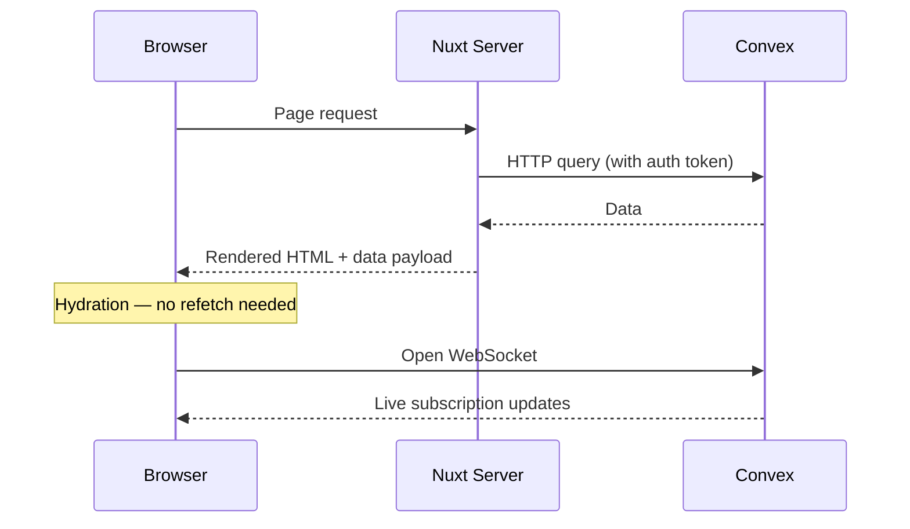
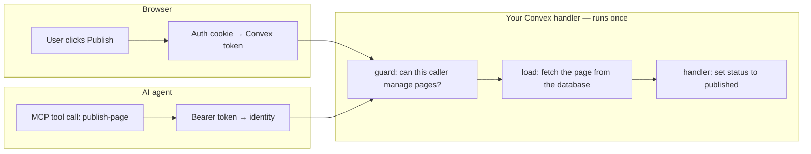

Trellis does two things:

1. Makes Nuxt and Convex feel like one runtime on the frontend.
2. Keeps one set of business rules on the backend — no matter who is calling.

This page explains both halves so you can see the full picture before diving into the details.

## Frontend: From Server to Real-Time

When a user visits a page, three things happen in sequence:



**Phase 1 — SSR.** The Nuxt server reads the auth cookie, exchanges it for a Convex token, fetches data over HTTP, and renders the page.

**Phase 2 — Hydration.** The browser picks up the server-rendered data and creates the Convex client. No duplicate request needed.

**Phase 3 — Real-time.** A WebSocket opens and the same data refs become live subscriptions. When data changes in Convex, the UI updates automatically.

The important point: **your component code stays the same across all three phases.** You write `useConvexQuery(...)` once, and Trellis handles the SSR fetch, the hydration handoff, and the live subscription.

```vue [app/pages/index.vue]
<script setup lang="ts">
import { api } from '#trellis/api'

const { data: pages } = await useConvexQuery(api.pages.listPublished, {})
</script>

<template>
  <article v-for="page in pages" :key="page._id">
    <h2>{{ page.title }}</h2>
  </article>
</template>
```

That query is server-rendered on first load, then becomes a live subscription. If someone publishes a new page, every browser seeing this list updates in real time.

## Backend: One Handler, Many Callers

This is the bigger idea.

Imagine you have a CMS. A browser user clicks "Publish" to push a draft page live. Later, you add MCP support so an AI agent can publish pages too. Both requests should go through the same permission checks and the same business logic.

Here is what that looks like in Trellis:



The browser user and the AI agent arrive through different transports, but they hit the **same Convex handler** with the **same permission checks**. Trellis makes this convergence structural — you do not maintain it by hand.

Here is the actual handler from the [mini CMS example](https://github.com/lupinum-dev/trellis/tree/main/examples/08-component-mini-cms):

```ts [convex/components/miniCms/pages.ts]
export const publishPage = mutation({
  args: publishPageSchema.args,
  guard: canManagePages,
  load: async (ctx, args) => {
    const page = await ctx.db.get(args.id)
    requireRecord(page, 'Page')
    return { page }
  },
  handler: async (ctx, _args, { page }) => {
    await ctx.db.patch(page._id, {
      publishedBody: page.draftBody,
      status: 'published',
      publishedAt: Date.now(),
    })
    return { pageId: page._id, published: true }
  },
})
```

Notice what is in the signature:

- **`guard: canManagePages`** — entry gating. If the caller is a viewer, the request stops here.
- **`load`** — fetch the page. If it does not exist, the request stops here.
- **`handler`** — the actual business logic. Only runs if the guard and load both passed.

You can read the security model from the function signature without chasing through other files.

## What Trellis Handles vs What You Write

| Trellis handles                        | You write                                         |
| -------------------------------------- | ------------------------------------------------- |
| SSR data fetching and hydration        | Database schema and queries                       |
| WebSocket subscription management      | Business rules and permission checks              |
| Auth token exchange (Better Auth)      | Role definitions (who is a viewer, editor, admin) |
| Route protection middleware            | UI components                                     |
| Identity resolution from any transport | Shared schemas for your data                      |
| Component bridge forwarding            |                                                   |
| MCP protocol, envelopes, rate limits   |                                                   |

Trellis owns the hard infrastructure — auth wiring, real-time subscriptions, SSR hydration, and the protocol glue for server routes and AI agents. Your app owns the meaning: what your data model looks like, who can do what, and what the UI shows.

## The Docs Follow This Progression

The rest of the documentation adds one layer at a time:

1. **[Data Fetching](/docs/data-fetching/queries)** and **[Mutations](/docs/mutations/mutations)** — query and write data from Vue components.
2. **[Authentication](/docs/auth-security/authentication)** — add sign-in, sessions, and route protection.
3. **[Permissions](/docs/permissions/setup)** — protect handlers with guards, actors, and capabilities.
4. **[Server-Side](/docs/server-side/ssr-overview)** — call Convex from Nitro routes with the same permission model.
5. **[MCP Tools](/docs/mcp-tools/getting-started)** — let AI agents use your business logic through MCP.
6. **[Testing](/docs/testing/getting-started)** — prove your permission boundaries work.

Each section is additive. A public todo app needs sections 1-2. A SaaS app with teams needs 1-4. Adding AI agent support means picking up section 5. You never need to rewrite what you already have.

## Next Steps

::card-group
::card{title="Quick Start" to="/docs/guide/quick-start" icon="i-lucide-rocket"}
Build a real-time task list in 5 minutes.
::
::card{title="Authentication" to="/docs/auth-security/authentication" icon="i-lucide-lock"}
Add sign-in, sessions, and route protection.
::
::card{title="Permissions" to="/docs/permissions/setup" icon="i-lucide-shield"}
Protect your handlers with guards and actors.
::
::
