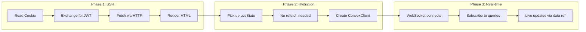
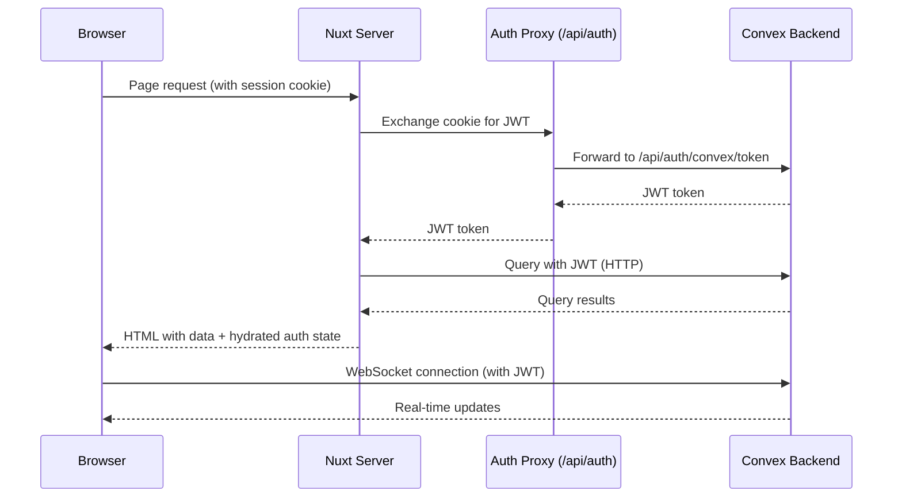
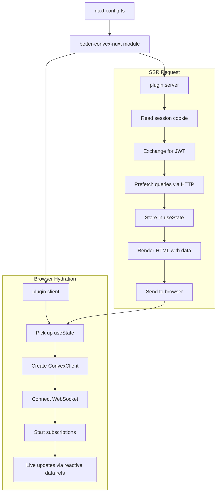

`better-convex-nuxt` bridges the gap between Nuxt's server-rendered architecture and Convex's real-time WebSocket protocol. This page explains the key architectural decisions and how data flows through the system.

## The two plugins

The module registers two Nuxt plugins that handle different phases of the request lifecycle:

::field-group
  ::field{name="Server plugin" type="plugin.server.ts"}
  Runs during SSR on every request. Reads auth cookies, exchanges them for a JWT token, and prefetches query data via HTTP. All data is stored in Nuxt's `useState` so it can be serialized into the HTML payload.
  ::
  ::field{name="Client plugin" type="plugin.client.ts"}
  Runs once in the browser after hydration. Creates a `ConvexClient` instance that connects via WebSocket, authenticates with the SSR-provided token, and starts live subscriptions for all active queries.
  ::
::

These two plugins work together to give you the best of both worlds: fast server-rendered HTML with data, followed by real-time updates over WebSocket.

## SSR lifecycle

When a user requests a page, the server plugin executes before any component renders:

::steps

### Cookie extraction

The server plugin reads the session cookie from the incoming HTTP request. It checks for both `better-auth.session_token` and the secure variant `__Secure-better-auth.session_token` (used on HTTPS in production).

### Token exchange

If a session cookie is found, the plugin sends it to your Better Auth endpoint (`/api/auth/convex/token`) to exchange it for a short-lived Convex JWT. This JWT is what Convex uses to authenticate queries and mutations.

::tip
You can enable token caching in `nuxt.config.ts` to skip the token exchange on subsequent requests from the same session. This reduces TTFB significantly:

```ts [nuxt.config.ts]
export default defineNuxtConfig({
  convex: {
    auth: {
      cache: { enabled: true, ttl: 60 },
    },
  },
})
```
::

### Query prefetch

When your components call `await useConvexQuery(...)` during SSR, the composable fetches data from Convex over HTTP (not WebSocket -- there is no persistent connection on the server). The results are stored in Nuxt's `useState` and included in the rendered HTML.

### HTML response

The server sends the fully rendered page with all query data embedded in the `__NUXT_DATA__` payload. The user sees content immediately -- no loading spinners.

::

## Hydration

When the browser receives the server-rendered HTML, Nuxt's hydration process kicks in:

1. **State pickup** -- Vue reuses the server-rendered DOM. All `useState` values (query data, auth token, user info) are deserialized from the HTML payload and become reactive refs.
2. **No refetch** -- because the data is already in `useState`, composables like `useConvexQuery` detect the existing data and skip the initial fetch. The component renders immediately with the server data.
3. **WebSocket upgrade** -- the client plugin creates a `ConvexClient` and establishes a WebSocket connection to Convex. Each active `useConvexQuery` starts a live subscription, replacing the static SSR snapshot with a real-time stream.

This transition is seamless. The data ref keeps the same value throughout -- it simply starts receiving live updates once the WebSocket is connected.



## Real-time subscriptions

After hydration, the `ConvexClient` maintains a persistent WebSocket connection. Here is what happens when data changes:

1. Any client (or a server-side mutation) modifies data in Convex.
2. Convex evaluates all affected queries and pushes new results to subscribed clients.
3. The `useConvexQuery` composable updates its `data` ref with the new value.
4. Vue's reactivity system triggers a re-render of any component reading that ref.

This is fully automatic. You do not need to poll, invalidate caches, or manually refetch. The `data` ref from `useConvexQuery` is always up to date.

::note
Subscriptions are reference-counted. If two components subscribe to the same query with the same arguments, only one WebSocket subscription is created. When the last component unmounts, the subscription is cleaned up automatically.
::

## Auth flow overview

Authentication flows through several layers to ensure zero flash of unauthenticated content:



In more detail:

::field-group
  ::field{name="1. Cookie" type="Server"}
  The session cookie is set by Better Auth when the user signs in. It is an HTTP-only cookie on your app's domain.
  ::
  ::field{name="2. Token exchange" type="Server"}
  The server plugin sends the cookie to `/api/auth/convex/token` (an auth proxy route handled by the module). This endpoint forwards the request to your Convex HTTP action, which validates the session and returns a signed JWT.
  ::
  ::field{name="3. State hydration" type="Server to Client"}
  The JWT and decoded user data are stored in `useState`. They are serialized into the HTML and picked up by the client on hydration.
  ::
  ::field{name="4. Client auth" type="Client"}
  The client plugin reads the token from `useState` and calls `ConvexClient.setAuth()`. All subsequent queries and mutations are authenticated.
  ::
  ::field{name="5. Token refresh" type="Client"}
  The client reuses recent tokens briefly and requests a fresh JWT when the current one is missing or too close to expiry, keeping the WebSocket connection authenticated without unnecessary duplicate fetches.
  ::
::

::warning
The auth proxy route (`/api/auth/**`) is required even in SPA mode. Browsers block cross-origin cookie setting, so auth cookies must be set on your app's domain, not on Convex's domain.
::

## Auto-imports

All composables are auto-imported by the module. You never need to write manual import statements:

| Composable | Purpose |
|---|---|
| `useConvexQuery` | Fetch data with SSR and real-time subscriptions |
| `useConvexMutation` | Call mutations with automatic state tracking |
| `useConvexAction` | Call actions (non-transactional, can call external services) |
| `useConvexPaginatedQuery` | Paginated queries with `loadMore()` support |
| `useConvexAuth` | Access auth state, Better Auth client, `refreshAuth()`, and `signOut()` |
| `useConvexAuthActions` | Run sign-in/sign-up flows with refresh, status, and redirect handling |
| `useConvex` | Access the raw `ConvexClient` instance |
| `useConvexConnectionState` | Monitor the WebSocket connection state |
| `useConvexUpload` | Upload files to Convex storage with progress tracking |
| `useConvexStorageUrl` | Resolve a Convex storage ID to a URL |

::tip
Server utilities are also auto-imported in your `server/` directory: `serverConvexQuery`, `serverConvexMutation`, and `serverConvexAction`. These let you call Convex functions from Nitro API routes and server middleware.
::

## Architecture diagram

Here is the full picture of how a request flows through the system:



## Learn more

- [Queries](/docs/data-fetching/queries) -- reactive arguments, conditional queries, transforms, and query options
- [Mutations](/docs/mutations/optimistic-updates) -- optimistic updates and error handling
- [Authentication](/docs/auth-security/authentication) -- route protection, sign-in flows, and session management
