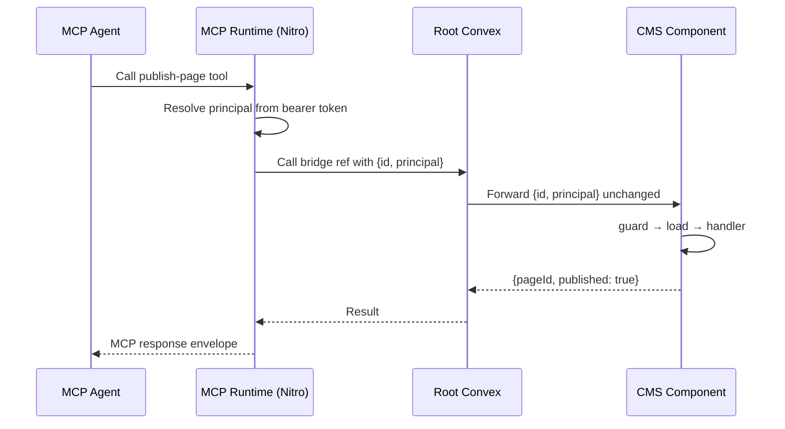

Your protected Convex handlers already enforce who can do what. Now you want server routes or AI agents to use the same business logic. This page shows how Trellis makes that work without duplicating your authorization model.

::tip
This page introduces **principal** and **actor** — the two concepts that make multi-caller apps work. If you only need browser users for now, you can skip ahead to [Permissions Setup](/docs/permissions/setup) and come back here later.
::

## The Scenario

You have a CMS built with Trellis. Browser users sign in, create draft pages, and publish them. The `publishPage` mutation has a guard — only editors and agents can publish.

Then requirements grow:

- The ops team wants a server route that publishes pages from a webhook.
- Product wants an AI agent that can publish pages through MCP.

Each of these callers arrives differently — a cookie, an API key, a bearer token — but they should all hit the same `publishPage` mutation with the same permission checks. How?

## How Identity Flows: Principals

When a browser user signs in, Trellis resolves their identity from the auth session. When an MCP agent connects, Trellis resolves their identity from a bearer token. When a server route forwards a call, identity comes from the request context.

Trellis calls this transport-level identity a **principal**. You define its shape and resolution once:

```ts [convex/auth/principal.ts]
export const principal = definePrincipal({
  validator: miniCmsPrincipalValidator,
  resolve: async (ctx, args) => {
    // If another layer forwarded a principal, use it
    const forwarded = (args as { principal?: MiniCmsPrincipal }).principal
    if (forwarded) return forwarded

    // Otherwise, resolve from the auth session (browser path)
    const auth = await getAuth(ctx)
    if (!auth) return { kind: 'anonymous' }

    return { kind: 'user', userId: auth.subject }
  },
})
```

The principal type is shared across the entire app:

```ts [shared/principal.ts]
export type MiniCmsPrincipal =
  | { kind: 'anonymous' }
  | { kind: 'user'; userId: string }
  | { kind: 'agent'; agentId: string }
```

A principal answers one question: **who is calling, according to this transport?** It carries identity, not business roles.

## How Authorization Stays in One Place: Actors

Your app maps each principal into a business role. Trellis calls this an **actor**. An editor is an editor whether they arrived from a browser or an MCP client.

```ts [convex/components/miniCms/functions.ts]
export type MiniCmsActor =
  | { kind: 'viewer' }
  | { kind: 'editor'; userId: string }
  | { kind: 'agent'; agentId: string }

export async function getActorFromPrincipal(
  _ctx: unknown,
  _args: Record<string, unknown>,
  resolved: MiniCmsPrincipal,
): Promise<MiniCmsActor> {
  switch (resolved.kind) {
    case 'anonymous':
      return { kind: 'viewer' }
    case 'user':
      return { kind: 'editor', userId: resolved.userId }
    case 'agent':
      return { kind: 'agent', agentId: resolved.agentId }
  }
}
```

Then wire both into `defineTrellis(...)`:

```ts [convex/components/miniCms/functions.ts]
export const { query, mutation } = defineTrellis(
  { query, mutation },
  {
    principal,
    actor: getActorFromPrincipal,
  },
)
```

From this point on, every handler built with `query(...)` or `mutation(...)` has access to the resolved actor. Guards operate on actors, not principals — so the same permission check covers every caller type.

## The Handler Pipeline

Protected handlers follow a clear sequence:

```ts [convex/components/miniCms/pages.ts]
export const publishPage = mutation({
  args: publishPageSchema.args,
  guard: canManagePages,
  load: async (ctx, args) => {
    const page = await ctx.db.get(args.id)
    requireRecord(page, 'Page')
    return { page }
  },
  handler: async (ctx, _args, { page }) => {
    await ctx.db.patch(page._id, {
      publishedBody: page.draftBody,
      status: 'published',
      publishedAt: Date.now(),
    })
    return { pageId: page._id, published: true }
  },
})
```

Each phase has a distinct job:

| Phase         | What it does                                                                     |
| ------------- | -------------------------------------------------------------------------------- |
| **guard**     | Entry gating — can this actor perform this action at all?                        |
| **load**      | Fetch the resource from the database                                             |
| **authorize** | _(optional)_ Resource-level check — can this actor touch _this specific_ record? |
| **preview**   | _(optional)_ Confirmation summary for destructive actions                        |
| **handler**   | The actual business logic                                                        |

The guard is `canManagePages` — a one-liner:

```ts [convex/components/miniCms/functions.ts]
export const canManagePages = defineGuard<MiniCmsActor>(
  'Manage pages',
  (actor) => actor.kind !== 'viewer',
)
```

A viewer is blocked. An editor or agent proceeds. The handler does not need to check roles — the guard already did.

## Component Bridges: Forwarding Identity

Convex components are isolated. They cannot access the root app's auth session. When the root app needs to call a component's handler, it uses a **component bridge** to forward the principal unchanged:

```ts [convex/miniCmsBridge.ts]
const bridge = createComponentBridge(
  { query, mutation, internalQuery, internalMutation },
  { principal },
)

export const publishPageBridge = bridge.internalMutation({
  component: components.miniCms.pages.publishPage,
  args: publishPage.args,
  returns: v.object({ pageId: v.string(), published: v.boolean() }),
})
```

The bridge only forwards `{ ...args, principal }` into the component. It does not check permissions, load data, or make business decisions — those responsibilities belong to the component's handler.

For more detail, see [Component Bridges](/docs/server-side/private-bridge).

## MCP Projection: Exposing Tools to AI Agents

For Convex-backed business logic, MCP tools should point at your existing handlers rather than redefining the logic. Trellis calls this **projection**:

```ts [server/mcp/tools/publish-page.ts]
export default tool.fromOperation(publishPageOp, {
  execute: publishPage,
  preview: previewPublishPage,
  capability: 'publishPage',
  meta: {
    name: 'publish-page',
    description: 'Publish the selected draft page to the public site.',
  },
})
```

The MCP tool owns metadata, visibility, and the confirmation flow. Convex still runs the guard, loads the page, and executes the handler. No business logic is duplicated.

For the full setup, see [Your First MCP Tool](/docs/mcp-tools/getting-started).

## Future Agent Protocols

MCP is just one transport adapter. If you add Agent Auth, a webhook worker, or another agent protocol later, the stable architecture should stay the same:

1. verify the incoming request in Nitro or your route layer
2. resolve a transport-shaped `principal`
3. optionally compute a coarse visibility snapshot for discovery or routing
4. call a stable root internal ref or bridge ref with `{ ...args, principal }`
5. let Convex run `guard -> load -> authorize -> preview -> handler`

This is why Trellis recommends a transport-neutral agent principal shape:

```ts [shared/principal.ts]
type AppPrincipal =
  | { kind: 'anonymous' }
  | { kind: 'user'; userId: string; sessionId?: string }
  | {
      kind: 'agent'
      agentId: string
      provider?: 'mcp' | 'agent-auth' | string
      sessionId?: string
      onBehalfOfUserId?: string
      grantedCapabilities?: string[]
    }
  | { kind: 'service'; serviceId: string }
```

Keep protocol details such as `provider` or transport-level grants inside the principal. Keep business roles, entitlements, and record-level permission checks in the actor and Convex handlers.

::tip{title="Important boundary"}
Transport capabilities or grants can decide whether a tool or route should be advertised, approved, or coarse-grained allowed. They do **not** replace Convex business authorization. Even when a transport grant exists, the protected handler should still run its `guard`, `load`, and `authorize` phases.
::

## The Full Picture

Here is how a publish request flows from an MCP agent through the full stack:



The browser path is shorter — the browser calls a root wrapper directly, and the root resolves the principal from the auth session — but the component handler is the same.

## Common Mistakes to Avoid

::tip{title="Keep these in mind"}

- **Keep business logic in Convex.** If a server route or MCP tool starts checking roles or loading records, move that logic into the handler.
- **Keep principals transport-shaped.** A principal should carry identity (user ID, agent ID), not business roles (admin, editor). Roles belong in the actor.
- **Keep bridges thin.** A bridge forwards principal and args. If it starts making authorization decisions, the architecture is drifting.
- **Use `tool(...)` for Convex-backed tools.** Reserve `defineTool(...)` for tools that are Nitro-native (DNS lookups, external API calls).
- **Treat root internal refs as the automation surface.** Agents, webhooks, and server automations should target root internal refs or bridge refs rather than calling component functions directly.
- **Test each layer separately.** Prove the handler's permission boundary first, then prove that forwarded principals hit the same boundary. See [Testing](/docs/testing/getting-started).
  ::

## Next Steps

::card-group
::card{title="Component Bridges" to="/docs/server-side/private-bridge" icon="i-lucide-git-branch"}
How root wrappers and component bridges work in detail.
::
::card{title="Your First MCP Tool" to="/docs/mcp-tools/getting-started" icon="i-lucide-bot"}
Set up your first MCP tool step by step.
::
::card{title="Testing" to="/docs/testing/getting-started" icon="i-lucide-test-tubes"}
Prove your permission boundaries work across all caller types.
::
::
