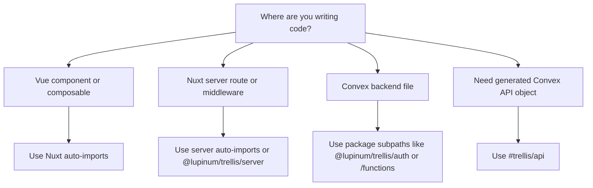

Trellis has more than one surface because Nuxt, Nitro, and Convex do different jobs. The fastest rule is: start from your runtime, not from the full package list.

## Decision Tree

## The Short Version

- Vue component or composable:
  use Nuxt auto-imports like `useConvexQuery`, `useConvexMutation`, `useConvexAuth`, and `useConvexUpload`.
- Nitro server route, server middleware, or server utility:
  use `serverConvexQuery`, `serverConvexMutation`, `serverConvexAction`, or `@lupinum/trellis/server`.
- Convex backend code:
  use package subpaths like `@lupinum/trellis/auth`, `@lupinum/trellis/functions`, `@lupinum/trellis/args`, or `@lupinum/trellis/visibility`.
- Generated schema access inside the Nuxt app:
  use `#trellis/api`.
- Advanced MCP setup:
  use `#trellis/mcp` inside the app or `@lupinum/trellis/mcp` when you need the package export directly.

## The Recommended Learning Order

1. Core: `useConvexQuery`, `useConvexMutation`, `useConvexPaginatedQuery`
2. Auth: `useConvexAuth`, `useConvexAuthActions`
3. Uploads: `useConvexUpload`, `useConvexStorageUrl`
4. Permissions: `usePermissions`, `useAuthGuard`
5. Advanced server and MCP surfaces

If you are unsure, use the generated [API Surface](/docs/api-reference/api-surface) page as the source of truth.
