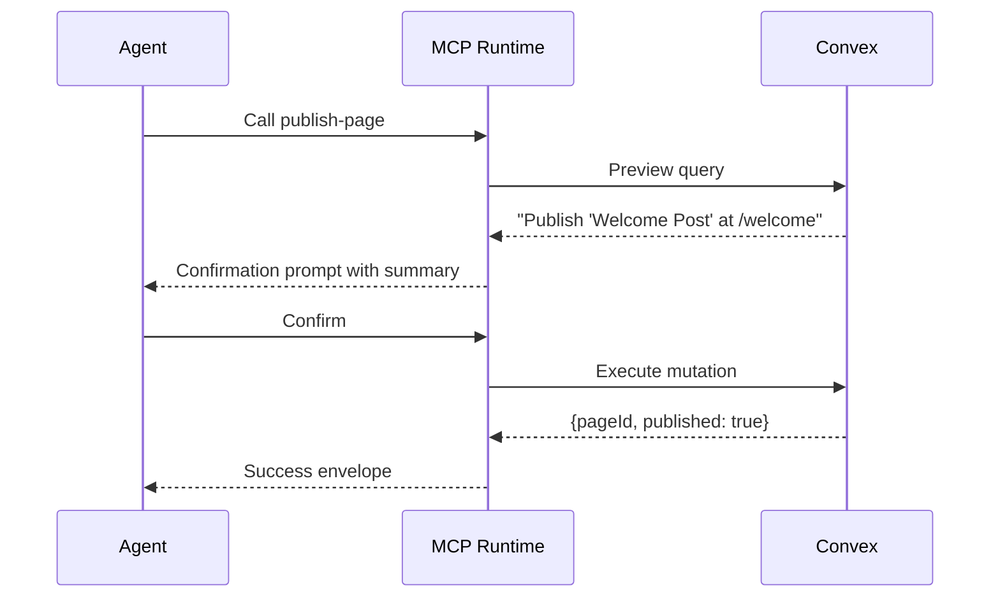

When an MCP tool changes or deletes data, the agent should see a summary of what will happen before confirming. Trellis handles this through a **preview query** in Convex and a `destructive: true` flag on the projected tool.

## The Preview Flow

Here is what happens when an AI agent calls a destructive tool:



The agent sees the preview summary, decides whether to proceed, and confirms. Only then does the mutation run.

## Writing a Preview

A preview is a function inside a `defineOperation(...)` that returns a human-readable summary. It runs as a **query**, not a mutation — so it is safe, idempotent, and fast.

```ts [convex/components/miniCms/pages.ts]
const publishPageOp = defineOperation({
  args: publishPage.args,
  returns: v.object({ pageId: v.string(), published: v.boolean() }),
  previewReturns: publishPreviewValidator,
  guard: canManagePages,
  load: async (ctx, args) => {
    const page = await ctx.db.get(args.id)
    requireRecord(page, 'Page')
    return { page }
  },
  preview: async (_ctx, _args, { page }) => ({
    summary: `Publish "${page.title}" at /${page.slug}`,
    warn: page.status === 'published'
      ? 'This republishes the current page body with the latest draft.'
      : 'This will make the draft visible on the public site.',
    affects: { pages: 1 },
  }),
  handler: async (ctx, _args, { page }) => {
    await ctx.db.patch(page._id, {
      publishedBody: page.draftBody,
      status: 'published',
      publishedAt: Date.now(),
    })
    return { pageId: page._id, published: true }
  },
})

export const publishPage = app.mutation(publishPageOp)
export const previewPublishPage = app.query(previewOf(publishPageOp))
```

Key details:

- **`preview`** receives the loaded resource from `load`, so it can include real titles, counts, and warnings.
- **`previewOf(...)`** wraps the operation's preview as a standalone query. Register it with `app.query(...)` so the MCP bridge can call it.
- **`guard`** runs before both preview and handler. If the caller cannot manage pages, the preview is never generated.

## Projecting a Destructive Tool

On the MCP side, mark the tool as destructive and provide the preview ref:

```ts [server/mcp/tools/publish-page.ts]
export default projectTool({
  schema: publishPage,
  call: internal.miniCmsBridge.publishPage,
  preview: internal.miniCmsBridge.previewPublishPage,
  capability: 'publishPage',
  meta: {
    name: 'publish-page',
    description: 'Publish the selected draft page to the public site.',
    destructive: true,
  },
})
```

- **`destructive: true`** tells the MCP runtime to call the preview before executing.
- **`preview`** points at the bridge query for the operation's preview.
- **`call`** points at the bridge mutation for the actual execution.

Both `preview` and `call` go through the same bridge and hit the same component handler, so permission checks are consistent.

## Blocked Previews

If the guard rejects the caller, the preview query throws before generating any summary. The agent sees a permission error, not a confirmation prompt.

The preview itself can also vary its message based on the resource state:

```ts
preview: async (_ctx, _args, { page }) => {
  if (page.status === 'published') {
    return {
      summary: `Republish "${page.title}"`,
      warn: 'This overwrites the currently published version.',
      affects: { pages: 1 },
    }
  }
  return {
    summary: `Publish "${page.title}" at /${page.slug}`,
    affects: { pages: 1 },
  }
}
```

## Rate Limits

For tools that should not be called too frequently, add a rate limit at the projection level:

```ts [server/mcp/tools/bulk-delete-posts.ts]
export default projectTool({
  schema: bulkDeletePosts,
  call: internal.posts.bulkDelete,
  preview: internal.posts.previewBulkDelete,
  capability: 'deletePost',
  meta: {
    name: 'bulk-delete-posts',
    description: 'Delete multiple posts at once.',
    destructive: true,
  },
  rateLimit: { max: 3, window: '1m' },
})
```

Rate limits are transport-level protection. They complement the Convex guard — they do not replace it.

## Next Steps

::card-group
::card{title="Result Envelopes" to="/docs/mcp-tools/result-envelopes" icon="i-lucide-package"}
Structure tool results for better agent consumption.
::
::card{title="Agent Design Guide" to="/docs/mcp-tools/agent-design-guide" icon="i-lucide-lightbulb"}
Tips for designing tools that agents use effectively.
::
::
