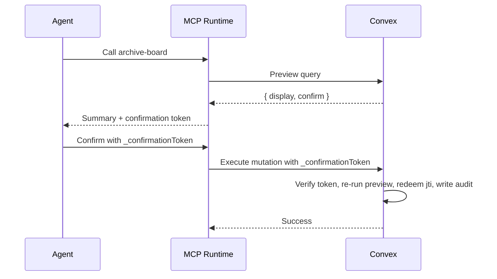

When an MCP tool changes or deletes data, Trellis requires an operation-backed destructive flow.
The first call returns a preview plus a signed `confirmationToken`.
The second call must send `_confirmationToken` back unchanged.

## The Flow



The token is bound to:

- operation id
- execute ref path
- preview ref path
- principal key
- tenant key
- args hash
- preview hash from `confirm`

If any of those change, Trellis rejects execution.

For operation-backed destructive MCP tools, the execute mutation also:

- checks whether the token `jti` was already redeemed
- inserts a redemption record atomically with execution
- writes a durable audit row on successful execution

## Writing the Operation

```ts [convex/boards.ts]
const archiveBoardOp = defineOperation({
  id: 'boards.archive',
  name: 'archiveBoard',
  kind: 'destructive',
  args: archiveBoard.args,
  returns: v.null(),
  guard: canArchiveBoard,
  load: async (ctx, args) => {
    const board = await ctx.db.get(args.id)
    requireRecord(board, 'Board')
    const columns = await listBoardColumns(ctx, board._id, board.workspaceId)
    const cards = await listBoardCards(ctx, board._id, board.workspaceId)
    return { board, columns, cards }
  },
  preview: async (_ctx, _args, { board, columns, cards }) => ({
    display: {
      summary: `Archive "${board.title}"`,
      warn: 'The board disappears from the active workspace view.',
      affects: { columns: columns.length, cards: cards.length },
    },
    confirm: {
      operation: 'boards.archive',
      targetId: board._id,
      affectedCounts: { columns: columns.length, cards: cards.length },
    },
  }),
  handler: async (ctx, _args, { board }) => {
    await ctx.db.patch(board._id, { archived: true, updatedAt: Date.now() })
    return null
  },
})

export const archiveBoard = mutation(archiveBoardOp)
export const previewArchiveBoard = query(previewOf(archiveBoardOp))
```

Rules:

- destructive operations need a stable `id`
- `display` is for humans and agents
- `confirm` is the stable semantic payload used for token validation
- `previewOf(...)` exposes the same preview shape to both UI and MCP

## Projecting the Tool

```ts [server/mcp/tools/archive-board.ts]
import { archiveBoard, archiveBoardOp, previewArchiveBoard } from '~/convex/boards'

export default tool.fromOperation(archiveBoardOp, {
  execute: archiveBoard,
  preview: previewArchiveBoard,
  capability: 'archiveBoard',
  meta: {
    description: 'Archive the current workspace board after a preview step.',
  },
})
```

Destructive generic `tool({...})` mode is not supported.
Use `tool.fromOperation(...)`.

## What Fails Confirmation

Trellis rejects the second call when:

- `_confirmationToken` is missing
- the token expired
- the args changed
- the principal changed
- the tenant changed
- the previewed `confirm` payload changed

That last case is the important one: Trellis re-runs the preview inside the execute mutation.
If the semantic destructive state drifted, the tool must preview again, and no redemption or audit row is written.

## Rate Limits

You can still add projection-level rate limits:

```ts
export default tool.fromOperation(bulkDeleteRunbooksOp, {
  execute: bulkRemove,
  preview: previewBulkRemove,
  capability: 'deleteWorkspaceRunbooks',
  rateLimit: { max: 5, window: '1m' },
})
```

Rate limits are transport protection.
They do not replace Convex guard or authorization logic.
