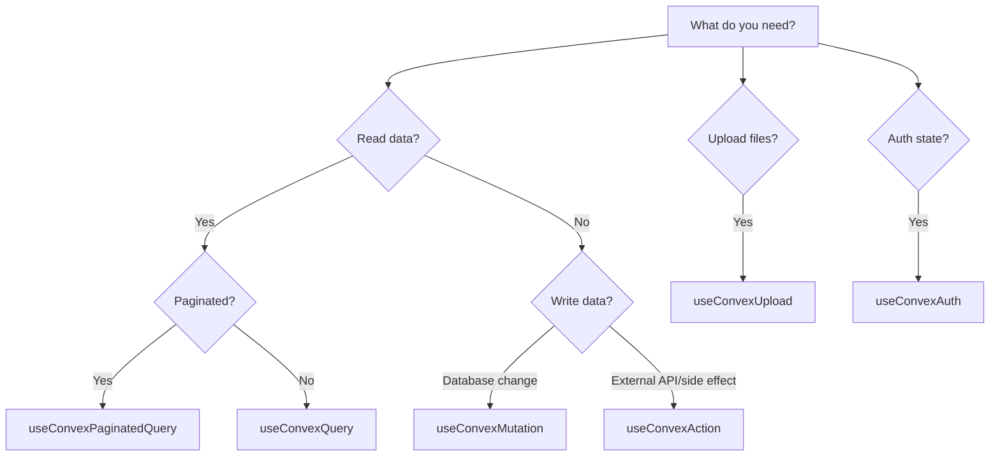

::note{title="Which composable do I need?"}



::

## Basic Usage

`useConvexQuery` fetches data from a Convex query function with full SSR support and automatic real-time subscriptions. Import your generated API object and pass the query reference along with its arguments.

```vue
<script setup lang="ts">
import { api } from '~~/convex/_generated/api'

const { data, status } = await useConvexQuery(api.tasks.list, { status: 'active' })
</script>

<template>
  <ul>
    <li v-for="task in data" :key="task._id">{{ task.text }}</li>
  </ul>
</template>
```

The `api` object is auto-generated by Convex from your backend functions. Each property corresponds to a file and exported function in your `convex/` directory.

## Await vs Non-Await

### With `await` (SSR-blocking)

When you `await` the composable, rendering is blocked until the first result arrives. This means the component will have data ready on the server and the HTML sent to the client includes the rendered content -- ideal for SEO and avoiding layout shift.

```vue
<script setup lang="ts">
import { api } from '~~/convex/_generated/api'

// Blocks rendering until data is ready
const { data: tasks, status } = await useConvexQuery(api.tasks.list, {})
// `status` is 'success' here (or 'error')
</script>
```

### Without `await` (non-blocking)

Without `await`, the composable returns immediately with `status` set to `'pending'` and `data` set to `null`. The component renders right away and updates reactively once data arrives.

```vue
<script setup lang="ts">
import { api } from '~~/convex/_generated/api'

// Non-blocking: starts as pending, updates reactively
const { data: tasks, status } = useConvexQuery(api.tasks.list, {})
</script>

<template>
  <div v-if="status === 'pending'">Loading...</div>
  <ul v-else>
    <li v-for="task in tasks" :key="task._id">{{ task.text }}</li>
  </ul>
</template>
```

::tip
Use `await` for above-the-fold content that should be server-rendered. Use the non-blocking pattern for secondary data that can load after the initial paint.
::

## Return Value

`useConvexQuery` returns an object with the following properties:

::field-group
  ::field{name="data" type="Ref<DataT | null>"}
  The query result. Starts as `null` (or the `default` value) and updates reactively as data arrives or changes on the server.
  ::

  ::field{name="status" type="Ref<'pending' | 'success' | 'error' | 'skipped'>"}
  The current lifecycle status of the query:
  - `'pending'` -- initial load in progress, no data yet
  - `'success'` -- data has been received
  - `'error'` -- the query failed
  - `'skipped'` -- the query is disabled because args are `null` or `undefined`

  ```mermaid
  stateDiagram-v2
      [*] --> pending: args provided
      [*] --> skipped: args null/undefined
      pending --> success: data received
      pending --> error: query failed
      success --> pending: args changed
      success --> skipped: args become null
      skipped --> pending: args become non-null
      error --> pending: retry/args changed
  ```
  ::

  ::field{name="pending" type="Ref<boolean>"}
  `true` while the query is loading. Equivalent to `status.value === 'pending'`.
  ::

  ::field{name="isStale" type="Ref<boolean>"}
  `true` only while `keepPreviousData` is showing the last settled result for previous args and the current args have not produced their first result yet.
  ::

  ::field{name="error" type="Ref<Error | null>"}
  The error object if the query failed, otherwise `null`.
  ::

  ::field{name="refresh" type="() => Promise<void>"}
  Re-execute the query, fetching fresh data from the server.
  ::

  ::field{name="clear" type="() => void"}
  Reset `data` and `error` to their initial state. Matches the behavior of Nuxt's `useAsyncData.clear()`.
  ::
::

## Reactive Arguments

Query arguments can be reactive. Pass a `ref`, `computed`, or getter function, and the query will automatically re-execute whenever the arguments change.

### Getter function (recommended)

```vue
<script setup lang="ts">
import { api } from '~~/convex/_generated/api'

const route = useRoute()

const { data: task } = await useConvexQuery(
  api.tasks.get,
  () => ({ id: route.params.id as string })
)
</script>
```

### Using a `computed`

```vue
<script setup lang="ts">
import { api } from '~~/convex/_generated/api'

const selectedStatus = ref<'active' | 'completed'>('active')

const args = computed(() => ({ status: selectedStatus.value }))
const { data: tasks } = await useConvexQuery(api.tasks.list, args)
</script>
```

When the reactive value changes, the composable automatically subscribes to the new query and returns updated results. The transition is seamless -- previous data remains visible until new data arrives if you enable `keepPreviousData`.

```vue
<script setup lang="ts">
import { api } from '~~/convex/_generated/api'

const category = ref('all')

const { data: posts, isStale } = await useConvexQuery(
  api.posts.list,
  () => ({ category: category.value }),
  { keepPreviousData: true },
)
</script>

<template>
  <section :style="{ opacity: isStale ? 0.65 : 1 }">
    <p v-if="isStale">Updating posts...</p>
    <article v-for="post in posts" :key="post._id">
      {{ post.title }}
    </article>
  </section>
</template>
```

## Options

Pass an options object as the third argument to customize behavior.

```ts
const { data } = await useConvexQuery(api.tasks.list, {}, {
  server: true,
  subscribe: true,
  default: () => [],
  transform: (tasks) => tasks.filter(t => !t.archived),
  keepPreviousData: false,
  shared: 'tasks-list',
  onData: (tasks) => console.log('Received', tasks.length, 'tasks'),
  onError: (err) => console.error('Query failed:', err),
})
```

::field-group
  ::field{name="server" type="boolean" default-value="true"}
  Run the query server-side during SSR. Set to `false` to skip server-side execution and only fetch on the client.
  ::

  ::field{name="subscribe" type="boolean" default-value="true"}
  Keep a live WebSocket subscription after the initial load. When `true`, the query receives real-time updates whenever the underlying data changes. Set to `false` for one-shot queries that do not need live updates.
  ::

  ::field{name="default" type="() => RawT | undefined"}
  Factory function that provides a fallback value while the query is pending or skipped. Useful for avoiding `null` checks in templates.
  ::

  ::field{name="transform" type="(input: RawT) => DataT"}
  Transform the raw Convex data before exposing it via `data`. Use this to add computed fields, filter, sort, or reshape the result.
  ::

  ::field{name="keepPreviousData" type="boolean" default-value="false"}
  Preserve the last successful data while a new result is loading. Prevents a flash of empty state when reactive args change.
  ::

  ::field{name="shared" type="string"}
  A unique string key that deduplicates this query across components. All usages with the same key share a single subscription and reactive data ref. See [Shared Queries](/docs/data-fetching/shared-queries) for details.
  ::

  ::field{name="onData" type="(data: DataT) => void"}
  Callback fired whenever new data arrives from the server or subscription. Fires for both the initial load and subsequent real-time updates.
  ::

  ::field{name="onError" type="(error: Error) => void"}
  Callback fired when the query encounters an error.
  ::
::

## TypeScript Inference

`useConvexQuery` automatically infers the return type from your Convex schema and function definitions. The `data` ref is typed to match what your query function returns.

```vue
<script setup lang="ts">
import { api } from '~~/convex/_generated/api'

// `data` is automatically typed as Ref<Doc<"tasks">[] | null>
const { data: tasks } = await useConvexQuery(api.tasks.list, {})

// TypeScript knows the shape of each task
tasks.value?.[0]._id      // string
tasks.value?.[0].text     // string
tasks.value?.[0].completed // boolean
</script>
```

When using the `transform` option, the inferred type updates to match the transform's return type:

```vue
<script setup lang="ts">
import { api } from '~~/convex/_generated/api'

// `data` is typed as Ref<{ id: string; label: string }[] | null>
const { data: tasks } = await useConvexQuery(api.tasks.list, {}, {
  transform: (tasks) => tasks.map(t => ({
    id: t._id,
    label: `${t.text} ${t.completed ? '(done)' : ''}`,
  })),
})
</script>
```

## Complete Example

A full component demonstrating loading, error, and success states with reactive filtering:

```vue
<script setup lang="ts">
import { api } from '~~/convex/_generated/api'

const statusFilter = ref<'all' | 'active' | 'completed'>('all')

const { data: tasks, status, error, refresh } = await useConvexQuery(
  api.tasks.list,
  () => statusFilter.value === 'all'
    ? {}
    : { status: statusFilter.value },
  {
    default: () => [],
    keepPreviousData: true,
  },
)
</script>

<template>
  <div>
    <div>
      <label>
        Filter:
        <select v-model="statusFilter">
          <option value="all">All</option>
          <option value="active">Active</option>
          <option value="completed">Completed</option>
        </select>
      </label>
      <button @click="refresh">Refresh</button>
    </div>

    <div v-if="status === 'error'">
      <p>Something went wrong: {{ error?.message }}</p>
    </div>

    <div v-else-if="status === 'pending'">
      <p>Loading tasks...</p>
    </div>

    <ul v-else>
      <li v-for="task in tasks" :key="task._id">
        <span :class="{ 'line-through': task.completed }">
          {{ task.text }}
        </span>
      </li>
      <li v-if="tasks?.length === 0">No tasks found.</li>
    </ul>
  </div>
</template>
```

::note
After the initial server-rendered load, the WebSocket subscription keeps `data` in sync automatically. Any mutation from any client that affects the query results will trigger a reactive update -- no polling or manual refetching required.
::
