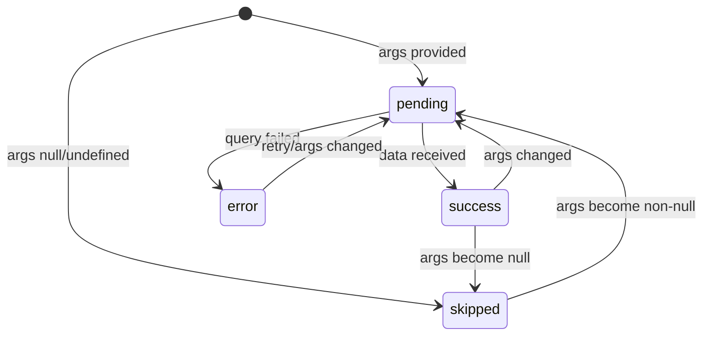

Pass `null` args to skip a query. When args become non-null, the query fires automatically.



## The Null Args Pattern

To conditionally skip a query, pass `null` or `undefined` as the args value. When args are nullish, the query will not execute and its `status` becomes `'skipped'`.

```vue
<script setup lang="ts">
import { api } from '~~/convex/_generated/api'

const selectedId = ref<string | null>(null)

// Query is skipped until selectedId has a value
const { data: note, status } = useConvexQuery(
  api.notes.get,
  () => selectedId.value ? { id: selectedId.value } : null,
)
</script>
```

This is the canonical pattern for conditional queries. The getter function returns either a valid args object or `null`, and the composable reacts accordingly.

## How It Works

The composable inspects the resolved args value on every reactive update:

- **Args are a valid object** -- the query executes normally and subscribes to real-time updates.
- **Args are `null` or `undefined`** -- the query is skipped. `status` is `'skipped'`, `data` is `null` (or the `default` value), and no network request is made.

When the args transition from `null` to a valid object, the query automatically fires. When they transition back to `null`, the subscription is released and the query enters the `'skipped'` state.

## With `useConvexQuery`

The most common use case is fetching a detail record only when an ID is available:

```vue
<script setup lang="ts">
import { api } from '~~/convex/_generated/api'

const route = useRoute()

// Skip the query if no ID is in the route params
const { data: task, status, error } = await useConvexQuery(
  api.tasks.get,
  () => {
    const id = route.params.id as string | undefined
    return id ? { id } : null
  },
)
</script>

<template>
  <div>
    <p v-if="status === 'skipped'">Select a task to view details.</p>
    <p v-else-if="status === 'pending'">Loading...</p>
    <p v-else-if="status === 'error'">Error: {{ error?.message }}</p>
    <div v-else-if="task">
      <h1>{{ task.text }}</h1>
      <p>Status: {{ task.completed ? 'Done' : 'In progress' }}</p>
    </div>
  </div>
</template>
```

## With `useConvexPaginatedQuery`

The same pattern works with paginated queries. Pass a getter that returns `null` to skip:

```vue
<script setup lang="ts">
import { api } from '~~/convex/_generated/api'

const teamId = ref<string | null>(null)

const { results, status, loadMore, hasNextPage } = useConvexPaginatedQuery(
  api.tasks.listByTeam,
  () => teamId.value ? { teamId: teamId.value } : null,
  { initialNumItems: 20 },
)
</script>

<template>
  <div>
    <p v-if="status === 'skipped'">Select a team to see tasks.</p>

    <template v-else>
      <ul>
        <li v-for="task in results" :key="task._id">{{ task.text }}</li>
      </ul>
      <button v-if="hasNextPage" @click="loadMore(20)">Load More</button>
    </template>
  </div>
</template>
```

## Reactive Re-Enable

Queries automatically fire when args transition from `null` to a valid value. This makes it straightforward to build interfaces where the query depends on a user selection:

```vue
<script setup lang="ts">
import { api } from '~~/convex/_generated/api'

const users = ref([
  { id: 'user1', name: 'Alice' },
  { id: 'user2', name: 'Bob' },
])

const selectedUserId = ref<string | null>(null)

// Automatically fetches when a user is selected, skips otherwise
const { data: profile, status } = useConvexQuery(
  api.users.getProfile,
  () => selectedUserId.value ? { userId: selectedUserId.value } : null,
)
</script>

<template>
  <div>
    <div>
      <button
        v-for="user in users"
        :key="user.id"
        @click="selectedUserId = user.id"
      >
        {{ user.name }}
      </button>
      <button @click="selectedUserId = null">Clear</button>
    </div>

    <div v-if="status === 'skipped'">
      <p>Select a user to view their profile.</p>
    </div>
    <div v-else-if="status === 'pending'">
      <p>Loading profile...</p>
    </div>
    <div v-else-if="profile">
      <h2>{{ profile.name }}</h2>
      <p>{{ profile.email }}</p>
    </div>
  </div>
</template>
```

## Detail Page Example

A complete master-detail layout where the detail panel skips its query until an item is selected:

```vue
<script setup lang="ts">
import { api } from '~~/convex/_generated/api'

// Master list -- always fetched
const { data: notes } = await useConvexQuery(api.notes.list, {})

// Detail -- skipped until a note is selected
const selectedNoteId = ref<string | null>(null)

const { data: selectedNote, status: detailStatus } = useConvexQuery(
  api.notes.get,
  () => selectedNoteId.value ? { id: selectedNoteId.value } : null,
)
</script>

<template>
  <div class="flex gap-4">
    <!-- Master list -->
    <ul class="w-1/3">
      <li
        v-for="note in notes"
        :key="note._id"
        :class="{ 'font-bold': note._id === selectedNoteId }"
        @click="selectedNoteId = note._id"
      >
        {{ note.title }}
      </li>
    </ul>

    <!-- Detail panel -->
    <div class="w-2/3">
      <p v-if="detailStatus === 'skipped'">
        Select a note from the list.
      </p>
      <p v-else-if="detailStatus === 'pending'">
        Loading...
      </p>
      <article v-else-if="selectedNote">
        <h1>{{ selectedNote.title }}</h1>
        <div>{{ selectedNote.content }}</div>
      </article>
    </div>
  </div>
</template>
```

::tip
The conditional query pattern is the recommended way to handle optional data dependencies. Avoid wrapping `useConvexQuery` in `v-if` blocks or conditional logic inside `<script setup>` -- always call the composable unconditionally and control execution through the args getter.
::
