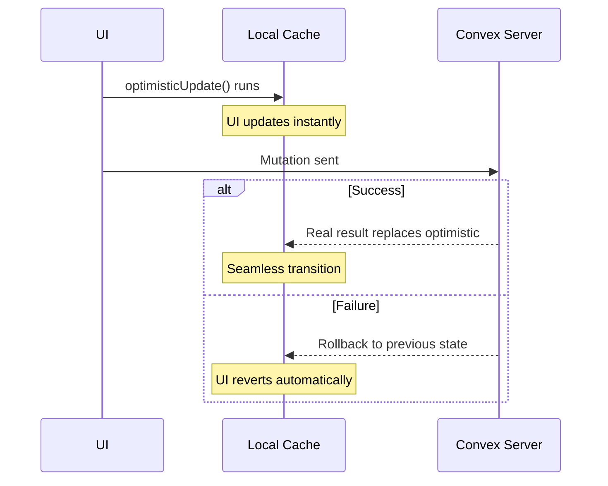

## What Are Optimistic Updates?

Optimistic updates let you update the UI **immediately** when a user performs an action, without waiting for the server to respond. If the server rejects the mutation, the update is automatically rolled back to the previous state.

This makes your app feel instant -- button clicks, form submissions, and list changes appear to happen without delay.



## Basic Usage

Pass an `optimisticUpdate` function as an option to `useConvexMutation`. It receives an `OptimisticContext` (`ctx`) and the mutation arguments.

```vue
<script setup lang="ts">
import { api } from '~~/convex/_generated/api'

const addNote = useConvexMutation(api.notes.add, {
  optimisticUpdate: (ctx, args) => {
    ctx.query(api.notes.list, {}).update(notes =>
      notes ? [{ ...args, _id: 'temp', _creationTime: Date.now() }, ...notes] : []
    )
  },
})
</script>
```

When `addNote` is called, the `optimisticUpdate` function runs synchronously before the mutation is sent to the server. The local query cache for `api.notes.list` is updated immediately, so the UI reflects the change. When the real server response arrives, the optimistic value is replaced with the authoritative result.

## OptimisticContext API

The `ctx` object provides a typed, fluent API for updating local query results.

### `ctx.query(queryRef, args)`

Returns an `OptimisticQueryHandle` for a regular (non-paginated) query with the exact arguments specified.

::field-group
  ::field{name=".update(updater)" type="(current: Result | undefined) => Result"}
  Update the query result using an updater function. The `current` value is `undefined` if the query has not loaded yet.
  ::

  ::field{name=".set(value)" type="Result"}
  Replace the query result with a new value directly.
  ::
::

```ts
// Update a list query
ctx.query(api.notes.list, { userId: '123' }).update(notes =>
  notes ? [...notes, newNote] : [newNote]
)

// Replace a single-document query
ctx.query(api.notes.get, { id: noteId }).set({
  ...existingNote,
  title: 'Updated Title',
})
```

### `ctx.paginatedQuery(queryRef, args)`

Returns an `OptimisticPaginatedHandle` for a paginated query. The `args` should exclude `paginationOpts` -- the handle operates across all loaded pages matching these args.

::field-group
  ::field{name=".insertAtTop(item)" type="void"}
  Insert an item at the top of the first page.
  ::

  ::field{name=".insertAtPosition(item, index)" type="void"}
  Insert an item at a specific numeric index across the loaded pages.
  ::

  ::field{name=".insertAtBottomIfLoaded(item)" type="void"}
  Insert an item at the bottom of the last loaded page. Only applies if all pages have been loaded (`isDone` is `true`).
  ::

  ::field{name=".updateItem(id, updater)" type="void"}
  Update the item matching the given Convex document `_id`. The updater receives the current item and returns the updated item.
  ::

  ::field{name=".deleteItem(id)" type="void"}
  Remove the item matching the given Convex document `_id`.
  ::
::

```ts
// Insert at top of paginated list
ctx.paginatedQuery(api.notes.listPaginated, { userId: '123' })
  .insertAtTop({ ...args, _id: 'temp', _creationTime: Date.now() })

// Delete from paginated list
ctx.paginatedQuery(api.notes.listPaginated, { userId: '123' })
  .deleteItem(args.id)

// Update an item across all pages
ctx.paginatedQuery(api.notes.listPaginated, { userId: '123' })
  .updateItem(args.id, note => ({ ...note, title: args.title }))
```

### `ctx.matchQuery(queryRef)`

Match **all** active argument combinations for a query. Useful when you don't know which specific args are being subscribed to, or when multiple components subscribe to the same query with different filters.

The updater receives both the current value and the active args for each match.

```ts
ctx.matchQuery(api.notes.list).update((current, args) => {
  // Update every active subscription to api.notes.list,
  // regardless of the args each component passed
  return current.map(note =>
    note._id === updatedId ? { ...note, title: newTitle } : note
  )
})
```

### `ctx.matchPaginatedQuery(queryRef)`

Match **all** active paginated page entries for a query. Works the same as `matchQuery` but for paginated queries, giving you access to the full `PaginationResult` for each page.

```ts
ctx.matchPaginatedQuery(api.notes.listPaginated).update((current, args) => ({
  ...current,
  page: current.page.filter(note => note._id !== deletedId),
}))
```

### `ctx.store`

Escape hatch providing direct access to the underlying Convex `OptimisticLocalStore`. Use when the builder methods don't cover your use case.

```ts
ctx.store.setQuery(api.notes.get, { id: noteId }, updatedNote)
```

## Standalone Helpers

For common operations, auto-imported helper functions provide a more concise syntax. These work with regular (non-paginated) queries that return arrays.

### `prependTo`

Add an item to the **start** of an array query result.

```ts
const addNote = useConvexMutation(api.notes.add, {
  optimisticUpdate: (ctx, args) =>
    prependTo(ctx, api.notes.list, {}, {
      ...args,
      _id: crypto.randomUUID(),
      _creationTime: Date.now(),
    }),
})
```

### `appendTo`

Add an item to the **end** of an array query result.

```ts
const addNote = useConvexMutation(api.notes.add, {
  optimisticUpdate: (ctx, args) =>
    appendTo(ctx, api.notes.list, {}, {
      ...args,
      _id: crypto.randomUUID(),
      _creationTime: Date.now(),
    }),
})
```

### `removeFrom`

Remove items matching a predicate from an array query result.

```ts
const deleteNote = useConvexMutation(api.notes.remove, {
  optimisticUpdate: (ctx, args) =>
    removeFrom(ctx, api.notes.list, {}, note => note._id === args.id),
})
```

### `updateIn`

Update items matching a predicate in an array query result.

```ts
const updateNote = useConvexMutation(api.notes.update, {
  optimisticUpdate: (ctx, args) =>
    updateIn(
      ctx,
      api.notes.list,
      {},
      note => note._id === args.id,
      note => ({ ...note, ...args }),
    ),
})
```

## Complete Examples

### Add to List

```vue
<script setup lang="ts">
import { api } from '~~/convex/_generated/api'
import type { Id } from '~~/convex/_generated/dataModel'

const title = ref('')

const addTask = useConvexMutation(api.tasks.create, {
  optimisticUpdate: (ctx, args) => {
    ctx.query(api.tasks.list, { status: 'active' }).update(tasks => {
      const optimisticTask = {
        _id: crypto.randomUUID() as Id<'tasks'>,
        _creationTime: Date.now(),
        text: args.text,
        completed: false,
      }
      return tasks ? [optimisticTask, ...tasks] : [optimisticTask]
    })
  },
})

async function handleAdd() {
  if (!title.value.trim()) return
  await addTask({ text: title.value })
  title.value = ''
}
</script>

<template>
  <form @submit.prevent="handleAdd">
    <input v-model="title" placeholder="New task..." />
    <button type="submit" :disabled="addTask.pending.value">Add</button>
  </form>
</template>
```

### Delete from List

```vue
<script setup lang="ts">
import { api } from '~~/convex/_generated/api'

const deleteTask = useConvexMutation(api.tasks.remove, {
  optimisticUpdate: (ctx, args) =>
    removeFrom(ctx, api.tasks.list, { status: 'active' }, task => task._id === args.id),
})
</script>

<template>
  <button @click="deleteTask({ id: task._id })" :disabled="deleteTask.pending.value">
    Delete
  </button>
</template>
```

### Update an Item

```vue
<script setup lang="ts">
import { api } from '~~/convex/_generated/api'

const toggleTask = useConvexMutation(api.tasks.toggle, {
  optimisticUpdate: (ctx, args) =>
    updateIn(
      ctx,
      api.tasks.list,
      { status: 'active' },
      task => task._id === args.id,
      task => ({ ...task, completed: !task.completed }),
    ),
})
</script>

<template>
  <input
    type="checkbox"
    :checked="task.completed"
    @change="toggleTask({ id: task._id })"
  />
</template>
```

### Paginated Insert

```vue
<script setup lang="ts">
import { api } from '~~/convex/_generated/api'
import type { Id } from '~~/convex/_generated/dataModel'

const addMessage = useConvexMutation(api.messages.send, {
  optimisticUpdate: (ctx, args) => {
    ctx.paginatedQuery(api.messages.list, { channelId: args.channelId })
      .insertAtTop({
        _id: crypto.randomUUID() as Id<'messages'>,
        _creationTime: Date.now(),
        channelId: args.channelId,
        text: args.text,
        authorId: args.authorId,
      })
  },
})
</script>
```

::tip
When creating optimistic items, use `crypto.randomUUID()` for the `_id` and `Date.now()` for `_creationTime`. These temporary values are replaced when the real server response arrives.
::

::warning
Optimistic updates run **synchronously** and should be fast. Avoid async operations or expensive computations inside the updater. The function receives the current local state and must return the new state immediately.
::
