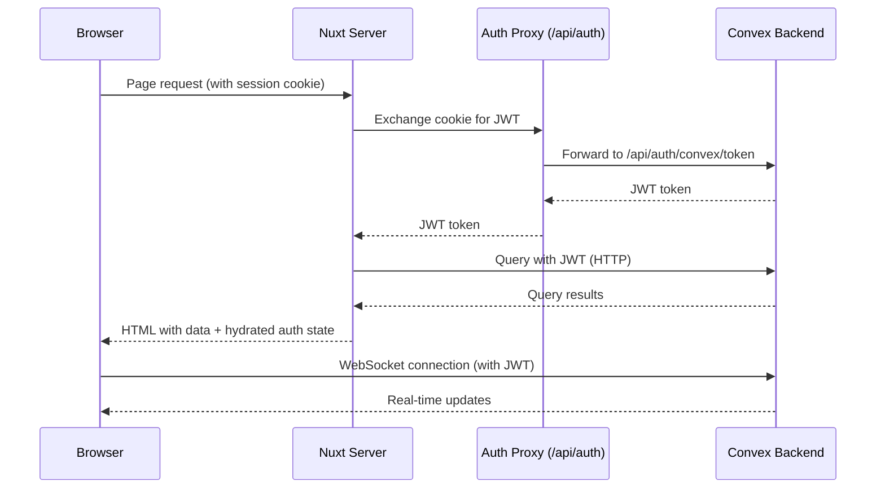

## Overview

`better-convex-nuxt` uses [Better Auth](https://www.better-auth.com/) running on [Convex](https://www.convex.dev/) for authentication. Better Auth handles user registration, sessions, and OAuth providers, while Convex stores the user data and issues JWT tokens for authenticated queries and mutations.

The module provides:

- **SSR-safe auth state** -- the server plugin reads the session cookie, exchanges it for a JWT, and hydrates auth state to the client with zero flash of unauthenticated content.
- **Reactive composables** -- `useConvexAuth()` and `useConvexAuthInternal()` expose user data, authentication status, sign-out, and token refresh.
- **Auth components** -- `<ConvexAuthenticated>`, `<ConvexUnauthenticated>`, `<ConvexAuthLoading>`, and `<ConvexAuthError>` for conditional rendering.
- **Route protection** -- protect pages with `definePageMeta({ convexAuth: true })`.
- **Automatic token refresh** -- tokens are refreshed before expiry so queries never fail due to stale credentials.



## Setup

::steps

### Install the peer dependency

Better Auth support on Convex is provided by `@convex-dev/better-auth`. Install it alongside your existing `convex` and `better-convex-nuxt` packages:

::code-group

```bash [pnpm]
pnpm add @convex-dev/better-auth
```

```bash [yarn]
yarn add @convex-dev/better-auth
```

```bash [npm]
npm install @convex-dev/better-auth
```

```bash [bun]
bun add @convex-dev/better-auth
```

::

### Create `convex/auth.ts`

Configure Better Auth with the Convex adapter. This file defines your auth providers and options:

```ts [convex/auth.ts]
import { betterAuth } from '@convex-dev/better-auth'

export const auth = betterAuth()
```

::tip
`betterAuth()` from `@convex-dev/better-auth` automatically uses the Convex adapter and database. You do not need to configure a database connection -- Convex handles storage for you.
::

To add OAuth providers or email/password support, pass configuration to `betterAuth()`:

```ts [convex/auth.ts]
import { betterAuth } from '@convex-dev/better-auth'

export const auth = betterAuth({
  emailAndPassword: {
    enabled: true,
  },
  socialProviders: {
    github: {
      clientId: process.env.GITHUB_CLIENT_ID!,
      clientSecret: process.env.GITHUB_CLIENT_SECRET!,
    },
  },
})
```

### Create `convex/http.ts`

Register the Better Auth HTTP routes so Convex can handle authentication requests:

```ts [convex/http.ts]
import { httpRouter } from 'convex/server'
import { auth } from './auth'

const http = httpRouter()

auth.addHttpRoutes(http)

export default http
```

### Set environment variables in the Convex dashboard

Navigate to your [Convex dashboard](https://dashboard.convex.dev/) and add the following environment variables to your deployment:

::field-group
  ::field{name="BETTER_AUTH_SECRET" type="required"}
  A random secret string used to sign session tokens. Generate one with `openssl rand -hex 32`.
  ::
  ::field{name="SITE_URL" type="required"}
  Your Convex site URL, e.g. `https://your-deployment-123.convex.site`. This is the HTTP Actions URL where Better Auth routes are served.
  ::
::

::warning
`BETTER_AUTH_SECRET` must be kept secret. Never commit it to version control. Set it exclusively in the Convex dashboard under **Settings > Environment Variables**.
::

### Set environment variables locally

Your `.env.local` file should contain the Convex deployment URL. This is typically already present if you have run `npx convex dev`:

```bash [.env.local]
CONVEX_URL=https://your-deployment-123.convex.cloud
```

### Enable auth in your Nuxt config

Enable authentication in your `nuxt.config.ts`:

```ts [nuxt.config.ts]
export default defineNuxtConfig({
  modules: ['better-convex-nuxt'],

  convex: {
    auth: true,
  },
})
```

Setting `auth: true` enables the full authentication flow with all defaults. You can also pass an object for fine-grained control:

```ts [nuxt.config.ts]
export default defineNuxtConfig({
  modules: ['better-convex-nuxt'],

  convex: {
    auth: {
      routeProtection: {
        redirectTo: '/login',
        preserveReturnTo: true,
      },
    },
  },
})
```

::

::note{title="About the auth proxy"}
When `auth` is enabled, the module creates a catch-all server route at `/api/auth/[...]` that proxies authentication requests to your Convex site URL. This is necessary because session cookies must be set on the same domain as your application -- since Convex runs on `*.convex.site`, the browser would block cookies set directly by Convex. The proxy keeps cookies on your app's domain while forwarding requests to Convex.

The proxy handles forwarding auth requests, preserving `Set-Cookie` headers, CORS validation, and OAuth redirect flows. The route path defaults to `/api/auth` and can be customized with `auth.route` in your config.
::

## Auth config options

The `auth` option accepts either `true` for defaults or an object with these properties:

::field-group
  ::field{name="enabled" type="boolean" default="true"}
  Enable or disable auth. When using the object form, defaults to `true`.
  ::
  ::field{name="route" type="string" default="'/api/auth'"}
  Custom route path for the auth proxy endpoint.
  ::
  ::field{name="routeProtection" type="object"}
  Configure route protection behavior. See [Route Protection](/docs/auth-security/route-protection).
  ::
  ::field{name="routeProtection.redirectTo" type="string" default="'/auth/signin'"}
  Where to redirect unauthenticated users on protected routes.
  ::
  ::field{name="routeProtection.preserveReturnTo" type="boolean" default="true"}
  Append `?redirect=/original-path` to the redirect URL so users return after sign-in.
  ::
  ::field{name="unauthorized" type="object"}
  Configure behavior when Convex returns a 401/403 for authenticated queries or mutations.
  ::
  ::field{name="cache" type="object"}
  SSR auth token caching. See [Token Refresh](/docs/auth-security/token-refresh).
  ::
  ::field{name="trustedOrigins" type="string[]" default="[]"}
  Additional trusted origins for CORS on the auth proxy. Same-origin is always allowed. Supports wildcards like `https://preview-*.vercel.app`.
  ::
  ::field{name="skipAuthRoutes" type="string[]" default="[]"}
  Routes that skip auth token fetches. Supports glob patterns like `/docs/**`.
  ::
  ::field{name="proxy" type="object"}
  Body size limits for the auth proxy (`maxRequestBodyBytes`, `maxResponseBodyBytes`).
  ::
::
