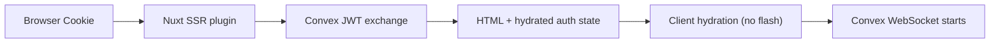

## Choosing the Right Composable

| Composable               | Purpose                            | Use when...                                                                        |
| ------------------------ | ---------------------------------- | ---------------------------------------------------------------------------------- |
| `useConvexAuth()`        | Reactive auth state + auth actions | Default choice. Sign in, sign up, sign out, and read auth state.                   |
| `useConvexUser()`        | Current-user query helper          | Seed UI from session user, then upgrade to canonical/profile data.                 |
| `useConvexAuth().client` | Typed Better Auth client           | Plugin-specific APIs (`admin`, `organization`, etc.) declared in `convex-auth.ts`. |

`useConvexAuth()` is the canonical public composable for auth state and common auth actions in this module.

## Reading Auth State (`useConvexAuth`)

```vue
<script setup lang="ts">
const { isAuthenticated, user, isPending } = useConvexAuth()
</script>

<template>
  <div v-if="isPending">Checking auth...</div>
  <div v-else-if="isAuthenticated">Welcome, {{ user?.name }}!</div>
  <div v-else>
    <NuxtLink to="/auth/signin">Sign In</NuxtLink>
  </div>
</template>
```

### SSR Auth Flow (No Flash)

Authentication is pre-populated during SSR for instant authenticated rendering:



**Key benefit**: Users see authenticated content immediately, no flash of unauthenticated state.

### Caching Authenticated Pages

The SSR payload for an authenticated request embeds that user's Convex JWT and profile (`convex:token` / `convex:user`) directly in the rendered HTML. The module sets `Cache-Control: private, no-store` on any SSR response that hydrates a token, but that header only protects you if your infrastructure respects it.

::callout{icon="i-lucide-shield-alert"}
**Never put authenticated routes behind ISR, a CDN, or any other shared/reverse-proxy cache.** If a shared cache stores an authenticated page anyway (e.g. a route rule or CDN config that ignores `Cache-Control`), every subsequent visitor who hits that cached entry receives the first user's bearer JWT and profile - full impersonation until the token expires.
::

Only cache routes that never hydrate a token — there is no per-route auth-skip config, so any route the server plugin resolves a session for will hydrate a token if one exists. SSR responses that carry a token send `Cache-Control: private, no-store`, but platform-level ISR, route-rule caching, or CDN rules can ignore handler headers. Do not enable shared caching for authenticated routes.

### Current User Data (`useConvexUser`)

`useConvexAuth().user` is session/JWT-derived data. Use it for immediate display fields and lightweight client state.

When a page needs canonical Better Auth user data or an app-owned derived profile, use `useConvexUser()` with an explicit Convex query. The helper starts with the session user, then upgrades to the query result when auth is ready.

```vue [app/pages/account.vue]
<script setup lang="ts">
import { api } from '#convex/api'

const currentUser = useConvexUser(api.users.viewer)
</script>

<template>
  <p v-if="currentUser.pending.value">Loading account...</p>
  <p v-else-if="currentUser.data.value">
    {{ currentUser.data.value.name }}
  </p>
</template>
```

For explicitly derived profile tables, mark the source:

```ts
const profile = useConvexUser(api.userProfiles.viewer, {}, { source: 'projection' })
```

The returned `source` is `'session'`, `'better-auth'`, `'projection'`, or `'none'`. Projection tables must be derived and rebuildable from the Better Auth component schema; do not duplicate role, membership, invitation, or API key secret truth in app tables.

### CSR-Only Mode

When running with `ssr: false` in your Nuxt config, the module automatically detects this and fetches auth state client-side:

```
1. Browser loads page (no SSR)
          |
          v
2. Client Plugin
   - Detects CSR-only mode
   - Fetches token from /api/auth/convex/token
   - Extracts user from JWT
   - Initializes ConvexClient with token
```

::callout{icon="i-lucide-info"}
CSR mode requires one additional request to check auth status. This is unavoidable since HttpOnly cookies cannot be read by JavaScript.
::

### URLs and Local Development (Progressive Setup)

**Recommended default (most apps):** only set `CONVEX_URL`.

```bash [.env.local]
CONVEX_URL=https://your-dev-deployment.convex.cloud
SITE_URL=http://localhost:3000
```

The module automatically derives `convex.siteUrl` (`*.convex.site`) from `CONVEX_URL`.

::callout{icon="i-lucide-info"}

- `convex.siteUrl` = Convex HTTP Actions host (used by the Nuxt auth proxy and SSR token exchange)
- `SITE_URL` = your app origin used by Better Auth inside `convex/auth.ts` (important for redirects/OAuth)
  ::

#### Custom Convex HTTP Actions Domain (Advanced)

If your Convex HTTP Actions are served from a custom domain, override `convex.siteUrl` explicitly:

```ts [nuxt.config.ts]
export default defineNuxtConfig({
  modules: ['better-convex-nuxt'],
  convex: {
    url: process.env.CONVEX_URL,
    siteUrl: 'https://api.example.com',
  },
})
```

#### Cross-Origin / Preview Scenarios (Advanced)

For localhost development, keep auth requests same-origin through the Nuxt proxy (`/api/auth/*`) and point the module at your dev Convex HTTP Actions URL.

```ts [nuxt.config.ts]
export default defineNuxtConfig({
  modules: ['better-convex-nuxt'],
  convex: {
    url: process.env.CONVEX_URL,
    siteUrl: process.env.CONVEX_SITE_URL,
    trustedOrigins: ['https://preview-*.vercel.app'],
  },
})
```

```bash [.env.local]
CONVEX_URL=https://your-dev-deployment.convex.cloud
CONVEX_SITE_URL=https://your-dev-deployment.convex.site
SITE_URL=http://localhost:3000
```

This avoids browser CORS preflight failures caused by cross-origin auth requests to production domains.

::callout{icon="i-lucide-shield"}
`better-convex-nuxt` `v0.2.11+` follows only canonical host redirects server-side (same path/query, different host) and forwards OAuth redirects to the browser.
::

::callout{icon="i-lucide-info"}
When using the Nuxt auth proxy (`/api/auth/*`), set `convex.siteUrl` in `nuxt.config` to your Convex HTTP Actions host (`*.convex.site`), but set Better Auth `baseURL` in `convex/auth.ts` to your app URL (`SITE_URL`). Redirect handling improved in `v0.2.11+`, but social OAuth callbacks still depend on the correct `baseURL`.
::

::callout{icon="i-lucide-alert-triangle"}
**Common mistake:** setting Better Auth `baseURL` to `convex.siteUrl` / `CONVEX_SITE_URL`.  
For Nuxt proxy setups, Better Auth `baseURL` should be your app origin (`SITE_URL`), while `convex.siteUrl` should point to Convex HTTP Actions.
::

---

## Auth Operations

### `useConvexAuth()` (Primary API)

Use `useConvexAuth()` for both reactive auth state and standard auth actions.

```vue
<script setup lang="ts">
const { signIn, signOut, isAuthenticated, user } = useConvexAuth()

async function signInWithEmail(email: string, password: string) {
  const { data, error } = await signIn.email({
    email,
    password,
  })

  if (error) {
    console.error('Sign in failed:', error.message)
  } else {
    // signIn synchronizes Convex auth automatically
    navigateTo('/dashboard')
  }
}

async function handleSignOut() {
  await signOut()
  navigateTo('/')
}
</script>
```

::callout{icon="i-lucide-info"}

- `signIn` / `signUp` are client-only (safe to reference during SSR; they warn if called on the server)
- `client` is available on `useConvexAuth()` as an advanced escape hatch for plugin-specific Better Auth APIs
  ::

::callout{icon="i-lucide-lightbulb"}
**What should I use?**

- Show user name/avatar: `useConvexAuth().user`
- Sign in / sign up: `useConvexAuth().signIn`, `useConvexAuth().signUp`
- Sign out: `useConvexAuth().signOut`
- Better Auth plugin methods (`admin`, `organization`, ...): `useConvexAuth().client` or a custom typed client
  ::

### Using Additional Better Auth Plugins

`useConvexAuth().client` is the module-managed Better Auth client. Its type is derived from your `convex-auth.ts` definition, so declaring plugins there makes their methods (for example `admin`, `organization`) appear on `client` — fully typed, with no separate factory.

To add a client plugin, list it in your definition. `better-convex-nuxt` prepends `convexClient()`, uses the configured Nuxt auth proxy route, and keeps `credentials: 'include'` for you.

::callout{icon="i-lucide-alert-triangle"}
Admin, Organization, and API Key change the Better Auth database schema. Use a local Better Auth Convex component install for these plugins and regenerate `convex/betterAuth/schema.ts` after enabling them.
::

#### Server: install the Better Auth plugin in `convex/auth.ts`

```ts [convex/auth.ts]
import { convex } from '@convex-dev/better-auth/plugins'
import { admin } from 'better-auth/plugins'

plugins: [convex({ authConfig }), admin()]
```

#### Client: declare the plugin in `convex-auth.ts`

```ts [app/convex-auth.ts]
import { adminClient } from 'better-auth/client/plugins'
import { defineConvexAuthClient } from 'better-convex-nuxt/auth-client'

export default defineConvexAuthClient({
  plugins: [adminClient()],
})
```

#### Example: use plugin APIs + keep reactive logout

```vue
<script setup lang="ts">
const { client, signOut } = useConvexAuth()

async function loadUsers() {
  if (!client) return
  const result = await client.admin.listUsers({
    query: { limit: 10 },
  })
  console.log(result)
}

async function handleSignOut() {
  // Prefer Convex-aware logout so local auth state clears after Better Auth succeeds.
  await signOut()
  navigateTo('/')
}
</script>
```

::callout{icon="i-lucide-alert-triangle"}
**Common mistake:** calling `client.signOut()` directly in app code and expecting `useConvexAuth().isAuthenticated` to update after logout.
Prefer `useConvexAuth().signOut()` so local Convex auth state is cleared only after Better Auth confirms logout.
::

### Schema-Changing Plugins: Admin, Organization, API Key

Better Auth owns the tables for Admin, Organization, and API Key. Do not mirror those tables into your app schema as a second source of truth. App tables may reference Better Auth ids, but role, membership, invitation, and API key secret state should stay in the generated Better Auth component schema.

Use this layout:

```txt
convex/
  auth.ts
  convex.config.ts
  betterAuth/
    convex.config.ts
    auth.ts
    adapter.ts
    schema.ts
```

#### 1. Define a local Better Auth component

```ts [convex/betterAuth/convex.config.ts]
import { defineComponent } from 'convex/server'

const component = defineComponent('betterAuth')

export default component
```

#### 2. Split Better Auth options from the runtime auth factory

```ts [convex/auth.ts]
import { createClient, type GenericCtx } from '@convex-dev/better-auth'
import { convex } from '@convex-dev/better-auth/plugins'
import { betterAuth, type BetterAuthOptions } from 'better-auth/minimal'
import { admin, organization } from 'better-auth/plugins'
import { apiKey } from '@better-auth/api-key'

import { components } from './_generated/api'
import type { DataModel } from './_generated/dataModel'
import authSchema from './betterAuth/schema'
import { authConfig } from './auth.config'

export const authComponent = createClient<DataModel, typeof authSchema>(components.betterAuth, {
  local: { schema: authSchema },
})

export function createAuthOptions(ctx: GenericCtx<DataModel>): BetterAuthOptions {
  return {
    database: authComponent.adapter(ctx),
    baseURL: process.env.SITE_URL,
    secret: process.env.BETTER_AUTH_SECRET,
    plugins: [convex({ authConfig }), admin(), organization(), apiKey()],
  } satisfies BetterAuthOptions
}

export function createAuth(ctx: GenericCtx<DataModel>) {
  return betterAuth(createAuthOptions(ctx))
}

export type AppAuth = ReturnType<typeof createAuth>
```

#### 3. Add a schema-generation-only auth export

```ts [convex/betterAuth/auth.ts]
import { createAuth } from '../auth'

export const auth = createAuth({} as never)
```

#### 4. Generate the Better Auth component schema

```bash
cd convex/betterAuth
npx auth generate
```

The generated `convex/betterAuth/schema.ts` is Better Auth-owned. Regenerate it whenever you add or reconfigure a schema-changing Better Auth plugin.

#### 5. Export local adapter functions

```ts [convex/betterAuth/adapter.ts]
import { createApi } from '@convex-dev/better-auth'

import { createAuthOptions } from '../auth'
import schema from './schema'

export const { create, findOne, findMany, updateOne, updateMany, deleteOne, deleteMany } =
  createApi(schema, createAuthOptions)
```

#### 6. Register the local component

```ts [convex/convex.config.ts]
import { defineApp } from 'convex/server'

import betterAuth from './betterAuth/convex.config'

const app = defineApp()
app.use(betterAuth)

export default app
```

#### 7. Use plugin-typed client APIs from Nuxt

```ts [app/convex-auth.ts]
import { apiKeyClient } from '@better-auth/api-key/client'
import { adminClient, organizationClient } from 'better-auth/client/plugins'
import { defineConvexAuthClient } from 'better-convex-nuxt/auth-client'

export default defineConvexAuthClient({
  plugins: [adminClient(), organizationClient(), apiKeyClient()],
})
```

```vue [app/pages/team.vue]
<script setup lang="ts">
const { client } = useConvexAuth()

async function createTeam() {
  if (!client) return
  await client.organization.create({
    name: 'Acme',
    slug: 'acme',
  })
}

async function createApiKey() {
  if (!client) return
  const result = await client.apiKey.create({
    name: 'CI deploy key',
  })

  // Show the secret once. Do not store it in app tables.
  console.log(result.data?.key)
}
</script>
```

For Convex functions, call Better Auth through the component API instead of duplicating plugin state:

```ts [convex/teams.ts]
import { query } from './_generated/server'
import { createAuth, authComponent } from './auth'

export const viewerOrganizations = query({
  args: {},
  handler: async (ctx) => {
    const { auth, headers } = await authComponent.getAuth(createAuth, ctx)
    const session = await auth.api.getSession({ headers })

    if (!session) return []

    // Prefer Better Auth Organization APIs/helpers for membership and role checks.
    return await auth.api.listOrganizations({ headers })
  },
})
```

::callout{icon="i-lucide-shield"}
If your app needs fast reads for organization names or user display fields, use derived projection tables only when they are explicitly rebuildable from Better Auth component data and covered by trigger/rebuild tests.
::

### Email/Password Sign In

```vue
<script setup lang="ts">
const { signIn } = useConvexAuth()

const email = ref('')
const password = ref('')
const error = ref<string | null>(null)
const loading = ref(false)

async function handleSignIn() {
  error.value = null
  loading.value = true

  try {
    const { error: authError } = await signIn.email({
      email: email.value,
      password: password.value,
    })

    if (authError) {
      error.value = authError.message
    } else {
      // signIn synchronizes Convex auth automatically
      navigateTo('/dashboard')
    }
  } finally {
    loading.value = false
  }
}
</script>

<template>
  <form @submit.prevent="handleSignIn">
    <input v-model="email" type="email" placeholder="Email" />
    <input v-model="password" type="password" placeholder="Password" />
    <button :disabled="loading">
      {{ loading ? 'Signing in...' : 'Sign In' }}
    </button>
    <p v-if="error" class="error">{{ error }}</p>
  </form>
</template>
```

### OAuth Sign In

```vue
<script setup lang="ts">
const { signIn } = useConvexAuth()

async function signInWithGoogle() {
  await signIn.social({
    provider: 'google',
    callbackURL: '/dashboard',
  })
}

async function signInWithGitHub() {
  await signIn.social({
    provider: 'github',
    callbackURL: '/dashboard',
  })
}
</script>

<template>
  <div class="oauth-buttons">
    <button @click="signInWithGoogle">Continue with Google</button>
    <button @click="signInWithGitHub">Continue with GitHub</button>
  </div>
</template>
```

### Sign Up

```vue
<script setup lang="ts">
const { signUp } = useConvexAuth()

const name = ref('')
const email = ref('')
const password = ref('')
const error = ref<string | null>(null)

async function handleSignUp() {
  const { error: authError } = await signUp.email({
    name: name.value,
    email: email.value,
    password: password.value,
  })

  if (authError) {
    error.value = authError.message
  } else {
    navigateTo('/dashboard')
  }
}
</script>

<template>
  <form @submit.prevent="handleSignUp">
    <input v-model="name" placeholder="Name" />
    <input v-model="email" type="email" placeholder="Email" />
    <input v-model="password" type="password" placeholder="Password" />
    <button>Create Account</button>
    <p v-if="error" class="error">{{ error }}</p>
  </form>
</template>
```

### Sign Out

```vue
<script setup lang="ts">
const { isAuthenticated, user, signOut } = useConvexAuth()

async function handleSignOut() {
  await signOut()
  navigateTo('/')
}
</script>

<template>
  <div v-if="isAuthenticated" class="user-menu">
    <span>{{ user?.name }}</span>
    <button @click="handleSignOut">Sign Out</button>
  </div>
</template>
```

---

## Auth Components

Declarative components for rendering content based on authentication state.

| Component                 | Shows content when...                                 |
| ------------------------- | ----------------------------------------------------- |
| `<ConvexAuthLoading>`     | Auth state is being determined                        |
| `<ConvexAuthenticated>`   | User is authenticated                                 |
| `<ConvexUnauthenticated>` | User is NOT authenticated                             |
| `<ConvexAuthError>`       | Auth error occurred (401/403 or token decode failure) |

### Basic Usage

```vue
<template>
  <ConvexAuthLoading>
    <div class="loading">Checking authentication...</div>
  </ConvexAuthLoading>

  <ConvexAuthenticated>
    <Dashboard />
  </ConvexAuthenticated>

  <ConvexUnauthenticated>
    <LoginPrompt />
  </ConvexUnauthenticated>
</template>
```

### ConvexAuthLoading

Renders content while auth state is being determined.

```vue
<template>
  <ConvexAuthLoading>
    <div class="auth-loading">
      <Spinner />
      <p>Loading...</p>
    </div>
  </ConvexAuthLoading>
</template>
```

### ConvexAuthenticated

Renders content when user is authenticated.

```vue
<template>
  <ConvexAuthenticated>
    <nav class="user-nav">
      <NuxtLink to="/dashboard">Dashboard</NuxtLink>
      <NuxtLink to="/settings">Settings</NuxtLink>
      <UserMenu />
    </nav>
  </ConvexAuthenticated>
</template>
```

### ConvexUnauthenticated

Renders content when user is NOT authenticated.

```vue
<template>
  <ConvexUnauthenticated>
    <div class="guest-nav">
      <NuxtLink to="/auth/signin">Sign In</NuxtLink>
      <NuxtLink to="/auth/signup">Sign Up</NuxtLink>
    </div>
  </ConvexUnauthenticated>
</template>
```

### ConvexAuthError

Renders content when authentication has failed (401/403 from token endpoint, or token decode error). Provides `retry` and `error` slot props.

```vue
<template>
  <ConvexAuthError v-slot="{ retry, error }">
    <div class="auth-error">
      <p>{{ error || 'Authentication failed. Please try again.' }}</p>
      <button @click="retry">Retry</button>
    </div>
  </ConvexAuthError>
</template>
```

---

## Patterns

### Header with Auth States

```vue
<template>
  <header class="app-header">
    <NuxtLink to="/" class="logo">MyApp</NuxtLink>

    <nav>
      <ConvexAuthLoading>
        <div class="skeleton-avatar" />
      </ConvexAuthLoading>

      <ConvexAuthenticated>
        <NuxtLink to="/dashboard">Dashboard</NuxtLink>
        <UserDropdown />
      </ConvexAuthenticated>

      <ConvexUnauthenticated>
        <NuxtLink to="/auth/signin">Sign In</NuxtLink>
        <NuxtLink to="/auth/signup" class="btn-primary"> Get Started </NuxtLink>
      </ConvexUnauthenticated>
    </nav>
  </header>
</template>
```

### Protected Page Layout

```vue [layouts/dashboard.vue]
<template>
  <div class="dashboard-layout">
    <ConvexAuthLoading>
      <div class="loading-screen">
        <Spinner size="lg" />
        <p>Loading your dashboard...</p>
      </div>
    </ConvexAuthLoading>

    <ConvexAuthenticated>
      <DashboardSidebar />
      <main class="dashboard-content">
        <slot />
      </main>
    </ConvexAuthenticated>

    <ConvexUnauthenticated>
      <div class="auth-required">
        <h1>Authentication Required</h1>
        <p>Please sign in to access this page.</p>
        <NuxtLink to="/auth/signin" class="btn">Sign In</NuxtLink>
      </div>
    </ConvexUnauthenticated>
  </div>
</template>
```

### Protected Page with Redirect

```vue
<script setup lang="ts">
const { isAuthenticated, isPending } = useConvexAuth()

// Redirect if not authenticated
watch(
  () => ({
    isAuthenticated: isAuthenticated.value,
    isPending: isPending.value,
  }),
  ({ isAuthenticated, isPending }) => {
    if (!isPending && !isAuthenticated) {
      navigateTo('/auth/signin')
    }
  },
  { immediate: true },
)
</script>

<template>
  <div v-if="isPending">Loading...</div>
  <div v-else-if="isAuthenticated">
    <Dashboard />
  </div>
</template>
```

### Route Middleware (Auth and Permissions)

Use `useConvexAuth()` for simple "signed in / signed out" guards in route middleware.

```ts [app/middleware/auth.ts]
export default defineNuxtRouteMiddleware(() => {
  const { isAuthenticated, isPending } = useConvexAuth()

  if (isPending.value) return
  if (!isAuthenticated.value) {
    return navigateTo('/auth/signin')
  }
})
```

If you need to query Convex in route middleware (for role/permission checks), use one-shot APIs:

- client navigation: `useConvex()`
- SSR navigation: `serverConvex(event)`

```ts [app/middleware/admin-only.ts]
import { api } from '#convex/api'

export default defineNuxtRouteMiddleware(async () => {
  const context = import.meta.server
    ? await serverConvex(useRequestEvent()!).query(api.auth.getPermissionContext, {})
    : await useConvex().query(api.auth.getPermissionContext, {})

  if (!context || context.role !== 'admin') {
    return navigateTo('/')
  }
})
```

::callout{icon="i-lucide-info"}
`useConvexQuery` and `useConvexPaginatedQuery` are setup-scope composables and should not be used in route middleware/plugins.
::

### Conditional Query Based on Auth

```vue
<script setup lang="ts">
const { isAuthenticated } = useConvexAuth()

// Only fetch when authenticated
const { data: profile } = await useConvexQuery(
  api.users.getProfile,
  computed(() => (isAuthenticated.value ? {} : 'skip')),
)
</script>
```

### Conditional Feature

```vue
<template>
  <div class="comments-section">
    <h2>Comments</h2>

    <!-- Anyone can read comments -->
    <CommentList :postId="postId" />

    <!-- Only authenticated users can post -->
    <ConvexAuthenticated>
      <CommentForm :postId="postId" />
    </ConvexAuthenticated>

    <ConvexUnauthenticated>
      <p class="signin-prompt">
        <NuxtLink to="/auth/signin">Sign in</NuxtLink>
        to leave a comment.
      </p>
    </ConvexUnauthenticated>
  </div>
</template>
```

### With SSR and ClientOnly

For proper SSR handling, wrap auth components in `<ClientOnly>`:

```vue
<template>
  <ClientOnly>
    <ConvexAuthLoading>
      <SkeletonHeader />
    </ConvexAuthLoading>

    <ConvexAuthenticated>
      <AuthenticatedHeader />
    </ConvexAuthenticated>

    <ConvexUnauthenticated>
      <GuestHeader />
    </ConvexUnauthenticated>

    <template #fallback>
      <SkeletonHeader />
    </template>
  </ClientOnly>
</template>
```

### User Welcome Message

```vue
<script setup lang="ts">
const { user } = useConvexAuth()
</script>

<template>
  <ConvexAuthenticated>
    <div class="welcome">
      
      <div>
        <p class="greeting">Welcome back,</p>
        <p class="name">{{ user?.name }}</p>
      </div>
    </div>
  </ConvexAuthenticated>
</template>
```

---

## Composable vs Components

Auth components are syntax sugar over `useConvexAuth()`:

```vue
<!-- Using components -->
<template>
  <ConvexAuthenticated>
    <Dashboard />
  </ConvexAuthenticated>
</template>

<!-- Equivalent with composable -->
<script setup>
const { isAuthenticated, isPending } = useConvexAuth()
</script>
<template>
  <Dashboard v-if="!isPending && isAuthenticated" />
</template>
```

**When to use components:**

- Cleaner template syntax
- Multiple auth states in one template
- Layouts and common patterns

**When to use composable:**

- Need access to `user` or `token`
- Complex conditional logic
- Programmatic auth checks

---

## Complete Auth Page Example

```vue [pages/auth/signin.vue]
<script setup lang="ts">
const { signIn, isAuthenticated } = useConvexAuth()

// Redirect if already authenticated
watch(
  isAuthenticated,
  (value) => {
    if (value) navigateTo('/dashboard')
  },
  { immediate: true },
)

const email = ref('')
const password = ref('')
const error = ref<string | null>(null)
const loading = ref(false)

async function handleEmailSignIn() {
  error.value = null
  loading.value = true

  try {
    const { error: authError } = await signIn.email({
      email: email.value,
      password: password.value,
    })
    if (authError) {
      error.value = authError.message
    }
    // signIn synchronizes Convex auth automatically
  } finally {
    loading.value = false
  }
}

async function handleGoogleSignIn() {
  await signIn.social({
    provider: 'google',
    callbackURL: '/dashboard',
  })
}
</script>

<template>
  <div class="auth-page">
    <h1>Sign In</h1>

    <form @submit.prevent="handleEmailSignIn">
      <input v-model="email" type="email" placeholder="Email" required />
      <input v-model="password" type="password" placeholder="Password" required />
      <button type="submit" :disabled="loading">
        {{ loading ? 'Signing in...' : 'Sign In' }}
      </button>
    </form>

    <p v-if="error" class="error">{{ error }}</p>

    <div class="divider">or</div>

    <button @click="handleGoogleSignIn" class="oauth-btn">Continue with Google</button>

    <p class="signup-link">
      Don't have an account?
      <NuxtLink to="/auth/signup">Sign Up</NuxtLink>
    </p>
  </div>
</template>
```

---

## API Reference

### useConvexAuth Returns

| Property          | Type                                            | Description                                                            |
| ----------------- | ----------------------------------------------- | ---------------------------------------------------------------------- |
| `status`          | `ComputedRef<ConvexAuthStatus>`                 | Current auth status: `authenticated`, `unauthenticated`, or `disabled` |
| `isPending`       | `ComputedRef<boolean>`                          | True while auth work is in flight (independent of `status`)            |
| `isAuthenticated` | `ComputedRef<boolean>`                          | True when a usable identity is present                                 |
| `user`            | `Readonly<Ref<ConvexUser \| null>>`             | Authenticated user data                                                |
| `token`           | `Readonly<Ref<string \| null>>`                 | JWT token for Convex auth                                              |
| `error`           | `Readonly<Ref<ConvexCallError \| null>>`        | Last auth error (framework-free `ConvexCallError`)                     |
| `signIn`          | `client['signIn']`                              | Typed sign-in methods; synchronizes Convex automatically (client-only) |
| `signUp`          | `client['signUp']`                              | Typed sign-up methods; synchronizes Convex automatically (client-only) |
| `signOut`         | `() => Promise<unknown>`                        | Signs out from both Better Auth and Convex                             |
| `refresh`         | `() => Promise<void>`                           | Advanced: force a fresh token (raw-client / claim-change flows only)   |
| `ready`           | `(options?: { timeoutMs? }) => Promise<status>` | Resolve once auth has settled; returns the settled `status`            |
| `client`          | `InferRegisteredConvexAuthClient \| null`       | Typed Better Auth client instance (null during SSR)                    |

When auth is disabled (`auth: false`), `useConvexAuth()` still exists: `status` reports `'disabled'`, and `signIn`/`signUp`/`signOut`/`refresh` reject.

### ConvexUser Type

```ts
interface ConvexUser {
  id: string
  name: string
  email: string
  emailVerified?: boolean
  image?: string
  createdAt?: string
  updatedAt?: string
}
```

### Which User Fields Layer Should I Use?

There are **three different places** where "extra user fields" can exist in a Better Auth + Convex app:

| Layer                    | Example                            | Used by                                                             | How to add fields                                             |
| ------------------------ | ---------------------------------- | ------------------------------------------------------------------- | ------------------------------------------------------------- |
| Better Auth core schema  | `user.additionalFields.department` | `authClient.useSession()`, plugin endpoints, Better Auth DB records | Better Auth `additionalFields` + `inferAdditionalFields(...)` |
| Convex JWT claims        | `useConvexAuth().user.department`  | Nuxt UI/auth state convenience fields                               | `convex({ jwt.definePayload })` + `ConvexUser` augmentation   |
| Your app's Convex tables | `profiles.timezone`, domain rows   | App business data that is not authorization                         | Convex schema + triggers/queries/mutations                    |

Use the right layer for the job:

- Need typed fields in Better Auth session/plugin responses: use Better Auth `additionalFields`.
- Need fields on `useConvexAuth().user`: add JWT claims and extend `ConvexUser`.
- Need roles or organization membership: use Better Auth Organization and read
  membership through `getPermissionContext` or the Better Auth component
  adapter.

### Better Auth Additional Fields for Sessions and Plugins

For Better Auth fields like `user.additionalFields` / `session.additionalFields`, use Better Auth's core schema config and client type inference.

See also: [Better Auth: Extending Core Schema](https://www.better-auth.com/docs/concepts/database#extending-core-schema)

::callout{icon="i-lucide-alert-triangle"}
**Common mistake:** expecting plugin APIs on `useConvexAuth().client` to be strongly typed automatically.  
For plugin methods (`admin`, `organization`, etc.) and typed `additionalFields`, create a custom client with plugin client adapters.
::

#### Server: define additional fields and export an auth type alias

```ts [convex/auth.ts]
export const createAuth = (ctx: GenericCtx<DataModel>) => {
  return betterAuth({
    // ...your existing config
    database: authComponent.adapter(ctx),
    user: {
      additionalFields: {
        organizationId: { type: 'string', required: false },
        marketingOptIn: { type: 'boolean', required: false },
      },
    },
  })
}

// Type-only bridge for frontend inference (safe to import with `import type`)
export type AppAuth = ReturnType<typeof createAuth>
```

#### Client: infer additional fields in the definition

```ts [app/convex-auth.ts]
import { inferAdditionalFields, adminClient } from 'better-auth/client/plugins'
import { defineConvexAuthClient } from 'better-convex-nuxt/auth-client'
import type { AppAuth } from '../convex/auth'

export default defineConvexAuthClient({
  plugins: [inferAdditionalFields<AppAuth>(), adminClient()],
})
```

```vue
<script setup lang="ts">
const { client } = useConvexAuth()
const session = client?.useSession()

// Typed from Better Auth additionalFields (not from Convex JWT claims)
const orgId = computed(() => session?.value.data?.user.organizationId)
const marketingOptIn = computed(() => session?.value.data?.user.marketingOptIn)
</script>
```

::callout{icon="i-lucide-triangle-alert"}
Use `import type { AppAuth }` only. Do not runtime-import your server auth instance into client code.
::

### Extending ConvexUser (Custom JWT Claims)

`useConvexAuth().user` is typed as `ConvexUser`. You can extend it with TypeScript module augmentation so app-specific fields like `role`, `authId`, or `organizationId` are recognized by your editor and type checker.

```ts [app/types/convex-user.d.ts]
declare module 'better-convex-nuxt' {
  interface ConvexUser {
    role?: 'owner' | 'admin' | 'member' | 'viewer'
    authId?: string
    organizationId?: string
  }
}

export {}
```

#### Runtime values require JWT claims

Type augmentation only changes TypeScript. For `user.role` (or any custom field) to exist at runtime, that field must be included in the Convex JWT payload.

```ts [convex/auth.ts]
import { convex } from '@convex-dev/better-auth/plugins'

plugins: [
  convex({
    authConfig,
    jwt: {
      definePayload: ({ user }) => ({
        // Keep standard fields used by useConvexAuth()
        name: user.name,
        email: user.email,
        emailVerified: user.emailVerified,
        image: user.image ?? undefined,

        // Custom claims
        authId: user.id,
        role: 'member', // example only
      }),
    },
  }),
]
```

#### Using extended fields in components

```vue
<script setup lang="ts">
const { user, refresh } = useConvexAuth()

const role = computed(() => user.value?.role)

async function refreshClaims() {
  await refresh()
}
</script>

<template>
  <p>JWT role claim: {{ role || '(no claim)' }}</p>
  <button @click="refreshClaims">Refresh Auth Claims</button>
</template>
```

### Best Practices for Custom Claims

- Treat `useConvexAuth().user` as **identity + convenience claims** (good for UI display and lightweight client checks).
- Treat a Convex query (for example `api.auth.getPermissionContext`) as the authoritative read path for Better Auth roles and organization membership. Derive an application-owned `useAppCapabilities()` helper from that result when the UI needs reusable visibility checks.
- Keep JWT payload generation **cheap and deterministic**. Avoid expensive work in token minting.
- Avoid calling Convex functions from `jwt.definePayload()` to build claims. Prefer data already available on the auth user/session, or read Better Auth membership separately through Convex queries.
- If claims can change during a session (e.g. role changes), call `useConvexAuth().refresh()` after the change to fetch a fresh token.
- Never rely on frontend/JWT claims alone for backend authorization. Always enforce permissions inside Convex functions.

---

## Notes

- Components use `useConvexAuth()` internally
- Auth state is pre-populated during SSR (no flash)
- Components render nothing (not even a wrapper element) when condition isn't met
- All four components can coexist in the same template

---

## Avoiding Unnecessary Auth Work on Public Pages

There is no route-level or page-level config to skip auth checks entirely — every page still resolves auth
state (needed for `useConvexAuth()`/`<ConvexAuthenticated>` to work correctly everywhere). What you control
is per-query: pass `auth: 'none'` to queries on marketing/public pages that never need identity, so they
execute immediately without waiting on auth settlement.

```vue [pages/landing.vue]
<script setup lang="ts">
import { api } from '#convex/api'

const { data: content } = useConvexQuery(api.pages.getMarketingContent, {}, { auth: 'none' })
</script>
```

### When to Use `auth: 'none'`

| Use `auth: 'none'`      | Use `required` / `optional` (default) |
| ----------------------- | ------------------------------------- |
| Marketing/landing pages | Dashboard                             |
| Public blog posts       | User settings                         |
| Documentation           | Protected content                     |
| Pricing page            | Admin panels                          |

::callout{icon="i-lucide-zap"}
`auth: 'none'` skips waiting on auth settlement and always executes anonymously, avoiding an unnecessary
delay on pages that don't need identity.
::

---

## Related Topics

- [Auth Guards and Permissions](/docs/recipes/auth-guards-and-permissions) - Role-based access control
- [SSR & Hydration](/docs/server-side/ssr-hydration) - Skeleton loaders for auth content
