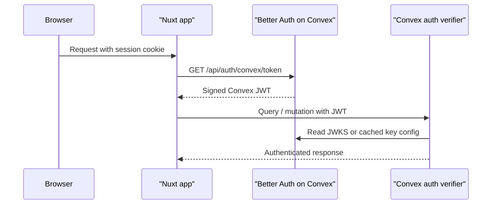

## The short version

Think of a JWT like a signed hall pass.

- Better Auth writes the hall pass.
- Convex checks whether the signature is real.
- JWKS is the public key list Convex uses to check that signature.

If the signature matches one of the public keys in JWKS, Convex trusts the token. If it does not, Convex rejects it.

## What actually happens

When a signed-in user loads your app, the flow is:

1. Better Auth has already created a session cookie on your app's domain.
2. The Nuxt server plugin sends that cookie to `/api/auth/convex/token`.
3. The Convex Better Auth plugin validates the session and returns a short-lived Convex JWT.
4. Convex later verifies that JWT against the matching public key from JWKS.



## The defaults from `@convex-dev/better-auth`

The upstream helper `getAuthConfigProvider()` sets these defaults for Convex custom JWT auth:

- `issuer`: `process.env.CONVEX_SITE_URL`
- `applicationID`: `"convex"`
- `algorithm`: `"RS256"`
- `jwks`: `${CONVEX_SITE_URL}/api/auth/convex/jwks` by default

The Convex Better Auth plugin issues JWTs with:

- `issuer`: `process.env.CONVEX_SITE_URL`
- `audience`: `"convex"`
- `expiration`: 15 minutes by default
- `algorithm`: based on the auth config, with Convex custom JWT support requiring `RS256`

Those values must agree. If the issuer, audience, algorithm, or JWKS source do not line up, auth breaks.

## The two JWKS modes

### 1. Live JWKS URL

This is the default and usually the right choice.

```ts [convex/auth.config.ts]
import type { AuthConfig } from 'convex/server'
import { getAuthConfigProvider } from '@convex-dev/better-auth'

export default {
  providers: [getAuthConfigProvider()],
} satisfies AuthConfig
```

In this mode:

- Convex verifies JWTs using `/api/auth/convex/jwks`
- Better Auth keeps the real keys in its JWKS table
- key rotation can happen without copying env vars around

### 2. Static `JWKS`

This is an optimization or deployment choice, not the default.

```ts [convex/auth.config.ts]
import type { AuthConfig } from 'convex/server'
import { getAuthConfigProvider } from '@convex-dev/better-auth'

export default {
  providers: [getAuthConfigProvider({ jwks: process.env.JWKS })],
} satisfies AuthConfig
```

```ts [convex/auth.ts]
plugins: [convex({ authConfig, jwks: process.env.JWKS })]
```

In static mode:

- Convex does not fetch JWKS from `/api/auth/convex/jwks`
- both places must use the exact same `process.env.JWKS`
- you are responsible for rotating it when keys change

::warning
Do not set `process.env.JWKS` in only one place. If `convex/auth.config.ts` and `convex({ authConfig, jwks })` disagree, token verification and token generation no longer describe the same key set.
::

## Why the JWKS value is sensitive

`process.env.JWKS` is not just a harmless URL. In static mode it is a stringified document based on Better Auth's JWKS table. Treat it as sensitive deployment config and keep it out of source control.

## Common mistakes

### Mixing up `SITE_URL` and `CONVEX_SITE_URL`

- `SITE_URL` is your app origin, like `http://localhost:3000`
- `CONVEX_SITE_URL` is your Convex HTTP Actions origin, like `https://your-project.convex.site`

They do different jobs. `SITE_URL` is for Better Auth callbacks and trusted origins. `CONVEX_SITE_URL` is the issuer/JWKS base for Convex JWT auth.

### Assuming `useConvexAuth()` signs users in

It does not. It reads auth state and provides `signOut()`.

Sign-in uses the Better Auth client exposed as `useNuxtApp().$auth`.

### Thinking JWKS is the private key

It is not. JWKS is the public key set. Better Auth signs with the private key. Convex verifies with the public key.

### Assuming tokens live forever

They do not. The Convex Better Auth plugin issues short-lived JWTs. The client fetches fresh ones when needed.

## Minimal truthful setup

```ts [convex/auth.config.ts]
import type { AuthConfig } from 'convex/server'
import { getAuthConfigProvider } from '@convex-dev/better-auth'

export default {
  providers: [getAuthConfigProvider()],
} satisfies AuthConfig
```

```ts [convex/auth.ts]
import { createClient } from '@convex-dev/better-auth'
import { convex } from '@convex-dev/better-auth/plugins'
import { betterAuth } from 'better-auth'

import authConfig from './auth.config'
import { components } from './_generated/api'
import type { DataModel } from './_generated/dataModel'

export const authComponent = createClient<DataModel>(components.betterAuth)

export const createAuth = (ctx: any) =>
  betterAuth({
    database: authComponent.adapter(ctx),
    plugins: [convex({ authConfig })],
  })
```

```ts [convex/http.ts]
import { httpRouter } from 'convex/server'

import { authComponent, createAuth } from './auth'

const http = httpRouter()

authComponent.registerRoutes(http, createAuth, { cors: true })

export default http
```

## When to reach for static JWKS

Use static `JWKS` only if you have a concrete reason, such as:

- you want Convex auth verification to avoid the JWKS endpoint lookup
- you need fully explicit key material in deployment config
- you understand and accept manual rotation responsibility

If you do not have one of those reasons, stay on the default live JWKS path.
