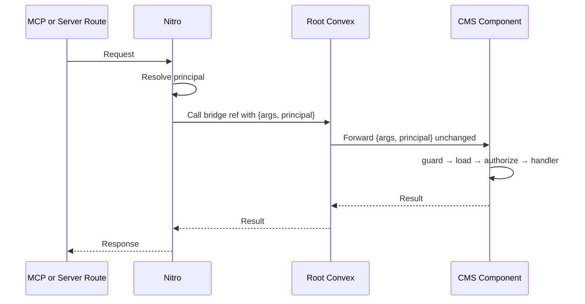

When your Convex backend uses components — isolated modules that cannot access the root app's auth session — you need a way to forward the caller's identity into them. Trellis provides two patterns for this: **root wrappers** for browser-facing entrypoints and **component bridges** for server-side and MCP callers.

## When You Need This

You need a bridge or wrapper when:

- Your business logic lives in a Convex component (like the mini CMS example), and browser users need to call it.
- Server routes or MCP tools need to invoke component handlers with the correct caller identity.
- You have multiple entrypoints (browser, server, MCP) that all call the same component function.

If your app runs entirely in the root Convex environment (no components), you do not need bridges — `query(...)` and `mutation(...)` handle identity automatically.

## Root Wrapper Pattern

Use explicit root wrappers when the root app is the browser-facing surface. The wrapper resolves the principal from the auth session and calls the component handler directly:

```ts [convex/pages.ts]
export const publish = mutation({
  args: publishPage.args,
  guard: canManagePages,
  handler: async (ctx, args) => {
    return await ctx.runMutation(components.miniCms.pages.publishPage, {
      ...args,
      principal: await ctx.principal(),
    })
  },
})
```

This is the right choice when:

- The entrypoint is browser-facing
- You want the auth flow to be visible and readable in the function signature
- You only have a small number of component entrypoints

## Component Bridge Pattern

Use `createComponentBridge(...)` when you need a **stable inventory of internal refs** that server routes and MCP tools can call:

```ts [convex/miniCmsBridge.ts]
const bridge = createComponentBridge(
  { query, mutation, internalQuery, internalMutation },
  { principal },
)

export const listPublishedPages = bridge.internalQuery({
  component: components.miniCms.pages.listPublishedPages,
  args: listPublishedPages.args,
  returns: v.array(publishedPageValidator),
})

export const publishPage = bridge.internalMutation({
  component: components.miniCms.pages.publishPage,
  args: publishPage.args,
  returns: v.object({ pageId: v.string(), published: v.boolean() }),
})
```

Each bridge entry wraps a component function and automatically forwards `{ ...args, principal }`. The root app owns the inventory; MCP tools and server routes call these bridge refs.

Treat those root internal refs as the stable automation surface for non-browser callers. MCP, Agent Auth execute routes, webhook handlers, and cron workers should target the root inventory rather than reaching into component functions directly.

This is the right choice when:

- Multiple server-side or MCP entrypoints need the same component function
- You want a reviewable bridge inventory in one file
- The root app should own the naming and exported surface

## What the Bridge Does

The bridge handles three things:

1. **Forwards identity.** Every call includes the resolved principal so the component can derive its own actor.
2. **Preserves function visibility.** `bridge.internalQuery(...)` stays internal; `bridge.query(...)` is public.
3. **Validates args at the boundary.** The `args` and `returns` validators type-check the call between root and component.

The bridge does **not** check permissions, load data, or make business decisions. Those responsibilities belong to the component's handler — specifically its `guard`, `load`, and `authorize` phases.

## Calling a Bridge from Nitro

On the server side, call the registered bridge ref like any other Convex function:

```ts [server/api/pages/publish.post.ts]
export default defineEventHandler(async (event) => {
  const principal = await resolveServerPrincipal(event)
  const body = await readBody(event)

  return await serverConvexMutation(
    event,
    internal.miniCmsBridge.publishPage,
    { id: body.id, principal },
    { auth: 'none' },
  )
})
```

The server route resolves the caller's identity and passes it as a principal. Convex handles the rest.

## Calling a Bridge from MCP

MCP projection uses the same bridge refs:

```ts [server/mcp/tools/publish-page.ts]
export default tool({
  schema: publishPage,
  call: internal.miniCmsBridge.publishPage,
  preview: internal.miniCmsBridge.previewPublishPage,
  capability: 'publishPage',
  meta: {
    name: 'publish-page',
    description: 'Publish the selected draft page to the public site.',
    destructive: true,
  },
})
```

The MCP runtime resolves the principal, the bridge forwards it, and the component handler runs the same permission checks as a browser request. This is the full flow:



## Next Steps

::card-group
::card{title="Multi-Caller Architecture" to="/docs/guide/multi-caller-architecture" icon="i-lucide-network"}
The full picture of how principals and actors work across callers.
::
::card{title="Your First MCP Tool" to="/docs/mcp-tools/getting-started" icon="i-lucide-bot"}
Set up your first MCP tool using bridge refs.
::
::
