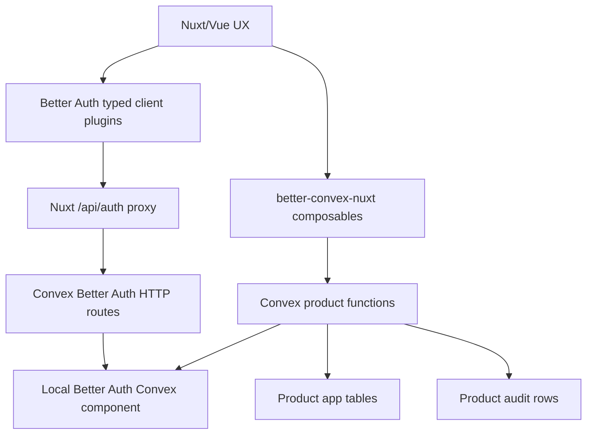

::callout{icon="i-lucide-shield-check" color="green"}
This is the product direction that consolidates the Better Auth team-starter research. The short version: keep `better-convex-nuxt` as an integration library, and ship SaaS as verified, editable templates and recipes.
::

## Executive Decision

Build `better-convex-nuxt` as the best Nuxt integration for Convex and Better Auth. Do not turn the core package into a SaaS framework.

The SaaS product should be delivered as:

1. Core runtime primitives in `better-convex-nuxt`.
2. Verified templates such as `auth`, `team-saas`, `api-saas`, and `admin-security`.
3. Optional recipe tracks for Stripe, SCIM, OAuth/MCP, SSO boundaries, and agents.
4. A CLI or doctor flow that copies userland code and verifies the stack.

The sellable promise:

```txt
Build tenant-aware SaaS with Nuxt, Convex, and Better Auth using verified templates,
not a hidden tenant framework.
```

The technical promise:

```txt
One source of truth per concept. Better Auth owns identity and tenant membership.
Convex owns product data and backend invariants. Nuxt owns UX.
```

## Final State

The final state should look like this:



In the base SaaS path:

- Better Auth owns users, sessions, organizations, members, invitations, roles, teams, API keys, MFA/passwordless/passkeys, admin controls, and plugin-owned auth data.
- Convex app tables own product rows, product audit, product workflows, agent delegations, billing enforcement decisions, and any app-specific domain records.
- Nuxt owns display state, forms, navigation, optimistic UI, and route ergonomics.
- Product authorization is enforced inside Convex functions. Frontend permission checks are display-only.

## Source Of Truth Map

| Concept                | Owner                            | Storage                      | Rule                                                                   |
| ---------------------- | -------------------------------- | ---------------------------- | ---------------------------------------------------------------------- |
| Auth user              | Better Auth                      | Better Auth Convex component | App `users` may be a trigger-derived projection only.                  |
| Session                | Better Auth                      | Better Auth Convex component | Convex JWT is derived from Better Auth state.                          |
| Organization           | Better Auth Organization         | Better Auth Convex component | No app-owned organization mirror in SaaS templates.                    |
| Member                 | Better Auth Organization         | Better Auth Convex component | No app-owned membership mirror.                                        |
| Invitation             | Better Auth Organization         | Better Auth Convex component | Invitation lifecycle belongs to Better Auth.                           |
| Role                   | Better Auth Organization         | Better Auth Convex component | Static roles by default. Dynamic roles are advanced.                   |
| Team                   | Better Auth Organization         | Better Auth Convex component | Optional. Do not add app-owned team membership mirrors.                |
| API key                | Better Auth API Key              | Better Auth Convex component | Raw secrets are never copied into app tables.                          |
| Product tenant data    | App                              | Convex app tables            | Store Better Auth organization ids as strings.                         |
| Product authorization  | App Convex code                  | Convex functions             | Ask Better Auth at request time, then enforce product invariants.      |
| Product audit          | App                              | Convex app tables            | Immutable product history, not a membership mirror.                    |
| Billing subscription   | Better Auth Stripe, when enabled | Better Auth Convex component | Convex product functions enforce entitlements from subscription state. |
| Agent threads/messages | Convex Agent component           | Convex Agent component       | Agent infrastructure, not product authorization authority.             |
| Agent delegation       | App                              | Convex app tables            | Explicit run/capability record before an agent can act.                |

## Research Verdict

### Proven Defaults

The team-starter research proved these as viable defaults:

- Local Better Auth Convex component.
- Better Auth Organization as the canonical org/member/invite source.
- Static Better Auth organization roles and product permissions.
- Better Auth-owned teams and team members when teams are enabled.
- Convex product tables storing Better Auth ids as strings.
- Convex product functions calling Better Auth for permission checks.
- Nuxt typed client plugin DX through `createBetterConvexAuthClient()`.
- App-owned `users` projection, `projects`, and `auditEvents` only.
- Verification loop: hard reset, seed, probe, inspect app and component tables, assert empty cleanup.

### Proven Advanced Capabilities

These work, but should be opt-in recipes:

- Better Auth Admin: user listing, creation, role update, ban/unban, impersonation.
- Organization API keys with predefined configs.
- User API keys.
- API-key-authenticated Convex product HTTP routes.
- Dynamic organization roles.
- TOTP, email OTP, magic links, and passkey runtime boundaries.
- Generic OAuth with a synthetic provider.
- OIDC provider and device authorization runtime paths.
- MCP runtime in isolated mode.
- OAuth/MCP bearer-token product routes with explicit recipe logic.
- Stripe local fake-client path for checkout activation and project-limit enforcement.
- SCIM create/list/get provisioning.

### Known Limits

These are not starter defaults:

- Raw Better Auth organization deletion is unsafe for starter UI. Org-scoped API keys can survive, default teams can leave the final team/teamMember row, and stale session active ids can remain.
- Server-side Better Auth API-key cleanup from a Convex mutation currently hits `dynamic module import unsupported` in the installed API-key plugin path.
- SCIM full lifecycle is blocked until the Convex Better Auth route helper can route PUT/PATCH/DELETE.
- Stripe is only locally proven with a fake client. Real webhooks, real Stripe network behavior, portal, cancellation/restore, upgrade, and seat sync are not proven.
- SSO is not a pure Convex starter feature today.
- OAuth/MCP provider surfaces have missing endpoint and lifecycle limits: absent revoke/introspect, reusable old refresh tokens, client-credentials not implemented, MCP advertised userinfo/JWKS returning 404, and raw MCP dynamic client secrets.
- `oAuthProxy()` plus Generic OAuth is an expected limit: Generic OAuth callback routes reject the encrypted proxy state.

## Product Shape

Use this split:

```txt
Library = integration primitives
Templates = product patterns
App = product semantics
```

### Core Runtime

Package: `better-convex-nuxt`

Core should include:

- Convex client injection.
- SSR query support.
- Realtime query composables.
- Mutation and action composables.
- Pagination and storage helpers.
- Better Auth auth proxy support.
- Convex JWT/session sync.
- `useConvexAuth()`.
- `useConvexUser()`.
- `createBetterConvexAuthClient()`.
- Vue-safe Better Auth client handling.
- Auth pending and unauthenticated helpers.
- Light config diagnostics.
- UI-only capability helpers.
- Docs for Better Auth local component setup.

Core should not include:

- App-owned organization tables.
- App-owned membership tables.
- Product tables such as `projects`, `files`, or `fileShares`.
- Generic tenant engines.
- Generic sharing engines.
- Generic authorization engines.
- Product audit schemas.
- Billing models.
- Agent permission frameworks.

### Template Layer

Templates contain generated, editable userland code:

```txt
convex/
  auth.ts
  http.ts
  schema.ts
  betterAuth/
    convex.config.ts
    auth.ts
    adapter.ts
    generatedSchema.ts
    schema.ts
  lib/
    authz.ts
    audit.ts
  projects.ts

app/
  composables/
    useSaasAuthClient.ts
    useOrganizationActions.ts
  pages/
    dashboard.vue
    organizations/[organizationId].vue
```

Template code is intentionally userland. The app can inspect it, simplify it, delete it, or replace it.

## Template Set

### `base`

Nuxt + Convex only.

Includes:

- queries
- mutations
- SSR example
- storage example
- deployment docs

No auth.

### `auth`

Consumer or internal app with login, but no organizations.

Includes:

- Better Auth setup
- Convex JWT sync
- optional `users` projection
- protected page
- sign-in/sign-out

No tenant roles.

### `team-saas`

Canonical tenant-aware SaaS.

Includes:

- local Better Auth Convex component
- Better Auth `organization()`
- static roles: `owner`, `admin`, `member`, `viewer`
- product permission resource, initially `project`
- product table with `organizationId: v.string()`
- Convex `requireOrgPermission()`
- invite/member flow
- product audit events
- scenario tests
- feedback scripts

Does not include:

- app-owned organizations
- app-owned memberships
- app-owned invitations
- dynamic roles by default
- org deletion UI
- enterprise SSO/SCIM

### `api-saas`

Customer API or integration surface.

Includes:

- `@better-auth/api-key`
- organization-owned key configs
- user-owned key example where useful
- server-side `verifyApiKey()`
- HTTP product route example
- audit actor such as `apiKey:<apiKeyId>`
- wrong-org, read-only, deleted-key tests

Avoid:

- public `/api/auth/api-key/verify` unless route behavior is intentionally supported
- arbitrary per-key permissions from Convex mutations until the dynamic-import path is solved
- trusting API keys without checking organization existence

### `admin-security`

Operator/admin and hardened auth template.

Includes:

- Better Auth Admin
- first-admin bootstrap guidance
- ban/unban
- impersonation
- TOTP
- email OTP
- magic link
- delivery-provider placeholders
- security tests

### `platform-auth`

Advanced API platform, developer platform, or MCP-oriented app.

Keep experimental until:

- replacement OAuth provider path is stable
- token revocation/introspection exists or a recipe-level invalidation story is proven
- client credentials are real, or service integrations stay on API keys
- Nuxt callback/proxy behavior is verified for the concrete provider

### `agentic-saas`

Agents inside a tenant-aware product.

Includes:

- Convex Agent component
- app-owned `agentRuns`
- bounded delegated capabilities
- tools that call normal product functions
- approval UI for risky operations
- usage tracking by organization/user/run
- rate limiting by organization/user/run
- agent audit events

Does not include:

- agent-owned membership tables
- agent-specific product mutation bypasses
- generic agent permission framework
- autonomous destructive writes by default

## Phased Roadmap

### Phase 0: Research Consolidation

Status: done.

Evidence lives in:

- `research/learnings.md`
- `roadmap.md`
- `research/verification-loop.md`
- `experiments/better-auth-organization-plugin.md`
- `starters/team/README.md`

Acceptance:

- final verdict documented
- scripts pass
- final inspect empty
- temporary experiment env vars removed
- no second source of truth introduced

### Phase 1: Core Story Cleanup

Goal: make the public docs match the architecture.

Todos:

- Present `better-convex-nuxt` as the integration runtime, not a SaaS framework.
- Done (vNext Phase 1): the permissions factory is deleted; docs now show an app-owned UI capability composable pattern instead.
- Stop recommending app-owned roles or memberships for SaaS templates.
- Make Better Auth local component setup first-class.
- Explain that frontend checks are display-only.

Acceptance:

- Docs identify Better Auth Organization as the recommended SaaS authority.
- Docs do not imply app-owned membership mirrors are preferred.
- Core package has no new product-domain abstractions.

### Phase 2: Hard-Cutover `team-saas`

Goal: turn the verified team starter into the canonical template.

Todos:

- Keep the local Better Auth component.
- Keep Better Auth `organization()`.
- Keep app-owned `users` projection, `projects`, and `auditEvents`.
- Keep old app-owned `organizations`, `memberships`, and `invitations` deleted.
- Extract `requireOrgPermission()` into clear userland helper code.
- Keep product audit events.
- Keep starter UI focused on create/list/invite/manage, not org deletion.

Acceptance:

- `pnpm typecheck`
- `pnpm test`
- `pnpm feedback:local-baseline`
- `pnpm feedback:inspect`
- no app-owned org/member/invite tables
- outsider cannot list/create product rows
- viewer cannot create product rows
- member downgrade/removal changes future access

### Phase 3: CLI And Doctor

Goal: make adoption repeatable.

Possible commands:

```bash
pnpm dlx create-better-convex-nuxt@latest my-app --template team-saas
pnpm dlx better-convex-nuxt@latest add better-auth-local
pnpm dlx better-convex-nuxt@latest add saas-organization
pnpm dlx better-convex-nuxt@latest add api-keys
pnpm dlx better-convex-nuxt@latest doctor saas
```

`add` should copy userland code and show what changed. It should not silently hide domain policy in the runtime package.

Doctor checks:

- `SITE_URL` configured
- `BETTER_AUTH_SECRET` configured
- local Better Auth component registered
- expected plugin tables exist
- required indexes exist
- `/api/auth/sign-up/email` reachable
- `/api/auth/convex/token` reachable
- Better Auth Organization route reachable
- Convex JWT sync works
- hard-cutover template does not contain duplicate app-owned org/member/invite tables
- product mutation rejects outsider access

### Phase 4: API And Admin Recipes

Goal: ship the next proven SaaS capabilities without bloating the default template.

Todos:

- Add `api-saas` recipe from the API-key verifier path.
- Add `admin-security` recipe from the admin and auth-hardening verifier paths.
- Document API-key cleanup before org deletion.
- Document API-key warning/dynamic-import limits.
- Add real UI only after the verifier stays green.

Acceptance:

- API key secrets never enter app tables.
- Reader key cannot write.
- Writer key cannot write into another org.
- Deleted key does not verify.
- Raw org deletion cannot authorize product writes.
- Admin bootstrap is explicit and local/preview safe.

### Phase 5: Billing Recipe

Goal: convert the local Stripe proof into a production recipe only after real lifecycle verification.

Todos:

- Replace fake local Stripe client with real Stripe test mode.
- Verify signed webhook handling.
- Verify checkout completion, cancellation, restore, upgrade, downgrade, payment failure, billing portal, and seat sync.
- Keep Better Auth `subscription` as billing-domain source of truth.
- Keep Convex product functions as entitlement enforcement.

Acceptance:

- Real Stripe checkout creates expected customer and subscription rows.
- Signed webhooks update Better Auth subscription rows.
- Product writes enforce current subscription limits.
- No app-owned billing mirror is introduced.

### Phase 6: Enterprise Identity

Goal: decide what can be supported without pretending pure Convex solves enterprise identity.

SCIM todos:

- Add route-method support for PUT/PATCH/DELETE under `/api/auth/*`.
- Verify SCIM update.
- Verify SCIM patch.
- Verify SCIM deprovision/delete.
- Verify provider connection management.
- Verify IdP-compatible filters.

SSO todos:

- Do not build custom SAML/SSO.
- Treat SSO as external or Node-bound until Better Auth + Convex compatibility changes.
- If an external auth boundary is explored, prove it does not create a second membership source.

Acceptance:

- SCIM full lifecycle passes against a realistic IdP-style flow.
- SSO direction has exactly one canonical auth-domain source.
- Docs state hard limits before any marketing claim.

### Phase 7: Platform Auth

Goal: keep OAuth/OIDC/MCP useful for advanced platform apps without making it default SaaS auth.

Todos:

- Keep OIDC/MCP bearer product routes as explicit recipe code.
- Require token scope plus Better Auth membership lookup.
- Do not use OIDC/MCP for service-to-service auth until client credentials are real.
- Prefer Better Auth API keys for service integrations.
- Do not recommend OAuth/MCP bearer routes as high-security public API boundaries until revocation/introspection or recipe-level invalidation exists.

Acceptance:

- Valid token with required scope can create a product row.
- Missing scope is rejected.
- Invalid token is rejected.
- Wrong organization is rejected.
- Token lifecycle limits are documented in the recipe.

### Phase 8: Agentic SaaS

Goal: let agents participate in SaaS apps without becoming a privileged side door.

Todos:

- Add Convex Agent component to a separate `agentic-saas` template.
- Add app-owned `agentRuns` as the explicit delegation record.
- Keep Agent component as thread/message infrastructure.
- Make tools call normal product functions or shared product helpers.
- Add approval UI for risky operations.
- Add usage tracking and rate limiting by organization/user/run.

Acceptance:

- Outsider cannot start an agent run for another org.
- User without product permission cannot start a write-capable run.
- Agent cannot use undelegated capabilities.
- Agent cannot access another org's resource.
- Revoked run cannot call tools.
- Destructive tool requires approval.
- Unauthorized user cannot approve.
- Audit distinguishes `agent` actor and delegating user.

### Phase 9: Stable SaaS Kit

Goal: declare the templates stable.

Only do this after:

- template creation is repeatable
- docs fit the actual generated code
- doctor catches common misconfiguration
- feedback scripts are green from a fresh checkout
- no unreleased compatibility shims remain
- no second source of truth is introduced

After stability, compatibility rules change. Until then, prefer hard cutovers.

## Core Code Patterns

These examples show the target shape. Template code should be generated into userland and stay editable.

### Better Auth Local Component

```ts [convex/auth.ts]
import { createClient, type GenericCtx } from '@convex-dev/better-auth'
import { convex } from '@convex-dev/better-auth/plugins'
import { betterAuth, type BetterAuthOptions } from 'better-auth'
import { createAccessControl, organization } from 'better-auth/plugins'

import { components, internal } from './_generated/api'
import type { DataModel } from './_generated/dataModel'
import authConfig from './auth.config'
import authSchema from './betterAuth/schema'

export const authComponent = createClient<DataModel, typeof authSchema>(components.betterAuth, {
  local: { schema: authSchema },
  authFunctions: internal.auth,
})

export const saasAccessControl = createAccessControl({
  project: ['create', 'read', 'update', 'delete'],
  billing: ['read', 'manage'],
})

export const ownerRole = saasAccessControl.newRole({
  project: ['create', 'read', 'update', 'delete'],
  billing: ['read', 'manage'],
})

export const memberRole = saasAccessControl.newRole({
  project: ['create', 'read'],
})

export const viewerRole = saasAccessControl.newRole({
  project: ['read'],
})

export function createAuthOptions(ctx: GenericCtx<DataModel>) {
  return {
    baseURL: process.env.SITE_URL,
    secret: process.env.BETTER_AUTH_SECRET,
    database: authComponent.adapter(ctx),
    emailAndPassword: { enabled: true },
    plugins: [
      organization({
        ac: saasAccessControl,
        roles: {
          owner: ownerRole,
          member: memberRole,
          viewer: viewerRole,
        },
        requireEmailVerificationOnInvitation: process.env.ALLOW_TEST_RESET !== 'true',
      }),
      convex({ authConfig }),
    ],
    advanced: {
      database: {
        generateId: false,
      },
    },
  } satisfies BetterAuthOptions
}

export function createAuth(ctx: GenericCtx<DataModel>) {
  return betterAuth(createAuthOptions(ctx))
}
```

### Product Schema

```ts [convex/schema.ts]
import { defineSchema, defineTable } from 'convex/server'
import { v } from 'convex/values'

export default defineSchema({
  users: defineTable({
    authUserId: v.string(),
    name: v.optional(v.string()),
    email: v.optional(v.string()),
    createdAt: v.number(),
    updatedAt: v.number(),
  }).index('by_auth_user_id', ['authUserId']),

  projects: defineTable({
    organizationId: v.string(),
    name: v.string(),
    createdByAuthUserId: v.string(),
    createdAt: v.number(),
  }).index('by_org', ['organizationId']),

  auditEvents: defineTable({
    organizationId: v.string(),
    actorId: v.string(),
    action: v.string(),
    resourceType: v.string(),
    resourceId: v.optional(v.string()),
    createdAt: v.number(),
  }).index('by_org_created', ['organizationId', 'createdAt']),
})
```

No app-owned `organizations`, `memberships`, or `invitations` table belongs in `team-saas`.

### Product Authorization Helper

```ts [convex/lib/authz.ts]
import { ConvexError } from 'convex/values'
import type { MutationCtx, QueryCtx } from '../_generated/server'
import { authComponent, createAuth } from '../auth'

type AuthzCtx = MutationCtx | QueryCtx

type ProductPermissions = {
  project?: Array<'create' | 'read' | 'update' | 'delete'>
  billing?: Array<'read' | 'manage'>
}

export async function requireOrgPermission(
  ctx: AuthzCtx,
  organizationId: string,
  permissions: ProductPermissions,
) {
  const { auth, headers } = await authComponent.getAuth(createAuth, ctx)

  const result = await auth.api.hasPermission({
    headers,
    body: {
      organizationId,
      permissions,
    },
  })

  if (!result.success) {
    throw new ConvexError({
      code: 'FORBIDDEN',
      message: 'Missing organization permission',
    })
  }

  return { auth, headers }
}
```

### Product Mutation

```ts [convex/projects.ts]
import { ConvexError, v } from 'convex/values'
import { mutation, query } from './_generated/server'
import { requireOrgPermission } from './lib/authz'

export const list = query({
  args: {
    organizationId: v.string(),
  },
  handler: async (ctx, args) => {
    await requireOrgPermission(ctx, args.organizationId, {
      project: ['read'],
    })

    return await ctx.db
      .query('projects')
      .withIndex('by_org', (q) => q.eq('organizationId', args.organizationId))
      .collect()
  },
})

export const create = mutation({
  args: {
    organizationId: v.string(),
    name: v.string(),
  },
  handler: async (ctx, args) => {
    const { auth, headers } = await requireOrgPermission(ctx, args.organizationId, {
      project: ['create'],
    })

    const session = await auth.api.getSession({ headers })
    const authUserId = session?.user?.id

    if (!authUserId) {
      throw new ConvexError({
        code: 'UNAUTHENTICATED',
        message: 'Missing Better Auth user',
      })
    }

    const now = Date.now()
    const projectId = await ctx.db.insert('projects', {
      organizationId: args.organizationId,
      name: args.name,
      createdByAuthUserId: authUserId,
      createdAt: now,
    })

    await ctx.db.insert('auditEvents', {
      organizationId: args.organizationId,
      actorId: authUserId,
      action: 'projects.create',
      resourceType: 'project',
      resourceId: projectId,
      createdAt: now,
    })

    return projectId
  },
})
```

### Nuxt Auth Client

```ts [app/composables/useSaasAuthClient.ts]
import { organizationClient } from 'better-auth/client/plugins'
import { createBetterConvexAuthClient } from '#imports'

type SaasAuthClient = ReturnType<typeof createClient>

let client: SaasAuthClient | null = null

function createClient() {
  return createBetterConvexAuthClient({
    plugins: [organizationClient()],
  })
}

export function useSaasAuthClient() {
  client ??= createClient()
  return client
}
```

### Organization Actions

```ts [app/composables/useOrganizationActions.ts]
export function useOrganizationActions() {
  const authClient = useSaasAuthClient()

  async function createOrganization(input: { name: string; slug: string }) {
    return await authClient.organization.create({
      name: input.name,
      slug: input.slug,
    })
  }

  async function inviteMember(input: {
    organizationId: string
    email: string
    role: 'admin' | 'member' | 'viewer'
  }) {
    return await authClient.organization.inviteMember({
      organizationId: input.organizationId,
      email: input.email,
      role: input.role,
    })
  }

  return {
    createOrganization,
    inviteMember,
  }
}
```

### Product UI

```vue [app/pages/organizations/[organizationId].vue]
<script setup lang="ts">
import { api } from '#convex/api'

const route = useRoute()
const organizationId = computed(() => String(route.params.organizationId))
const name = ref('')

const projects = await useConvexQuery(
  api.projects.list,
  computed(() => ({ organizationId: organizationId.value })),
)

const createProject = useConvexMutation(api.projects.create)

async function submit() {
  await createProject.mutate({
    organizationId: organizationId.value,
    name: name.value,
  })
  name.value = ''
}
</script>

<template>
  <form @submit.prevent="submit">
    <input v-model="name" name="name" />
    <button type="submit">Create project</button>
  </form>

  <ul>
    <li v-for="project in projects.data.value ?? []" :key="project._id">
      {{ project.name }}
    </li>
  </ul>
</template>
```

The UI does not decide whether creation is authorized. Convex does.

## Advanced Recipe Patterns

### Safe Organization Delete

Do not expose raw org deletion in `team-saas`.

If a product needs destructive org deletion, implement one verified flow:

```ts
type DeleteOrganizationRecipe = {
  revokeOrgApiKeys: true
  clearDeletingUserActiveTeam: true
  enableAllowRemovingAllTeams: true
  removeAllTeamsThroughBetterAuthRoutes: true
  deleteOrganizationThroughBetterAuth: true
  refetchCurrentOrgStateAfterDelete: true
}
```

Operational steps:

1. List and revoke all known org-scoped API-key configs through Better Auth HTTP/client routes.
2. Enable `organization({ teams: { allowRemovingAllTeams: true } })` for this workflow.
3. Clear the deleting user's active team.
4. Remove every team through Better Auth routes.
5. Delete the organization through Better Auth.
6. Treat stale session active org/team ids as display-only.
7. Verify `organization`, `member`, `team`, `teamMember`, `invitation`, and `apikey` component rows are gone.

Product routes must still reject stale API keys by checking the referenced Better Auth organization exists.

### API Key Product Route

```ts [convex/http.ts]
import { httpRouter } from 'convex/server'
import { httpAction } from './_generated/server'
import { authComponent, createAuth } from './auth'

const http = httpRouter()

http.route({
  path: '/api/projects',
  method: 'POST',
  handler: httpAction(async (ctx, request) => {
    const apiKey = request.headers.get('authorization')?.replace('Bearer ', '')

    if (!apiKey) {
      return Response.json({ error: 'Missing API key' }, { status: 401 })
    }

    const { auth } = await authComponent.getAuth(createAuth, ctx)
    const verified = await auth.api.verifyApiKey({
      body: { key: apiKey },
    })

    if (!verified.valid || !verified.key) {
      return Response.json({ error: 'Invalid API key' }, { status: 401 })
    }

    // Recipe code must also check:
    // - key config has project:create
    // - key reference organization still exists
    // - request organization matches key referenceId
    // - product audit actor is apiKey:<keyId>

    return Response.json({ ok: true })
  }),
})

export default http
```

Use API keys for service integrations until OAuth client credentials are actually supported.

### Agent Delegation

Agents should never receive ambient authority. Store explicit delegation first:

```ts [convex/schema.ts]
agentRuns: defineTable({
  organizationId: v.string(),
  threadId: v.string(),
  agentName: v.string(),
  status: v.union(
    v.literal('active'),
    v.literal('paused'),
    v.literal('completed'),
    v.literal('revoked'),
    v.literal('failed'),
  ),
  startedByAuthUserId: v.string(),
  actingAsAuthUserId: v.optional(v.string()),
  capabilities: v.array(
    v.union(
      v.literal('files:read'),
      v.literal('files:draft'),
      v.literal('files:share'),
      v.literal('files:delete'),
    ),
  ),
  createdAt: v.number(),
  updatedAt: v.number(),
  expiresAt: v.optional(v.number()),
})
  .index('by_thread', ['threadId'])
  .index('by_organization', ['organizationId'])
```

Tool calls must check the run, organization, and delegated capability before touching product data.

## Verification Contract

Every default template or advanced recipe needs a pass/fail loop.

Minimum commands for `team-saas`:

```bash
cd starters/team
bash -n scripts/verify-better-auth-*.sh
pnpm typecheck
pnpm test
pnpm feedback:local-baseline
pnpm feedback:inspect
git diff --check
```

Full research regression:

```bash
cd starters/team
pnpm feedback:better-auth-all
pnpm feedback:local-baseline
pnpm feedback:inspect
```

Environment and process checks:

```bash
pnpm exec convex env list --deployment local
lsof -nP -iTCP:3000 -iTCP:3210 -iTCP:3211 -sTCP:LISTEN || true
```

Acceptance:

- product authorization failures are tested, not just happy paths
- final app tables are empty after reset
- final Better Auth component tables are empty after reset
- temporary experiment env vars are removed
- ports are free after scripts
- no second source of truth is introduced

## Do Not Build

Do not build:

- a Better Auth replacement
- a second organization system
- a second membership system
- app-owned role mirrors in SaaS templates
- a generic authorization engine
- a generic SaaS domain model
- dynamic roles as the default
- teams inside organizations as mandatory default
- public API-key verification until route behavior is intentionally supported
- enterprise SSO/SCIM promises until proven
- OAuth/MCP as default SaaS auth
- compatibility paths for unreleased starter code

If a feature requires mirrored memberships or dual auth databases, stop and redesign.

## Open Todo Backlog

### Core And Docs

- Reposition public docs around Convex/Nuxt integration plus verified SaaS templates.
- Done (vNext Phase 1): the permissions factory is deleted; the recipe docs show an app-owned UI capability helper, not the SaaS authorization layer.
- Add Better Auth local component setup as a first-class guide.
- Add a SaaS source-of-truth guide.
- Add a doctor command spec.

### Template Productization

- Make `team-saas` the canonical tenant-aware template.
- Extract the current team-starter patterns into generator-friendly userland files.
- Decide whether org teams are included by default or a team-within-org recipe.
- Add starter UI for passkeys/TOTP/magic-link only after real UX and recovery flows are designed.

### Advanced Recipes

- API keys: document warnings and dynamic-import limits; keep predefined key configs.
- Safe org delete: implement only as an advanced admin recipe, never as a raw starter UI button.
- Stripe: prove real test-mode checkout and signed webhooks.
- SCIM: solve route methods, then prove full IdP lifecycle.
- SSO: investigate external boundary only if it preserves one auth-domain source.
- OAuth/MCP: solve revocation/introspection or document recipe-level invalidation.
- Agents: build separate `agentic-saas` template with explicit delegation and approvals.

## Final Recommendation

The strongest product is not one giant abstraction. It is a set of hard, proven paths:

- pick the template
- add only needed capabilities
- keep one source of truth
- let Better Auth own auth and tenant membership
- let Convex own product state and backend enforcement
- keep Nuxt responsible for UX
- verify everything locally

That is the simplest system we can stand behind for SaaS, team, platform, internal, and agentic apps.
