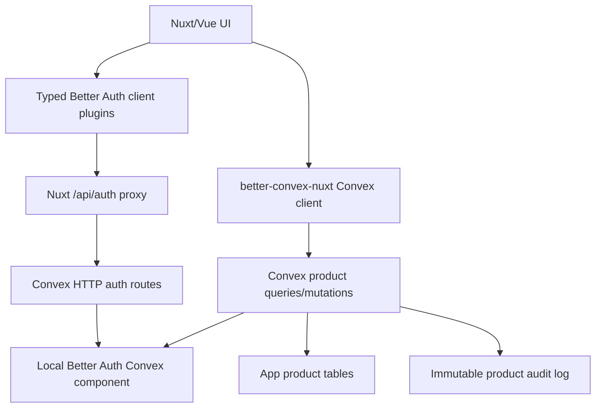

# Better Auth Team Starter Research Learnings

## Goal

Research how `starters/team` can better use Better Auth plugins for team and organization management while keeping Convex as the durable source of truth through a proper Better Auth Convex component.

The main constraint is still the team starter guardrail:

- Convex owns product authorization invariants.
- Nuxt may display auth/team state, but display state is not authorization.
- Important concepts should have one source of truth.

## Current Team Starter Shape

`starters/team` currently uses:

- `@convex-dev/better-auth` for Better Auth storage and Convex JWT issuance.
- App-owned Convex `users` projection derived from Better Auth user triggers.
- App-owned Convex `organizations`, `memberships`, and `invitations` tables.
- Product tables, currently `projects`, guarded by `requireOrgAccess()`.
- Audit rows for product/team mutations.

This is internally coherent, but it intentionally does not use Better Auth Organization. If we now want Better Auth to do the team heavy lifting, we should not add Better Auth Organization beside these app-owned tables. That would create two canonical membership systems.

## Main Recommendation

For a Better Auth powered team starter, use a hard cutover:

1. Convert the starter to a local Better Auth Convex component.
2. Enable Better Auth `organization()` on the server and `organizationClient()` on the client.
3. Delete app-owned `organizations`, `memberships`, and `invitations`.
4. Store product data in app tables that reference Better Auth organization/member/user ids as strings.
5. Keep product authorization checks inside Convex functions by calling Better Auth through `authComponent.getAuth(createAuth, ctx)`.

Do not keep old and new organization paths side by side unless we are explicitly building a migration for released data.

Second-pass check: this recommendation still holds. The deeper source read made the tradeoff sharper:

- Better Auth Organization already enforces important team invariants, including "last owner cannot leave, be removed, or demote themselves away from owner".
- Better Auth Organization removes memberships by deleting `member` rows. The current starter's `status: 'removed'` membership history should become audit data if we still need history; it should not remain a parallel membership source.
- The Convex Better Auth adapter does not support Better Auth transactions. A Better Auth endpoint may perform multiple adapter operations, so do not hang product invariants off a later trigger expecting all earlier auth-domain writes to roll back together.
- Product authorization can still live in Convex product functions. Convex should ask Better Auth for membership/role/permission truth, then write product rows and product audit rows itself.

## B2B Dream State

The bigger goal is feasible, but it needs a sharper architecture than "a starter with teams".

Dream state:

- Nuxt/Vue developers get a typed Better Auth client for auth-domain workflows.
- Better Auth plugins own auth, sessions, users, organizations, members, invitations, admin user controls, API keys, MFA/passwordless methods, and eventually enterprise capabilities where compatible.
- Convex remains the durable database and product invariant layer.
- App Convex tables store product data and reference Better Auth component ids as strings.
- Product mutations enforce authorization in Convex by calling Better Auth permission APIs or component-local auth helper functions.
- Product audit logs are immutable app data; auth membership tables are not mirrored.
- Heavy B2B behavior is proven by spikes before becoming starter guidance.

The target DX should feel like Nuxt/Vue:

```ts
const authClient = useB2BAuthClient()
await authClient.organization.create({ name, slug })
await authClient.organization.inviteMember({ email, role, organizationId })
await authClient.apiKey.create({ configId: 'org-keys', organizationId })
```

Then product writes stay Convex-native:

```ts
const createProject = useConvexMutation(api.projects.create)
await createProject({ organizationId, name })
```

This is the right boundary: Better Auth for auth-domain heavy lifting, Convex for product-domain invariants.

## B2B Feasibility Verdict

Yes, we can push this architecture into real B2B apps, but not by assuming every Better Auth plugin automatically works in Convex.

What looks strong:

- Better Auth has a large plugin surface for auth, authorization, API/tokens, OAuth/OIDC provider behavior, billing, and security utilities.
- Official Better Auth docs list 50+ plugins, including Organization, Admin, API Key, Two Factor, Passkey, Magic Link, OAuth Provider, Stripe, and more.
- The official Convex integration supports local install, which gives us schema control and lets Convex component functions directly access Better Auth component tables.
- Our local fixture already proves `admin()`, `organization()`, and `apiKey()` can generate a local Convex component schema and preserve client plugin types through `createBetterConvexAuthClient()`.
- Organization-owned API keys are supported by Better Auth and use Organization role permissions for management.

What is limited:

- The official Convex + Better Auth supported plugins page says SSO is incompatible even with local install because it depends on Node.js.
- Any plugin with Node-only APIs, external runtime assumptions, unsupported database features, or custom secondary storage needs a spike before we recommend it.
- The Convex adapter limits still apply: no Better Auth transactions, no joins, no JSON fields, no native Date fields, no offset, no case-insensitive queries, count-by-read, and index sensitivity.
- Enterprise SSO, SCIM, OAuth Provider, billing plugins, and storage-mode-heavy API key setups are not "starter defaults"; they are advanced compatibility projects.

Practical conclusion:

- Core B2B teams, roles, invitations, product permissions, admin user management, organization API keys, MFA/passwordless auth: feasible path.
- Full enterprise identity suite with customer-managed SSO/SCIM: not proven inside pure Convex Better Auth today and currently blocked for SSO by official integration docs.
- API platform/MCP-style OAuth Provider: plausible, but needs a dedicated Convex compatibility spike.

Current external docs cross-check:

- Better Auth plugin catalog: https://better-auth.com/docs/plugins
- Convex + Better Auth local install: https://labs.convex.dev/better-auth/features/local-install
- Convex + Better Auth supported plugins and SSO incompatibility: https://labs.convex.dev/better-auth/supported-plugins
- Better Auth organization-owned API keys: https://better-auth.com/docs/plugins/api-key/advanced
- Better Auth SSO provisioning model: https://better-auth.com/docs/plugins/sso

## Why Local Better Auth Component

The official Convex Better Auth component supports a default installed component, but schema-changing Better Auth plugins need a local component install.

Relevant examples:

- `test/fixtures/better-auth-local-component/convex/auth.ts`
- `test/fixtures/better-auth-local-component/convex/betterAuth/schema.ts`
- `/Users/matthias/Git/external/convex-auths/better-auth-convex-plugin/docs/content/docs/features/local-install.mdx`

The local fixture already proves this stack compiles with:

- `admin()`
- `organization()`
- `apiKey()`
- `convex({ authConfig })`
- generated local Better Auth schema
- `authComponent.adapter(ctx)`
- `authComponent.triggersApi()`

This fixture is the best starting template for a team starter experiment.

## Better Auth Organization Plugin Learnings

Better Auth Organization already owns most of what the team starter hand-rolls today:

- organization create/update/delete
- slug checking
- active organization stored on session
- list user organizations
- full organization details
- invitations
- invitation accept/reject/cancel/list
- members list/remove/update role
- server-only add member
- leave organization
- role and permission checks
- optional teams
- lifecycle hooks for org/member/invitation/team events
- custom schema fields for organization/member/invitation/team
- dynamic access control, if enabled

Useful source files:

- `/Users/matthias/Git/external/convex-auths/better-auth/docs/content/docs/plugins/organization.mdx`
- `/Users/matthias/Git/external/convex-auths/better-auth/packages/better-auth/src/plugins/organization/schema.ts`
- `/Users/matthias/Git/external/convex-auths/better-auth/packages/better-auth/src/plugins/organization/types.ts`
- `/Users/matthias/Git/external/convex-auths/better-auth/packages/better-auth/src/plugins/organization/organization.ts`

Important details:

- Default roles are `owner`, `admin`, and `member`.
- A member can have multiple roles stored as a comma-separated string.
- Default organization permissions cover organization, member, and invitation actions.
- Custom product permissions are supported through `createAccessControl()`.
- `auth.api.hasPermission()` accepts `organizationId` in the body, so Convex product functions do not need to rely on the active organization.
- Invitation ids are action-capable. If invitation ids can be listed or are predictable, enable `requireEmailVerificationOnInvitation: true`.
- `removeMember()` and `leaveOrganization()` hard-delete membership rows and clear active organization when needed.
- `deleteOrganization()` deletes members and invitations before deleting the organization.
- Last-owner protection is implemented in source and covered by tests.
- Organization hooks can log lifecycle events, but they should not create a second membership projection unless there is a specific, tested rebuild story.
- Optional teams are available, but they add `team` and `teamMember` tables. Do not enable them until the starter actually exposes team-within-organization behavior.
- Dynamic access control adds `organizationRole` and runtime role management. Static roles are the simpler starting point.

## Better Auth Plugin System Learnings

The pasted Better Auth plugin docs are directly relevant:

- Server plugins can add endpoints, schema, hooks, middleware, rate limits, and trusted origins.
- Client plugins infer server plugin endpoints through `$InferServerPlugin`.
- Extra fields on `user` or `session` are inferred by Better Auth client calls when configured through Better Auth schema options.
- `sessionMiddleware` and `requireOrgRole` exist for Better Auth plugin endpoints.

For our starter, this means we should prefer official plugin APIs over app wrappers for auth-domain behavior:

- use `authClient.organization.create()`, not `api.organizations.create`
- use `authClient.organization.inviteMember()`, not `api.invitations.create`
- use `authClient.organization.updateMemberRole()`, not `api.memberships.updateRole`

Convex app functions should remain for product behavior:

- create/list projects
- write audit events
- enforce product permissions before product writes

## Plugin Capability Map

Use this as the starting compatibility map for serious app work:

| Capability | Better Auth plugin/path | Convex + Nuxt status | Recommendation |
| --- | --- | --- | --- |
| Organizations, members, invitations | `organization()` | Feasible with local component | Make this the team starter cutover. |
| Static product permissions | `organization({ ac, roles })` | Feasible | Use first for real B2B apps. |
| Dynamic runtime roles | `organization({ dynamicAccessControl })` | Feasible-looking, higher cost | Spike after static roles. Adds auth tables and admin UI. |
| Teams inside organizations | `organization({ teams })` | Feasible-looking, higher cost | Only enable when product has teams distinct from orgs. |
| Admin user management | `admin()` | Local fixture proves schema support | Add after org cutover. |
| Organization API keys | `apiKey({ references: 'organization' })` | Feasible-looking; docs say it uses org permissions | Spike with org permissions and Convex server route verification. |
| User API keys / service keys | `apiKey()` | Local fixture proves schema support | Good candidate for service integrations. |
| MFA | `twoFactor()` | Listed as supported by Convex integration | Candidate for hardened starter variant. |
| Passwordless | Magic Link, Email OTP, Passkey | Many are supported or local-install candidates | Add only with concrete UX. |
| OAuth social/custom providers | built-in providers / Generic OAuth | Supported path exists | Keep as auth config, not app tables. |
| OAuth 2.1 provider / MCP auth | `@better-auth/oauth-provider` | Unknown in Convex component | Spike separately. Potentially valuable for agent/API platforms. |
| Billing/subscriptions | Stripe or other billing plugins | Unknown in Convex component | Spike separately; may depend on runtime/webhook expectations. |
| SSO | `@better-auth/sso` | Officially incompatible with Convex integration today | Do not promise pure Convex support. Consider external auth boundary spike. |
| SCIM | SCIM plugin | Not proven | Treat as enterprise spike, likely coupled to SSO/runtime constraints. |

This table should be treated as an experiment queue, not a promise. The acceptance criterion for each plugin is: schema generates, Better Auth endpoints work through the Nuxt auth proxy, Convex JWT stays synchronized, product functions can authorize from Convex, and no duplicate source of truth is introduced.

## Dream Architecture for Advanced Apps

The high-end shape should be:



Rules:

- Better Auth component tables are canonical for auth-domain records.
- Product tables never mirror memberships, invitations, API key secrets, or auth roles.
- Product tables can store `organizationId`, `authUserId`, `memberId`, or `apiKeyId` string references when needed.
- Component-local functions are allowed for hot-path auth reads or adapter workarounds, but only when Better Auth API calls are too broad or too slow.
- Nuxt composables can improve DX, but they should remain thin typed clients/actions over Better Auth, not a new auth domain.

## Experimental Roadmap

Recommended spikes, in order:

1. **Organization cutover spike**
   - Local component with `organization()`.
   - Delete app-owned org/member/invite tables.
   - Product `projects.organizationId` becomes Better Auth organization id string.
   - Convex product mutations call `auth.api.hasPermission()`.

2. **Admin + API key spike**
   - Add `admin()` and `apiKey()`.
   - Prove generated schema, typed clients, admin list/ban/impersonation boundaries, user keys, and organization-owned keys.
   - Verify organization API key permissions from Better Auth docs with Convex server routes.

3. **Static B2B permissions spike**
   - Define product permissions in `createAccessControl()`.
   - Prove owner/admin/member/viewer plus product-specific permissions.
   - Keep frontend permission helpers display-only; backend remains authoritative.

4. **Dynamic roles and teams spike**
   - Enable `dynamicAccessControl`.
   - Enable `teams` only if needed.
   - Measure schema/index needs, endpoint compatibility, role update behavior, and UI complexity.

5. **Auth hardening spike**
   - Two factor, passkeys, magic link, email OTP.
   - Verify schema generation, auth flows, JWT refresh, and SSR hydration.

6. **OAuth Provider / MCP spike**
   - Test `@better-auth/oauth-provider` with Convex component runtime.
   - Verify authorization code, client credentials, JWKS, introspection, revocation, and Nuxt proxy behavior.

7. **Enterprise identity spike**
   - SSO is currently blocked in official Convex integration docs.
   - Explore whether an external Node Better Auth auth service can share enough truth with Convex without creating a second source of truth.
   - Stop if the result requires dual auth databases or mirrored memberships.

## Productization Criteria

A plugin becomes part of the recommended advanced path only when all of these are true:

- It works in local Convex component schema generation.
- It has a typed Nuxt/Vue client plugin path through `createBetterConvexAuthClient()`.
- It works through the Nuxt same-origin auth proxy.
- It keeps Convex JWT sync stable across SSR, hydration, sign-in, sign-out, and token refresh.
- It can be authorized from Convex product functions.
- Required indexes are explicit in the local component schema.
- Failure modes are covered by invariant tests.
- It does not create a second source of truth.

## Additional Fields

There are three separate places extra fields can exist:

1. Better Auth schema fields: visible in Better Auth sessions/plugin APIs.
2. Convex JWT claims: visible in `useConvexAuth().user`.
3. App Convex tables: used for product/business data.

Use the narrowest layer:

- Better Auth plugin/session response needs it: use Better Auth `additionalFields` plus `inferAdditionalFields<AppAuth>()`.
- Nuxt auth UI convenience needs it: put a claim in `convex({ jwt.definePayload })` and augment `ConvexUser`.
- Product logic needs it: store it in app Convex tables and test the invariant.

Do not copy organization membership into all three layers.

For Better Auth plugin-owned tables, add fields through Better Auth schema/plugin options and regenerate the local Convex component schema. Do not hand-edit generated schema as the source of truth. If Convex indexes are needed, use the local install pattern that imports generated tables into a local `schema.ts` and adds explicit indexes there.

Relevant local docs already in this repo:

- `docs/content/docs/4.auth-security/1.authentication.md`
- `src/runtime/composables/createBetterConvexAuthClient.ts`
- `playground/composables/useExtendedAuthClient.ts`

## Source of Truth Options

### Option A: Keep Current App-Owned Team Model

Better Auth owns users/sessions. App Convex tables own organizations, memberships, and invitations.

This is valid if the product needs custom membership semantics that Better Auth Organization does not model.

Tradeoff: we keep more code and manually maintain team lifecycle behavior.

### Option B: Better Auth Organization Owns Team Model

Better Auth component tables own organization, member, invitation, active org, and role data.

App Convex tables reference Better Auth ids:

- `projects.organizationId: v.string()`
- `projects.createdByAuthUserId: v.string()` or app user projection id if the projection remains necessary

Convex product functions ask Better Auth whether the current session can perform product actions.

Tradeoff: product tables lose `v.id('organizations')` references because the org table lives inside the Better Auth component. The gain is deleting the duplicate app-owned team model.

Recommended for the next experiment.

## Product Authorization Pattern After Cutover

The clean Convex-side pattern is:

```ts
const { auth, headers } = await authComponent.getAuth(createAuth, ctx)
const allowed = await auth.api.hasPermission({
  headers,
  body: {
    organizationId,
    permissions: {
      project: ['create'],
    },
  },
})

if (!allowed.success) {
  throw new ConvexError('Insufficient role')
}
```

Then product mutations can stay simple:

- validate args
- require permission
- write product row
- write audit row

That keeps backend invariants in Convex and uses Better Auth for membership/role resolution.

## Repo-by-Repo Learnings

### `better-auth-convex-plugin`

This is the official `@convex-dev/better-auth` component.

Key learnings:

- The `convex()` plugin adds `/convex/token`, JWKS, OIDC metadata, and token cookie behavior.
- `registerRoutesLazy()` is the right route registration path for avoiding eager Better Auth initialization.
- Query context disables Better Auth adapter writes to avoid accidental write side effects from session refresh/cleanup.
- Local install is the unlock for schema-changing Better Auth plugins.
- Triggers run in the same Convex transaction as the adapter write, and are better than Better Auth database hooks when deriving app data.
- The project is moving away from implicit two-user-table coupling. If an app user table remains, the relationship should be explicit.
- Adapter config is intentionally limited: no JSON fields, no native Date fields, no numeric ids, no Better Auth transaction support, no plural table names, arrays supported.
- Better Auth `experimental.joins` is forced off.
- `mode: 'insensitive'` where clauses are rejected. Store normalized values if case-insensitive lookup matters.
- `offset` pagination is rejected.
- OR queries are split, merged, deduped, and sorted in adapter code. They work, but they are not a reason to design broad OR-heavy product queries.
- `count()` is implemented by reading matching docs and counting them.
- Unique Better Auth fields require matching Convex indexes; missing indexes throw for unique lookups and log warnings for some non-unique queries.
- Large `in` queries are specifically called out in adapter code as a case where component-local Convex queries may be better than generic Better Auth API calls.

Applicable changes:

- Make the team starter local-component based when using Organization/Admin/API Key.
- Keep user projection explicit and trigger-driven if app product tables need an app user document.
- Add tests for trigger projection and plugin schema presence.
- Add direct component functions for hot paths if Better Auth generic API calls become too broad, especially organization member listing at large limits.

### `better-auth`

Key learnings:

- Organization plugin is feature-complete enough to replace the starter's org/member/invite tables.
- It supports lifecycle hooks for org, member, invitation, and team events.
- It supports custom schema fields.
- It supports static and dynamic access control.
- `hasPermission` can check an explicit `organizationId`.
- Admin and API Key plugins are reasonable future plugins, but they should be enabled only with local schema generation and explicit UI/API acceptance criteria.
- API keys can be organization-scoped and can integrate with organization permissions, but that is a product surface, not a team-management prerequisite.

Applicable changes:

- Define a small product permission statement, probably just `project: ['create', 'read', 'update', 'delete']` to start.
- Avoid dynamic access control initially. It adds another table and admin surface. Use static roles first.
- Use `requireEmailVerificationOnInvitation: true` unless we intentionally want weaker invitation acceptance.
- Decide whether membership removal history is required. If yes, keep it as immutable audit events, not as `memberships.status`.

### `nuxt-better-auth`

This Nuxt module does not provide Convex database integration.

Useful patterns:

- Separate server auth config from client auth config.
- Client config must include client plugin equivalents for server plugins.
- `useAuthClientAction()` style wrappers are useful for plugin operations that need pending/error state.
- SSR-safe session state should be separate from direct plugin client access.
- The Vue-safe auth proxy avoids Vue probing `then`, `catch`, `finally`, and `__v*` keys on Better Auth client objects.
- `useUserSession()` strips sensitive session token fields before storing client-visible state.
- It subscribes to Better Auth's `$sessionSignal` and reconciles SSR/hydration/prerender states; direct client calls are not enough for a polished Nuxt session surface.

Applicable changes:

- `better-convex-nuxt` already has `createBetterConvexAuthClient()`. The team starter should use it for `organizationClient()`.
- Consider adding a small starter-local `useTeamAuthClient()` composable that returns a cached `createBetterConvexAuthClient({ plugins: [organizationClient(...)] })`.
- Organization UI forms should use small action wrappers with pending/error state rather than calling raw client methods directly from many components.

### `convex-better-auth-svelte`

Key learnings:

- It carefully separates Better Auth session readiness from Convex token readiness.
- It avoids token fetches after sign-out to prevent `/convex/token` 401s.
- It supports an external/headless token exchange path.
- It uses SSR initial auth state to reduce auth flashes.
- It handles the ambiguity where Better Auth `$sessionSignal` can mean sign-out or tab refocus by waiting for the session to settle before fetching a Convex JWT.
- It retries network failures fetching `/convex/token`, but treats non-network auth errors as unauthenticated.
- Its SvelteKit handler forwards only auth-relevant headers and sets `x-better-auth-forwarded-*` plus `accept-encoding: identity`.
- SSR token lookup prefers async-local Convex token context, then falls back to secure/insecure Better Auth JWT cookie names.

Applicable changes:

- No direct team model change.
- Keep using `useConvexAuth()` and Convex authenticated wrappers for Convex data readiness.
- Do not rely on Better Auth `useSession()` alone before calling Convex product functions.
- Add regression coverage around sign-out/refocus token refresh if we touch `createBetterConvexAuthClient()` auth-state behavior.

### `convex-authz`

This is a much heavier authorization component.

Key learnings:

- It uses source role tables plus derived effective permissions/roles.
- It supports RBAC, ABAC, ReBAC, custom roles, overrides, expiry, and rebuilds.
- It introduces many expensive concepts: component tables, derived projections, rebuild story, relationship graph, audit log, and tenant routing.
- The component schema includes `roleAssignments`, `userAttributes`, `permissionOverrides`, `relationships`, `effectivePermissions`, `effectiveRoles`, `effectiveRelationships`, `customRoles`, and `auditLog`.
- The O(1) read path is bought by dual-writing source rows and effective rows, then running `recomputeUser()` after definition changes.
- `tenantId` is a core routing/index dimension. That is useful for complex multi-tenant systems, but it is extra architecture for this starter.

Applicable changes:

- Do not add this to the team starter now.
- Revisit only if the acceptance criteria explicitly require dynamic roles, relationship inheritance, direct permission overrides, or ABAC/ReBAC.

### `nuxt-convex`

Key learnings:

- It has a Nuxt-side Better Auth HTTP adapter that talks to Convex public functions.
- It documents that its Better Auth integration is dependency-constrained and tested only for a narrow stack.
- It wires `convexClient()` on the client and fetches `/api/auth/convex/token`.
- Its HTTP adapter has the same core limitations as the official adapter: no transactions, no JSON, no native dates, no offset, id/_id mapping, OR split/dedupe.
- The adapter requires a hosted `https://*.convex.*` URL, which is the wrong shape for a local component-first team starter.
- The playground uses `crossDomain({ siteUrl })`, explicit allowed origins, and `convex({ authConfig })`.

Applicable changes:

- Do not move `better-convex-nuxt` toward a Nuxt-side HTTP database adapter for Better Auth.
- The current `@convex-dev/better-auth` component adapter is cleaner because Convex component tables remain the auth database source.
- The useful pattern is only the client plugin shape, which we already expose through `createBetterConvexAuthClient()`.

## Current Team Starter Findings

The current code has one important ambiguity:

- `users.ts` looks up app user projection by `identity.subject`.
- The generated Convex guidelines say `identity.tokenIdentifier` is the canonical stable auth-linked identifier.
- The official `@convex-dev/better-auth` helper `safeGetAuthUser()` also uses `identity.subject` to look up Better Auth user id.

This needs an invariant test and a documented choice before changing. If the projection is keyed by Better Auth user id, `subject` may be intentional. If the projection is meant to be provider-stable across issuers, use `tokenIdentifier`.

Do not silently change this without checking the JWT identity shape produced by `@convex-dev/better-auth`.

## Verification Baseline

Commands tried:

```bash
pnpm --dir starters/team test
```

Result:

- Failed before running tests because `starters/team/node_modules` is missing.

```bash
../../node_modules/.bin/vitest run --config vitest.config.ts
```

Run from `starters/team`.

Result:

- 11 tests passed.
- 1 test failed: `projects Better Auth users through the auth trigger path`.
- Failure reason: package self import `better-convex-nuxt/server/createUserSyncTriggers` is not resolvable from the starter without preparing/installing the package.

This is a tooling gap, not necessarily a product invariant failure.

## Proposed Team Starter Experiment

Create a separate hard-cutover experiment branch or commit that:

1. Adds `convex/betterAuth/convex.config.ts`.
2. Adds `convex/betterAuth/auth.ts` for schema generation only.
3. Adds `convex/betterAuth/adapter.ts`.
4. Generates `convex/betterAuth/schema.ts` with `organization()`.
5. Changes `convex/convex.config.ts` to use the local component.
6. Changes `convex/auth.ts` to export `createAuthOptions()` and enable `organization()`.
7. Deletes app-owned `organizations`, `memberships`, and `invitations`.
8. Changes `projects.organizationId` to `v.string()`.
9. Replaces `requireOrgAccess()` with a Better Auth permission check.
10. Adds a typed `useTeamAuthClient()` using `organizationClient()`.
11. Changes org/member/invite UI to call Better Auth client plugin methods.
12. Keeps project creation/listing in Convex product functions.

Acceptance criteria:

- No app-owned org/member/invitation tables remain.
- Better Auth generated schema contains `organization`, `member`, `invitation`, and `session.activeOrganizationId`.
- Creating an organization through Better Auth allows creating a project for that organization.
- A non-member cannot create or list projects for that organization.
- A member without the product permission cannot create projects.
- Invitation acceptance creates Better Auth membership, not an app membership row.
- Product audit events still write from Convex product mutations.
- Removing a member prevents future project access and writes an audit event if membership history is a requirement.
- Removing or demoting the only owner fails through Better Auth Organization.
- Sign-out does not produce repeated `/convex/token` 401s or an authenticated/unauthenticated flash in the starter UI.
- The local Better Auth component schema has indexes for unique plugin fields and for product-critical lookup paths.

## Recommended Next Step

Start with the local Better Auth component cutover in `starters/team`.

Do not introduce `convex-authz`, app-level mirrors, compatibility shims, feature flags, or dual membership paths. If Better Auth Organization cannot satisfy a required invariant, document the specific failing acceptance criterion before adding app-owned team tables back.
