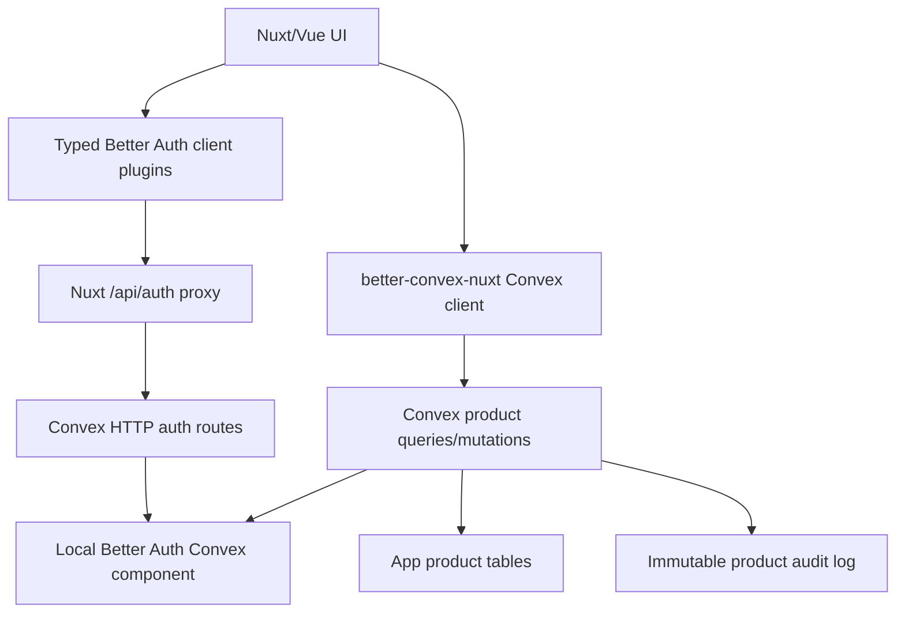

# Better Auth Team Starter Research Learnings

## Goal

Research how `starters/team` can better use Better Auth plugins for team and organization management while keeping Convex as the durable source of truth through a proper Better Auth Convex component.

The main constraint is still the team starter guardrail:

- Convex owns product authorization invariants.
- Nuxt may display auth/team state, but display state is not authorization.
- Important concepts should have one source of truth.

## Current Team Starter Shape

`starters/team` now uses:

- `@convex-dev/better-auth` for Better Auth storage and Convex JWT issuance.
- App-owned Convex `users` projection derived from Better Auth user triggers.
- Better Auth Organization component tables for organizations, memberships, invitations, teams, and roles.
- Product tables, currently `projects`, authorized by Better Auth permission checks inside Convex functions.
- Audit rows for product mutations.

The previous app-owned `organizations`, `memberships`, and `invitations` path has been removed. Do not add it back beside Better Auth Organization; that would create two canonical membership systems.

## Main Recommendation

For a Better Auth powered team starter, keep the hard cutover:

1. Use a local Better Auth Convex component.
2. Enable Better Auth `organization()` on the server and `organizationClient()` on the client.
3. Keep app-owned `organizations`, `memberships`, and `invitations` deleted.
4. Store product data in app tables that reference Better Auth organization/member/user ids as strings.
5. Keep product authorization checks inside Convex functions by calling Better Auth through `authComponent.getAuth(createAuth, ctx)`.

Do not keep old and new organization paths side by side unless we are explicitly building a migration for released data.

Second-pass check: this recommendation still holds. The deeper source read made the tradeoff sharper:

- Better Auth Organization already enforces important team invariants, including "last owner cannot leave, be removed, or demote themselves away from owner".
- Better Auth Organization removes memberships by deleting `member` rows. The current starter's `status: 'removed'` membership history should become audit data if we still need history; it should not remain a parallel membership source.
- The Convex Better Auth adapter does not support Better Auth transactions. A Better Auth endpoint may perform multiple adapter operations, so do not hang product invariants off a later trigger expecting all earlier auth-domain writes to roll back together.
- Product authorization can still live in Convex product functions. Convex should ask Better Auth for membership/role/permission truth, then write product rows and product audit rows itself.

## B2B Dream State

The bigger goal is feasible, but it needs a sharper architecture than "a starter with teams".

Dream state:

- Nuxt/Vue developers get a typed Better Auth client for auth-domain workflows.
- Better Auth plugins own auth, sessions, users, organizations, members, invitations, admin user controls, API keys, MFA/passwordless methods, and eventually enterprise capabilities where compatible.
- Convex remains the durable database and product invariant layer.
- App Convex tables store product data and reference Better Auth component ids as strings.
- Product mutations enforce authorization in Convex by calling Better Auth permission APIs or component-local auth helper functions.
- Product audit logs are immutable app data; auth membership tables are not mirrored.
- Heavy B2B behavior is proven by spikes before becoming starter guidance.

The target DX should feel like Nuxt/Vue:

```ts
const authClient = useB2BAuthClient()
await authClient.organization.create({ name, slug })
await authClient.organization.inviteMember({ email, role, organizationId })
await authClient.apiKey.create({ configId: 'org-keys', organizationId })
```

Then product writes stay Convex-native:

```ts
const createProject = useConvexMutation(api.projects.create)
await createProject({ organizationId, name })
```

This is the right boundary: Better Auth for auth-domain heavy lifting, Convex for product-domain invariants.

## B2B Feasibility Verdict

Yes, we can push this architecture into real B2B apps, but not by assuming every Better Auth plugin automatically works in Convex.

Final wrap-up verdict:

- Core B2B orgs, teams, roles, invitations, and Convex-enforced product permissions are proven.
- Better Auth owns auth-domain tables; Convex app tables own product-domain rows and product audit.
- API keys are usable with predefined configs; destructive org deletion requires explicit API-key cleanup.
- MFA/passwordless/passkeys are proven as runtime capabilities; starter UI and delivery/provider setup are separate product work.
- Stripe is partial and local-fake-client only until real webhooks, portal, cancellation/restore, upgrade, and seat sync pass.
- SCIM is partial until PUT/PATCH/DELETE route support exists.
- SSO is not a pure Convex starter feature today.
- OAuth/OIDC/MCP provider surfaces stay advanced recipes, not starter defaults.
- Raw organization deletion is not a starter UI feature.

What looks strong:

- Better Auth has a large plugin surface for auth, authorization, API/tokens, OAuth/OIDC provider behavior, billing, and security utilities.
- Official Better Auth docs list 50+ plugins, including Organization, Admin, API Key, Two Factor, Passkey, Magic Link, OAuth Provider, Stripe, and more.
- The official Convex integration supports local install, which gives us schema control and lets Convex component functions directly access Better Auth component tables.
- Our local fixture already proves `admin()`, `organization()`, and `apiKey()` can generate a local Convex component schema and preserve client plugin types through `createBetterConvexAuthClient()`.
- Dynamic organization roles are now verified in the team starter with the local Convex component.
- Organization-owned API key management is now verified in the team starter with the separate `@better-auth/api-key` package and the local Convex component.
- User-owned API key management is now verified with the same Better Auth component; user keys are isolated by Better Auth user id and do not need an app-owned mirror.
- API-key lifecycle after organization deletion is now verified: Better Auth can leave an org-scoped key valid after the organization row is deleted, so product routes must check organization existence separately.
- API-key safe organization deletion is now verified as a route/client-level recipe: Better Auth API-key list/delete routes can revoke known org-scoped keys before org deletion, but the same cleanup through Better Auth server APIs inside a Convex mutation currently fails with `dynamic module import unsupported`.
- Stripe billing is partially runtime-verified with `@better-auth/stripe`: the local component schema generates subscription/customer fields, owner organization subscription listing works through Better Auth, outsider access is denied, checkout start creates an incomplete Better Auth subscription row, checkout success activates it, Convex product logic can enforce the configured project limit from the active Better Auth subscription row, and no app-owned billing mirror is needed for that path.

What is limited:

- The official Convex + Better Auth supported plugins page says SSO is incompatible even with local install because it depends on Node.js.
- Any plugin with Node-only APIs, external runtime assumptions, unsupported database features, or custom secondary storage needs a spike before we recommend it.
- The Convex adapter limits still apply: no Better Auth transactions, no joins, no JSON fields, no native Date fields, no offset, no case-insensitive queries, count-by-read, and index sensitivity.
- Enterprise SSO, SCIM, OAuth Provider, billing plugins, and storage-mode-heavy API key setups are not "starter defaults"; they are advanced compatibility projects. SSO is an official Convex incompatibility today. SCIM is partially runtime-verified with `@better-auth/scim`, but full SCIM is currently blocked because the Convex Better Auth route helper exposes only GET/POST auth routes while SCIM requires PUT/PATCH/DELETE. Stripe is partially verified for local schema, organization subscription listing, checkout creation, checkout-success activation, and local project-limit enforcement; webhooks, real Stripe network calls, billing portal, seat sync, and real provider lifecycle still need dedicated spikes.

Practical conclusion:

- Core B2B teams, roles, invitations, product permissions, admin user management, organization API keys, MFA/passwordless auth: feasible path.
- Full enterprise identity suite with customer-managed SSO/SCIM: not proven inside pure Convex Better Auth today. SSO is currently blocked by official integration docs; SCIM provisioning works for GET/POST flows but needs route-method support before it can satisfy real IdP lifecycle requirements.
- API platform/MCP-style OAuth Provider: plausible, but needs a dedicated Convex compatibility spike.
- Billing/subscriptions: plausible through Better Auth Stripe for auth-domain subscription state plus Convex product enforcement. The local fake-client list/checkout/success boundary and local project-limit enforcement are proven; real Stripe lifecycle and seat sync are not.

Current external docs cross-check:

- Better Auth plugin catalog: https://better-auth.com/docs/plugins
- Convex + Better Auth local install: https://labs.convex.dev/better-auth/features/local-install
- Convex + Better Auth supported plugins and SSO incompatibility: https://labs.convex.dev/better-auth/supported-plugins
- Better Auth organization-owned API keys: https://better-auth.com/docs/plugins/api-key/advanced
- Better Auth Stripe plugin: https://better-auth.com/docs/plugins/stripe
- Better Auth SSO provisioning model: https://better-auth.com/docs/plugins/sso
- Better Auth SCIM plugin model: https://better-auth.com/docs/plugins/scim

## Why Local Better Auth Component

The official Convex Better Auth component supports a default installed component, but schema-changing Better Auth plugins need a local component install.

Relevant examples:

- `test/fixtures/better-auth-local-component/convex/auth.ts`
- `test/fixtures/better-auth-local-component/convex/betterAuth/schema.ts`
- `/Users/matthias/Git/external/convex-auths/better-auth-convex-plugin/docs/content/docs/features/local-install.mdx`

The local fixture already proves this stack compiles with:

- `admin()`
- `organization()`
- `apiKey()`
- `convex({ authConfig })`
- generated local Better Auth schema
- `authComponent.adapter(ctx)`
- `authComponent.triggersApi()`

This fixture is the best starting template for a team starter experiment.

## Better Auth Organization Plugin Learnings

Better Auth Organization already owns most of what the team starter hand-rolls today:

- organization create/update/delete
- slug checking
- active organization stored on session
- list user organizations
- full organization details
- invitations
- invitation accept/reject/cancel/list
- members list/remove/update role
- server-only add member
- leave organization
- role and permission checks
- optional teams
- lifecycle hooks for org/member/invitation/team events
- custom schema fields for organization/member/invitation/team
- dynamic access control, if enabled

Useful source files:

- `/Users/matthias/Git/external/convex-auths/better-auth/docs/content/docs/plugins/organization.mdx`
- `/Users/matthias/Git/external/convex-auths/better-auth/packages/better-auth/src/plugins/organization/schema.ts`
- `/Users/matthias/Git/external/convex-auths/better-auth/packages/better-auth/src/plugins/organization/types.ts`
- `/Users/matthias/Git/external/convex-auths/better-auth/packages/better-auth/src/plugins/organization/organization.ts`

Important details:

- Default roles are `owner`, `admin`, and `member`.
- A member can have multiple roles stored as a comma-separated string.
- Default organization permissions cover organization, member, and invitation actions.
- Custom product permissions are supported through `createAccessControl()`.
- `auth.api.hasPermission()` accepts `organizationId` in the body, so Convex product functions do not need to rely on the active organization.
- Invitation ids are action-capable. If invitation ids can be listed or are predictable, enable `requireEmailVerificationOnInvitation: true`.
- `removeMember()` and `leaveOrganization()` hard-delete membership rows and clear active organization when needed.
- `deleteOrganization()` deletes members and invitations before deleting the organization.
- Runtime verification shows raw `deleteOrganization()` currently does not clean up Better Auth `team` or `teamMember` rows, and it can leave stale active org/team ids on sessions that did not perform the deletion.
- Last-owner protection is implemented in source and covered by tests.
- Organization hooks can log lifecycle events, but they should not create a second membership projection unless there is a specific, tested rebuild story.
- Optional teams are runtime-verified, but they add `team` and `teamMember` tables plus product/UI complexity. Enable them only when the product has team-scoped records or workflows distinct from the organization.
- Dynamic access control adds `organizationRole` and runtime role management. Static roles are the simpler starting point.

Verified local experiments are tracked in `experiments/better-auth-organization-plugin.md`.

Current verified findings from the team starter:

- The npm `@convex-dev/better-auth` component is not enough for schema-changing organization plugin tables; it fails when `organization()` writes models such as `member`.
- A local Better Auth component with generated schema works for organization, member, team, teamMember, invitation, and session tables.
- `advanced.database.generateId: false` is required so Convex owns component document ids.
- Local-only invitation acceptance works with `requireEmailVerificationOnInvitation: process.env.ALLOW_TEST_RESET !== 'true'`.
- Additional fields on organization/team/invitation work and persist in component tables.
- Additional fields on Better Auth `user` work and persist in the component `user` table and `get-session` response.
- The app `users` projection can intentionally stay limited to rebuildable display fields such as `name` and `email`; do not mirror every Better Auth user additional field by default.
- Additional fields on Better Auth `member` work through server-side `auth.api.addMember` and persist in the component `member` table.
- The public `/api/auth/organization/add-member` route is not exposed in this setup; treat direct member creation as a server-side Convex path for now.
- `update-member-role` updates only role; it is not a generic member-profile update endpoint.
- Default member/admin/owner permissions behave correctly for core B2B flows.
- Last-owner protection works.
- Ownership transfer works.
- Product authorization from Convex works with Better Auth `project` permissions.
- Owner/member can create product rows, viewer can read but not create, and outsiders are blocked.
- Organization and team lifecycle updates work through Better Auth component tables without app-owned org/member mirrors.
- Team-scoped product authorization works by reading Better Auth `team` and `teamMember` component rows from Convex. A team member can create/list team projects, an org-only member is rejected for that team, and a team member is rejected for another team.
- Better Auth role changes are enforced on stale session tokens because Convex product authorization calls Better Auth permissions at request time.
- Removing a member deletes the Better Auth `member` row and related `teamMember` rows; any retained session is not enough to pass product authorization.
- Removing an unused team deletes the Better Auth `team` row.
- Raw Better Auth organization deletion removes `organization`, `member`, and `invitation` rows, but currently leaves default/explicit `team` rows and related `teamMember` rows.
- Raw Better Auth organization deletion clears `activeOrganizationId` on the deleting owner's session, but can retain `activeTeamId`; a non-deleting member session can retain stale `activeOrganizationId` and `activeTeamId`.
- Stale sessions after raw organization deletion still cannot read or write product rows because Convex product functions ask Better Auth for current membership/permission truth at request time.
- Product UI should not call raw `/api/auth/organization/delete` as the destructive org deletion flow. Keep deletion disabled or route it through one verified cleanup path for teams, team members, API keys, and stale session state.
- Best-effort public route cleanup can remove non-last teams and their `teamMember` rows before org deletion, but Better Auth default team settings reject removing the final team with `UNABLE_TO_REMOVE_LAST_TEAM`.
- After best-effort route cleanup plus raw org deletion, the final `team` and its `teamMember` row can still remain. Product access is still denied, but storage cleanup is incomplete.
- When `teams.allowRemovingAllTeams` is enabled, Better Auth public `remove-team` can remove the final team too. Route cleanup can then leave zero `team` and zero `teamMember` rows before raw organization deletion.
- `allowRemovingAllTeams` does not clear stale active org/team ids on sessions belonging to users who did not perform the deletion. Product authorization remains safe; UI/session display still needs to treat active ids as advisory and refetch current org state.
- Product rows can reference Better Auth organization/user/team ids as strings without app-owned membership or team rows.
- The visible Nuxt starter path now proves the same source-of-truth split in a browser: sign-up, Better Auth organization creation, Convex product creation, and sign-out work with Better Auth team rows plus app product/audit rows only.
- App-owned `organizations` and `memberships` no longer exist while Better Auth owns org state.
- Dynamic access control generates `organizationRole` and works through Better Auth HTTP endpoints.
- Dynamic roles can be assigned to members and immediately affect Convex product authorization through `auth.api.hasPermission()`.
- Better Auth rejects invalid permission resources, blocks non-AC users from creating roles, and refuses to delete roles that are assigned to members.
- `admin()` works with the local component for global user management.
- Admin adds Better Auth component fields on `user` and `session`, not app tables.
- Admin HTTP endpoints can list users, create users, set roles, ban, unban, impersonate, and stop impersonating.
- First-admin bootstrap can use `BETTER_AUTH_ADMIN_USER_IDS`; an env-listed admin can keep stored `role: "user"` while still receiving admin permissions.
- `twoFactor()` works with the local component for TOTP-based MFA.
- Two-factor state lives in Better Auth `user.twoFactorEnabled` and component table `twoFactor`.
- TOTP sign-in gating, backup code use, backup code single-use enforcement, and disable flow are verified.
- Raw backup codes are not stored directly in the component table.
- `emailOTP()` works with the local component for passwordless sign-in and email verification.
- Email OTP uses Better Auth `verification` rows; no app-owned OTP table is needed.
- With `storeOTP: "hashed"`, raw OTPs are not stored directly in component rows.
- Local deterministic OTP generation is useful for feedback scripts but must stay gated behind `ALLOW_TEST_RESET`.
- `magicLink()` works with the local component for passwordless sign-in.
- Magic link uses Better Auth `verification` rows; no app-owned magic-link table is needed.
- With `storeToken: "hashed"`, raw magic-link tokens are not stored directly in component rows.
- Consumed magic-link tokens cannot be replayed; replay redirects with `INVALID_TOKEN`.
- Passkeys live in the separate `@better-auth/passkey` package, not `better-auth/plugins/passkey`.
- `@better-auth/passkey@1.6.20` works with the local Better Auth Convex component for schema generation, server option generation, challenge storage, and passkey table inspection.
- Browser passkey registration and sign-in work with Playwright's Chromium virtual authenticator: Better Auth creates a `passkey` row, consumes WebAuthn challenge rows, and creates a new `session` on passkey sign-in.
- Deprecated `oidcProvider()` works with the local component for dynamic client registration, consent, authorization-code token exchange, and userinfo.
- `deviceAuthorization()` works with the local component for device-code creation, claim, approve, deny, token exchange, row consumption, and session creation.
- Device-issued Better Auth session tokens work with Convex product authorization. A device-issued member token can create while the member has `project.create`, can read but not create after role downgrade to `viewer`, and loses read/write access after member removal.
- `@better-auth/api-key@1.6.20` works as a separate dependency; it is not exported from `better-auth/plugins`.
- Organization-owned API keys generate component table `apikey` and work for create/list/update/delete through Better Auth HTTP routes.
- User-owned API keys work for create/list/delete through Better Auth HTTP routes, and another user cannot list or delete the owner's key.
- Server-side Convex code can verify raw API keys through `auth.api.verifyApiKey()`.
- API-key-authenticated product routes work when API-key scopes come from Better Auth API-key configuration defaults.
- API-key management route warnings are now expected-limit verified: `@better-auth/api-key@1.6.20` calls expired-key cleanup without awaiting it from management routes, and there is no public option to disable that cleanup call.
- Organization-scoped API keys can outlive deleted Better Auth organizations.
- Product routes must check that the referenced Better Auth organization row still exists; `verifyApiKey()` plus `referenceId` is not enough.
- Ad hoc per-key permission creation from Convex mutations and server-side org API-key cleanup through `auth.api.listApiKeys()` / `auth.api.deleteApiKey()` currently fail with `dynamic module import unsupported`.
- Route/client-level cleanup can list and delete known org-scoped key configs before org deletion; after that, raw keys return `INVALID_API_KEY` and component `apikey` rows are gone.
- HTTP `/api/auth/api-key/verify` returns 404 in the current Convex route setup, so key verification should be treated as server-side for now.
- After a member leaves, Better Auth clears `activeOrganizationId`; in the tested owner-leave flow it can leave `activeTeamId` set, so UI helpers must not trust active team without active organization.

## Better Auth Plugin System Learnings

The pasted Better Auth plugin docs are directly relevant:

- Server plugins can add endpoints, schema, hooks, middleware, rate limits, and trusted origins.
- Client plugins infer server plugin endpoints through `$InferServerPlugin`.
- Extra fields on `user` or `session` are inferred by Better Auth client calls when configured through Better Auth schema options.
- `sessionMiddleware` and `requireOrgRole` exist for Better Auth plugin endpoints.

For our starter, this means we should prefer official plugin APIs over app wrappers for auth-domain behavior:

- use `authClient.organization.create()`, not `api.organizations.create`
- use `authClient.organization.inviteMember()`, not `api.invitations.create`
- use `authClient.organization.updateMemberRole()`, not `api.memberships.updateRole`

Convex app functions should remain for product behavior:

- create/list projects
- write audit events
- enforce product permissions before product writes

## Plugin Capability Map

Use this as the starting compatibility map for serious app work:

| Capability                          | Better Auth plugin/path                                  | Convex + Nuxt status                                                                  | Recommendation                                                                                                                                                                                                                   |
| ----------------------------------- | -------------------------------------------------------- | ------------------------------------------------------------------------------------- | -------------------------------------------------------------------------------------------------------------------------------------------------------------------------------------------------------------------------------- |
| Organizations, members, invitations | `organization()`                                         | Feasible with local component                                                         | Make this the team starter cutover.                                                                                                                                                                                              |
| Static product permissions          | `organization({ ac, roles })`                            | Feasible                                                                              | Use first for real B2B apps.                                                                                                                                                                                                     |
| Dynamic runtime roles               | `organization({ dynamicAccessControl })`                 | Feasible with local component                                                         | Advanced pattern. Adds `organizationRole`, admin UI, and role policy.                                                                                                                                                            |
| Teams inside organizations          | `organization({ teams })`                                | Verified with local component                                                         | Use only when product rows need a team boundary distinct from orgs. Convex can read Better Auth `team`/`teamMember` rows for product authorization without app-owned team mirrors.                                               |
| Admin user management               | `admin()`                                                | Verified with local component                                                         | Use for global user admin. Bootstrap first admin explicitly; do not mirror roles into app tables.                                                                                                                                |
| Organization API keys               | `@better-auth/api-key` with `references: 'organization'` | Partially verified with local component                                               | Key management, route-level cleanup before org deletion, and server-side verification work. Raw org deletion can leave keys valid; server-side list/delete cleanup currently hits dynamic import in Convex. HTTP verify route currently returns 404. |
| API-key product routes              | `@better-auth/api-key` + Convex HTTP route               | Verified with predefined key configs                                                  | Use config-level default permissions. Avoid ad hoc per-key permissions from Convex mutations for now.                                                                                                                            |
| API-key management warnings         | `@better-auth/api-key` management routes                 | Expected-limit verified                                                               | Current package logs Convex dangling-operation warnings from expired-key cleanup. Do not fork the source of truth to hide this; wait for upstream fix or accept operationally.                                                   |
| User API keys / service keys        | `@better-auth/api-key` default user reference mode       | Verified with local component                                                         | Use for personal/service keys when a human owner is the correct source of truth. Keep secrets hashed in Better Auth and verify server-side from Convex.                                                                          |
| User additional fields              | Better Auth `user.additionalFields`                      | Verified with local component and typed Nuxt client                                   | Use for auth/session profile fields such as locale/timezone/preferences. Keep product authorization and membership out of these fields.                                                                                          |
| Member additional fields            | Better Auth Organization `member.additionalFields`       | Verified through Convex server-side `auth.api.addMember`; HTTP add-member is 404      | Use for lightweight membership profile fields created with membership, such as title/department/billable. Use app product tables for mutable HR/profile workflows unless a Better Auth member-update path is proven.             |
| MFA                                 | `twoFactor()`                                            | TOTP verified with local component                                                    | Good hardened starter variant. OTP delivery and passkey UI/productization still need separate product work.                                                                                                                     |
| Email OTP passwordless              | `emailOTP()`                                             | Verified with local component                                                         | Feasible for passwordless sign-in and email verification. Needs real delivery before product use.                                                                                                                                |
| Magic link passwordless             | `magicLink()`                                            | Verified with local component                                                         | Feasible for passwordless sign-in. Needs real delivery before product use.                                                                                                                                                       |
| Session lifecycle                   | Core Better Auth session routes                          | Verified with local component                                                         | `revoke-session` and `sign-out` delete component `session` rows; stale session tokens stop authorizing Convex product writes. Keep session validity in Better Auth, not app tables.                                              |
| Passkeys                            | `@better-auth/passkey`                                   | Browser WebAuthn boundary verified with local component                               | Schema, option endpoints, virtual-authenticator registration, passkey row creation, passkey sign-in, session creation, and challenge consumption work. Real-device UX and starter UI are still product work.                    |
| OAuth social/custom providers       | built-in providers / Generic OAuth                       | Runtime verified with local component for a synthetic provider                        | Better Auth owns OAuth state, provider account links, user/session creation, and replay protection. Keep provider account data in Better Auth `account`, not app tables. Real provider config and Nuxt callback UX remain product work. |
| OIDC provider                       | Deprecated `oidcProvider()`                              | Runtime verified with local component                                                 | Dynamic client registration, consent, token exchange, userinfo, and refresh grants work. Use only as an advanced API-platform spike until `@better-auth/oauth-provider` is available and Nuxt proxy/callback UX is proven.       |
| Device authorization                | `deviceAuthorization()`                                  | Runtime and product authorization verified with local component                       | Good API/platform recipe for CLI/TV/device login. Device-issued sessions use normal Better Auth session authorization in Convex. Nuxt verification/polling UX still needs product work.                                          |
| MCP / platform auth                 | `mcp()`                                                  | Runtime verified with local component in isolated mode                                | API-platform recipe only. Do not enable beside deprecated `oidcProvider()` because both claim `POST /oauth2/consent`; current MCP userinfo/JWKS endpoints are advertised but missing, and dynamic client secrets are stored raw. |
| OAuth/MCP token product routes      | `oauthAccessToken` + component `member`                  | Runtime verified with local component                                                 | Feasible as an explicit recipe route. Requires token scope such as `project:create` plus Better Auth membership lookup. Not a built-in Better Auth permission check for OAuth tokens.                                            |
| OAuth/MCP token lifecycle           | OIDC `/oauth2/token`, MCP `/mcp/token`                   | Runtime verified with important limits                                                | Refresh grants work, but old access tokens remain valid, old refresh tokens remain reusable, token rows accumulate, and revoke/introspect endpoints are absent in `better-auth@1.6.20`.                                          |
| OAuth/MCP client credentials        | OIDC/MCP token endpoints                                 | Expected-limit verified                                                               | Discovery does not advertise `client_credentials`; registration accepts the grant metadata, but token endpoints reject it with `invalid_request` / `code is required`. Use API keys for service integrations.                    |
| Generic OAuth / OAuth proxy         | `genericOAuth()`, `oAuthProxy()`                         | Generic OAuth runtime verified; OAuth proxy expected-limit verified for Generic OAuth | `genericOAuth()` works for state creation, callback, account row creation, session creation, and state replay rejection. `oAuthProxy()` rewrites Generic OAuth state/callback, but Generic OAuth still uses `/oauth2/callback/:providerId`, which does not decrypt proxy state; the callback fails with `state_mismatch`. |
| Billing/subscriptions               | `@better-auth/stripe`                                    | Partially runtime-verified with local component                                       | Schema generation, organization subscription listing, checkout row creation, checkout-success activation, and local Convex project-limit enforcement work with Better Auth-owned `subscription` state and owner/outsider checks. Do not productize until webhooks, real Stripe network behavior, billing portal, and seat sync are proven. |
| SSO                                 | `@better-auth/sso`                                       | Officially incompatible with Convex integration today                                 | Do not promise pure Convex support. Consider external auth boundary spike.                                                                                                                                                       |
| SCIM                                | `@better-auth/scim`                                      | Partially runtime-verified; full lifecycle blocked by route-method support            | Schema, metadata, org-scoped token generation, hashed token storage, user provisioning, account linking, and member creation work. PUT/PATCH/DELETE currently 404 because `@convex-dev/better-auth` registers only GET/POST.      |

This table should be treated as an experiment queue, not a promise. The acceptance criterion for each plugin is: schema generates, Better Auth endpoints work through the Nuxt auth proxy, Convex JWT stays synchronized, product functions can authorize from Convex, and no duplicate source of truth is introduced.

## Dream Architecture for Advanced Apps

The high-end shape should be:



Rules:

- Better Auth component tables are canonical for auth-domain records.
- Product tables never mirror memberships, invitations, API key secrets, or auth roles.
- Product tables can store `organizationId`, `authUserId`, `memberId`, or `apiKeyId` string references when needed.
- Component-local functions are allowed for hot-path auth reads or adapter workarounds, but only when Better Auth API calls are too broad or too slow.
- Nuxt composables can improve DX, but they should remain thin typed clients/actions over Better Auth, not a new auth domain.

## Experimental Roadmap

Recommended spikes, in order:

1. **Organization cutover baseline**
   - Local component with `organization()`.
   - App-owned org/member/invite tables are deleted.
   - Product `projects.organizationId` is a Better Auth organization id string.
   - Convex product mutations call `auth.api.hasPermission()`.

2. **Admin + API key spike**
   - Add `admin()` and `apiKey()`.
   - Prove generated schema, typed clients, admin list/ban/impersonation boundaries, user keys, and organization-owned keys.
   - Verify organization API key permissions from Better Auth docs with Convex server routes.

3. **Static B2B permissions spike**
   - Define product permissions in `createAccessControl()`.
   - Prove owner/admin/member/viewer plus product-specific permissions.
   - Keep frontend permission helpers display-only; backend remains authoritative.

4. **Dynamic roles and teams spike**
   - Enable `dynamicAccessControl`.
   - Teams are verified for Better Auth-owned `team`/`teamMember` state and team-scoped product authorization.
   - Keep teams opt-in unless product data has a real team boundary.
   - Measure schema/index needs, endpoint compatibility, role update behavior, and UI complexity.

5. **Auth hardening spike**
   - Session lifecycle is verified for two concurrent sessions, session revocation, sign-out, stale-token product authorization denial, and empty final `session` table.
   - Two factor is verified for TOTP and backup codes.
   - Email OTP is verified for passwordless sign-in and email verification.
   - Magic link is verified for passwordless sign-in.
   - Passkey server/runtime boundaries are verified with `@better-auth/passkey`.
   - Verify schema generation, auth flows, JWT refresh, and SSR hydration.

6. **OAuth Provider / MCP spike**
   - `oidcProvider()`, `deviceAuthorization()`, and isolated `mcp()` runtime probes pass with the local Convex component.
   - `genericOAuth()` runtime probe passes with a local synthetic provider, proving Better Auth `verification`, `account`, `user`, and `session` rows are enough for custom OAuth sign-in.
   - `oAuthProxy()` plus `genericOAuth()` is expected-limit verified: proxy state is encrypted, but Generic OAuth uses `/oauth2/callback/:providerId`, so the decrypting proxy hook does not run and callback fails with `state_mismatch`.
   - Device-issued Better Auth session tokens are verified against Convex product authorization, including role downgrade and member removal on a stale device token.
   - Product-route authorization from OIDC and MCP access tokens is verified with explicit recipe logic: component `oauthAccessToken` lookup, `project:create` scope enforcement, and component `member` lookup.
   - Refresh grants are verified for OIDC and MCP, but current behavior is not strict token rotation: old access tokens remain valid, old refresh tokens remain reusable, and token rows accumulate.
   - Client credentials are expected-limit verified: registration accepts the metadata, but token endpoints reject the grant and create no token rows.
   - Still unproven: replacement `@better-auth/oauth-provider`, `oAuthProxy()` with a real built-in social provider, Nuxt proxy/callback UX, and a safe revocation/cleanup recipe.
   - Current OAuth/MCP limits: revoke/introspect endpoints return 404; client credentials are not implemented; MCP cannot run cleanly beside deprecated `oidcProvider()` because of the shared consent endpoint; advertised MCP userinfo/JWKS endpoints return 404; dynamic MCP client secrets are stored raw.

7. **Enterprise identity spike**
   - SSO is currently blocked in official Convex integration docs.
   - Explore whether an external Node Better Auth auth service can share enough truth with Convex without creating a second source of truth.
   - Stop if the result requires dual auth databases or mirrored memberships.

## Productization Criteria

A plugin becomes part of the recommended advanced path only when all of these are true:

- It works in local Convex component schema generation.
- It has a typed Nuxt/Vue client plugin path through `createBetterConvexAuthClient()`.
- It works through the Nuxt same-origin auth proxy.
- It keeps Convex JWT sync stable across SSR, hydration, sign-in, sign-out, and token refresh.
- It can be authorized from Convex product functions.
- Required indexes are explicit in the local component schema.
- Failure modes are covered by invariant tests.
- It does not create a second source of truth.

## Additional Fields

There are three separate places extra fields can exist:

1. Better Auth schema fields: visible in Better Auth sessions/plugin APIs.
2. Convex JWT claims: visible in `useConvexAuth().user`.
3. App Convex tables: used for product/business data.

Use the narrowest layer:

- Better Auth plugin/session response needs it: use Better Auth `additionalFields` plus `inferAdditionalFields<AppAuth>()`.
- Nuxt auth UI convenience needs it: put a claim in `convex({ jwt.definePayload })` and augment `ConvexUser`.
- Product logic needs it: store it in app Convex tables and test the invariant.

Do not copy organization membership into all three layers.

For Better Auth plugin-owned tables, add fields through Better Auth schema/plugin options and regenerate the local Convex component schema. Do not hand-edit generated schema as the source of truth. If Convex indexes are needed, use the local install pattern that imports generated tables into a local `schema.ts` and adds explicit indexes there.

Current team-starter evidence: `pnpm --dir starters/team feedback:better-auth-user-additional-fields` signs up a user with `locale`, `timezone`, and `marketingOptIn`, proves those fields are stored in Better Auth `user`, proves `get-session` returns them, proves the typed Nuxt client sees them through `inferAdditionalFields<AppAuth>()`, and asserts the app `users` projection does not mirror them.

`pnpm --dir starters/team feedback:better-auth-member-additional-fields` proves the public HTTP add-member route is unavailable here, then uses a guarded Convex mutation to call server-side `auth.api.addMember` with `title`, `department`, and `billable`. It proves those fields are stored in Better Auth `member`, proves the member can be team-scoped, proves role updates preserve but do not mutate those fields, and asserts app `memberships` table is not present.

Relevant local docs already in this repo:

- `docs/content/docs/4.auth-security/1.authentication.md`
- `src/runtime/composables/createBetterConvexAuthClient.ts`
- `playground/composables/useExtendedAuthClient.ts`

## Source of Truth Options

### Option A: Keep Current App-Owned Team Model

Better Auth owns users/sessions. App Convex tables own organizations, memberships, and invitations.

This is valid if the product needs custom membership semantics that Better Auth Organization does not model.

Tradeoff: we keep more code and manually maintain team lifecycle behavior.

### Option B: Better Auth Organization Owns Team Model

Better Auth component tables own organization, member, invitation, active org, and role data.

App Convex tables reference Better Auth ids:

- `projects.organizationId: v.string()`
- `projects.createdByAuthUserId: v.string()` or app user projection id if the projection remains necessary

Convex product functions ask Better Auth whether the current session can perform product actions.

Tradeoff: product tables lose `v.id('organizations')` references because the org table lives inside the Better Auth component. The gain is deleting the duplicate app-owned team model.

Recommended for the next experiment.

## Product Authorization Pattern After Cutover

The clean Convex-side pattern is:

```ts
const { auth, headers } = await authComponent.getAuth(createAuth, ctx)
const allowed = await auth.api.hasPermission({
  headers,
  body: {
    organizationId,
    permissions: {
      project: ['create'],
    },
  },
})

if (!allowed.success) {
  throw new ConvexError('Insufficient role')
}
```

Then product mutations can stay simple:

- validate args
- require permission
- write product row
- write audit row

That keeps backend invariants in Convex and uses Better Auth for membership/role resolution.

## Repo-by-Repo Learnings

### `better-auth-convex-plugin`

This is the official `@convex-dev/better-auth` component.

Key learnings:

- The `convex()` plugin adds `/convex/token`, JWKS, OIDC metadata, and token cookie behavior.
- `registerRoutesLazy()` is the right route registration path for avoiding eager Better Auth initialization.
- Query context disables Better Auth adapter writes to avoid accidental write side effects from session refresh/cleanup.
- Local install is the unlock for schema-changing Better Auth plugins.
- Triggers run in the same Convex transaction as the adapter write, and are better than Better Auth database hooks when deriving app data.
- The project is moving away from implicit two-user-table coupling. If an app user table remains, the relationship should be explicit.
- Adapter config is intentionally limited: no JSON fields, no native Date fields, no numeric ids, no Better Auth transaction support, no plural table names, arrays supported.
- Better Auth `experimental.joins` is forced off.
- `mode: 'insensitive'` where clauses are rejected. Store normalized values if case-insensitive lookup matters.
- `offset` pagination is rejected.
- OR queries are split, merged, deduped, and sorted in adapter code. They work, but they are not a reason to design broad OR-heavy product queries.
- `count()` is implemented by reading matching docs and counting them.
- Unique Better Auth fields require matching Convex indexes; missing indexes throw for unique lookups and log warnings for some non-unique queries.
- Large `in` queries are specifically called out in adapter code as a case where component-local Convex queries may be better than generic Better Auth API calls.
- The installed `mcp()` plugin can run in Convex, but it must be isolated from deprecated `oidcProvider()` because both register `POST /oauth2/consent`.
- Current `mcp()` metadata advertises `/mcp/userinfo` and `/mcp/jwks`, but those routes are not implemented in `better-auth@1.6.20`.
- Current `mcp()` dynamic client registration stores `oauthApplication.clientSecret` as raw plaintext, unlike the hashed OIDC provider spike.
- Product routes can authorize OIDC/MCP access tokens by reading Better Auth component `oauthAccessToken` and component `member` directly. This avoids a second source of truth, but it is route-level recipe code, not Better Auth `hasPermission()` heavy lifting.
- OIDC and MCP refresh-token grants create additional component `oauthAccessToken` rows instead of invalidating the original row. The original access token remains valid and the original refresh token remains reusable in the current installed package.
- OIDC/MCP revocation and introspection endpoints are not exposed by the installed plugin surfaces; route recipes cannot rely on them.

Applicable changes:

- Make the team starter local-component based when using Organization/Admin/API Key.
- Keep user projection explicit and trigger-driven if app product tables need an app user document.
- Add tests for trigger projection and plugin schema presence.
- Add direct component functions for hot paths if Better Auth generic API calls become too broad, especially organization member listing at large limits.

### `better-auth`

Key learnings:

- Organization plugin is feature-complete enough to replace the starter's org/member/invite tables.
- It supports lifecycle hooks for org, member, invitation, and team events.
- It supports custom schema fields.
- It supports static and dynamic access control.
- `hasPermission` can check an explicit `organizationId`.
- Admin works with the local component for global user management: list, create, set role, ban, unban, impersonate, and stop impersonating.
- API Key plugins are reasonable future plugins, but they should be enabled only with local schema generation and explicit UI/API acceptance criteria.
- API keys can be organization-scoped and can integrate with organization permissions, but that is a product surface, not a team-management prerequisite.

Applicable changes:

- Define a small product permission statement, probably just `project: ['create', 'read', 'update', 'delete']` to start.
- Avoid dynamic access control initially. It adds another table and admin surface. Use static roles first.
- Use `requireEmailVerificationOnInvitation: true` unless we intentionally want weaker invitation acceptance.
- Decide whether membership removal history is required. If yes, keep it as immutable audit events, not as `memberships.status`.

### `nuxt-better-auth`

This Nuxt module does not provide Convex database integration.

Useful patterns:

- Separate server auth config from client auth config.
- Client config must include client plugin equivalents for server plugins.
- `useAuthClientAction()` style wrappers are useful for plugin operations that need pending/error state.
- SSR-safe session state should be separate from direct plugin client access.
- The Vue-safe auth proxy avoids Vue probing `then`, `catch`, `finally`, and `__v*` keys on Better Auth client objects.
- `useUserSession()` strips sensitive session token fields before storing client-visible state.
- It subscribes to Better Auth's `$sessionSignal` and reconciles SSR/hydration/prerender states; direct client calls are not enough for a polished Nuxt session surface.

Applicable changes:

- `better-convex-nuxt` already has `createBetterConvexAuthClient()`. The team starter should use it for `organizationClient()`.
- Consider adding a small starter-local `useTeamAuthClient()` composable that returns a cached `createBetterConvexAuthClient({ plugins: [organizationClient(...)] })`.
- Organization UI forms should use small action wrappers with pending/error state rather than calling raw client methods directly from many components.

### `convex-better-auth-svelte`

Key learnings:

- It carefully separates Better Auth session readiness from Convex token readiness.
- It avoids token fetches after sign-out to prevent `/convex/token` 401s.
- It supports an external/headless token exchange path.
- It uses SSR initial auth state to reduce auth flashes.
- It handles the ambiguity where Better Auth `$sessionSignal` can mean sign-out or tab refocus by waiting for the session to settle before fetching a Convex JWT.
- It retries network failures fetching `/convex/token`, but treats non-network auth errors as unauthenticated.
- Its SvelteKit handler forwards only auth-relevant headers and sets `x-better-auth-forwarded-*` plus `accept-encoding: identity`.
- SSR token lookup prefers async-local Convex token context, then falls back to secure/insecure Better Auth JWT cookie names.

Applicable changes:

- No direct team model change.
- Keep using `useConvexAuth()` and Convex authenticated wrappers for Convex data readiness.
- Do not rely on Better Auth `useSession()` alone before calling Convex product functions.
- Add regression coverage around sign-out/refocus token refresh if we touch `createBetterConvexAuthClient()` auth-state behavior.

### `convex-authz`

This is a much heavier authorization component.

Key learnings:

- It uses source role tables plus derived effective permissions/roles.
- It supports RBAC, ABAC, ReBAC, custom roles, overrides, expiry, and rebuilds.
- It introduces many expensive concepts: component tables, derived projections, rebuild story, relationship graph, audit log, and tenant routing.
- The component schema includes `roleAssignments`, `userAttributes`, `permissionOverrides`, `relationships`, `effectivePermissions`, `effectiveRoles`, `effectiveRelationships`, `customRoles`, and `auditLog`.
- The O(1) read path is bought by dual-writing source rows and effective rows, then running `recomputeUser()` after definition changes.
- `tenantId` is a core routing/index dimension. That is useful for complex multi-tenant systems, but it is extra architecture for this starter.

Applicable changes:

- Do not add this to the team starter now.
- Revisit only if the acceptance criteria explicitly require dynamic roles, relationship inheritance, direct permission overrides, or ABAC/ReBAC.

### `nuxt-convex`

Key learnings:

- It has a Nuxt-side Better Auth HTTP adapter that talks to Convex public functions.
- It documents that its Better Auth integration is dependency-constrained and tested only for a narrow stack.
- It wires `convexClient()` on the client and fetches `/api/auth/convex/token`.
- Its HTTP adapter has the same core limitations as the official adapter: no transactions, no JSON, no native dates, no offset, id/\_id mapping, OR split/dedupe.
- The adapter requires a hosted `https://*.convex.*` URL, which is the wrong shape for a local component-first team starter.
- The playground uses `crossDomain({ siteUrl })`, explicit allowed origins, and `convex({ authConfig })`.

Applicable changes:

- Do not move `better-convex-nuxt` toward a Nuxt-side HTTP database adapter for Better Auth.
- The current `@convex-dev/better-auth` component adapter is cleaner because Convex component tables remain the auth database source.
- The useful pattern is only the client plugin shape, which we already expose through `createBetterConvexAuthClient()`.

## Current Team Starter Findings

The current code has one important ambiguity:

- `users.ts` looks up app user projection by `identity.subject`.
- The generated Convex guidelines say `identity.tokenIdentifier` is the canonical stable auth-linked identifier.
- The official `@convex-dev/better-auth` helper `safeGetAuthUser()` also uses `identity.subject` to look up Better Auth user id.

This needs an invariant test and a documented choice before changing. If the projection is keyed by Better Auth user id, `subject` may be intentional. If the projection is meant to be provider-stable across issuers, use `tokenIdentifier`.

Do not silently change this without checking the JWT identity shape produced by `@convex-dev/better-auth`.

## Verification Baseline

Current passing commands:

```bash
pnpm --dir starters/team test
pnpm --dir starters/team typecheck
pnpm --dir starters/team convex:local:once
pnpm --dir starters/team feedback:local-baseline
pnpm --dir starters/team feedback:starter-ui-cutover
pnpm --dir starters/team feedback:better-auth-client-surface
pnpm --dir starters/team feedback:better-auth-user-additional-fields
pnpm --dir starters/team feedback:better-auth-member-additional-fields
pnpm --dir starters/team feedback:better-auth-org
pnpm --dir starters/team feedback:better-auth-org-lifecycle
pnpm --dir starters/team feedback:better-auth-org-limits
pnpm --dir starters/team feedback:better-auth-org-teams
pnpm --dir starters/team feedback:better-auth-product-authz
pnpm --dir starters/team feedback:better-auth-dynamic-roles
pnpm --dir starters/team feedback:better-auth-admin
pnpm --dir starters/team feedback:better-auth-two-factor
pnpm --dir starters/team feedback:better-auth-email-otp
pnpm --dir starters/team feedback:better-auth-magic-link
pnpm --dir starters/team feedback:better-auth-passkey-surface
pnpm --dir starters/team feedback:better-auth-enterprise-surface
pnpm --dir starters/team feedback:better-auth-scim
pnpm --dir starters/team feedback:better-auth-oidc-provider
pnpm --dir starters/team feedback:better-auth-device-authorization
pnpm --dir starters/team feedback:better-auth-api-keys
pnpm --dir starters/team feedback:better-auth-api-key-warning-limit
pnpm --dir starters/team feedback:better-auth-user-api-keys
pnpm --dir starters/team feedback:better-auth-api-key-product-route
pnpm --dir starters/team feedback:better-auth-api-key-lifecycle
pnpm --dir starters/team feedback:better-auth-all
```

`feedback:local-baseline` is the self-contained verifier for agent-visible development. It starts local Convex when needed, performs initial and final hard resets, runs the agent feedback probes, inspects app and Better Auth component tables, and stops only the server it started. `feedback:better-auth-all` is now self-contained for shared-server plugin probes: it starts or reuses local Convex, runs the slower proven plugin suite, hard-resets at the end, inspects tables, and stops only a server it started. The focused feedback scripts reset the local deployment, drive Better Auth through HTTP routes, inspect Convex component/app tables, and assert source-of-truth invariants.

`feedback:better-auth-client-surface` is the cheap typed Nuxt client gate. It
checks the installed client plugin exports and ids, then runs `nuxt typecheck`
against `useTeamAuthClient()` to prove `createBetterConvexAuthClient()` preserves
organization, admin, API key, SCIM, passkey, two-factor, email OTP, magic-link,
and additional-field client types. The current installed
`inferAdditionalFields()` client id is `additional-fields-client`.

## Proposed Team Starter Experiment

Create a separate hard-cutover experiment branch or commit that:

1. Adds `convex/betterAuth/convex.config.ts`.
2. Adds `convex/betterAuth/auth.ts` for schema generation only.
3. Adds `convex/betterAuth/adapter.ts`.
4. Generates `convex/betterAuth/schema.ts` with `organization()`.
5. Changes `convex/convex.config.ts` to use the local component.
6. Changes `convex/auth.ts` to export `createAuthOptions()` and enable `organization()`.
7. Deletes app-owned `organizations`, `memberships`, and `invitations`.
8. Changes `projects.organizationId` to `v.string()`.
9. Replaces `requireOrgAccess()` with a Better Auth permission check.
10. Adds a typed `useTeamAuthClient()` using `organizationClient()`.
11. Changes org/member/invite UI to call Better Auth client plugin methods.
12. Keeps project creation/listing in Convex product functions.

Acceptance criteria:

- No app-owned org/member/invitation tables remain.
- Better Auth generated schema contains `organization`, `member`, `invitation`, and `session.activeOrganizationId`.
- Creating an organization through Better Auth allows creating a project for that organization.
- A non-member cannot create or list projects for that organization.
- A member without the product permission cannot create projects.
- Invitation acceptance creates Better Auth membership, not an app membership row.
- Product audit events still write from Convex product mutations.
- Removing a member prevents future project access and writes an audit event if membership history is a requirement.
- Removing or demoting the only owner fails through Better Auth Organization.
- Sign-out does not produce repeated `/convex/token` 401s or an authenticated/unauthenticated flash in the starter UI.
- The local Better Auth component schema has indexes for unique plugin fields and for product-critical lookup paths.

## Recommended Next Step

Use the verification loop as the gate for every next plugin spike. The hard
cutover has landed: the visible Nuxt path, real `projects` functions, and final
`projects`/`auditEvents` table names all use Better Auth ids as the auth-domain
source of truth.

The fastest observable table loop is `pnpm feedback:better-auth-table-smoke` in
`starters/team`. It starts local Convex when needed, runs the Better Auth
organization lifecycle probe, and prints the same app/component rows through
`convex data`, so an agent can verify actual table state without opening the
dashboard.

Do not introduce `convex-authz`, app-level mirrors, compatibility shims, feature flags, or dual membership paths. If Better Auth Organization cannot satisfy a required invariant, document the specific failing acceptance criterion before adding app-owned team tables back.
