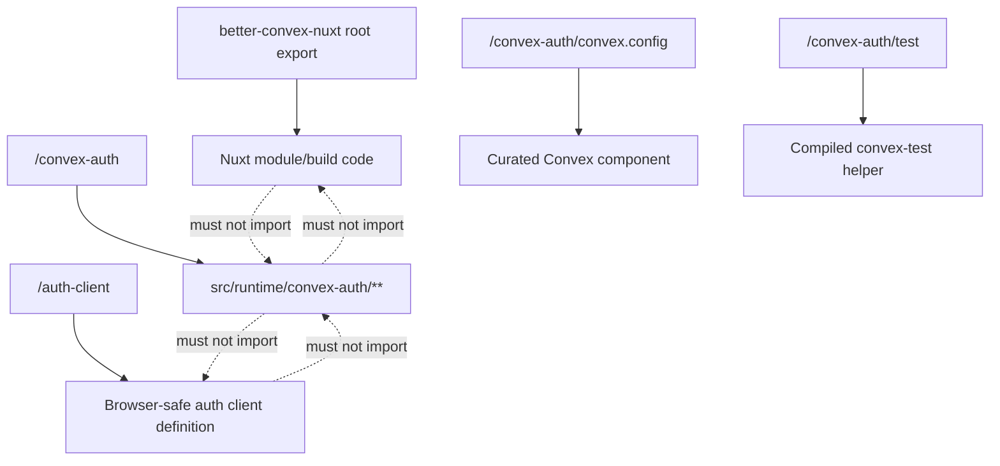
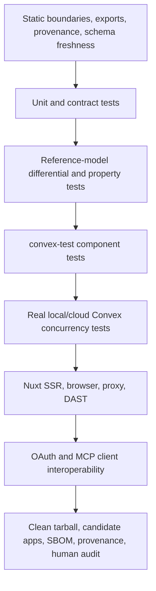

# Better Convex Nuxt Auth Platform Plan

> **Historical 0.7 record.** This document describes the completed 0.7 design and its
> detached-checkout release commands. It is not the vNext implementation contract. The normative vNext
> design is [`internal/RFC-better-convex-vnext.md`](./internal/RFC-better-convex-vnext.md), executable
> status lives only in [`internal/VNEXT-TASKS.md`](./internal/VNEXT-TASKS.md), and current release
> instructions live in [`RELEASING.md`](./RELEASING.md). In particular, the flat artifact paths below
> apply only to historical 0.7 evidence.

| Field                       | Decision                                                                                                                                                                           |
| --------------------------- | ---------------------------------------------------------------------------------------------------------------------------------------------------------------------------------- |
| Status                      | Greenfield hard-cut implementation in progress; no public release. Every phase still requires its listed gates, and Phases 5–6 require external rehearsal/stable-release evidence. |
| Plan date                   | 2026-07-16                                                                                                                                                                         |
| Product repository          | `/Users/matthias/Git/convex/better-convex-nuxt`                                                                                                                                    |
| Original upstream reference | `/Users/matthias/Git/convex/better-auth`                                                                                                                                           |
| Read-only mirror/reference  | `/Users/matthias/Git/convex/convex-better-auth-component`; it must remain bit-identical to its recorded upstream commit and is not a separate provenance source                    |
| Upstream source baseline    | `get-convex/better-auth` commit `c628916b451a6b4cff0f5464f134475464b1a6da`, tag `v0.12.5`, Apache-2.0                                                                              |
| Product decision            | `better-convex-nuxt` becomes the only maintained and published product.                                                                                                            |
| Framework scope             | Nuxt 4 and Convex only. No Next.js, React, React Start, TanStack, or generic framework compatibility layer.                                                                        |
| Protocol strategy           | Better Auth remains the authentication and OAuth/OIDC protocol engine. We own the Convex and Nuxt integration, storage correctness, tests, and release gates.                      |
| First stable target         | `better-convex-nuxt@0.7.0`, only after Better Auth 1.7 stable, all gates, protocol interoperability evidence, and an independent human security review                             |

> This document was the implementation contract for the 0.7 line. Preserve it as
> historical evidence; record vNext decisions in the RFC and its decision ledger.

## 0. Implementation progress

This ledger records implemented repository work separately from evidence that
requires a protected external environment or an independent person. A phase is
not release-complete merely because its code exists.

| Phase                              | Repository status                                                                                                                                                                                                                                                                                                                                                                                                      | Remaining evidence or blocker                                                                                                                                                                                                                                                       |
| ---------------------------------- | ---------------------------------------------------------------------------------------------------------------------------------------------------------------------------------------------------------------------------------------------------------------------------------------------------------------------------------------------------------------------------------------------------------------------- | ----------------------------------------------------------------------------------------------------------------------------------------------------------------------------------------------------------------------------------------------------------------------------------- |
| 0 — contract and one-package proof | Implemented; hard-cut boundaries, packed-package probes, pinned local backend proof, provenance, notices, and the packaged/local component topology are present.                                                                                                                                                                                                                                                       | Independent human licensing review remains an external release gate.                                                                                                                                                                                                                |
| 1 — Better Auth 1.7 foundation     | Implemented on the exact pinned RC tuple with one adapter, one final schema, logical-ID invariants, one-call single-snapshot component counting, atomic bulk mutations with no BCN row cap (subject only to Convex transaction limits), differential upstream-reference coverage, real-backend trigger proofs, an exact 1,001-row scale harness, secret handling, and no legacy runtime or migration path.             | No repository blocker remains; the exact 1,001-row real-backend run and final whole-tree port/network-dependent verification are green and must repeat after any candidate change.                                                                                                  |
| 2 — origin, session JWT, and JWKS  | Implemented, including persisted-final-session exchange, token-class separation, strict same-origin proxying, signed client-IP provenance, MFA tests, additive JWKS rotation, and secret/export sentinels.                                                                                                                                                                                                             | Final whole-tree verification is repeated after every remaining implementation change.                                                                                                                                                                                              |
| 3 — OAuth beta                     | Implemented with the official Provider, BCN-owned transport/storage/resource invariants, provider-owned authorization semantics and safe error redirects, exact issuer/client/resource/subject/scope binding, database quotas, hardened public metadata CORS, fault barriers, and real-backend concurrency evidence.                                                                                                   | Final whole-tree verification is repeated after every remaining implementation change.                                                                                                                                                                                              |
| 4 — delegated MCP                  | Implemented; the delegated starter, fixed Nuxt relay, direct Convex verifier/dispatcher, Inspector and mcp-remote OAuth paths, expanded live Nuxt/direct authorization parity, terminal revocation, and selected official protocol scenarios pass self-contained.                                                                                                                                                      | Final whole-tree verification is repeated after every remaining implementation change; release claims remain limited to the exact evidence described below.                                                                                                                         |
| 5 — production-like beta rehearsal | Repository automation is implemented for independently recomputed tarball/SBOM evidence, a shared auth/MCP runtime fingerprint, closed-ingress ownership, current-mount zero-state proof, real session-JWT-to-Convex acceptance, public Better Auth lockout/reset, protected publishing, registry-byte comparison, cleanup, advisories, security evidence, and a green exact-candidate seven-app clean-install matrix. | Provider-host deployment identity and edge-lease configuration, a clean-provision/no-hidden-component record, a real protected cloud run, trusted npm prerelease publication, notification drill, and a reviewed forward-fix rehearsal require external credentials and governance. |
| 6 — stable `0.7.0`                 | Blocked by design.                                                                                                                                                                                                                                                                                                                                                                                                     | Better Auth 1.7 stable is not yet available; stable also requires all final evidence, an independent human auth/security review, human licensing review, and an immutable stable publish.                                                                                           |

### 0.1 Latest verification checkpoint — 2026-07-18

- Green on the feedback-reconciled implementation tree: formatting, lint, full
  typecheck, provenance, boundaries, ASVS/SBOM generation, prepack/dist exports,
  contract fixtures, and more than 1,300 tests across 136 files. The focused OAuth suite
  is 146/146, the focused adapter suite is 30/30, and the separately isolated MCP
  project is green across 9 files and 71 tests. Clean Node 22.14 verification
  from absent `.nuxt`/`dist` now self-prepares generated root and fixture types,
  resolves the repository Convex tests' package self-imports directly to the
  reviewed source, builds current package and DevTools bytes before dist and
  consumer gates, loads local TypeScript helpers through pinned `jiti`, and
  leaves no two-factor package symlink behind.
- The pinned real Convex backend gates are green for schema installation,
  logical-ID uniqueness, 1,001-row count/update/delete behavior, transaction
  rollback, sustained concurrency, signed client-IP provenance, eight-way JWKS
  rotation, OAuth quotas, authorization-code single consumption, replay denial,
  PKCE/client/secret rejection, and injected faults. The capability evidence
  also proves that this exact backend does not yet supply `URL.canParse`, while
  the delegated OAuth path succeeds with the documented temporary primitive
  fill.
- Security and interoperability gates are green: final persisted-session/MFA
  exchange, credential export sentinels, eleven isolated browser/SSR E2E files,
  six raw-proxy DAST checks, Inspector and mcp-remote OAuth flows, terminal token
  revocation, selected official MCP protocol scenarios, production/full npm
  audits, eight exact GitHub advisory queries, and upstream drift monitoring.
- The maintained Team and Agentic SaaS local-component schemas are now generated
  and freshness-gated from their canonical plugin options, alongside the curated
  and generic local-component schemas. Generated adapter indexes and a final
  schema/metadata pair invariant prevent wrapper-only index drift. A fail-fast
  external-disposable MCP proof mode can exercise the same harness against a
  freshly provisioned consumer app without taking deployment ownership or
  leaking fixture credentials.
- The automatic same-repository pull-request preview workflow is implemented and
  publishes only an evidence-bound exact tarball through `pkg.pr.new`. Its first
  clean run correctly refused the pre-fix candidate before upload because the
  repository Convex tests depended on an already-built self-package `dist`; no
  preview URL was produced. A second replacement run also refused upload: the
  nested playground package had no declared workspace dependency, while an
  ignored local self-link had masked that clean-checkout failure. The playground
  is now an explicit `workspace:*` consumer with a frozen lock importer and a
  manifest source gate; the mandatory frozen install owns workspace and lock
  consistency. Its auth-loop passes after the stale local directory is removed.
  Copyable proxy-secret examples are blank so a
  forgotten setup step fails closed instead of accepting a public placeholder,
  and bootstrap examples generate credentials instead of publishing accepted
  literals. The seven-app matrix now adds an offline generated-API and
  type-inference probe to the delegated starter before typecheck/build,
  preventing its recursive API inference from being hidden by an unchanged
  example app. A later fresh-Linux preview run was the first replacement to
  reach the extended browser session matrix and correctly refused publication:
  unrelated browser contexts shared Better Auth's fallback IP rate-limit
  bucket, while one stale test and public helper surface still claimed that a
  raw Better Auth session token was a public bearer-exchange credential. The
  matrix now injects a simulated post-ingress TEST-NET client address per
  isolated browser context (the dedicated proxy tests retain ingress-ownership
  coverage), the local Convex harness requires the current
  `Convex functions ready!` signal instead of accepting a stale persisted route,
  and the greenfield server API accepts explicit Better Auth credentials only
  as filtered cookies. Raw session-token bearer exchange is denied; the private
  marked component bridge and OAuth/MCP bearer paths remain separate. No
  preview artifact from the rejected commit was accepted. Release verification
  now forces the auto-started, local-only Convex path. That harness accepts only
  `anonymous:`/`local:` selectors with loopback URLs, rejects cloud credentials
  and inherited deployment selectors, refuses an already-running backend whose
  source graph it cannot prove, gives subprocesses only a temporary mode-0600
  local selector, and must terminate its owned process tree and port. The
  preview workflow likewise accepts only a preview SHA equal to the source
  commit, the exact full-commit `pkg.pr.new` URL, and hosted bytes whose SHA-256
  matches the immutable local candidate. An
  absent-`.nuxt`/`dist` `pnpm verify` remains green on the exact Node 22.14
  baseline. Every replacement commit must still repeat the complete
  `pnpm release:prepare` gate and seven-app clean-install matrix. Preview and
  external disposable-app results are attached to the exact pull-request commit
  rather than inferred from earlier local evidence.
- The first fresh Convex Cloud consumer rehearsal caught a stale provisioning
  instruction before any secret was sent: Convex 1.42.2 owns
  `CONVEX_SITE_URL` as a runtime built-in and rejects attempts to set the
  reserved name. Maintained guides and the delegated starter now set only
  application-owned Convex variables, keep the selected deployment's generated
  site URL for Nuxt, and regression-test that the forbidden command cannot
  reappear. The rejected preview commit is not accepted as release evidence; its
  replacement must repeat the immutable candidate and hosted-byte gates.
- The pre-publication external proof audit then caught two final consumer-path
  defects before any destructive MCP run: the one-shot harness trusted the
  app's implicit Convex selector after validating only its URLs, and the
  delegated starter tried to display email from an intentionally minimal
  session JWT. External evidence now requires an owner-only exact selector that
  matches both managed Convex origins (and region), rejects competing dotenv
  authority, strips every case variant of ambient Convex overrides, and passes
  the validated deployment name explicitly. Before any mutation, the pinned CLI
  resolves that name in an isolated directory, must report its real type as
  `dev` or `preview`, and produces the only private env file later CLI calls may
  load. Human display identity comes from the existing live user projection;
  no PII was added to the session token. Both defects have adversarial source
  coverage; live projection behavior remains an exact-preview consumer proof.
  The canceled preview produced no accepted artifact.
- Preliminary immutable-package rehearsal is now green against the exact
  full-commit `c067e1eaa2f19443b9ff278290d89cf476f43947` pkg.pr.new URL in two
  physically independent clean applications. Their manifests and lockfiles
  contain only the hosted URL and its CI integrity; no file, link, workspace,
  repository, user-directory, or temporary-package provenance remains. That
  candidate is not final release evidence: its workflow verified the hosted
  bytes but failed to retain the hidden `.release-artifacts` directory. The
  workflow now explicitly retains hidden files, and the repository formatter
  guards the corrected YAML.
- Human/browser deployment `doting-hedgehog-693` passed fresh signing-key
  rotation, public JWKS publication, signup without auto-session, generic login
  failure, persisted-session-before-JWT exchange, exact RS256 signature and
  issuer/audience/subject/session/lifetime/token-class claims, absence of PII,
  live projection placeholder-to-email resolution, two-tab realtime updates,
  request-scoped Nitro parity, two-user isolation, sign-out privacy, eight
  concurrent private/no-store SSR requests, diagnostic event coverage with
  credential redaction, and behavior-equivalent diagnostic silence after
  restart. The cloud backend required a disposable public HTTPS origin because
  it cannot retrieve JWKS from a developer loopback address; no source or dotenv
  file was uploaded to obtain that origin.
- Destructive OAuth/MCP deployment `dusty-cardinal-622` passed once and is now
  consumed. Before authorization traffic it had the only local listener, a
  fresh independent signing key, a public matching `kid`, a fresh Better Auth
  administrator, and the reviewed internal Convex `oauthAdmin` operator change.
  The external-disposable runner then passed 75 focused MCP/security tests,
  real Inspector and mcp-remote authorization-code/PKCE flows, exact
  issuer/client/resource/subject/scope binding, least privilege and approvals,
  live membership/delegation authorization, Nuxt/direct parity, terminal
  client/session/consent revocation, and the initialize, ping, and tools/list
  server scenarios with zero failures or warnings. It was not rerun.
- Final preview acceptance remains pending on the current PR head. It must retain
  the CI artifact, expose one full-40-character pkg.pr.new URL, prove hosted-byte
  equality and manifest/toolchain/runtime fingerprints, reinstall that exact
  URL in both clean applications, and leave every GitHub check green before the
  draft PR becomes ready. The unrelated Vercel demo now deploys only from
  `main`; PR proof uses the immutable package workflow because the demo's
  unreleased npm dependency cannot exist before publication.
- External release/governance gates remain unchanged: protected cloud identity
  and ingress lease, clean provision, exact-candidate cloud rehearsal, npm
  trusted publishing, owner/deputy notification drill, forward-fix record,
  independent security/licensing review, and Better Auth 1.7 stable.

The acceptance checklists below remain the authority. They are deliberately not
bulk-checked from implementation intent; each item needs its named automated or
human evidence.

## 1. Detailed goal

We want Better Convex Nuxt to be the best supported way to build a modern
Nuxt-and-Convex application whose identity system works for humans, server-side
rendering, agents, MCP clients, and later enterprise OIDC SSO.

The finished product must let an application owner:

- install one maintained package;
- run Better Auth on Convex behind Better Convex Nuxt's same-origin `/api/auth`
  proxy;
- use one Better Auth user/session store and one Convex component database;
- issue a short-lived Convex session JWT only after a final persisted Better
  Auth session exists;
- expose a standards-based OAuth authorization server for delegated agents and
  MCP clients without writing OAuth cryptography or protocol state machines in
  application code;
- bind OAuth access tokens to the correct issuer, client, resource, subject, and
  scopes;
- keep application authorization live in Convex, so a token never freezes an
  organization's current membership or permissions;
- preserve the existing advanced local-component mode for schema-changing Better
  Auth plugins without creating a second adapter implementation;
- start from a fresh auth component with one final schema and no compatibility,
  data-conversion, or dual-runtime path;
- test security invariants under concurrency, failure, malicious input, a real
  Convex backend, clean npm tarballs, browsers, SSR, and real OAuth/MCP clients;
- receive security patches through one repository, one release process, and one
  supported dependency tuple.

The dream version is not the version with the most features. It is the smallest
version whose critical guarantees are explicit, enforceable, observable, and
maintainable.

### Product-level success statement

An application using Better Convex Nuxt can authenticate a browser user, exchange
that final session for a Convex JWT, authorize an external MCP client with
authorization code plus PKCE, validate the resource-bound access token, and then
perform live Convex authorization—all through one documented package and without
depending on the standalone fork at runtime, build time, test time, or release
time.

### Security-level success statement

For every security-sensitive state transition, the repository contains:

1. one canonical state owner;
2. one atomic backend operation when concurrency matters;
3. one named invariant;
4. at least one negative or adversarial automated test;
5. real-backend or conformance evidence where an in-memory test cannot prove the
   behavior;
6. an explicit release gate.

### Junior-implementation success statement

A junior developer can take one phase, read its prerequisites, edit only the
listed areas, follow ordered steps, run exact commands, collect expected
evidence, recognize a stop condition, and know whether the phase passed without
inventing API names, dependency versions, data policy, token semantics, or
security behavior.

### Where implementation work starts

All new product work happens in:

```text
/Users/matthias/Git/convex/better-convex-nuxt
```

The original repository is the authoritative upstream source. The personal fork
is only a read-only, bit-identical convenience mirror of the recorded upstream
commit. Do not add feature work to it, publish it, use it as a dependency, or
record it as a second provenance source. If it diverges, delete or reset the
mirror administratively; product work does not wait for an archival ceremony.

The first implementation pull requests should be:

1. **Phase 0A — contract scaffolding:** boundary rules, canonical type-only
   package-entry support, license/provenance scaffolding, and failing package
   probes. No copied adapter source.
2. **Phase 0B — packaging proof:** the smallest real Convex component, clean
   tarball consumer, codegen, local deploy, compiled test helper, and
   `auth: false` graph proof.

Only after both pass does Phase 1 import the enumerated source seams and perform
the direct dependency and schema hard cut.

## 2. Final decision

### 2.1 What we will build

We will port only the necessary Convex/Better Auth integration into an isolated
`src/runtime/convex-auth/**` backend island inside `better-convex-nuxt`.

The directory is under `src/runtime` because the existing Nuxt module builder
already transpiles and copies that tree into `dist/runtime`. The code inside the
new directory is not Nuxt runtime code. Boundary checks will enforce that it is
framework-free Convex/edge code.

We will:

- retain the official Better Auth engine;
- retain the official `@better-auth/oauth-provider` for OAuth protocol behavior;
- rewrite the Convex adapter seams that are incorrect or insufficient;
- replace the deprecated Convex `oidcProvider` composition with one explicit JWT
  plugin graph;
- preserve Better Convex Nuxt's same-origin browser transport;
- provide a curated packaged component and one advanced local-component mode
  backed by the same implementation;
- hard-cut every maintained app from `@convex-dev/better-auth` to
  `better-convex-nuxt/convex-auth`.

### 2.2 What we will not build

We will not:

- maintain or publish a second Convex Better Auth package;
- copy the full upstream repository;
- recreate Next.js, React, React Start, TanStack, or cross-domain integrations;
- hand-write an OAuth authorization server while the official provider can be
  safely integrated;
- expose generic adapter internals as public package subpaths;
- support arbitrary browser-to-Convex auth requests;
- infer the public application origin from forwarding headers;
- store a second Convex JWT cookie;
- mint a Convex JWT from broad sign-in, callback, or session hooks;
- let a Convex query pretend a write succeeded;
- add a permanent logical-ID-to-`_id` fallback;
- add dual writes, dual adapters, npm aliases, or general/legacy compatibility shims;
- enable refresh tokens, public dynamic registration, Client ID Metadata
  Documents, DPoP, or client credentials in the first OAuth beta;
- mix inbound enterprise SSO with the outbound OAuth Provider work;
- claim SAML support inside the Convex edge runtime.

### 2.3 Options considered

| Option                                                                            | Decision                                                                   | Reason                                                                                                                                                                                  |
| --------------------------------------------------------------------------------- | -------------------------------------------------------------------------- | --------------------------------------------------------------------------------------------------------------------------------------------------------------------------------------- |
| Wait for upstream issue `#395`                                                    | Rejected as the delivery plan                                              | Upstream timing is outside our control and the feature is strategically important for agentic applications. We still monitor and contribute upstream.                                   |
| Maintain the entire fork as a second library                                      | Rejected                                                                   | It creates two products, two release processes, broad framework surface, duplicated test obligations, and a permanent source-of-truth problem.                                          |
| Build a custom OAuth server from scratch                                          | Rejected unless Phase 3 proves the official provider structurally unusable | OAuth protocol, token, consent, discovery, and client-management behavior are security infrastructure. Owning the integration is valuable; unnecessarily rewriting the protocol is not. |
| Put only frontend helpers in Better Convex Nuxt and leave backend depth elsewhere | Rejected                                                                   | Adapter atomics, token issuance, key lifecycle, and storage invariants are backend responsibilities. Moving them to Nuxt orchestration would be incorrect.                              |
| Port the minimal backend into Better Convex Nuxt                                  | Chosen, subject to Phase 0 proof                                           | It produces one package and one implementation while reusing the repository's existing Nuxt, SSR, proxy, packaging, security, starter, and release harnesses.                           |

### 2.4 Why the earlier companion-package recommendation changed

The earlier research report recommended a companion package because it avoided
polluting the Nuxt module with a stateful component. Repository inspection showed
that this repository already:

- packages `src/runtime/**` file-for-file;
- centrally verifies public package entries;
- maintains strict dependency-direction checks;
- verifies clean tarball consumers;
- supports both packaged and local Better Auth components;
- has an extensive auth proxy, SSR, browser, starter, ASVS, SBOM, and release
  harness.

That makes a same-package, isolated subpath simpler than a second package.
However, this remains a hypothesis until Phase 0 proves build, codegen,
deployment, tarball, and runtime isolation.

### 2.5 Disposition of the external LLM review

The July 2026 review is input, not authority. Its consequential recommendations
were checked against the pinned npm artifacts, the current repository, RFCs, and
current primary documentation.

| Review suggestion                                                                                                                                                                                                       | Decision                               | Plan consequence                                                                                                                                                                                                                                                                                                                                                                                                                                                                                                                      |
| ----------------------------------------------------------------------------------------------------------------------------------------------------------------------------------------------------------------------- | -------------------------------------- | ------------------------------------------------------------------------------------------------------------------------------------------------------------------------------------------------------------------------------------------------------------------------------------------------------------------------------------------------------------------------------------------------------------------------------------------------------------------------------------------------------------------------------------- |
| Treat authorization-code consumption before later binding checks as a release-fatal protocol defect                                                                                                                     | Rejected as stated                     | After BCN's fixed profile/auth-method guard, the pinned provider deliberately fails closed on the first forwarded token-endpoint presentation. Later binding failures mint nothing, consume the code, and require a fresh authorization transaction. Guard-rejected malformed/unsupported requests do not burn it.                                                                                                                                                                                                                    |
| Ship a `pnpm.patchedDependencies` fix for the OAuth Provider package                                                                                                                                                    | Rejected                               | A consumer-root pnpm patch is not a cross-package-manager release mechanism and cannot prove what npm/Yarn/downstream pnpm consumers execute. Release evidence uses the official pinned artifact. A patch may be used only in a non-release experiment.                                                                                                                                                                                                                                                                               |
| Replace the private service-actor MCP starter                                                                                                                                                                           | Rejected                               | `starters/mcp-agent` remains the private service-actor example. Phase 4 adds `starters/mcp-oauth-agent` for delegated human OAuth; documentation makes the different trust models explicit.                                                                                                                                                                                                                                                                                                                                           |
| Narrow the packaged schema immediately in Phase 1                                                                                                                                                                       | Accepted for the greenfield target     | Phase 1 creates the final curated packaged schema directly. Applications requiring schema-changing plugins choose a fresh app-local component at build time and import the same adapter implementation.                                                                                                                                                                                                                                                                                                                               |
| Add privilege fail-closed checks, exact grant controls, origin hardening, versioned secrets, encrypted account tokens, pinned backends, exact MCP clients, artifact-identity publishing, fuzzing, and negative controls | Accepted                               | These are explicit phase gates below.                                                                                                                                                                                                                                                                                                                                                                                                                                                                                                 |
| Assume empty omitted plugin tables, the default memory rate limiter, or a version-only MCP command are sufficient evidence                                                                                              | Rejected after artifact inspection     | Curated mode also compares active runtime schema requirements; rate limiting is explicitly database-backed with verified IP provenance; MCP protocol evidence uses exact pinned scenario invocations and the fixed relay.                                                                                                                                                                                                                                                                                                             |
| Treat the pinned MCP server active suite as capability-adaptive, or add an “everything server” fixture to make it pass                                                                                                  | Rejected after an empirical 0.1.16 run | The unfiltered run passed 4 of 30 active scenarios; 26 scenarios require optional capabilities or hard-coded `test_*` fixtures BCN does not advertise. Widening the product or testing a conformance-only overlay would be false evidence. The gate runs only initialize, ping, and tools/list; BCN-specific tool calls and live authorization remain in `test:mcp-auth`.                                                                                                                                                             |
| Maintain a hand-curated CVE-to-commit database                                                                                                                                                                          | Rejected                               | Advisory automation evaluates authoritative affected ranges against the exact tuple. Temporary exceptions require an owner, reason, mitigation, and expiry; no second vulnerability database is created.                                                                                                                                                                                                                                                                                                                              |
| Delete the `URL.canParse` capability fill before the pinned runtime/provider tuple changes                                                                                                                              | Rejected for this exact tuple          | The hash-pinned Convex default isolate lacks `URL.canParse`, while `@better-auth/oauth-provider@1.7.0-rc.1` calls it when parsing RFC 8707 resources and resource challenges. One internal 16-line, idempotent primitive fill is therefore a time-bounded exception—not a second auth path. Real-backend evidence must continue to prove the primitive is absent and delegated OAuth works. Delete the helper and both call sites as soon as a reviewed Convex runtime supplies it or a reviewed Provider release removes both calls. |

## 3. Baseline and version policy

### 3.1 Current repository baseline

As inspected on 2026-07-16:

| Dependency/product        | Exact baseline                           |
| ------------------------- | ---------------------------------------- |
| Better Convex Nuxt        | `0.6.1`                                  |
| Better Auth               | `1.6.23`                                 |
| `@better-auth/core`       | `1.6.23`, through the Better Auth family |
| `@convex-dev/better-auth` | `0.12.5`                                 |
| Convex                    | `1.42.2`                                 |
| Nuxt                      | peer `^4.4.0`, development `4.4.8`       |
| Package manager           | `pnpm@10.30.3`                           |

### 3.2 Fixed implementation tuple

The direct Better Auth 1.7 hard cut and OAuth work must use exactly:

```text
better-auth@1.7.0-rc.1
@better-auth/core@1.7.0-rc.1
@better-auth/oauth-provider@1.7.0-rc.1
kysely@0.28.17
convex@1.42.2
nuxt@4.4.8
convex-helpers@0.1.114
local Convex backend precompiled-2026-07-06-44f7aa7
release CI Node.js 22.14.0
release CI npm 11.5.1
```

No implementer may replace these with `latest`, `next`, a caret range, a newer
release candidate, or a beta during a phase. A dependency tuple change is a
reviewed plan change and reruns every security and compatibility gate.

`@better-auth/core` may remain transitive if the final package graph guarantees
the exact physical version. The release checks must still prove one physical
instance of it.

The initial Darwin arm64 local-backend artifact has SHA-256
`3d28873cf24019877146367c539104d54a05a9b8ec1b501e503077474c84415d`.
Before Phase 1 CI, add the reviewed Linux CI artifact digest to one canonical
backend manifest. Every test that claims real local-Convex evidence runs
`convex dev --local-backend-version precompiled-2026-07-06-44f7aa7` through the
repository harness and fails if the downloaded platform artifact or reported
backend version differs from the manifest.

The Phase 4 interoperability harness initially pins:

```text
mcp-remote@0.1.38
@modelcontextprotocol/inspector@0.22.0
@modelcontextprotocol/conformance@0.1.16
```

These are test-tool versions, not production dependencies. Changing one is a
reviewed interoperability-fixture change with fresh evidence.

### 3.3 Release train

| Release           | Earliest gate                                                                                                | Intended use                                                                                  |
| ----------------- | ------------------------------------------------------------------------------------------------------------ | --------------------------------------------------------------------------------------------- |
| No public release | Phases 0–4                                                                                                   | Use immutable CI/local tarballs while packaging, JWT, OAuth, and MCP behavior are incomplete. |
| `0.7.0-beta.0`    | Phases 0–5 pass and the trusted-publishing workflow publishes the already-tested artifact                    | First public prerelease; OAuth/MCP beta with refresh and advanced registration disabled.      |
| `0.7.0`           | Independent human security review, required conformance/interoperability evidence, and all stable gates pass | Production-supported release.                                                                 |

Stable `0.7.0` must not be published against a Better Auth release candidate.

### 3.4 Version checks

Update the existing dependency-alignment, SBOM, package-probe, starter, and
release scripts so they read one canonical tuple. Do not add a second hand-written
version list.

The canonical tuple must drive:

- root peer and development dependencies;
- maintained starter dependencies;
- clean consumer fixtures;
- package export probes;
- SBOM requirements;
- security documentation;
- release compatibility documentation;
- generated install commands.

The same canonical definition references, rather than duplicates:

- the exact local Convex backend version and per-platform digests;
- the exact MCP interoperability tool tuple;
- authoritative Better Auth/Convex affected-version ranges consumed by the
  advisory check.

## 4. Architecture

### 4.1 Runtime flow

```mermaid
flowchart LR
  Browser["Browser / Nuxt client"] -->|"same-origin /api/auth only"| NuxtProxy["Better Convex Nuxt auth proxy"]
  NuxtSSR["Nuxt SSR / server routes"] -->|"filtered Better Auth session credential"| NuxtProxy
  NuxtProxy -->|"bounded request; forwarding headers stripped"| ConvexHTTP["Application Convex HTTP action"]
  ConvexHTTP -->|"request URL rewritten to configured public origin"| BetterAuth["Better Auth instance"]
  BetterAuth --> Adapter["Better Convex Nuxt Convex adapter"]
  Adapter --> AuthDB[("One Convex auth component database")]
  BetterAuth -->|"GET /api/auth/convex/token after final session"| SessionJWT["Short-lived Convex session JWT"]
  SessionJWT --> ConvexAuth["Convex customJwt verification"]

  MCPClient["MCP / agent client"] -->|"authorization code + PKCE"| PublicOAuth["Public Nuxt OAuth routes and discovery"]
  PublicOAuth --> BetterAuth
  BetterAuth -->|"resource-bound OAuth access token"| McpProxy["Nuxt /mcp fixed proxy"]
  McpProxy -->|"Authorization only; fixed target"| McpAction["Convex MCP HTTP action"]
  McpAction -->|"exact token verification"| ToolInternal["Tool-specific internal function"]
  ToolInternal -->|"live auth + operation in one transaction"| AppData[("Application data")]
```



### 4.2 Build and package boundary



### 4.3 Sources of truth

| Concept                                     | Sole source of truth                                                  | Explicitly not a source of truth                            |
| ------------------------------------------- | --------------------------------------------------------------------- | ----------------------------------------------------------- |
| User and session identity                   | Better Auth rows in the Convex auth component                         | Nuxt state, JWT display claims, application user projection |
| Browser session credential                  | Better Auth session cookie                                            | Convex JWT cookie, local storage                            |
| Convex request identity                     | Short-lived verified Convex session JWT                               | OAuth access token                                          |
| OAuth grant state                           | Better Auth OAuth Provider rows through the Convex adapter            | MCP server cache, Nuxt UI state                             |
| Current organization/resource authorization | Application Convex tables and functions                               | OAuth scopes alone                                          |
| Public application origin                   | Validated `SITE_URL`                                                  | `Host`, `Forwarded`, `x-forwarded-*`, platform headers      |
| Convex transport origin                     | Validated `CONVEX_SITE_URL`                                           | Browser origin inference                                    |
| Package API contract                        | `scripts/package-entry-manifest.mjs`                                  | `package.json`, docs, and tests maintaining separate lists  |
| Supported dependency tuple                  | One canonical release compatibility definition                        | Per-starter manual choices                                  |
| Generated component schema                  | Deterministic generator plus reviewed schema options                  | Hand edits to generated schema                              |
| Upstream-derived source history             | Provenance ledger                                                     | Git memory or comments alone                                |
| Local real-backend test binary              | Canonical backend manifest with exact version and platform digest     | Floating `convex dev` download                              |
| Better Auth encryption-secret order         | Better Auth's official versioned `secrets` option/environment parsing | A BCN key registry or custom crypto parser                  |
| MCP bearer verification and dispatch        | One fixed Convex HTTP action                                          | Nuxt proxy, public Convex mutations, generic bridge         |
| MCP tool authorization and state change     | Tool-specific internal Convex function and its transaction            | OAuth scopes alone, Nuxt state, caller-supplied principal   |

### 4.4 Trust boundaries

1. The browser and every external OAuth/MCP client are untrusted.
2. Nuxt server code may handle session cookies but must forward only the minimum
   credential set.
3. The Convex HTTP action is the protocol execution environment.
4. The auth component owns auth state; application tables own product
   authorization.
5. JWT signatures are necessary but insufficient. Issuer, audience/resource,
   token class, algorithm, time, subject, and client claims are also required.
6. The original upstream is an untrusted source input until each imported file
   is enumerated, reviewed, modified where necessary, and covered by
   target-repository tests. The personal mirror adds no trust or provenance.
7. The public Nuxt `/mcp` route is a bounded fixed-target proxy, not an
   authorization boundary. The Convex HTTP action verifies the bearer token;
   tool-specific internal functions own live authorization and application state
   transitions.

## 5. Target repository and public API

### 5.1 Target source tree

Create only files required by the current phase. The final core tree is:

```text
src/runtime/
├── shared/
│   └── auth-origin.ts
│
├── auth-client/
│   ├── index.ts
│   ├── empty-definition.ts
│   └── convex-client-plugin.ts
│
└── convex-auth/
    ├── index.ts
    ├── context.ts
    ├── create-auth-component.ts
    ├── internal-session.ts
    ├── jwks-rotation.ts
    ├── oauth-resource.ts
    ├── oauth-security.ts
    ├── origin.ts
    ├── plugin.ts
    ├── provider.ts
    ├── test.ts
    ├── types.ts
    │
    ├── adapter/
    │   ├── create-adapter.ts
    │   ├── define-functions.ts
    │   ├── metadata.ts
    │   ├── query.ts
    │   └── generate-schema.ts
    │
    └── component/
        ├── convex.config.ts
        ├── adapter.ts
        ├── schema.ts
        ├── schemaMetadata.ts
        └── _generated/
            ├── api.ts
            ├── component.ts
            ├── dataModel.ts
            └── server.ts
```

Rules:

- `convex-client-plugin.ts` is internal. The Nuxt module installs it.
- `shared/auth-origin.ts` is the single dependency-free origin parser used by
  both the Nuxt proxy/site-URL path and the Convex auth island. Boundary checks
  allow this one shared leaf and reject any dependency flowing through it.
- `schema.ts`, `schemaMetadata.ts`, and `_generated/**` are generated and
  freshness-checked.
- `schema.ts` and `schemaMetadata.ts` are generated together from one Better
  Auth schema description. The metadata is derived, rebuildable, and never
  hand-edited.
- Test-only component functions belong under `test/convex-auth/**`, not shipped
  production component source.
- Do not create empty `oauth-provider.ts`, `sso.ts`, service
  layers, adapters, or configuration registries before their phase needs them.

### 5.2 Public subpaths

Keep all existing public entries and add exactly these four:

```json
{
  "./convex-auth": {
    "types": "./dist/runtime/convex-auth/index.d.ts",
    "import": "./dist/runtime/convex-auth/index.js"
  },
  "./convex-auth/convex.config": {
    "types": "./dist/runtime/convex-auth/component/convex.config.d.ts",
    "import": "./dist/runtime/convex-auth/component/convex.config.js"
  },
  "./convex-auth/_generated/component.js": {
    "types": "./dist/runtime/convex-auth/component/_generated/component.d.ts"
  },
  "./convex-auth/test": {
    "types": "./dist/runtime/convex-auth/test.d.ts",
    "import": "./dist/runtime/convex-auth/test.js"
  }
}
```

Do not add public subpaths for:

- `plugins`;
- `client/plugins`;
- `auth-config`;
- `adapter`;
- `utils`;
- internal component functions.

The root package export must not re-export the Convex auth backend.

`./convex-auth/_generated/component.js` is intentionally a type-only Convex
codegen entry, matching the upstream component pattern. Extend the canonical
package-entry manifest with one explicit `types-only` entry kind. Do not create a
fake JavaScript file and do not special-case this path in multiple check scripts.

### 5.3 Public names

`better-convex-nuxt/convex-auth` exposes only:

```ts
export {
  convexAuth,
  createAuthComponent,
  defineAuthAdapterFunctions,
  getConvexAuthProvider,
  requireAuthOrigin,
  verifyOAuthBearerToken,
}

export type {
  AuthComponentTriggers,
  AuthCtx,
  AuthFunctions,
  CreateAuth,
  VerifyOAuthBearerTokenOptions,
}
```

`verifyOAuthBearerToken` is the one reviewed Phase 4 addition to this list. The
delegated MCP starter is its concrete consumer: a Convex HTTP action uses it to
apply the fixed issuer, resource, algorithm, token-class, client, subject,
session, scope, and time checks before constructing a narrow in-memory
principal. It is not re-exported from the root package, does not accept generic
JWTs, and does not perform application authorization.

The exported list may be reduced only through an explicit maintainer-reviewed
plan/API change proving a type is unused; a junior implementer does not decide
that inside a phase. Adding a new public name requires a concrete consumer
fixture and an acceptance criterion. Do not preserve an upstream name solely for
compatibility.

### 5.4 Curated packaged-component usage

**Target code — must compile in
`test/fixtures/convex-auth-packaged/convex/convex.config.ts`:**

```ts
import auth from 'better-convex-nuxt/convex-auth/convex.config'
import { defineApp } from 'convex/server'

const app = defineApp()
app.use(auth, { name: 'betterAuth' })

export default app
```

**Target code — must compile in
`test/fixtures/convex-auth-packaged/convex/auth.config.ts`:**

```ts
import { getConvexAuthProvider } from 'better-convex-nuxt/convex-auth'
import type { AuthConfig } from 'convex/server'

export default {
  providers: [getConvexAuthProvider()],
} satisfies AuthConfig
```

**Target code — must compile in
`test/fixtures/convex-auth-packaged/convex/auth.ts`:**

```ts
import {
  convexAuth,
  createAuthComponent,
  requireAuthOrigin,
  type AuthCtx,
} from 'better-convex-nuxt/convex-auth'
import { betterAuth } from 'better-auth'
import { jwt } from 'better-auth/plugins'

import { components } from './_generated/api'
import type { DataModel } from './_generated/dataModel'
import authConfig from './auth.config'

const authComponent = createAuthComponent<DataModel>(components.betterAuth)

function assertAuthSecretsConfigured() {
  const versioned = process.env.BETTER_AUTH_SECRETS
  if (!versioned) {
    throw new Error('BETTER_AUTH_SECRETS is required')
  }
}

export async function createAuth(ctx: AuthCtx<DataModel>) {
  try {
    const siteUrl = requireAuthOrigin('SITE_URL')
    const convexSiteUrl = requireAuthOrigin('CONVEX_SITE_URL')
    assertAuthSecretsConfigured()

    const auth = betterAuth({
      account: {
        encryptOAuthTokens: true,
        storeAccountCookie: false,
      },
      advanced: {
        ipAddress: {
          ipAddressHeaders: ['x-bcn-verified-client-ip'],
        },
      },
      basePath: '/api/auth',
      baseURL: siteUrl,
      disabledPaths: [
        '/token',
        '/get-access-token',
        '/refresh-token',
        '/.well-known/openid-configuration',
        '/oauth2/register',
        '/oauth2/introspect',
        '/oauth2/userinfo',
        '/oauth2/end-session',
      ],
      trustedOrigins: [siteUrl],
      database: authComponent.adapter(ctx),
      rateLimit: {
        enabled: true,
        modelName: 'rateLimit',
        storage: 'database',
      },
      verification: {
        storeIdentifier: 'hashed',
      },
      plugins: [
        jwt({
          disableSettingJwtHeader: true,
          jwks: {
            gracePeriod: 21 * 60,
            keyPairConfig: { alg: 'RS256' },
            disablePrivateKeyEncryption: false,
          },
          jwt: {
            audience: `${siteUrl}/api/auth`,
            expirationTime: '10m',
            issuer: `${siteUrl}/api/auth`,
          },
        }),
        convexAuth({
          authConfig,
          sessionJwt: {
            audience: 'convex',
            expirationTime: '15m',
            issuer: convexSiteUrl,
            definePayload: ({ session }) => ({
              sid: session.id,
              token_use: 'convex-session',
            }),
          },
        }),
      ],
    })

    await auth.$context
    return auth
  } catch {
    throw new Error('AUTH_CONFIG_INVALID')
  }
}
```

This example intentionally does not include OAuth until Phase 3. The exact
Better Auth 1.7 option names must be compiled against the pinned tuple before the
example is merged.

The official JWT plugin's global issuer is the public authorization-server
issuer because the OAuth Provider derives its access-token issuer and metadata
from that plugin. `convexAuth()` must use the same JWKS signing state but override
the Convex session token's `iss`, `aud`, lifetime, and `token_use` per signing
call. The inspected `1.7.0-rc.1` `signJWT` implementation supports these
per-call payload overrides. Keep a compile/runtime regression test so a later
tuple cannot silently change them.

The fixed initial JWKS timing tuple is: maximum issued JWT lifetime 15 minutes,
public JWKS cache lifetime 5 minutes, clock skew 1 minute, and therefore Better
Auth `jwks.gracePeriod = 21 minutes`. The JWKS response uses
`Cache-Control: public, max-age=300, must-revalidate`. Change these values only
together through a reviewed tuple change and rerun rotation tests.

The example intentionally lets Better Auth parse `BETTER_AUTH_SECRETS` and its
version envelope. BCN checks only that the versioned setting is present; it does
not implement another secret parser, key registry, encryption format, or
decryption fallback. `account.encryptOAuthTokens` and
`verification.storeIdentifier: 'hashed'` are enabled before the first write.

`CreateAuth` accepts an async factory. `registerRoutes()`, `getAuth()`, schema
fixtures, and every internal caller must await it. The awaited `$context` maps
all Better Auth bootstrap failures to the fixed safe code without retaining or
logging the raw cause; HTTP registration converts that safe code to a fixed 500
response. Do not spread/clone the Better Auth object or leave an unobserved
rejected `$context` promise.

### 5.5 Curated packaged schema profile

The packaged component is not an “all Better Auth plugins” component.

The schema path is direct:

| Configuration | Tables/schema sources                                                                                                                                                                                                                                                                                                      |
| ------------- | -------------------------------------------------------------------------------------------------------------------------------------------------------------------------------------------------------------------------------------------------------------------------------------------------------------------------- |
| Packaged core | Better Auth core `user`, `session`, `account`, and `verification`; JWT `jwks`; Better Auth database-backed `rateLimit`.                                                                                                                                                                                                    |
| App-local     | An application-owned schema generated from its exact schema-changing plugins and `additionalFields`, mounted as `betterAuth`, importing the same BCN adapter implementation.                                                                                                                                               |
| OAuth-enabled | The selected packaged or local profile plus all seven tables generated by `@better-auth/oauth-provider@1.7.0-rc.1`: `oauthClient`, `oauthRefreshToken`, `oauthAccessToken`, `oauthConsent`, `oauthResource`, `oauthClientResource`, and `oauthClientAssertion`. A tuple update must regenerate and re-enumerate this list. |

The presence of `oauthRefreshToken` in the generated provider schema does not
enable refresh tokens. Capability enablement is controlled by scopes, grant
policy, client registration, endpoint enforcement, metadata, and tests.

The packaged profile does not include organization, team, two-factor, username,
phone, magic-link, email-OTP, generic OAuth, anonymous, API-key, or application
tables. An application that enables any schema-changing plugin or additional
field declares that configuration before its first deployment and uses
local-component mode. A dedicated two-factor local fixture supplies the Phase 2
MFA tests.

Configuration chooses packaged or local mode at build time. There is no runtime
data inspection, automatic mode selection, second mount, or mixed schema. The
generator fails when runtime plugin configuration needs a field or table absent
from the chosen schema. Both modes mount exactly once with
`app.use(auth, { name: "betterAuth" })`.

`schema-options.ts` must contain one explicit Better Auth configuration used only
for deterministic schema generation. It must not instantiate every plugin “for
future compatibility.”

Schema generation must not require production environment variables. The
build-only profile uses reserved, unmistakable non-production values:

```ts
const schemaGenerationEnvironment = {
  baseURL: 'https://schema.invalid',
  secret: 'schema-generation-only-value-never-used-at-runtime',
} as const
```

The file is not imported by request/runtime code and is not a public export.
Boundary and package tests must prove that:

- schema generation succeeds with `SITE_URL`, `CONVEX_SITE_URL`,
  `BETTER_AUTH_SECRETS`, and `BCN_AUTH_PROXY_IP_SECRET` unset;
- production `createAuth()` still fails closed when a required value is missing,
  a versioned secret envelope is malformed, or an origin is unsafe;
- the schema-only value never appears in a runtime bundle, response, log, or
  published usage example.

### 5.6 Advanced local-component mode

Keep local-component mode because Team, Agentic SaaS, and the existing local
component fixture use schema-changing plugins and generated plugin indexes.

Local mode may own:

- its local `schema-options.ts`;
- its generated schema;
- its generated schema metadata descriptor;
- its component `convex.config.ts`;
- its generated component files.

Local mode must import the same `defineAuthAdapterFunctions` implementation from
`better-convex-nuxt/convex-auth`. It must not copy or fork adapter logic.

**Target code — must compile in
`test/fixtures/better-auth-local-component/convex/betterAuth/adapter.ts`:**

```ts
import { defineAuthAdapterFunctions } from 'better-convex-nuxt/convex-auth'

import schema from './schema'
import schemaMetadata from './schemaMetadata'

export const {
  count,
  create,
  deleteMany,
  deleteOne,
  findMany,
  findOne,
  incrementOne,
  updateMany,
  updateOne,
  consumeOne,
} = defineAuthAdapterFunctions({ schema, metadata: schemaMetadata })
```

The concrete returned function names must match the Better Auth 1.7 adapter
contract and target component implementation. The fixture is the compile-time
contract.

A Convex `SchemaDefinition` does not retain all Better Auth semantics needed by
the adapter. The generated metadata descriptor contains, for every physical model
and field:

- logical and physical names;
- required and nullable semantics;
- value kind and date conversion;
- uniqueness;
- explicit single-field indexes;
- ordered compound indexes;
- reference fields;
- selectable and sortable fields required by the adapter contract.

The Better Auth schema/options input is canonical. Convex schema and metadata are
two deterministic generated artifacts from that one input, not two manually
maintained definitions. Maintained local components must pass the generated
tables directly to `defineSchema`. Adapter-required single and compound indexes
belong in the deterministic generator policy so schema and metadata receive the
same descriptor; app-specific tables and indexes belong in the application
schema, not as an untracked mutation of the auth component schema.

### 5.7 Simplified component-client API

`createAuthComponent()` may return only:

- `adapter(ctx)`;
- `safeGetAuthUser(ctx)`;
- `getAuthUser(ctx)`;
- `getAuth(createAuth, ctx)` for mutation/action contexts;
- `triggerFunctions()`;
- `registerRoutes(http, createAuth)`.
- `jwksOperatorFunctions(createAuth)` for the one deployment-only additive
  signing-key rotation action required by the session and OAuth JWT profiles.

Delete or do not port:

- separate eager and lazy route-registration paths;
- `clientApi()`;
- `getAnyUserById()`;
- `setUserId()`;
- public `getHeaders()`;
- public verbose mode;
- CORS configuration;
- forwarded-origin restoration;
- component-owned root redirects.

`registerRoutes()` is always lazy, fixed to `/api/auth`, and creates Better Auth
with the real request context.

## 6. Source intake, deletion, dependencies, and licensing

### 6.1 Enumerated source mapping

| Upstream source                                         | Target                                                     | Treatment                                                                                                                                    |
| ------------------------------------------------------- | ---------------------------------------------------------- | -------------------------------------------------------------------------------------------------------------------------------------------- |
| `src/client/index.ts`                                   | `src/runtime/convex-auth/index.ts`                         | Rewrite as the narrow public barrel.                                                                                                         |
| `src/client/create-client.ts`                           | `src/runtime/convex-auth/create-auth-component.ts`         | Rewrite, remove header restoration and generic compatibility surface.                                                                        |
| `src/client/adapter.ts`                                 | `src/runtime/convex-auth/adapter/create-adapter.ts`        | Port concepts, then correct logical IDs, nulls, atomics, and query behavior.                                                                 |
| `src/client/create-api.ts`                              | `src/runtime/convex-auth/adapter/define-functions.ts`      | Rewrite around internal component functions and native atomic operations.                                                                    |
| `src/client/adapter-utils.ts`                           | `src/runtime/convex-auth/adapter/query.ts`                 | Rewrite filter/index semantics and delete trivial helper dependencies.                                                                       |
| `src/client/create-schema.ts`                           | `src/runtime/convex-auth/adapter/generate-schema.ts`       | Rewrite deterministically; generate Convex schema and adapter metadata while preserving index order and explicit indexes.                    |
| `src/component/adapter.ts`                              | `src/runtime/convex-auth/component/adapter.ts`             | Thin call into the shared function definition.                                                                                               |
| `src/component/schema.ts`                               | `src/runtime/convex-auth/component/schema.ts`              | Regenerate; never copy stale output.                                                                                                         |
| `src/component/convex.config.ts`                        | matching target path                                       | Port only after Phase 0 packaging proof.                                                                                                     |
| `src/component/_generated/**`                           | matching target path                                       | Regenerate using target codegen.                                                                                                             |
| `src/auth-options.ts`                                   | `internal/convex-auth/schema-options.ts`                   | Rewrite as the deterministic fresh-install generator input; applications choose curated or app-local generation from declared configuration. |
| `src/plugins/convex/index.ts`                           | `plugin.ts`, `internal-session.ts`, and `jwks-rotation.ts` | Rewrite. Do not carry deprecated OIDC, broad hooks, JWT cookies, destructive rotation, or private-row responses.                             |
| `src/plugins/convex/client.ts`                          | `src/runtime/auth-client/convex-client-plugin.ts`          | Keep internal to the Nuxt-owned auth client.                                                                                                 |
| `src/auth-config.ts`                                    | `src/runtime/convex-auth/provider.ts` and `origin.ts`      | Rewrite with explicit validated issuer/JWKS inputs.                                                                                          |
| selected types/context guards from `src/utils/index.ts` | `src/runtime/convex-auth/context.ts`                       | Port only required types and guards.                                                                                                         |
| `src/test.ts`                                           | `src/runtime/convex-auth/test.ts`                          | Compile into the tarball; never source-import from a consumer.                                                                               |

### 6.2 Code never imported

Do not copy:

- `src/nextjs/**`;
- `src/react/**`;
- `src/react-start/**`;
- `src/plugins/cross-domain/**`;
- framework examples;
- docs site;
- upstream release scripts;
- upstream package compatibility aliases;
- production test profiles;
- deprecated `oidcProvider` tables and exports;
- JWT cookie caching;
- destructive key rotation;
- forwarded-host/protocol restoration;
- generic utilities not required by the target implementation.

### 6.3 Maintained consumer hard-cut map

The logical-ID and fail-closed query changes affect maintained consumers outside
`src/runtime/convex-auth`. They are part of Phase 1, not optional cleanup.

| Consumer area                                                                             | Required cutover                                                                                                                                                                                    |
| ----------------------------------------------------------------------------------------- | --------------------------------------------------------------------------------------------------------------------------------------------------------------------------------------------------- |
| `src/runtime/server/createUserSyncTriggers.ts` and its tests/consumer fixture             | Change `BetterAuthUserDocLike` from `_id` to logical `id`; key every projection lookup and rebuild by `user.id`. Existing application projection rows keep their own Convex `_id`.                  |
| `demo/convex/auth.ts` and `playground/convex/auth.ts`                                     | Store `user.id` in `authId`; update projection rebuild types and tests.                                                                                                                             |
| `starters/agency/**` and `starters/mcp-agent/**`                                          | Use logical Better Auth user IDs for auth subjects, membership relations, audit actors, credential ownership, and organization keys. Product-table documents continue using their own Convex `_id`. |
| `starters/team/convex/lib/betterAuthRows.ts`, `lib/authz.ts`, tests, and helpers          | Change Better Auth row types from `_id` to `id`; use `ctx.auth.getUserIdentity()` plus direct indexed component reads in queries; keep a pure permission evaluator shared by query/mutation paths.  |
| `internal/labs/agentic-saas/convex/betterAuthPermissions.ts`, callers, tests, and helpers | Remove query-context `getHeaders()`/Better Auth API calls; derive the subject from `ctx.auth`, read required rows directly, and run a pure permission evaluator.                                    |
| `test/fixtures/better-auth-local-component/convex/typeContracts.ts`                       | Prove `getAuth()` is callable only from mutation/action contexts and that query auth uses the read path.                                                                                            |
| Generated API declarations, docs, and shipped factory/source assertions                   | Regenerate and update to the logical-ID contract and reduced API.                                                                                                                                   |

Identity rules after cutover:

- a Better Auth row exposed outside the component uses `id`, never `_id`;
- `ctx.auth.getUserIdentity().subject` equals the Better Auth logical user ID;
- application-owned Convex documents may and should keep their own `_id`;
- component-internal adapter code may use auth-table `_id` only to address storage
  within the same operation;
- no app relation, projection, JWT claim, trigger payload, or public type stores
  an auth-table `_id`;
- no fallback accepts both logical ID and `_id`.

Add `pnpm check:auth-logical-ids` as an AST-based, allowlist-aware gate. It must
distinguish legitimate application-document `_id` access from forbidden
Better-Auth-row `_id` identity. At minimum it scans the helper and maintained
consumer seams in the table above and fails on:

- `BetterAuthUserDocLike` exposing `_id`;
- `user._id` where `user` is an auth row/trigger payload;
- `row.id ?? row._id`, `user.id || user._id`, or equivalent logical-ID fallback
  in any maintained auth-row path;
- Better Auth row types declaring `_id`;
- auth projections populated from auth `_id`;
- query-context calls to `authComponent.getAuth()` or
  `authComponent.getHeaders()`.

### 6.4 Dependency policy

Remove completely after the Phase 1 hard cut:

- `@convex-dev/better-auth`;
- any direct dependency imported solely by code we do not retain;
- React as a BCN direct or required peer dependency;
- framework dependencies pulled only for upstream compatibility.

After the hard cut, the old package is never executed. Its exact source commit
and npm artifact metadata remain provenance inputs only; neither is a test
oracle, fixture generator, workspace dependency, runtime dependency, or release
input.

Add only when concrete code requires them:

- `convex-helpers@0.1.114` as an exact direct dependency for the initially
  retained stream/validator helpers;
- `@better-auth/oauth-provider@1.7.0-rc.1` in Phase 3 as an exact direct
  production dependency because the shared Convex auth entry statically loads
  its metadata and resource-client verification engines;
- `fast-check` as a development dependency when property tests are added;
- official Better Auth test utilities only if their published package and
  runtime are compatible with the target tuple.

BCN does not re-export `@better-auth/oauth-provider`. The official provider is
installed transitively with the one maintained BCN package, so consumers do not
select or install another provider version. An application source file that
imports provider-owned APIs directly, including the maintained OAuth starter,
may declare the same exact dependency for package-manager visibility; the
resolved production graph must still deduplicate to one physical
provider/Core/Better Auth tuple. This keeps the protocol API owned by Better
Auth and the Convex/Nuxt integration owned by BCN. Package checks must prove
that every clean tarball consumer resolves the package-owned provider and
exactly one provider/Core/Better Auth graph.

Do not add direct `jose`, `zod`, `@better-fetch/fetch`, `common-tags`, `remeda`,
`semver`, or `type-fest` merely because the upstream package used them. If target
code directly needs one, document the exact import, why platform primitives are
insufficient, and the test that proves the dependency is necessary.

The release graph must contain one physical instance of:

- `better-auth`;
- `@better-auth/core`;
- `@better-auth/oauth-provider`;
- `convex`.

A clean production tarball consumer that does not opt into a React integration
must install no `react`, `react-dom`, `next`, or TanStack production package.
Optional peer declarations owned by Better Auth may remain in upstream metadata;
BCN bundles, declarations, exports, required peers, and runtime imports must not
reference them. Test both the installed production tree and the built graph
rather than rejecting an arbitrary optional peer string.

### 6.5 Apache-2.0 provenance and mixed-license gate

The upstream source is Apache-2.0 while Better Convex Nuxt is currently MIT.
This plan defines engineering requirements, not legal advice.

Before importing upstream-derived production code:

1. Add `LICENSES/Apache-2.0.txt` containing the complete Apache-2.0 text.
2. Add `THIRD_PARTY_NOTICES.md` with:
   - repository URL;
   - source commit and tag;
   - import date;
   - original license;
   - statement that the inspected commit contains no `NOTICE` file;
   - enumerated imported and intentionally omitted areas.
3. Add `security/upstream-convex-better-auth.json` as the canonical provenance
   ledger. Each record contains:
   - source path;
   - target path;
   - source commit;
   - source SHA-256;
   - current target SHA-256 or deterministic source-to-target patch digest;
   - import category: copied, adapted, rewritten, regenerated, omitted;
   - concise modification summary;
   - latest reviewed upstream patch reference.
4. Put a prominent Apache-derived modification notice in each adapted file where
   legally and technically appropriate.
5. Recheck upstream for a `NOTICE` file on every sync.
6. Update the tarball allowlist and package checks so required license and notice
   files are present in the packed artifact.
   The root package `files` allowlist must explicitly include
   `THIRD_PARTY_NOTICES.md` and `LICENSES/**` in addition to `dist`; verify the
   root MIT license is also packed.
7. Add `pnpm check:auth-provenance`.
8. Require a human legal/licensing reviewer to decide the final npm `license`
   metadata before any public prerelease containing the code.

`check:auth-provenance` must fail when:

- an Apache-derived file has no ledger entry;
- a ledger source path or commit is missing;
- a tracked target changes without a modification-ledger update;
- the Apache license or third-party notice is absent from the tarball;
- an upstream sync silently expands the imported surface;
- a required upstream notice is missing.

### 6.6 Upstream and advisory monitoring after extraction

The read-only personal mirror does not reduce upstream responsibility.

Add one automated nightly, monthly-review, and pre-release process:

1. fetch `get-convex/better-auth` releases, security advisories, issue `#395`,
   PR `#380`, and adapter changes;
2. run `pnpm check:auth-advisories` against authoritative Better Auth, Convex,
   npm, GitHub, and imported-upstream advisory data and the exact resolved tuple;
3. diff only the enumerated source seams against the provenance ledger;
4. categorize each change as irrelevant, already implemented, patch required, or
   architectural review required;
5. record the result in the provenance ledger or release evidence;
6. rerun the full relevant phase gates for every imported security patch.

`SECURITY.md` names one current human **BCN Security Owner** and one deputy who
receive the nightly failure. A public release is blocked while either role is
vacant or notifications are untested.

Do not maintain a second hand-written CVE-to-commit database. The check records
the advisory identifier, authoritative affected range, exact resolved version,
applicability result, and source link. Any temporary exception requires a named
owner, concrete mitigation, reason, creation time, and expiry no later than 30
days. A newly applicable high/critical advisory is acknowledged within 24 hours
and receives a patch/mitigation decision within 72 hours.

The fork becomes a read-only extraction reference. It must not be a dependency,
submodule, workspace member, codegen input, test fixture dependency, or release
input.

## 7. Security model and named invariants

### 7.1 Threats in scope

- concurrent requests racing auth state transitions;
- authorization-code replay;
- duplicate logical IDs or unique fields;
- lost increments affecting lockout/rate-limit/security counters;
- missing-versus-null query divergence;
- token-class confusion;
- wrong issuer, audience, resource, algorithm, type, or time;
- pre-MFA token issuance;
- forwarded-host and origin confusion;
- redirect URI substitution;
- cross-client, cross-user, cross-resource, and cross-tenant substitution;
- stale membership or delegation after token issuance;
- forged MCP principals or transport-to-backend authorization bypass;
- private key, session token, OAuth secret, code, or refresh-token leakage;
- destructive or partial key rotation;
- partial or mismatched generated schemas;
- package exports that work only through workspace links;
- dependency duplication and plugin-registry splitting;
- accidental direct browser-to-Convex auth transport;
- SSR request-context leakage;
- malicious OAuth client metadata and dynamic registration;
- mistakes introduced by a junior or AI implementer following an ambiguous plan.

### 7.2 Invariant registry

| ID            | Invariant                                                                                                                                                                                                                                                                                                                                                                                                                                                                                                                     | Enforcing seam                                                                    | Required proof                                                                                                                       |
| ------------- | ----------------------------------------------------------------------------------------------------------------------------------------------------------------------------------------------------------------------------------------------------------------------------------------------------------------------------------------------------------------------------------------------------------------------------------------------------------------------------------------------------------------------------- | --------------------------------------------------------------------------------- | ------------------------------------------------------------------------------------------------------------------------------------ |
| AUTH-INV-001  | Every Better Auth row has an immutable required logical `id: string`; Convex `_id` is internal.                                                                                                                                                                                                                                                                                                                                                                                                                               | Schema generator, adapter create/update/output                                    | Fresh-schema, force-ID, and no-`_id` output tests                                                                                    |
| AUTH-INV-002  | Logical ID and unique-field checks happen in the same mutation as the write.                                                                                                                                                                                                                                                                                                                                                                                                                                                  | Component create/update mutations                                                 | Real-backend concurrent duplicate tests                                                                                              |
| AUTH-INV-002A | `updateMany` rejects `id` and every generated unique field before reading or writing. `updateMany` and `deleteMany` select and write in one component mutation with no BCN-defined row cap; rejection, trigger failure, or an intrinsic Convex transaction-limit failure commits zero partial writes.                                                                                                                                                                                                                         | Adapter and component bulk-mutation boundary                                      | ID/unique rejection, fault rollback, and >1,000-row real-backend tests                                                               |
| AUTH-INV-003  | Nullable fields have one stored empty state: explicit `null`.                                                                                                                                                                                                                                                                                                                                                                                                                                                                 | Adapter normalization and schema                                                  | Property/differential tests and zero-missing fresh-write report                                                                      |
| AUTH-INV-004  | Omitted update fields remain unchanged; explicit `null` clears.                                                                                                                                                                                                                                                                                                                                                                                                                                                               | Update normalization                                                              | Targeted update tests                                                                                                                |
| AUTH-INV-005  | `consumeOne` reads, guards, deletes, triggers, and returns within one mutation.                                                                                                                                                                                                                                                                                                                                                                                                                                               | Component `consumeOne`                                                            | 200-way PR race, 1,000-way nightly race, fault test                                                                                  |
| AUTH-INV-006  | `incrementOne` reads, guards, patches, triggers, and returns within one mutation.                                                                                                                                                                                                                                                                                                                                                                                                                                             | Component `incrementOne`                                                          | Concurrent increment/decrement and overflow tests                                                                                    |
| AUTH-INV-007  | Compound index order is preserved and explicit plugin indexes are generated.                                                                                                                                                                                                                                                                                                                                                                                                                                                  | Schema generator and query planner                                                | Deterministic generation and indexed/fallback parity                                                                                 |
| AUTH-INV-007A | The public adapter delegates `count` through exactly one call to the component count query, so every page belongs to one Convex query snapshot. Count uses the same model, physical-field, filter, null, and index semantics as `findMany`; generated metadata is the sole adapter descriptor.                                                                                                                                                                                                                                | Adapter boundary, generated metadata, and component query engine                  | Single-call delegation, pinned contract, differential parity, and real-backend scale tests                                           |
| AUTH-INV-008  | Unexpected writes in Convex query context fail; no successful no-op writes exist.                                                                                                                                                                                                                                                                                                                                                                                                                                             | Context guards and adapter                                                        | Query write rejection tests                                                                                                          |
| AUTH-INV-009  | The normalized configured public origin is the only browser/OAuth origin and is never inferred from the incoming `Host`, URL, or forwarding headers.                                                                                                                                                                                                                                                                                                                                                                          | Shared origin parser, Nuxt config/proxy, request rewrite                          | Host/header/origin injection matrix                                                                                                  |
| AUTH-INV-009A | Better Auth rate limiting is enabled and database-backed; its only IP input is a wrapper-created verified address from the signed Nuxt handoff or Convex request metadata. Caller headers cannot select a quota bucket.                                                                                                                                                                                                                                                                                                       | Nuxt proxy, Convex HTTP wrapper, Better Auth rate limiter, adapter `incrementOne` | Signature/forgery matrix and cross-isolate quota races                                                                               |
| AUTH-INV-010  | Browser auth uses only the Nuxt same-origin `/api/auth` proxy.                                                                                                                                                                                                                                                                                                                                                                                                                                                                | Nuxt module and boundary checks                                                   | Browser/SSR tests and build graph checks                                                                                             |
| AUTH-INV-011  | A Convex session JWT is minted only from a final, current, persisted Better Auth session.                                                                                                                                                                                                                                                                                                                                                                                                                                     | `/convex/token` endpoint                                                          | MFA, deleted, expired, mismatched session tests                                                                                      |
| AUTH-INV-012  | No Convex JWT cookie or automatic JWT response header exists.                                                                                                                                                                                                                                                                                                                                                                                                                                                                 | JWT plugin config, endpoint response                                              | Raw response and cookie tests                                                                                                        |
| AUTH-INV-013  | Convex session and OAuth access tokens are different token classes.                                                                                                                                                                                                                                                                                                                                                                                                                                                           | Claim construction and separate verifiers                                         | Full token confusion matrix                                                                                                          |
| AUTH-INV-014  | JWT verification requires signature, exact algorithm, issuer, audience/resource, token class, and time validity.                                                                                                                                                                                                                                                                                                                                                                                                              | Convex provider and resource verifier                                             | Negative validation matrix                                                                                                           |
| AUTH-INV-015  | JWT/custom claims use an explicit allowlist; no user object spread.                                                                                                                                                                                                                                                                                                                                                                                                                                                           | Payload builder                                                                   | Sentinel and claim snapshot tests                                                                                                    |
| AUTH-INV-016  | JWKS rotation is additive and concurrency-safe; the committing mutation owns rotation time, and every unexpired token retains a published verification key through token lifetime, cache lifetime, and skew.                                                                                                                                                                                                                                                                                                                  | Key lifecycle operation                                                           | Multi-rotator/delayed-commit race, grace, partial-failure tests                                                                      |
| AUTH-INV-017  | Public JWKS and operator responses never contain private key material.                                                                                                                                                                                                                                                                                                                                                                                                                                                        | JWKS serializer and operator API                                                  | Recursive private-member leak tests                                                                                                  |
| AUTH-INV-018  | BCN rejects malformed transport and unsafe stored client/resource/link profiles before provider handling. The provider owns authorization parsing, PKCE/scope/redirect semantics, state-preserving error redirects, and exact code-bound callback validation. At token/revocation, BCN rejects an unregistered callback shape before code lookup; a different still-registered callback reaches the provider and fails closed after consume when it differs from the callback captured in the code. No failure mints a token. | BCN boundary, OAuth Provider flow, adapter consume                                | Safe authorization redirects, guard-survival, registered-shape/no-consume, exact-binding burn/no-mint, replay, race, and fault tests |
| AUTH-INV-019  | OAuth access tokens are bound to one public resource identifier in the first beta.                                                                                                                                                                                                                                                                                                                                                                                                                                            | OAuth configuration and verifier                                                  | Resource A/B confusion matrix                                                                                                        |
| AUTH-INV-020  | OAuth scopes are a ceiling; every MCP tool performs live application authorization.                                                                                                                                                                                                                                                                                                                                                                                                                                           | MCP resource server and Convex functions                                          | Revoked membership/delegation tests                                                                                                  |
| AUTH-INV-020A | One Convex HTTP action serves `/mcp`; that action alone verifies the bearer and dispatches to tool-specific internal functions whose live authorization and state change share one Convex transaction. No public function accepts a principal/token, no generic bridge exists, and no extra shared secret substitutes for OAuth.                                                                                                                                                                                              | Provider-neutral MCP handler, Convex HTTP action, internal tool functions         | Static boundary plus official-client, forgery, argument, and secret-absence tests                                                    |
| AUTH-INV-021  | Refresh tokens are not advertised or issued in the first beta.                                                                                                                                                                                                                                                                                                                                                                                                                                                                | OAuth metadata/configuration                                                      | Metadata and token-response assertions                                                                                               |
| AUTH-INV-022  | Versioned Better Auth secrets, the proxy IP-signing secret, social-provider account tokens, OAuth client secrets, OAuth opaque access/refresh tokens, and private keys follow the pinned protection/retention policy; protocol credentials appear only in explicitly authorized locations and never in logs or public artifacts.                                                                                                                                                                                              | Better Auth options, Nuxt/Convex proxy, provider/JWT storage, diagnostics         | Rotation, database, authorized-location, log, source-map, and tarball scans                                                          |
| AUTH-INV-023  | A fresh deployment has one complete final schema before its first auth write; generated schema and metadata are deterministic, paired, and refuse undeclared runtime schema requirements.                                                                                                                                                                                                                                                                                                                                     | Schema options, generator, metadata, deployment gate                              | Environment-cleared generation, freshness, mismatch, and first-write tests                                                           |
| AUTH-INV-024  | Packaged and local modes use the same adapter implementation.                                                                                                                                                                                                                                                                                                                                                                                                                                                                 | Public function boundary                                                          | Static import graph and both-mode suites                                                                                             |
| AUTH-INV-025  | The tested tarball is the release artifact.                                                                                                                                                                                                                                                                                                                                                                                                                                                                                   | Release script and artifact identity check                                        | Hash equality and clean consumer gates                                                                                               |
| AUTH-INV-026  | OAuth beta revocation semantics are explicit: client, consent, session, membership, and delegation changes are checked live; a self-contained JWT's residual individual-token window never exceeds its 10-minute lifetime.                                                                                                                                                                                                                                                                                                    | Access-token expiry and live resource authorization                               | Revocation timing matrix and clock-boundary tests                                                                                    |
| AUTH-INV-027  | Schema/codegen runs without production secrets, while production auth refuses missing or unsafe configuration.                                                                                                                                                                                                                                                                                                                                                                                                                | Build-only schema profile and runtime validators                                  | Environment-cleared codegen plus runtime fail-closed tests                                                                           |
| AUTH-INV-028  | Packaged or local mode is selected explicitly from declared runtime schema requirements before first deployment; exactly one component named `betterAuth` is mounted and no automatic data-driven mode selection exists.                                                                                                                                                                                                                                                                                                      | App configuration, schema generator, mount graph                                  | Both-mode fresh-install, undeclared-plugin refusal, and single-mount tests                                                           |
| AUTH-INV-029  | OAuth client/resource privilege callbacks are mandatory at startup and deny on `false`, `undefined`, error, timeout, missing session, or missing context.                                                                                                                                                                                                                                                                                                                                                                     | `convexAuth` OAuth-profile validation and callbacks                               | Startup and operation-level fail-closed matrix                                                                                       |

### 7.3 No-go gates

The following remain disabled until their individual later-phase gate passes:

| Capability                                                  | Initial status                                                                   | Required separate proof                                                                                            |
| ----------------------------------------------------------- | -------------------------------------------------------------------------------- | ------------------------------------------------------------------------------------------------------------------ |
| `offline_access` and refresh tokens                         | Disabled                                                                         | Atomic refresh-family transition and forced interleaving suite                                                     |
| Public dynamic client registration                          | Disabled                                                                         | Abuse controls, authorization model, rate limits, metadata validation                                              |
| Client ID Metadata Documents                                | Disabled                                                                         | SSRF, redirect, DNS rebinding, cache, size, content-type, and trust policy                                         |
| DPoP                                                        | Disabled; every DPoP metadata member is omitted, never emitted as an empty array | Proof validation, nonce, replay store, method/URI binding, key binding                                             |
| `client_credentials`                                        | Disabled                                                                         | Machine identity, owner/admin policy, resource/scope model, revocation                                             |
| Outbound OIDC Provider mode (`openid`, ID tokens, UserInfo) | Disabled in the agent/MCP beta                                                   | A real relying-party requirement, OIDC claim/privacy policy, logout, UserInfo, and ID-token interoperability tests |
| Multi-resource access token                                 | Disabled                                                                         | Audience semantics and cross-resource test matrix                                                                  |
| SAML in Convex runtime                                      | Unsupported                                                                      | Use an external/mature SAML boundary, not an edge-runtime reimplementation                                         |
| Multi-domain origin inference                               | Unsupported                                                                      | Requires a separate trusted-tenant-origin design                                                                   |

## 8. Difficult implementation cornerstones

These examples explain shapes and failure modes. Unless a snippet is explicitly
labeled “Target code,” it is **illustrative pseudocode—do not paste**. The named
tests, Better Auth adapter contract, and Convex types are authoritative.

### 8.1 Logical IDs are not Convex `_id`

**Wrong—drops Better Auth's forced identity and turns storage identity into
protocol identity:**

```ts
const { id: ignoredId, ...row } = data
const storageId = await ctx.db.insert(model, row)
return { ...row, id: String(storageId) }
```

**Illustrative pseudocode—do not paste:**

```ts
async function createAuthRow(ctx: MutationCtx, args: CreateArgs) {
  const row = canonicalizeCreate(args.model, args.data)

  if (typeof row.id !== 'string' || row.id.length === 0) {
    throw new Error('Better Auth logical id is required')
  }

  await assertUniqueInsideThisMutation(ctx, args.model, 'id', row.id)

  for (const uniqueField of uniqueFieldsFor(args.model)) {
    await assertUniqueInsideThisMutation(ctx, args.model, uniqueField, row[uniqueField])
  }

  const storageId = await ctx.db.insert(args.model, row)
  return toBetterAuthDocument(await ctx.db.get(storageId))
}
```

Rules:

- every table contains `id: v.string()` and `.index('id', ['id'])`;
- remove `disableIdGeneration: true` and the
  `mapKeysTransformInput`/`mapKeysTransformOutput` ID rewrites;
- let Better Auth generate logical IDs and preserve any forced logical ID it
  supplies; reject a create that still reaches the component without an ID;
- Convex indexes are query indexes, not uniqueness constraints;
- uniqueness is enforced by an indexed read and write in the same mutation;
- `id` update is rejected;
- adapter output strips `_id` and `_creationTime`;
- there is no fallback to `_id`.

### 8.2 Atomic uniqueness

**Wrong—two callers can both observe “missing”:**

```ts
const existing = await ctx.runQuery(internal.auth.findByEmail, { email })
if (!existing) {
  await ctx.runMutation(internal.auth.createUser, { email })
}
```

**Illustrative pseudocode—do not paste:**

```ts
async function assertUniqueInsideThisMutation(
  ctx: MutationCtx,
  model: AuthModel,
  field: string,
  value: unknown,
  exceptStorageId?: GenericId<AuthModel>,
) {
  if (value === null || value === undefined) return

  const existing = await findByIndexedField(ctx, model, field, value)
  if (existing && existing._id !== exceptStorageId) {
    throw duplicateFieldError(model, field)
  }
}
```

Convex optimistic concurrency is the basis of the race guarantee: the mutation
reads the relevant indexed range and writes in one transaction. A retry must
observe the winner. `convex-test` cannot prove the production OCC behavior, so
the acceptance test runs on a real local Convex backend.

### 8.3 Create normalization is not update normalization

**Wrong—allows both missing and `null`:**

```ts
v.optional(v.union(v.null(), v.string()))
```

**Wrong—erases every omitted optional field during a partial update:**

```ts
const update = canonicalizeAllMissingFieldsToNull(input)
```

**Illustrative pseudocode—do not paste:**

```ts
function canonicalizeCreate(
  model: string,
  input: Record<string, unknown>,
  schema: BetterAuthSchema,
) {
  const result = { ...input }

  for (const field of nullableFieldsFor(schema, model)) {
    if (result[field.physicalName] === undefined) {
      result[field.physicalName] = null
    }
  }

  return result
}

function canonicalizeUpdate(input: Record<string, unknown>) {
  return Object.fromEntries(Object.entries(input).filter((entry) => entry[1] !== undefined))
}
```

Nullable validators use `v.union(v.null(), validator)` without `v.optional` from
the first deployment.

`updateMany` is deliberately narrower than arbitrary SQL bulk update. Before it
reads or writes any row, validate the patch against generated metadata and reject:

- `id`;
- every field marked unique, including model/plugin-added unique fields;
- unknown or non-updatable fields;
- an empty patch.

Only non-unique fields may be bulk-updated. A rejection or injected failure must
leave every matching row unchanged; do not loop through independent mutations.

### 8.4 `consumeOne` is exactly one mutation

**Wrong—both racers can return the same row:**

```ts
const row = await adapter.findOne({ model, where })
if (!row) return null
await adapter.delete({ model, where: [{ field: 'id', value: row.id }] })
return row
```

**Illustrative pseudocode—do not paste:**

```ts
export const consumeOne = internalMutation({
  args: consumeOneArgs,
  handler: async (ctx, args) => {
    if (args.where.length === 0) {
      throw new Error('consumeOne requires a non-empty guard')
    }

    const rows = await findAtMostTwoInsideMutation(ctx, args)
    if (rows.length === 0) return null
    if (rows.length > 1) {
      throw new Error('consumeOne guard matched more than one row')
    }

    const row = rows[0]
    await ctx.db.delete(row._id)
    await runDeleteTriggerInsideTransaction(ctx, args.model, row)
    return toBetterAuthDocument(row)
  },
})
```

Authorization codes need an additional provider-level rule. In the pinned OAuth
Provider RC they are represented through Better Auth verification state, not an
`oauthAuthorizationCode` table. The inspected provider consumes the verification
row on the first token-endpoint presentation forwarded past BCN's fixed profile
guard and then performs later client, redirect, resource, PKCE, expiry, session,
and grant validation.

BCN accepts this as a narrow, fail-closed beta tradeoff:

1. a binding or credential mismatch returns the protocol error and emits/persists
   no access, refresh, or ID token;
2. the consumed code cannot be retried by either the attacker or rightful client;
3. the client starts a fresh authorization transaction;
4. concurrent correct redemption still has exactly one token-producing winner.

RFC 6749 and RFC 7636 require the client/redirect/PKCE checks and single use;
RFC 9700 requires invalidation after first token-endpoint use. None of those
sources requires a failed binding attempt to leave the code reusable. This
decision therefore treats code burn as a bounded availability property, not as
permission to skip any binding or no-token proof.

Requests rejected before code lookup—for example a missing code or structurally
insufficient authentication material, an unknown client, a method rejected by
Section 8.17, an unregistered/unlinked resource, or a redirect outside that
client's registered shape—need not consume a valid code. Maintained clients use
one exact resource. A different still-registered callback, including an allowed
IP-literal loopback port, may pass the guard, but the provider compares it with
the exact callback captured in the code and fails closed after consuming a
mismatch. Tests must describe the exact boundary and must not claim that every
malformed request burns it.

Use two-minute authorization-code expiry, `Referrer-Policy: no-referrer`, no
third-party content on login/consent/continuation pages, code redaction in query
and body diagnostics, token-endpoint rate limits, and an automatic
fresh-authorization UX after `invalid_grant`. A non-consuming upstream change may
later be adopted as an availability improvement through a pinned official
release. Do not ship a consumer-root `patchedDependencies` rule or treat a local
patch as release evidence.

### 8.5 `incrementOne` is exactly one mutation

**Wrong—concurrent updates lose increments:**

```ts
const row = await adapter.findOne({ model, where })
return await adapter.update({
  model,
  where,
  update: { attempts: row.attempts + 1 },
})
```

**Illustrative pseudocode—do not paste:**

```ts
export const incrementOne = internalMutation({
  args: incrementOneArgs,
  handler: async (ctx, args) => {
    assertIncrementRequestIsNotEmpty(args)
    assertIncrementAndSetFieldsDoNotOverlap(args)

    const row = await findExactlyOneOrNullInsideMutation(ctx, args)
    if (!row) return null

    const patch: Record<string, unknown> = { ...args.set }

    for (const [field, delta] of Object.entries(args.increment)) {
      const current = row[field]
      if (typeof current !== 'number' || !Number.isFinite(current) || !Number.isFinite(delta)) {
        throw new Error(`Cannot increment non-finite field ${field}`)
      }

      const next = current + delta
      if (!Number.isFinite(next)) {
        throw new Error(`Increment overflow for ${field}`)
      }
      patch[field] = next
    }

    await ctx.db.patch(row._id, patch)
    await runUpdateTriggerInsideTransaction(ctx, args.model, row, patch)
    return toBetterAuthDocument(await ctx.db.get(row._id))
  },
})
```

The provenance-tracked pinned Better Auth adapter contract wins if its exact
missing-number, return-value, or set/increment behavior differs. Pin the observed
contract before implementation.

### 8.6 Preserve compound-index order

**Wrong:**

```ts
const fields = Array.isArray(index) ? index.sort() : [index]
```

**Illustrative pseudocode—do not paste:**

```ts
const fields = Array.isArray(index) ? [...index] : [index]
const descriptor = buildStableIndexDescriptor(fields)
```

The generator must fail on:

- unknown fields;
- duplicate descriptors;
- descriptor name collisions;
- a unique field without a usable index;
- ignored `field.index === true`;
- a hand-maintained compound index that contradicts an actual query prefix.

The query planner must apply equality predicates in index field order. It must
not alphabetically sort predicates.

### 8.7 Fail closed in query context

**Wrong—reports success for a write that never happened:**

```ts
ctx.context.adapter.delete = async () => 0
```

**Illustrative pseudocode—do not paste:**

```ts
function assertWritableContext(
  ctx: QueryCtx | MutationCtx | ActionCtx,
): asserts ctx is MutationCtx | ActionCtx {
  if (!isMutationOrActionContext(ctx)) {
    throw new Error('Better Auth writes are not allowed in Convex queries')
  }
}
```

`getAuth()` accepts only mutation/action contexts. Queries use
`ctx.auth.getUserIdentity()` and explicit read functions. No generic read-only
adapter may be added until named endpoints prove they need one.

### 8.8 Public origin is configuration, not a header

**Wrong:**

```ts
const host = request.headers.get('x-forwarded-host')
const protocol = request.headers.get('x-forwarded-proto')
const publicOrigin = `${protocol}://${host}`
```

**Illustrative pseudocode—do not paste:**

```ts
export function requireAuthOrigin(name: 'SITE_URL' | 'CONVEX_SITE_URL', env = process.env) {
  const raw = env[name]
  if (!raw) throw new Error(`${name} is required`)
  const url = new URL(raw)
  const inputWithoutOneTrailingSlash = raw.endsWith('/') ? raw.slice(0, -1) : raw

  if (url.username || url.password) throw new Error('origin credentials forbidden')
  if (url.search || url.hash) throw new Error('origin query and fragment forbidden')
  if (url.pathname !== '/') throw new Error('origin path forbidden')
  if (inputWithoutOneTrailingSlash !== url.origin) {
    throw new Error('origin must use its canonical URL serialization')
  }
  if (url.protocol !== 'http:' && url.protocol !== 'https:') {
    throw new Error('origin protocol must be HTTP or HTTPS')
  }
  if (url.protocol === 'http:' && !isExactLoopbackHost(url.hostname)) {
    throw new Error('HTTPS is required outside loopback')
  }

  return url.origin
}

function rewriteRequestToPublicOrigin(request: Request, publicOrigin: string) {
  const incoming = new URL(request.url)
  const target = new URL(publicOrigin)
  target.pathname = incoming.pathname
  target.search = incoming.search
  return new Request(target, request)
}
```

The existing Nuxt proxy continues to strip `Host`, `Forwarded`,
`x-forwarded-*`, `x-better-auth-forwarded-*`, and platform proxy-control
headers. It also strips every inbound `x-bcn-client-ip`,
`x-bcn-client-ip-signature`, and `x-bcn-verified-client-ip` header. It forwards
only the genuine browser security context required by Better Auth.

The Nuxt module exposes one configured canonical public value, `auth.publicOrigin`
(defaulted from validated `SITE_URL` at build/startup). The proxy compares
`Origin`/`Referer` to this configured origin, never
`getRequestURL(event).origin`. A request with an attacker-controlled `Host` and a
matching attacker `Origin` must still be denied. Existing
`src/runtime/utils/site-url.ts` imports the shared parser instead of maintaining a
second loopback/origin implementation.

`isExactLoopbackHost()` is the one shared predicate used for origins and redirect
registration. It accepts only the URL parser's canonical hostname forms
`localhost`, `127.0.0.1`, and `[::1]`; it rejects subdomains, suffix lookalikes,
integer/octal/hex IPv4 spellings, IPv4-mapped alternatives, and every other
hostname. Origin tests include `ftp:`, `file:`, `ws:`, `wss:`, custom schemes,
`localhost.example`, and noncanonical loopback spellings.

The canonical-serialization comparison is required because WHATWG URL parsing
can normalize an integer/octal/hex loopback spelling into `127.0.0.1` before a
hostname predicate sees it. Redirect registration likewise accepts only the
exact canonical `url.href` serialization before applying the shared hostname,
scheme, explicit-registration-port, credentials, and fragment rules. At
authorization and token-guard time, RFC 8252 loopback IP literals may vary only
the port; scheme, address, path, and query remain exact. This deliberately rejects
ambiguous-but-equivalent spellings rather than silently normalizing them.

Better Auth reads only the synthetic `x-bcn-verified-client-ip` header. Request
code creates that header; callers never supply it:

1. The Nuxt proxy reads one normalized address only from the configured
   ingress-owned `auth.proxy.trustedClientIpHeader`, after stripping every
   caller-supplied forwarding/client-IP header.
2. When a trusted ingress header is configured, both runtimes require the same
   private `BCN_AUTH_PROXY_IP_SECRET`, provisioned from at least 32 random bytes.
   Nitro sends `x-bcn-client-ip` plus a base64url HMAC-SHA-256 over
   `v1\n<normalized-ip>` in `x-bcn-client-ip-signature`; it never sends the raw
   secret.
3. The Convex HTTP wrapper removes all three internal headers from the received
   request. It constant-time verifies a complete signed pair, otherwise ignores
   the pair and uses `ctx.meta.getRequestMetadata().ip` as the direct caller
   address. It then creates a new request containing only
   `x-bcn-verified-client-ip`.
4. If neither source supplies an IP, Better Auth's documented single shared
   per-path bucket is used. `disableIpTracking` is never enabled because that
   disables Better Auth rate limiting rather than selecting a shared bucket.

The IP signature authenticates only the forwarded address; it is not a second
session or request-authentication protocol and needs no replay table. A leaked
signature can at most claim the same address, so the signature is treated as
sensitive diagnostic data and never logged. The OAuth production gate requires
a configured trusted ingress header and signing secret; direct Convex requests
remain covered through Convex request metadata. Tests prove a forged signed
header is charged to the direct caller rather than the claimed victim address.

The implementation uses standard Web Crypto HMAC in both runtimes, strict
base64url decoding, exact header size limits, and `crypto.subtle.verify`; no
Node-only `crypto` import or handwritten timing comparison enters the Convex
bundle. Normalize once before signing and again before accepting the verified
value. A partial, oversized, noncanonical, or invalid pair is treated as
untrusted and cannot suppress the direct-metadata fallback.

### 8.9 Mint a Convex JWT only from a final persisted session

**Wrong:**

```ts
if (ctx.context.session ?? ctx.context.newSession) {
  await mintConvexJwt()
}
```

**Illustrative pseudocode—do not paste:**

```ts
const getConvexToken = createAuthEndpoint(
  '/convex/token',
  {
    method: 'GET',
    use: [sessionMiddleware],
  },
  async (ctx) => {
    const middlewareSession = requireMiddlewareSession(ctx)
    const persistedSession = await readSessionByLogicalId(ctx, middlewareSession.session.id)

    assertSessionMatches(middlewareSession, persistedSession)
    assertSessionIsUnexpired(persistedSession)
    const persistedUser = await readUserByLogicalId(ctx, persistedSession.userId)

    const token = await signConvexSessionToken({
      session: persistedSession,
      user: persistedUser,
    })

    ctx.setHeader('Cache-Control', 'private, no-store')
    return { token }
  },
)
```

There is no broad hook, automatic JWT response header, or `convex_jwt` cookie.
The Better Auth session cookie remains the browser credential. The existing
Better Convex Nuxt client exchanges it explicitly and keeps the short-lived JWT
in memory.

### 8.10 Token-class separation

Use the official
`@better-auth/oauth-provider/resource-client` as the verification engine. Do not
add a direct `jose` dependency or create `verifyAnyJwt`. Configure the resource
client with exact issuer, audience, RS256 algorithm, and `at+jwt` type checks;
then apply BCN's explicit token-class and claim checks.

**Target code — must compile in the Phase 4 MCP fixture:**

```ts
import { oauthProviderResourceClient } from '@better-auth/oauth-provider/resource-client'

const verifyBearerToken = oauthProviderResourceClient().getActions().verifyBearerToken

async function verifyMcpAccessToken(
  token: string,
  expectedResource: string,
): Promise<OAuthPrincipal> {
  const payload = await verifyBearerToken(token, {
    jwksUrl: `${oauthIssuer}/jwks`,
    verifyOptions: {
      algorithms: ['RS256'],
      audience: expectedResource,
      issuer: oauthIssuer,
      typ: 'at+jwt',
    },
  })

  if (payload.aud !== expectedResource) throw invalidToken()
  if (payload.token_use !== 'oauth-access') throw invalidToken()
  if (typeof payload.client_id !== 'string') throw invalidToken()
  if (typeof payload.sub !== 'string') throw invalidToken()
  if (typeof payload.sid !== 'string') throw invalidToken()

  return {
    clientId: payload.client_id,
    resource: expectedResource,
    sessionId: payload.sid,
    subject: payload.sub,
    scopes: parseScopeClaim(payload.scope),
  }
}
```

This verifier runs only inside the fixed Convex MCP HTTP action. The Nuxt
`/mcp` route forwards the bearer credential to that one action and performs no
token decoding or authorization. The action keeps the raw token in request
memory, maps the MCP operation through a closed tool allowlist, and invokes only
the matching tool-specific internal query or mutation. It passes the narrow
verified principal fields internally, never the bearer token. Each internal
function re-reads current auth-component and application authorization and
performs the authorized read/write in that same Convex transaction.

No public Convex query or mutation accepts an `OAuthPrincipal`, bearer token, or
caller-selected function name. There is no generic call-any bridge and no
`MCP_SERVER_SECRET`; the OAuth credential plus live Convex authorization is the
complete security boundary. The direct Convex HTTP action and Nuxt-proxied path
must produce identical verification, tool dispatch, authorization, status, and
challenge behavior.

This is the inspected `1.7.0-rc.1` action shape. It must compile and execute in
the MCP fixture. If a later pinned tuple cannot enforce algorithm and `typ` or
does not expose enough verified data to enforce the class checks, stop for an
upstream resource-client patch rather than silently dropping a check or
switching to a second verifier.

Exact token classes:

| Token                                                     | Required class claim                               | Issuer                                                                            | Audience                                    |
| --------------------------------------------------------- | -------------------------------------------------- | --------------------------------------------------------------------------------- | ------------------------------------------- |
| Convex session JWT                                        | `token_use: "convex-session"`                      | normalized `CONVEX_SITE_URL`                                                      | `"convex"`                                  |
| OAuth access token                                        | `token_use: "oauth-access"` and `typ: "at+jwt"`    | public Better Auth OAuth issuer derived from validated `SITE_URL` and `/api/auth` | exactly one registered resource URI in beta |
| Future or foreign OIDC ID token, never issued by the beta | OIDC ID token semantics rather than `oauth-access` | OAuth/OIDC issuer                                                                 | OAuth client ID                             |

If the official JWT/OAuth plugin graph cannot create these distinct token classes
while sharing one JWKS state, stop Phase 3 and prepare the smallest upstream
patch. Do not create a second JWKS table or permissive verifier.

### 8.11 Additive JWKS rotation

**Wrong:**

```ts
await adapter.deleteMany({ model: 'jwks', where: [] })
await createNewKey()
```

**Illustrative pseudocode—do not paste:**

```ts
async function rotateSigningKey(ctx: ActionCtx) {
  const next = await generateEncryptedSigningKey()

  return await ctx.runMutation(internal.auth.commitSigningKeyRotation, {
    next,
  })
}

export const commitSigningKeyRotation = internalMutation({
  args: signingKeyRotationArgs,
  handler: async (ctx, args) => {
    const rotationNow = Date.now()
    const keysCurrentAtCommit = await readCurrentSigningKeys(ctx, rotationNow)
    const createdAt = Math.max(
      rotationNow,
      ...keysCurrentAtCommit.map((key) => key.createdAt.getTime() + 1),
    )
    await ctx.db.insert('jwks', {
      ...args.next,
      createdAt: new Date(createdAt),
      expiresAt: null,
    })

    for (const previous of keysCurrentAtCommit) {
      if (previous.id !== args.next.id && !previous.expiresAt) {
        await ctx.db.patch(previous._id, {
          expiresAt: new Date(rotationNow),
        })
      }
    }

    return {
      newKid: args.next.id,
      previousKids: keysCurrentAtCommit.map((key) => key.id),
      rotatedAt: rotationNow,
      previousVerifyUntil: rotationNow + jwksGracePeriodMs,
    }
  },
})
```

`signingKeyRotationArgs` validates only the generated encrypted `next` key
material. It has no caller-supplied timestamp or current-key identifier.

Private keys remain encrypted. Public JWKS recursively excludes private JWK
members including `d`, `p`, `q`, `dp`, `dq`, `qi`, and symmetric `k`. Operator
responses return metadata, never database rows.

The mutation must tolerate two operators attempting K2 and K3 concurrently.
Convex OCC/retry and deterministic key ordering choose the current issuance key;
any losing candidate remains a published verification key through the full
configured grace period. Better Auth considers a key with a future `expiresAt`
live for signing and then publishes it for an additional `jwks.gracePeriod`, so
do not store the verification deadline in `expiresAt`. Store the retirement
instant computed inside the committing mutation and configure the one explicit
21-minute grace period. Neither rotation may delete the other's key. There is one
JWKS table and no second “current key” registry.

The rotation suite includes a delayed interleaving: action A generates K2, action
B generates and commits K3, then A commits K2. The later commit time must govern
retirement, K3 must retain the complete verification grace from that retirement
instant, created-at ordering must remain monotonic, and no action-captured clock
value may shorten another key's overlap.

### 8.12 Fresh schema before first write

The target is greenfield. Generate the complete schema and paired metadata from
the exact declared plugin configuration before deploying any auth route. The
deployment gate fails when:

- generated schema or metadata is stale;
- the two artifacts come from different configuration digests;
- runtime configuration enables an undeclared schema-changing plugin or field;
- both packaged and local auth components are mounted;
- the component is not mounted exactly once as `betterAuth`;
- any auth write can occur before codegen and deployment succeed.

Tests create fresh packaged and local deployments, execute a representative
first write for every declared plugin model, and prove an undeclared plugin fails
before serving traffic. There is no data inspection, conversion runner, or
alternate schema path.

### 8.13 OAuth fault barrier

The pinned provider's authorization-code flow follows:

```text
VALIDATE WHAT IS AVAILABLE → ATOMIC COMMIT → VALIDATE REMAINING BINDINGS → EMIT
```

For authorization-code exchange:

1. reject structurally insufficient requests before code lookup where the pinned
   provider does so;
2. atomically consume the exact authorization-code verification row;
3. validate the remaining client authentication, client ID, redirect URI, PKCE,
   resource, expiry, user/session, and supported grant;
4. sign, persist, and emit tokens only if every check passes.

If a binding check or signing fails after consumption, the code stays consumed.
That is fail-closed. The client must restart authorization. Never mint before
consuming and never retry the complete exchange automatically after the commit
barrier. This provider-specific order does not weaken BCN's other state
transitions: uniqueness, `consumeOne`, increments, and key lifecycle
still use the narrowest available validation plus one atomic mutation.

### 8.14 Refresh-token family stop condition

`offline_access` remains disabled because a read, delete, and child-create split
across separate adapter calls can produce a surviving descendant during reuse or
failure.

Before enabling it, the implementation must own one atomic state transition that:

- validates the current family member;
- marks the old token used/revoked;
- creates exactly one child;
- detects reuse;
- invalidates the full family on replay;
- cannot leave a usable untracked child after failure.

A reuse interval is not a substitute for an atomic family invariant.

### 8.15 Versioned secrets and stored credential protection

Use Better Auth's official `secrets`/`BETTER_AUTH_SECRETS` support, ordered with
the newest version first. `BETTER_AUTH_SECRETS` is the only accepted Better Auth
secret setting. BCN must not guess ciphertext formats, maintain another key
registry, or implement a decryption fallback. Provision each production secret
value from at least 32 cryptographically random bytes, encoded for the secret
manager; do not use memorable text or committed defaults.

Enable `account.encryptOAuthTokens: true` and
`verification.storeIdentifier: "hashed"` before the first auth write. Tests
prove social-provider tokens are encrypted at rest and verification identifiers
are never stored raw. There is no plaintext token state or raw identifier state
to convert.

An actual current-secret rotation puts a new random version first, invalidates
every Better Auth session and outstanding HMAC-signed browser/auth transaction
created under the previous current secret, and requires reauthentication. The
inspected RC uses only the newest value for ordinary HMAC signing/verification;
older versions support decryption only. Retain a prior version only while a
supported encrypted value requires it, and remove it only after a bounded
inventory and decryption test pass. Signing-key rotation and Better Auth
encryption-secret rotation remain separate operations and runbooks.

### 8.16 Auth-safe diagnostics and source maps

Auth-sensitive boundaries emit fixed diagnostic codes, safe HTTP status, and a
reviewed error class/name only. They do not serialize raw `Error.message`,
`cause`, `stack`, request/response/body/header objects, codes, tokens, secrets, or
database rows. The repository's general sanitizer remains useful, but it is not
sufficient proof because secret text can be embedded in an otherwise ordinary
error message.

This includes Better Auth startup/configuration failures. The inspected
versioned-secret parser can place the malformed environment entry in an error
message, so the outer bootstrap reports only a fixed `AUTH_CONFIG_INVALID` code
and never prints the raw exception.

Tests put unique sentinels inside the message and nested cause of thrown errors,
then scan structured logs, console output, CI artifacts, responses, traces, and
snapshots. Production deployments must not publicly serve server source maps.
Private source-map artifacts and package maps remain allowed only when access is
restricted and the sentinel scan passes.

### 8.17 Enforce BCN's OAuth storage and transport profile without replacing the provider

The inspected OAuth Provider RC parses `client_secret_post` and, for ordinary
secret-based clients, does not compare that extracted method with the client's
registered `tokenEndpointAuthMethod`. Metadata filtering alone would therefore
be false security.

`convexAuth()` registers a narrow pre-provider boundary for
`/api/auth/oauth2/authorize`, `/api/auth/oauth2/token`, and
`/api/auth/oauth2/revoke` on both the Nuxt-proxied and directly reachable Convex
transports. The pinned hook-order test must prove Better Auth's canonical global
endpoint rate limiter runs first, this middleware runs second, and the OAuth
Provider handler runs last.

On authorization requests, BCN owns only bounded transport, stored
client/resource/link profile integrity, and the exactly-one-resource invariant.
After those checks, the official provider owns request parsing, redirect trust,
PKCE, scopes, `state`, and OAuth authorization error responses. Errors for a
trusted client callback are returned through that callback; an unknown client or
untrusted callback is never used as a redirect target.

That canonical limiter is the pinned Better Auth implementation configured with
`enabled: true`, `storage: "database"`, `modelName: "rateLimit"`, and
`advanced.ipAddress.ipAddressHeaders: ["x-bcn-verified-client-ip"]`. The pinned
RC's database wrapper uses adapter `incrementOne` for guarded window increments;
BCN must not fall back to the default process-local memory map. The verified-IP
header is created only by the Section 8.8 wrapper from a valid signed Nuxt
address or Convex request metadata. Missing trustworthy metadata deliberately
uses Better Auth's documented shared per-path bucket; spoofable forwarded
headers never select a bucket.

For authorization requests, reject duplicate security parameters and require
exactly one `resource` parameter before a code/consent transaction is created.
Zero resources, multiple resource values, or an unregistered/unlinked resource
returns the protocol error and creates no code, consent, or token state.

For token and revocation requests:

1. prove every rejected guard request consumes the canonical token/revoke quota;
2. require the already-bounded `application/x-www-form-urlencoded` body;
3. reject duplicate security parameters; the token set is `grant_type`, `code`,
   `client_id`, `client_secret`, `client_assertion`, `client_assertion_type`,
   `redirect_uri`, `code_verifier`, and `resource`, while revocation also covers
   `token` and `token_type_hint`;
4. for the token endpoint, require exactly one `resource` value;
5. reject any body `client_secret`, `client_assertion`, or
   `client_assertion_type` with `invalid_client` before code lookup;
6. when Authorization is absent, require exactly one body `client_id`, load that
   client by indexed `clientId`, and require `public === true` plus
   `tokenEndpointAuthMethod === "none"`;
7. when Authorization is present, require one valid Basic header, reject a body
   `client_id`, decode only the client ID needed for an indexed lookup, and
   require a confidential client with
   `tokenEndpointAuthMethod === "client_secret_basic"`; Better Auth still verifies
   the secret;
8. reject unknown, disabled, or method-mismatched clients before forwarding;
9. never log or echo the form body, decoded credentials, or Authorization value.

The Phase 3 enablement inventory and every client-provisioning path allow stored
`tokenEndpointAuthMethod` values only `none` or `client_secret_basic`; the
per-request indexed lookup also protects against a malicious/manual stored row.
The direct Convex URL, if discovered, must not bypass this guard. If the middleware
cannot prove rate-limit → guard → provider ordering, or cannot enforce the guard
before provider handling, the beta stops until an official provider release or
reviewed upstream hook supports it. Do not add a second rate-limit table or
independent quota.

Cross-isolate tests start one request below each configured limit, then release
multiple workers simultaneously against the same verified IP and endpoint. The
combined successes may not exceed the remaining allowance. Repeat with two
different verified IPs, a forged Nuxt signature, a direct Convex request, a
window-reset race, and an injected `incrementOne` failure. No process-local lock
or fixed sleep counts as evidence.

## 9. Test and evidence strategy

### 9.1 Evidence layers



No lower layer may be described as proof of a property that belongs to a higher
layer. In particular:

- mocks do not prove HTTP behavior;
- `convex-test` does not prove real OCC concurrency;
- workspace imports do not prove npm tarball exports;
- token decoding does not prove token verification;
- one happy-path MCP client does not prove interoperability;
- automated review does not replace the required independent human stable-release
  review.

### 9.2 Existing commands

These commands already exist:

```bash
pnpm install --frozen-lockfile
pnpm check:boundaries
pnpm typecheck
pnpm test
pnpm verify
pnpm test:e2e
pnpm test:e2e:full
pnpm test:dast:proxy
pnpm check:candidate-apps
pnpm check:package-exports
pnpm release:verify
```

### 9.3 Commands that implementation must add

Do not tell a developer to run one of these until its package script, runner,
fixtures, timeout, and CI integration are merged.

| Command                          | Exact responsibility                                                                                                                                                                                                   | Runner shape                                        | CI tier                                          | Timeout |
| -------------------------------- | ---------------------------------------------------------------------------------------------------------------------------------------------------------------------------------------------------------------------- | --------------------------------------------------- | ------------------------------------------------ | ------- |
| `pnpm check:auth-provenance`     | Verify source ledger, modification notices, license files, and packed artifact                                                                                                                                         | `node scripts/check-auth-provenance.mjs`            | Every PR touching auth/package files; release    | 60 s    |
| `pnpm check:auth-schema`         | Regenerate curated/local schemas, schema metadata, and codegen in a temporary worktree and fail on diff                                                                                                                | `node scripts/check-auth-schema.mjs`                | Every auth PR; release                           | 180 s   |
| `pnpm check:auth-logical-ids`    | Reject auth-table `_id` identity and query-context Better Auth calls in maintained consumers                                                                                                                           | `node scripts/check-auth-logical-ids.mjs`           | Every auth/consumer PR; release                  | 60 s    |
| `pnpm check:no-old-auth-runtime` | Enforce an allowlist-aware absence of the old package from code, manifests, locks, generated files, and build graph                                                                                                    | `node scripts/check-no-old-auth-runtime.mjs`        | Every PR after Phase 1; release                  | 60 s    |
| `pnpm check:auth-advisories`     | Resolve the exact dependency/import tuple against authoritative advisory affected ranges; enforce owned expiring exceptions                                                                                            | `node scripts/check-auth-advisories.mjs`            | Nightly; every auth dependency PR; release       | 120 s   |
| `pnpm check:auth-backend`        | Download/select only the manifest-pinned local Convex backend and verify platform digest/version before real-backend tests                                                                                             | `node scripts/check-auth-backend.mjs`               | Every real-backend job; release                  | 180 s   |
| `pnpm test:auth-adapter`         | Pinned Better Auth adapter contract, reference model, count, properties, query planner, null/ID behavior                                                                                                               | `vitest run --project=auth-adapter`                 | Every auth PR                                    | 180 s   |
| `pnpm test:auth-concurrency`     | Real Convex uniqueness, consume, increment/rate-limit, and rotation races, including verified-IP cross-isolate quotas                                                                                                  | `node scripts/run-auth-concurrency.mjs`             | Auth PR reduced load; nightly full load; release | 600 s   |
| `pnpm test:oauth`                | Discovery, authorization code, PKCE, resource, replay, claims, negative HTTP and fault matrix                                                                                                                          | `vitest run --project=oauth` plus real HTTP fixture | OAuth PR; nightly; release                       | 600 s   |
| `pnpm test:auth-fuzz`            | Seeded bounded HTTP fuzz corpora for proxy/OAuth form, query, path, duplicate parameters, encodings, and size/timeout limits                                                                                           | `vitest run --project=auth-fuzz`                    | Proxy/OAuth PR; nightly; release                 | 600 s   |
| `pnpm test:auth-mutations`       | Kill a fixed reviewed set of security-negative code mutants; no global score target                                                                                                                                    | `node scripts/run-auth-mutations.mjs`               | Relevant auth PR; nightly; release               | 900 s   |
| `pnpm test:mcp-auth`             | Actual MCP clients, Nuxt/direct-Convex equivalence, fixed dispatch, and live transactional authorization                                                                                                               | `node scripts/run-mcp-auth.mjs`                     | MCP PR; nightly; release                         | 600 s   |
| `pnpm test:mcp-conformance`      | Run the pinned official initialize, ping, and tools/list server scenarios matching BCN's advertised MCP surface through a test-only authenticated relay; this is neither the full active suite nor OAuth certification | `node scripts/run-mcp-conformance.mjs`              | MCP PR reduced; release full                     | 900 s   |
| `pnpm release:artifact`          | Build/prepack once, pack with lifecycle scripts disabled, and emit one tarball plus SHA-256, SRI, file manifest, and SBOM manifest                                                                                     | refactored `scripts/release.mjs artifact`           | Phase 5 rehearsal; every public release          | 600 s   |

New Vitest projects belong in the existing canonical Vitest configuration. Do
not create independent test runners for behavior that Vitest already supports.

If the pinned Better Auth release does not publish a consumable adapter
conformance suite, do not claim an “official suite.” Build a provenance-tracked
local contract suite from:

- the exact `CustomAdapter`/adapter type definitions in the pinned npm artifact;
- the relevant upstream adapter tests at the exact commit recorded in the test
  provenance file;
- observed required behavior from the provider/JWT call sites;
- the repository's SQL-like differential reference model.

The local suite records the npm integrity hash, upstream commit, source test
paths, and every intentional adaptation.

### 9.4 Determinism and failure quality

Every new test command must:

- use exact dependencies and a locked install;
- use unique, deterministic fixture identifiers;
- save a property-test seed when a case fails;
- avoid fixed sleeps when an observable condition can be awaited;
- fail if zero tests run;
- fail if the real backend was expected but unavailable;
- redact secrets from console output and CI artifacts;
- delete or isolate created test state;
- print the exact dependency tuple and backend mode;
- distinguish local emulation from real Convex evidence;
- use bounded retries and total timeouts;
- produce a nonzero exit code for every failed acceptance criterion.

`test:auth-fuzz` stores deterministic seeds and a reviewed regression corpus. It
targets duplicate OAuth form/query keys, ambiguous encoding, overlong values,
path normalization, method overrides, malformed bearer headers, hostile
Origin/Host combinations, response splitting attempts, body limits, and timeout
boundaries. It is bounded fuzzing, not unbounded internet exposure.

`test:auth-mutations` uses a fixed list of critical negative controls. Each phase
adds the mutants for seams that now exist, and the release runner passes only
when every declared mutant executes and is killed. By beta the required list is:

- skip JWT audience/type validation;
- treat an undefined privilege callback result as allow;
- derive canonical origin from the request/Host;
- trust a caller-supplied forwarded/client-IP header or skip the Nuxt IP
  signature check;
- bypass the token-endpoint registered-auth-method guard;
- bypass the authorize/token exact-one-resource guard;
- skip one authorization-code binding check;
- allow `updateMany` to change `id` or a unique field;
- split atomic consume into read-then-delete.

Do not add a noisy repository-wide mutation score. A new invariant adds a named
mutant only when removing its enforcement would create a plausible silent
security regression.

Extend the existing ASVS evidence generator instead of creating another security
mapping document. Every new invariant must map to its test command and evidence
through the existing `pnpm check:asvs` gate.

### 9.5 Clean artifact proof

The prerelease/release workflow creates and then verifies one candidate with:

```bash
pnpm release:artifact
pnpm release:verify --artifact-manifest .release-artifacts/vX.Y.Z-beta.N.artifact.json
```

`release:artifact` owns the lifecycle: clean, build/prepack once, then
`npm pack --ignore-scripts` so packing cannot run the build again. It writes the
tarball and one machine-readable manifest under gitignored
`.release-artifacts/`. The manifest contains traversal-safe basenames resolved
relative to the manifest directory, package name/version, SHA-256, npm
integrity/SRI, file-manifest and SBOM evidence, exact Node/pnpm versions, git
commit, source cleanliness, and a random runtime fingerprint embedded in both
the packed Nuxt module and its package-owned proof handler. Verification
bounded-reads those exact tar entries and rejects a fingerprint that is merely
well formed but is not present in the candidate bytes. Relative artifact
identities are intentional:
the protected workflow uploads and downloads the immutable set into a different
job, where machine-specific absolute paths would be invalid.

`release:verify` separates source-integrity/source-runtime gates from
artifact-dependent gates. Source lint, type, unit, browser, DAST, and generated
evidence checks intentionally run from the reviewed checkout. Package export
probes, provenance, candidate apps, and clean consumers receive the explicit
absolute tarball path; the hybrid auth runner passes it to package-aware
sub-gates. Artifact-dependent scripts must fail when their release tarball input
is missing. No gate may discover, repack, or rebuild a replacement candidate.

The consumer fixture must install the tarball by absolute path in a clean
temporary directory with no parent workspace link. It must import every public
entry, run TypeScript, run Nuxt build, run Convex codegen, and execute the
relevant tests. In the non-React fixture, inspect the production installed tree,
bundle graph, and emitted declarations and fail on installed/imported `react`,
`react-dom`, `next`, or TanStack packages. Do not fail merely because an upstream
manifest declares an uninstalled optional peer.

The release process records the tarball SHA-256 before tests and compares it with
the artifact selected for publish. Repacking after the release tests is forbidden.
The public workflow also records SRI, file manifest, and SBOM, then compares the
registry-downloaded bytes after trusted publication.

Release verification runs the full locked-workspace dependency audit and a
production-only audit inside the clean consumer so workspace/dev layout cannot
hide a supported runtime advisory. Both use the same owned, expiring exception
policy as `check:auth-advisories`.

### 9.6 Secret sentinel suite

Generate unique sentinel values for:

- current and retained prior Better Auth secret versions;
- `BCN_AUTH_PROXY_IP_SECRET` and one derived client-IP signature;
- session token;
- social-provider account access/refresh/ID tokens;
- OAuth client secret;
- authorization code;
- PKCE code verifier;
- OAuth access token;
- refresh token when that phase exists;
- private JWK member;
- DPoP private key when that phase exists;
- text embedded in an auth `Error.message` and nested `cause`.

After each relevant suite, scan:

- database exports available to the test;
- HTTP responses and headers;
- serialized errors;
- console output;
- devtools state;
- snapshots;
- build output;
- source maps;
- packed tarball.

The expected hashed or encrypted representation may appear only where the design
requires it. Raw values use this closed authorized-location allowlist:

| Secret/credential                       | Authorized raw locations                                                                                                                                                                                                                                                |
| --------------------------------------- | ----------------------------------------------------------------------------------------------------------------------------------------------------------------------------------------------------------------------------------------------------------------------- |
| Better Auth secret versions             | secret manager and target process environment/memory only                                                                                                                                                                                                               |
| BCN auth-proxy IP signing secret        | secret manager plus Nitro/Convex process environment and HMAC memory only; only the derived signature may cross the private Nuxt-to-Convex request                                                                                                                      |
| Better Auth session token               | canonical component `session.token` row required by the pinned engine; signed `Set-Cookie`/`Cookie` wire exchange; isolated browser cookie jar                                                                                                                          |
| Social-provider access/refresh/ID token | external provider response and auth-process memory; encrypted database values only                                                                                                                                                                                      |
| OAuth client secret                     | one-time admin creation response, confidential client's secret manager, and Basic Authorization wire value only                                                                                                                                                         |
| Authorization code                      | redirect `Location` to the provider-validated callback (exact HTTPS or RFC 8252 loopback-IP port variance), isolated client memory, and token request body to the exact authorization server only; wire assertions remain in-process and are never attached as evidence |
| PKCE code verifier                      | isolated client memory and token request body to the exact authorization server only; it never enters URLs, browser persistence, database exports, logs, reports, or attached evidence                                                                                  |
| OAuth access token                      | token response to the intended client, isolated ephemeral client store/memory, and Authorization header to the exact resource only                                                                                                                                      |
| Convex session JWT                      | JSON response to the authenticated same-origin client, in-memory auth client state, and Convex Authorization transport only                                                                                                                                             |
| Private JWK members                     | key-generation process memory before immediate encrypted persistence only                                                                                                                                                                                               |
| Test-only Inspector proxy token         | runner environment/memory, isolated Inspector browser profile, and localhost proxy Authorization header only                                                                                                                                                            |

Every other database field, local/session storage entry, log, exception, trace,
HAR, screenshot, snapshot, source map, build output, CI artifact, tarball, or
public response is forbidden. Sensitive browser/OAuth suites disable Playwright
trace/video/HAR collection; if a failure mode requires a local trace, scrub and
verify it before any upload. MCP tests use a unique mode-0700
`MCP_REMOTE_CONFIG_DIR`, an isolated Inspector browser profile, and a finalizer
that wipes both even on failure. An allowlisted wire assertion is inspected
in-process and never attached as raw CI evidence. A future refresh-token or DPoP
plan must extend this allowlist before adding those sentinels or code.

### 9.7 Required reviewers and separation of duties

| Gate                           | Required reviewer                                                            |
| ------------------------------ | ---------------------------------------------------------------------------- |
| Source intake and public API   | BCN maintainer who did not author the complete change                        |
| Adapter storage and atomics    | Convex/backend reviewer plus auth reviewer                                   |
| JWT, origin, and key lifecycle | Auth/security reviewer                                                       |
| OAuth and MCP                  | OAuth/OIDC reviewer plus application-authorization reviewer                  |
| Licensing/package metadata     | Human licensing/legal reviewer                                               |
| Stable release                 | Independent human auth/security reviewer who was not the primary implementer |

An AI agent may implement, test, and perform an additional audit. It may not be
the only approver for licensing, production release, or stable authentication
security.

## 10. Implementation phases

Each phase is a separate reviewable milestone. A phase can contain multiple pull
requests, but its final pull request must close every listed acceptance item.

When a phase names a command introduced by this plan, its first implementation
pull request creates the package script, runner, fixtures, timeout, failure
negative control, and CI job before the phase uses that command as evidence.
`command not found`, zero discovered tests, a skipped required backend, or a
missing fixture means the phase is incomplete; it is not a test result and never
counts as a pass.

### Phase 0 — Freeze the contract and prove the one-package architecture

**Objective:** Prove that one npm package can safely ship the Nuxt module and the
Convex auth component before substantial source is imported.

**Prerequisites:**

- current `oauth` branch checked out;
- clean dependency install;
- current baseline versions unchanged;
- access to a disposable manifest-pinned local Convex deployment;
- a human identified to review license/package metadata.

**Files/directories allowed to change:**

- `plan.md`;
- `package.json`;
- `scripts/package-entry-manifest.mjs`;
- `scripts/check-package-exports.mjs`;
- `scripts/package-check/**`;
- `scripts/check-boundaries.mjs`;
- `scripts/check-auth-provenance.mjs`;
- `scripts/check-auth-backend.mjs`;
- `scripts/check-auth-disabled-build-graph.mjs`;
- `src/runtime/convex-auth/**` only for the minimum real packaging spike;
- `test/fixtures/convex-auth-packaged/**`;
- `test/fixtures/better-auth-local-component/**` only for a fresh local-mode
  packaging proof;
- `test/helpers/local-convex.ts` for the manifest-pinned backend selection;
- CI workflow lines required to run Phase 0 checks;
- license and provenance files.

**Must not change:**

- current production auth runtime behavior;
- current maintained app imports;
- Better Auth/Convex versions;
- current component database schema;
- current session/token behavior;
- public OAuth behavior.

**Ordered steps:**

1. Record the clean baseline outputs of:

   ```bash
   pnpm install --frozen-lockfile
   pnpm verify
   pnpm test:e2e
   pnpm check:candidate-apps
   ```

2. Add the `CONVEX_AUTH_DIR` dependency group and the final boundary rules before
   adding implementation code.
3. Add the four fixed public entries to the canonical package entry manifest,
   `package.json` exports, `typesVersions`, API documentation generation, probes,
   and tarball checks.
4. Add the minimum genuine Convex component needed to prove package behavior.
   Do not import the adapter implementation yet.
5. Add the canonical local-backend manifest and platform/version check. Record
   the reviewed Darwin arm64 digest from Section 3.2 and add the reviewed Linux
   CI digest before claiming CI evidence.
6. Build and pack the package.
7. Install the tarball in a clean fixture with only documented peer dependencies.
8. Runtime-import the three executable entries. Type-resolve the intentionally
   type-only `better-convex-nuxt/convex-auth/_generated/component.js` entry
   through `tsc` and Convex codegen; do not attempt to import a JavaScript file
   that intentionally does not exist.
9. Mount the component explicitly:

   ```ts
   app.use(auth, { name: 'betterAuth' })
   ```

10. Run Convex codegen and confirm the generated type reference is exactly:

```text
better-convex-nuxt/convex-auth/_generated/component.js
```

11. Deploy the fixture to the disposable pinned Convex backend.
12. Test the compiled `/convex-auth/test` helper from the tarball.
13. Run an `auth: false` build and prove the auth backend and Better Auth family
    are absent from the app build graph.
14. Mount a fresh application-owned local component once as `betterAuth`, run
    codegen and deployment, and prove it imports the package boundary without
    copying adapter source. Phase 1 supplies the real shared adapter.
15. Add the license/provenance scaffolding and prove it is present in the packed
    tarball.

**Concrete failure example:**

The fixture type-checks through the workspace, but a clean tarball consumer
cannot resolve `better-convex-nuxt/convex-auth/convex.config`. Phase 0 fails even
if local development works.

**Acceptance criteria:**

- [ ] Baseline commands pass before production changes.
- [ ] Boundary checks reject a Convex auth import of Nuxt, Vue, Nitro, browser
      runtime, static Node built-ins, module aliases, or server runtime.
- [ ] The root export does not reference the Convex auth backend.
- [ ] All four entries exist in the real tarball and their declarations resolve
      in a clean consumer.
- [ ] Convex codegen and local deployment accept the packaged component.
- [ ] The backend check proves the exact local binary version and platform digest
      before deployment.
- [ ] The test helper runs from compiled tarball files.
- [ ] `auth: false` has no Better Auth or Convex auth backend in its build graph.
- [ ] A fresh local component mounts exactly once as `betterAuth`, completes
      codegen/deployment, and does not copy adapter source.
- [ ] No production behavior or dependency tuple changed.
- [ ] Apache license and provenance files are present in the source tree and
      tarball.
- [ ] Human licensing reviewer records the package-metadata decision or marks
      public publication blocked.

**Exact verification commands:**

```bash
pnpm check:boundaries
pnpm typecheck
pnpm test
pnpm prepack
pnpm check:package-exports
pnpm check:auth-provenance
pnpm check:auth-backend
pnpm check:auth-disabled-build-graph
```

**Expected evidence:**

- tarball file manifest;
- clean-consumer import output;
- codegen output showing the exact package path;
- pinned-backend version/digest and local deploy log;
- fresh packaged/local mount and first-deploy report;
- build-graph report;
- tarball license/provenance report.

**Stop conditions:**

- a combined package cannot be consumed through the packed artifact;
- Convex codegen or deployment requires unsupported source imports;
- either fresh packaged/local proof mounts a second component;
- runtime boundary rules cannot isolate the component;
- required licensing cannot be satisfied.

If any stop condition occurs, do not port source. Revisit repository/package
layout with the evidence.

**Recovery:** Delete the packaging spike and its fixture. No production data or
maintained app import changed.

**Reviewer checklist:**

- [ ] Proof used the tarball, not a workspace link.
- [ ] Proof used a real Convex deployment.
- [ ] Both fresh packaged and local proofs used the explicit mount name.
- [ ] The boundary rule fails on a deliberately injected forbidden import.
- [ ] The tarball contains only expected new files.
- [ ] No later-phase feature entered the spike.

### Phase 1 — Direct Better Auth 1.7 foundation hard cut

**Objective:** Replace `@convex-dev/better-auth` in one reviewed hard cut with
the minimal integrated BCN implementation on the exact Better Auth
`1.7.0-rc.1` family. Land the final logical-ID, null, schema, adapter, secret,
and credential-storage contracts before the first auth write.

This phase intentionally combines source intake, dependency replacement, adapter
correctness, and the RC tuple cutover. There is no transitional Better Auth 1.6
runtime, pre-target schema, data converter, alternate adapter, or execution of
the replaced package.

**Prerequisites:**

- every Phase 0 criterion passes;
- package metadata/licensing publication decision is recorded;
- the exact source mapping and provenance treatment are approved;
- the exact Better Auth/Core RC artifacts and their registry integrity are
  recorded;
- the fixed tuple's adapter, JWT, secret, edge-runtime, schema, and plugin APIs
  have been inspected;
- the Linux CI backend digest is present in the canonical backend manifest.

**Files/directories allowed to change:**

- `src/runtime/convex-auth/**`;
- `src/runtime/auth-client/**` and `src/runtime/plugin.auth.client.ts`;
- maintained auth factories, triggers, projections, consumers, fixtures, and
  generated declarations named in Section 6.3;
- package manifests, lockfiles, canonical tuple definition, SBOM/package probes,
  boundary checks, and generated API documentation;
- `scripts/check-no-old-auth-runtime.mjs`;
- `scripts/check-auth-schema.mjs`;
- `scripts/check-auth-logical-ids.mjs`;
- `scripts/check-auth-advisories.mjs`;
- auth adapter/concurrency/mutation runners and canonical Vitest projects;
- CI jobs and documentation required by this phase.

**Must not add or retain:**

- `@convex-dev/better-auth` in code, manifests, locks, generated declarations,
  build graphs, fixtures, or test execution;
- a Better Auth 1.6 runtime path;
- a second adapter implementation;
- logical-ID-to-`_id` fallback;
- optional/missing nullable storage;
- runtime schema mode selection;
- dual mounts, dual reads, dual writes, aliases, shims, or feature flags;
- OAuth Provider enablement, MCP authorization, or the Phase 2 origin/JWKS
  hardening;
- data conversion, old-schema support, or an old-package behavior oracle.

**Ordered steps:**

1. Pin the canonical compatibility definition to the exact Section 3.2 tuple.
   Update root peers/development dependencies, maintained starters, clean
   fixtures, SBOM, probes, docs, and the lockfile from that one definition.
   Prove exactly one physical Better Auth, Core, and Convex instance.
2. Add the Apache license, third-party notice, and complete provenance ledger
   before importing production code.
3. Port only the enumerated source seams. Rewrite the public barrel and
   component-client API to the exact Section 5 surface. Move the required
   browser client behavior into internal
   `src/runtime/auth-client/convex-client-plugin.ts`.
4. Implement the curated component and fresh app-local mode. Both mount exactly
   once as `betterAuth`, and both import the same
   `defineAuthAdapterFunctions`; local mode owns only declared schema options
   and generated artifacts.
5. Generate the final schema and paired metadata directly from the exact RC
   plugin configuration:
   - required immutable logical `id: string` on every model;
   - explicit `id` and unique-field indexes;
   - required fields required;
   - nullable fields stored as explicit `null`, never missing;
   - ordered compound indexes preserved;
   - `field.index === true` honored;
   - physical/logical names, date conversion, references, select/sort, unique,
     and index semantics in the generated descriptor.
6. Implement create, find, count, update, delete, `consumeOne`, and
   `incrementOne` against that descriptor. Enforce forced IDs, same-mutation
   uniqueness, create/update normalization differences, bulk-update restrictions,
   exact return values, trigger atomicity, and query/filter/index parity. Delegate
   public adapter counts to one component query snapshot. Keep bulk selection and
   writes in one component mutation without a BCN row cap; intrinsic Convex
   transaction limits remain the only size boundary and roll back atomically.
7. Reject every write in query context. Restrict `getAuth()` to mutation/action
   contexts; queries use `ctx.auth.getUserIdentity()`, explicit indexed reads,
   and pure authorization evaluators.
8. Make `CreateAuth` async. Await `auth.$context` in every factory/caller and
   map bootstrap failure to fixed `AUTH_CONFIG_INVALID` without preserving or
   logging the raw cause.
9. Require only `BETTER_AUTH_SECRETS`. Enable
   `account.encryptOAuthTokens: true` and
   `verification.storeIdentifier: "hashed"` before any auth write. Keep schema
   generation environment-free and isolated from runtime configuration.
10. Run the fresh packaged and local fixtures through tarball install, TypeScript,
    schema generation, Convex codegen, deployment, representative first writes,
    and the compiled test helper. Prove stale or mismatched schema/metadata and
    undeclared schema-changing plugins fail before traffic.
11. Hard-cut every maintained consumer in Section 6.3 from auth-row `_id` to
    logical `id`, while retaining application-document `_id`. Remove
    query-context Better Auth calls and all ID fallbacks.
12. Delete the old dependency and every old runtime/client import, copied local
    adapter, obsolete flaw-preservation test, old generated declaration, and
    source assertion. Add the allowlist-aware absence gate and prove
    `pnpm why @convex-dev/better-auth` has no result.
13. Add the provenance-tracked adapter contract suite, deterministic reference
    model, property tests, schema snapshots, descriptor/count parity tests,
    trigger fault tests, and fixed negative mutants.
14. Run same-ID/unique-field, `consumeOne`, `incrementOne`, rate-limit, and
    trigger races through multiple workers against the manifest-pinned real
    Convex backend. Use 200-way PR loads and 1,000-way nightly loads where
    specified.
15. Execute the exact RC in supported edge-like runtime selection and request
    isolation tests. Verify concurrent success/failure/cancellation never leaks
    request context or secrets.
16. Build every maintained application and candidate from the clean tarball and
    rerun the complete relevant repository gates.

**Concrete failure example:**

A create with a forced Better Auth ID stores a Convex `_id`, returns that value
as protocol identity, and later application relations key off it. Ordinary
sign-in may pass, but the phase fails AUTH-INV-001 and the hard-cut consumer
gate.

**Acceptance criteria:**

- [ ] The exact RC tuple is recorded, locked, and physically deduplicated.
- [ ] No range, newer prerelease, Better Auth 1.6 execution, or old auth package
      exists in any product/test/build/release graph.
- [ ] Only the Section 5.3 public names and four new subpaths are exposed.
- [ ] Every imported or rewritten source file has complete provenance.
- [ ] Every model has one required immutable logical ID and outputs no storage
      metadata.
- [ ] Forced IDs survive exactly; duplicate IDs and generated unique fields
      produce one winner under real concurrency.
- [ ] Nullable fields are explicit `null` from the first write; partial updates
      preserve omitted fields and explicit null clears them.
- [ ] `updateMany` rejects IDs, every generated unique field, unknown fields,
      and empty patches before any read/write; failures produce zero partial
      writes.
- [ ] `updateMany` and `deleteMany` have no BCN-defined row ceiling, stay inside
      one mutation, and update/delete every match within Convex transaction limits; >1,000-row real-backend tests prove the former magic ceiling is absent.
- [ ] Compound index order, explicit indexes, query semantics, and count/find
      parity match the pinned contract and reference model; the public adapter
      performs exactly one component count query per count operation.
- [ ] `consumeOne` has one winner; `incrementOne` loses no updates; both run
      triggers and writes in one Convex mutation and abort atomically on fault.
- [ ] Query-context writes fail and maintained query authorization uses only
      verified identity plus explicit reads and pure evaluation.
- [ ] Packaged and local modes use one adapter implementation, one explicit
      `betterAuth` mount, and fresh deterministic generated artifacts.
- [ ] Runtime/schema configuration mismatch fails before the first auth write.
- [ ] Maintained projections, relations, subjects, claims, and trigger payloads
      use logical auth IDs; legitimate application documents retain `_id`.
- [ ] `BETTER_AUTH_SECRETS` is mandatory; social-provider tokens are encrypted
      at rest and verification identifiers are hashed from their first write.
- [ ] Schema generation succeeds with production environment variables unset,
      while runtime startup fails closed on missing/unsafe configuration.
- [ ] Async bootstrap and concurrent edge requests leak no context, raw error,
      secret, token, or account credential.
- [ ] Real-backend race evidence identifies the exact pinned binary and platform
      digest.
- [ ] Clean tarball, candidate app, SSR/browser, package, SBOM, advisory, and
      dependency gates pass.

**Exact verification commands:**

```bash
pnpm check:no-old-auth-runtime
pnpm check:auth-provenance
pnpm check:boundaries
pnpm check:auth-schema
pnpm check:auth-logical-ids
pnpm check:auth-advisories
pnpm check:auth-backend
pnpm test:auth-adapter
pnpm test:auth-concurrency
pnpm test:auth-mutations
pnpm typecheck
pnpm test
pnpm test:e2e:full
pnpm check:candidate-apps
pnpm verify
```

Run schema generation once more with `SITE_URL`, `CONVEX_SITE_URL`,
`BETTER_AUTH_SECRETS`, and `BCN_AUTH_PROXY_IP_SECRET` unset. The runner owns
portable environment clearing; CI must not depend on shell-specific syntax.

**Expected evidence:**

- exact dependency graph and old-package absence report;
- provenance ledger and packed license report;
- public API and boundary reports;
- curated/local schema, metadata, freshness, and single-mount snapshots;
- logical-ID maintained-consumer report;
- adapter differential/property/contract results;
- real-backend uniqueness/consume/increment/rate-limit/fault timelines;
- edge runtime and request-isolation matrix;
- encrypted/hashed storage and secret-sentinel reports;
- clean tarball and candidate-app matrix.

**Stop conditions:**

- the RC tuple cannot run in the supported Convex/edge environment;
- final schema or adapter semantics cannot satisfy a named invariant;
- packaged and local modes require different adapter implementations;
- any maintained consumer requires auth-table storage identity;
- the old package or Better Auth 1.6 remains in a supported graph;
- secure credential storage or deterministic secret-free schema generation
  cannot be enabled from the first write;
- a required real-backend race cannot be made observable and repeatable.

If blocked, stop and amend the contract. Do not add an intermediate runtime,
compatibility layer, alternate identity, or data conversion path.

**Recovery:** Phase 1 is not deployed over an earlier auth database. Fix forward
in the unreleased fresh environment or recreate that environment from source and
repeat the gate; never reintroduce the deleted runtime.

**Reviewer checklist:**

- [ ] Source intake is limited to the enumerated seams.
- [ ] Old-package absence is checked in source, manifests, locks, declarations,
      tarball, and built graphs.
- [ ] Schema and descriptor are visibly derived from one input.
- [ ] Concurrency proof uses the pinned real backend and multiple workers.
- [ ] Both component modes import the same adapter.
- [ ] No temporary ID, secret, schema, or dependency path exists.
- [ ] Edge selection and context isolation were executed, not inferred.
- [ ] Stable publication remains blocked.

### Phase 2 — Origin, Convex session JWT, and JWKS hardening

**Objective:** Complete the Phase 1 session-token endpoint with exact
issuer/origin/key semantics and remove every deprecated Convex plugin behavior,
leaving one safe JWT/JWKS graph.

**Prerequisites:**

- Phase 1 passes;
- exact Better Auth JWT plugin behavior is inspected;
- current Nuxt proxy security suite is green.

**Files/directories allowed to change:**

- `src/runtime/convex-auth/convex-plugin.ts`;
- `src/runtime/convex-auth/convex-jwt.ts`;
- `src/runtime/convex-auth/convex-provider.ts`;
- `src/runtime/shared/auth-origin.ts`;
- `src/runtime/utils/site-url.ts`;
- Nuxt auth module configuration and proxy origin enforcement;
- `src/runtime/server/api/auth/[...].ts`;
- `src/runtime/server/api/auth/headers.ts`;
- `src/runtime/utils/auth-config.ts`;
- component schema options for the official JWT plugin;
- `test/fixtures/better-auth-two-factor/**`;
- relevant auth client/token exchange code;
- proxy tests where new endpoints affect routing;
- JWT/JWKS/security tests and documentation.

**Must not change:**

- OAuth Provider enablement;
- MCP resource authorization;
- public origin inference policy;
- public package subpaths;
- application permission model.

**Ordered steps:**

1. Create and baseline the dedicated local-component two-factor fixture using
   the same BCN adapter implementation. Prove first-factor and final-factor
   behavior before changing token issuance.
2. Use the official Better Auth JWT plugin with:
   - RS256;
   - automatic JWT response header disabled;
   - private-key encryption enabled;
   - explicit token lifetime;
   - global issuer set to the public `SITE_URL + "/api/auth"` authorization
     issuer;
   - no broad user-object payload.
3. Implement `convexAuth()` as the minimal Convex-specific endpoint/integration,
   not a second JWT plugin. It reuses the official plugin's active signing key
   but supplies per-call Convex session claims: `iss = CONVEX_SITE_URL`,
   `aud = "convex"`, `token_use = "convex-session"`, and the session lifetime.
   The pinned RC's exported `signJWT` is confirmed to honor per-call `iss`,
   `aud`, and `exp`; add a regression test rather than reopening that API choice.
4. Keep exactly one public mint endpoint:
   `/api/auth/convex/token`.
5. Disable the official JWT plugin's generic `/token` endpoint with Better Auth
   `disabledPaths: ['/token']`.
6. Require session middleware, then re-read and verify the persisted session and
   user.
7. Return JSON `{ token }` with `Cache-Control: private, no-store`.
8. Remove:
   - deprecated internal `oidcProvider`;
   - sign-in/callback/get-session mint hooks;
   - `ctx.context.newSession` minting;
   - Convex JWT cookie;
   - automatic JWT response headers;
   - delete-all rotation;
   - private-row operator responses;
   - forwarded-origin restoration.
9. Extract one dependency-free origin normalizer used by the current Nuxt
   site-URL logic and the Convex auth path. Add configured
   `auth.publicOrigin`, defaulted from validated `SITE_URL`.
10. Validate `SITE_URL`, `auth.publicOrigin`, and `CONVEX_SITE_URL` as bare safe
    origins at startup and require the first two to normalize identically.
11. Compare browser `Origin`/`Referer` to configured `auth.publicOrigin`, never
    the incoming request URL's origin.
12. Rewrite the incoming Convex request URL to `SITE_URL` before Better Auth
    handles it.
13. Preserve existing proxy stripping and bounded transport. Add the verified
    client-IP handoff from Section 8.8 without trusting caller headers.
14. Define a minimal Convex payload:
    - `sub`;
    - `sid`;
    - `iss`;
    - `aud`;
    - `iat`;
    - `nbf` if used;
    - `exp`;
    - `token_use: "convex-session"`;
    - explicitly configured display claims only.
15. Implement additive rotation using official encrypted key behavior or the
    smallest reviewed wrapper.
16. Test concurrent K2/K3 rotations, including delayed/out-of-order action
    completion, plus key verification across token lifetime,
    cache lifetime, and skew.
17. Set explicit bounded JWKS cache headers and include that cache lifetime in
    the old-key grace calculation.
18. Emit only auth-safe fixed diagnostic fields and run sentinels embedded in
    raw error messages/causes and private source-map artifacts.
19. Update client decoding only where the new minimal claim names require it.

**Concrete failure example:**

A first-factor response in a required two-factor flow has `newSession`, and an
after-hook mints a Convex token before the second factor. The phase fails even if
ordinary password login succeeds.

**Acceptance criteria:**

- [ ] No sign-in, sign-up, callback, magic-link, OTP, get-session, or update
      hook mints a Convex JWT.
- [ ] The generic `/api/auth/token` endpoint returns 404/disabled; only
      `/api/auth/convex/token` can mint a Convex session JWT.
- [ ] No `convex_jwt` cookie is set or read.
- [ ] No automatic JWT response header exists.
- [ ] First-factor-only MFA cannot obtain a token.
- [ ] Final-factor completion can obtain a token.
- [ ] The dedicated two-factor fixture used one local generated schema and the
      shared BCN adapter; no fixture-only adapter or mint path exists.
- [ ] Deleted, expired, mismatched, or missing persisted sessions return 401.
- [ ] Concurrent sessions never cross claims.
- [ ] Payload contains only approved claims.
- [ ] The official JWT graph's configured issuer is the public authorization
      issuer, while `/convex/token` output has `iss = CONVEX_SITE_URL`,
      `aud = "convex"`, and `token_use = "convex-session"`.
- [ ] Unsafe origins fail at startup.
- [ ] A poisoned `Host` plus matching attacker `Origin` is denied because proxy
      policy compares against configured `auth.publicOrigin`.
- [ ] Nuxt and Convex paths use one shared dependency-free origin parser.
- [ ] Non-HTTP(S) schemes and loopback lookalikes fail startup.
- [ ] Forged client-IP/signature headers cannot select the rate-limit identity;
      canonical proxy traffic uses the signed ingress address and direct Convex
      traffic uses Convex request metadata.
- [ ] Host/forwarded injection cannot change issuer, callback, discovery, JWKS,
      or redirect URLs.
- [ ] Apple `form_post` and OAuth callback GET remain functional through the
      proxy.
- [ ] Rotation creates/publishes the new key before retiring the old key.
- [ ] Concurrent K2/K3 rotations retain every required public verification key
      and create no second current-key registry.
- [ ] Old tokens verify through the complete grace window.
- [ ] Public JWKS and operator responses contain no private material.
- [ ] Adding a new versioned encryption secret preserves decryption through the
      retained prior version; prematurely removing a required prior version fails
      explicitly without deleting keys.
- [ ] Raw error message/cause/stack content and auth sentinels never appear in
      logs, responses, traces, snapshots, source maps, or public artifacts.
- [ ] Production server source maps are not publicly served.

**Exact verification commands:**

```bash
pnpm test
pnpm test:auth-concurrency
pnpm test:auth-fuzz
pnpm test:auth-mutations
pnpm test:dast:proxy
pnpm test:e2e:full
pnpm check:auth-schema
pnpm verify
```

**Expected evidence:**

- raw response/cookie matrix;
- MFA timing transcript;
- claim allowlist snapshots;
- origin/header attack matrix;
- concurrent and delayed/out-of-order K1/K2/K3 rotation timeline;
- private-material recursive scan;
- session-isolation race report.
- hostile Host/Origin regression report;
- diagnostic/source-map sentinel report.

**Stop conditions:**

- official JWT graph cannot serve Convex and later OAuth without duplicate key
  state;
- session finality cannot be proven through persisted state;
- static public origin cannot produce correct callbacks/discovery;
- additive rotation cannot be implemented without private-row exposure.

**Recovery:** Before public issuance, disable the incomplete endpoint and fix the
fresh environment forward. After release, retain required verification keys
while forward-fixing issuance.

**Reviewer checklist:**

- [ ] Network traces show one token endpoint.
- [ ] Tests inspect raw headers and cookies.
- [ ] Claim tests test absence as well as presence.
- [ ] Rotation tests include partial failure and concurrency.
- [ ] No forwarding marker survives.

### Phase 3 — OAuth Provider core beta without refresh tokens

**Objective:** Integrate the official Better Auth OAuth Provider for delegated
agent/MCP access while keeping the initial capability set intentionally narrow.

The ten-minute access-token lifetime and lack of refresh tokens are an intentional
beta tradeoff. They require more frequent user authorization, but they bound
stolen-token exposure while refresh-family atomicity is unproven. Do not lengthen
the lifetime to hide this UX limitation.

**Prerequisites:**

- Phases 0–2 pass;
- fixed OAuth Provider RC artifact is available with registry integrity recorded,
  but is not yet in the product graph;
- authorization server and protected resource identifiers are written down;
- one public Nuxt test origin is available;
- an OAuth threat-model review is scheduled;
- the Nuxt fixture has an ingress-owned `auth.proxy.trustedClientIpHeader`, and
  both runtimes have the same private `BCN_AUTH_PROXY_IP_SECRET`.

**Fixed topology contract:**

```text
ORIGIN = normalize(SITE_URL)
AUTH_ISSUER = ORIGIN + "/api/auth"
AUTHORIZATION_SERVER_METADATA =
  ORIGIN + "/.well-known/oauth-authorization-server/api/auth"
MCP_RESOURCE = ORIGIN + "/mcp"
PROTECTED_RESOURCE_METADATA =
  ORIGIN + "/.well-known/oauth-protected-resource/mcp"
LOGIN_PAGE = ORIGIN + "/login"
CONSENT_PAGE = ORIGIN + "/oauth/consent"
```

Production applications may use a different resource path, login page, or
consent page, but the derivation from one validated origin and the issuer/resource
binding rules do not change.

**Target configuration shape — the exact pinned types must compile in the OAuth
fixture:**

```ts
const oauthOptions = {
  accessTokenExpiresIn: 600,
  allowDynamicClientRegistration: false,
  allowUnauthenticatedClientRegistration: false,
  clientPrivileges: denyUnlessInternalOAuthAdmin,
  codeExpiresIn: 120,
  consentPage: '/oauth/consent',
  customAccessTokenClaims: () => ({
    token_use: 'oauth-access',
  }),
  dpop: {
    signingAlgorithms: [],
  },
  enforcePerClientResources: true,
  grantTypes: ['authorization_code'],
  loginPage: '/login',
  rateLimit: {
    authorize: { window: 60, max: 30 },
    revoke: { window: 60, max: 30 },
    token: { window: 60, max: 20 },
  },
  resourcePrivileges: denyUnlessInternalOAuthAdmin,
  scopes: ['mcp:read', 'mcp:write'],
  storeClientSecret: 'hashed',
  storeTokens: 'hashed',
} satisfies OAuthOptions

const plugins = [
  jwt(jwtOptions),
  convexAuth({
    authConfig,
    oauthProvider: oauthOptions,
    sessionJwt,
  }),
  oauthProvider(oauthOptions),
]
```

The same object is passed to the official provider and BCN's startup validator;
do not copy its security options into a second configuration. The internal empty
DPoP algorithm list is a deny mechanism for the pinned implementation, not
standards metadata. Public authorization-server and protected-resource metadata
omit every DPoP member.

`mcp:read` and `mcp:write` are the fixed security-fixture scopes. A production
app replaces them with one reviewed exact allowlist and matching tool-level tests;
it does not accept arbitrary runtime scopes.

The authorization-server projection exposes exactly these beta semantics:

| Metadata member                                  | Required beta value                                                       |
| ------------------------------------------------ | ------------------------------------------------------------------------- |
| `issuer`                                         | `AUTH_ISSUER`                                                             |
| `authorization_endpoint`                         | `AUTH_ISSUER + "/oauth2/authorize"`                                       |
| `token_endpoint`                                 | `AUTH_ISSUER + "/oauth2/token"`                                           |
| `jwks_uri`                                       | `AUTH_ISSUER + "/jwks"`                                                   |
| `revocation_endpoint`                            | `AUTH_ISSUER + "/oauth2/revoke"`                                          |
| `scopes_supported`                               | the exact application/MCP scope allowlist                                 |
| `response_types_supported`                       | `["code"]`                                                                |
| `grant_types_supported`                          | `["authorization_code"]`                                                  |
| `token_endpoint_auth_methods_supported`          | `["none", "client_secret_basic"]`                                         |
| `code_challenge_methods_supported`               | `["S256"]`                                                                |
| `authorization_response_iss_parameter_supported` | `true`; the inspected RC emits the authorization-response `iss` parameter |

The fixed denylist removes registration, introspection, UserInfo, end-session, device,
backchannel/CIBA, PAR/JAR/request-object, DPoP, refresh, client-credentials,
OIDC-claim, and unsupported algorithm/auth-method members. Endpoint values must
normalize to configured `ORIGIN` and expected paths. The protected-resource
document exposes only `resource = MCP_RESOURCE`,
`authorization_servers = [AUTH_ISSUER]`, exact supported scopes, and
`bearer_methods_supported = ["header"]`.

**Files/directories allowed to change:**

- exact OAuth Provider dependency and lockfiles;
- Better Auth plugin configuration;
- `convexAuth()` pre-provider middleware for the fixed token/revoke client-auth
  guard;
- curated/local schema options and generated schemas;
- Nuxt well-known route handling;
- OAuth consent/login UI fixture;
- minimal protected-resource verification fixture used only by `test:oauth`;
- OAuth tests and documentation;
- minimal client administration functions required for preregistered clients.

**Must not change:**

- refresh-token enablement;
- public dynamic registration;
- CIMD;
- DPoP;
- client credentials;
- application authorization rules;
- public package subpaths.

**Ordered steps:**

1. Add `@better-auth/oauth-provider@1.7.0-rc.1`.
2. Set the RC's confirmed server-wide
   `grantTypes: ['authorization_code']`. Per-client `grant_types` remains a
   second, narrower check.
3. Generate the seven provider tables from the exact RC configuration before the
   first OAuth write. Deploy schema and codegen successfully before enabling
   provider routes. There is no alternate OAuth table set or provider.
4. Configure the provider in the same Better Auth instance after the official
   JWT plugin. The maintained fixture uses this fixed security-relevant order:
   session-shaping/factor plugins, official `jwt()`, `convexAuth()`, then
   `oauthProvider()`.
5. Use one JWKS state graph. Assert that the official JWT plugin's global issuer
   and OAuth access-token issuer are `AUTH_ISSUER`, while the Convex session JWT
   uses the explicit per-call `CONVEX_SITE_URL` issuer.
6. Define the exact public issuer from validated `SITE_URL` and the supported
   `/api/auth` path.
7. Route authorization-server metadata through Nuxt when the catch-all auth
   route does not naturally reach it. Build it as a validated derived projection
   of the official provider metadata: fixed allowed fields, fixed disabled-field
   denylist, normalized same-origin endpoint validation, and exact beta grant/
   response/auth-method overrides. Do not maintain a second hand-written
   authorization-server document.
   Both public OAuth metadata documents may return
   `Access-Control-Allow-Origin: *` because neither contains credentials. They
   must never return `Access-Control-Allow-Credentials`.
8. Omit DPoP, backchannel/CIBA, dynamic-registration, introspection, UserInfo,
   end-session, OIDC discovery, refresh, client-credentials, and every other
   unsupported endpoint/capability member from public metadata. A claim with
   zero values is omitted rather than emitted as `[]`.
9. Keep protected-resource metadata owned by the resource application and omit
   all DPoP members there as well.
   Permit browser token exchange only on the exact Nuxt
   `POST /api/auth/oauth2/token` route (and its exact `OPTIONS` preflight), with
   no query, Cookie, Authorization, proxy authorization, DPoP, or credentialed
   CORS; require a bounded `application/x-www-form-urlencoded` body. Keep
   authorize, revoke, session, consent, admin, and every other auth route on the
   existing same-origin boundary. BCN remains the validator of stored client,
   resource/link, token-authentication, and consume-boundary invariants; the
   official provider remains the authority for authorization request, PKCE,
   scope, redirect, state, and OAuth error semantics.
10. Configure the supported scopes to application/MCP scopes only. Exclude
    `openid`, `profile`, `email`, and `offline_access`.
11. Support only:

- authorization code;
- mandatory PKCE S256 for every beta client, including confidential clients;
- exact HTTPS redirects and RFC 8252 loopback-IP port variance;
- preregistered public/confidential clients;
- explicit scopes and consent;
- exactly one resource identifier per access token;
- authorization codes expiring in at most two minutes;
- JWT access tokens expiring in at most ten minutes;
- revocation.

12. Register every beta client through the provider's admin API using the exact
    `SchemaClient` camel-case fields:
    - `grantTypes: ['authorization_code']`;
    - `responseTypes: ['code']`;
    - `tokenEndpointAuthMethod: 'none'` for public clients or
      `'client_secret_basic'` for confidential clients;
    - `public: true` for public clients and `public: false` for confidential
      clients;
    - `requirePKCE: true`;
    - `redirectUris` as an exact set: HTTPS, except canonical HTTP loopback
      callbacks with an explicit registration port for public desktop/dev
      clients; no wildcard, credentials, or fragment. For `127.0.0.1` and
      `[::1]`, only the runtime port may vary under RFC 8252; scheme, address,
      path, and query remain exact. DNS `localhost` remains byte-exact;
    - `scopes` as an exact allowlist;
    - `skipConsent: false`;
    - `dpopBoundAccessTokens: false`;
    - `enableEndSession: false`.
13. Make `convexAuth()` fail Better Auth startup when either
    `clientPrivileges` or `resourcePrivileges` is absent/not a function, the
    grant allowlist is not exactly authorization code, dynamic/unauthenticated
    registration is enabled, secure storage is disabled, DPoP is not internally
    denied, required disabled paths are missing, global rate limiting is not
    enabled/database-backed, the verified-IP header is not the sole Better Auth
    IP source, or the production proxy IP secret is missing/short. Both privilege
    callbacks deny on `false`, `undefined`, missing context/session, exception,
    or a 500 ms local-authorization timeout. Client/resource provisioning and
    linking are internal/admin operations with application-owned authorization.
    Run an enablement inventory proving every stored client uses only `none` or
    `client_secret_basic`, and install the Section 8.17 per-request guard before
    the OAuth Provider handler on both public transports. Pin a hook-order test
    proving Better Auth's canonical rate limiter runs before the guard.
14. Reject beta client/resource provisioning that requests:
    - consent bypass (`skipConsent`/`skip_consent`);
    - DPoP binding or DPoP keys;
    - private-key/JWKS metadata;
    - any grant other than authorization code;
    - PKCE opt-out;
    - unapproved resources or scopes.
15. Configure the pinned provider's internal DPoP signing-algorithm list as empty,
    omit all DPoP metadata members, and reject every DPoP-bound stored
    client/resource/assertion and every request that requires DPoP semantics.
16. Add all of `/token`, `/.well-known/openid-configuration`,
    `/oauth2/register`, `/oauth2/introspect`, `/oauth2/userinfo`, and
    `/oauth2/end-session` to Better Auth `disabledPaths`. Test the raw public
    routes return 404, not merely that metadata omits them.
17. Implement same-origin login and consent pages that:
    - display the verified preregistered client name;
    - display the exact resource and requested scopes;
    - never trust client display data from an unverified query parameter;
    - cannot approve scopes that were not requested;
    - cannot bypass consent;
    - use the existing CSRF/origin/session protections;
    - set anti-clickjacking and no-store response policy;
    - continue only through the provider's bounded transaction state.
18. Disable token introspection. The beta verifies JWT access tokens locally and
    performs live application/session/client/consent checks separately; it does
    not need a second remote verification path.
19. Explicitly enable Better Auth global rate limiting in production and the
    security fixture with `storage: "database"` and `modelName: "rateLimit"`.
    Configure Better Auth to read only `x-bcn-verified-client-ip` and implement
    the Section 8.8 signed Nuxt handoff/direct Convex metadata fallback. Pin the
    provider endpoint limits to:

    | Endpoint  | Window | Maximum |
    | --------- | -----: | ------: |
    | token     |   60 s |      20 |
    | authorize |   60 s |      30 |
    | revoke    |   60 s |      30 |

    The Nuxt/application ingress still owns deployment-level IP and abuse
    controls. Better Auth owns one database-backed canonical per-IP/per-path
    counter across isolates; do not add another auth quota table.

20. Pin secure storage configuration:

    - client secrets hashed;
    - opaque credentials/tokens hashed where the provider uses them;
    - private keys encrypted.

21. Add `token_use: "oauth-access"` through
    `customAccessTokenClaims`; do not attempt to override an AS-owned reserved
    claim.
22. Assert the inspected provider's JWT access token uses
    `typ: "at+jwt"` and keep a regression test for tuple drift.
23. Assert the provider's AS-owned `sid` claim equals the authorizing Better Auth
    session identifier and use it for the live active-session check. Do not
    recreate or override `sid` through custom claims, and never expose the raw
    session token.
24. Implement or expose only admin-owned preregistered client creation. Restricted
    fields such as consent bypass remain server/admin-only.
25. Add the exact issue `#395` regression: with explicit `jwt()`,
    `convexAuth()`, and `oauthProvider()` mounted, a signed-in session receives
    200 plus a valid JWT from `/api/auth/convex/token`; it must never become the
    authenticated 404/login-bounce reported by the deprecated internal
    OIDC-provider composition.
26. Verify endpoint uniqueness. There must be no collision between Convex token,
    JWT, OAuth, and well-known endpoints.
27. Implement the full negative HTTP and token-confusion matrix.
28. Split pre-provider and post-consume failures explicitly:
    - unknown client ID, unsupported auth method, assertion/post credentials,
      malformed Basic, mixed client identities, and a missing/multiple token
      `resource`, an unregistered/unlinked resource, a redirect not registered
      for that client, or a structurally invalid verifier fail in the Section
      8.17 guard before code lookup; the rightful request may still redeem the
      code;
    - a different valid preregistered/authenticated client, a valid-shape wrong
      PKCE verifier, or a wrong confidential Basic-auth secret reaches the
      provider's consume boundary. For each, prove:
    - the first wrong request forwarded past the guard fails and mints/persists
      zero tokens;
    - the rightful retry of that same code returns `invalid_grant`;
    - a fresh authorization transaction succeeds;
    - no access, refresh, or ID token row/claim exists from the failed flow.
29. Run authorization-code replay races through at least two independent worker
    processes/isolates against the same deployed provider, as well as direct
    component consume races.
30. Add fault injection around authorization-code consume and token emission.
31. Measure and document the official provider's JWT revocation behavior. Better
    Auth's current documentation says JWT access-token revocation validates that
    a client may discard the token but does not immediately invalidate the
    self-contained token. Therefore:
    - every Phase 3 protected-resource fixture request checks current session,
      client, and consent/grant state;
    - individual-token residual validity is bounded by the ten-minute `exp`;
    - documentation must not claim immediate individual JWT revocation;
    - if the exact RC behaves differently, pin the stronger observed behavior
      with tests;
    - if a reviewer requires immediate individual-token revocation, stop and
      choose a reviewed opaque/introspection or JWT-status design before release.
32. Confirm metadata does not advertise disabled grants/capabilities and raw
    disabled endpoint probes return 404.

**Concrete failure example:**

The provider is configured without `clientPrivileges`. Its default permits an
ordinary authenticated session to reach client administration. Metadata still
looks plausible and ordinary authorization works, but a user can create or
rotate an OAuth client. Startup must fail before serving a request.

**Acceptance criteria:**

- [ ] `/api/auth/convex/token` continues to work for final browser sessions.
- [ ] The generated OAuth schema contains exactly the seven pinned-RC tables
      listed in Section 5.5, with a reviewed field/index snapshot.
- [ ] The seven generated provider tables exist before the first OAuth write and
      no alternate table set or provider exists.
- [ ] Authorization server discovery exposes only the configured public Nuxt
      origin and implemented endpoints.
- [ ] Public authorization-server metadata is a validated projection of official
      provider metadata, not a second manually maintained capability list.
- [ ] Public metadata has wildcard non-credentialed CORS, while cross-origin
      browser token exchange is limited to the exact credential-free public
      client POST/preflight surface; human/session, consent, admin, authorize,
      revoke, and every other auth route remain same-origin.
- [ ] The server rejects `refresh_token` and `client_credentials` grants for
      every client, including a maliciously crafted stored client.
- [ ] Protected-resource metadata points to the correct authorization server.
- [ ] Authorization requests with zero or multiple `resource` values create no
      code/consent/token state; token requests with zero or multiple resources
      are rejected before code lookup.
- [ ] Only authorization code is advertised as an enabled user grant.
- [ ] Public clients require PKCE S256; `plain` and missing challenge fail.
- [ ] Confidential beta clients also require PKCE S256.
- [ ] Redirect URI comparison is exact for HTTPS and for loopback scheme,
      address, path, and query; only an IP-literal loopback port may vary under
      RFC 8252, and token redemption repeats the exact code-bound callback.
- [ ] Redirect registration rejects wildcards, credentials, fragments,
      non-loopback HTTP, and missing/invalid loopback registration ports.
- [ ] Authorization code is short-lived, single-use, and fully bound.
- [ ] Unknown/unsupported/malformed client authentication rejected by the guard
      leaves the code redeemable by the rightful request.
- [ ] An unregistered/unlinked resource or redirect outside the client's
      registered shape mints/persists zero tokens and leaves the code redeemable;
      a different valid authenticated client, valid-shape wrong PKCE verifier,
      or confidential Basic secret mints/persists zero tokens, makes the same
      code's rightful retry return `invalid_grant`, and allows a fresh
      authorization transaction to succeed.
- [ ] Authorization code lifetime is at most two minutes.
- [ ] OAuth access-token lifetime is at most ten minutes.
- [ ] Replay returns `invalid_grant`.
- [ ] Cross-client, cross-user, cross-resource, and cross-redirect substitution
      fail.
- [ ] Consent can only narrow requested scopes.
- [ ] Access token issuer, resource audience, type, class, client, subject, and
      time claims are verified.
- [ ] An `aud` array or a string for any resource other than the one exact
      expected resource is rejected, even if that array contains the expected
      resource.
- [ ] Convex session token, ID token, refresh token, code, and client assertion
      are rejected as resource access tokens.
- [ ] OAuth access token is rejected by Convex session authentication.
- [ ] Ordinary signed-in users cannot list/read/create/update/delete or rotate
      OAuth clients.
- [ ] Ordinary signed-in users cannot list/read/create/update/delete/link/unlink
      OAuth resources or client-resource links.
- [ ] Both privilege callbacks deny on `false`, `undefined`, exception, timeout,
      and missing session/context.
- [ ] Better Auth creation fails when either privilege callback is omitted or not
      a function, or when any fixed beta profile control drifts.
- [ ] `client_secret_post`, `private_key_jwt`, assertion fields, mixed Basic/body
      client identities, and malicious stored auth methods are rejected before
      provider credential/grant handling on both token and revocation routes and
      on both the Nuxt and direct Convex transports.
- [ ] Public clients use explicit `none`; confidential clients use explicit
      `client_secret_basic`; metadata, stored rows, and enforced request methods
      agree.
- [ ] Unknown/malformed/post/assertion/method-mismatch guard failures consume the
      same canonical token/revoke rate-limit quota before lookup, on both
      transports.
- [ ] The canonical quota is database-backed and atomic: concurrent requests
      from the same verified IP across at least two workers/isolates cannot
      exceed the configured allowance, while different verified IPs have
      independent counters.
- [ ] A forged Nuxt client-IP signature is ignored and charged to the direct
      Convex request-metadata IP; a valid signed ingress address survives the
      proxy and is never taken from a caller-controlled forwarded header.
- [ ] Beta provisioning rejects consent bypass, DPoP binding, private-key
      metadata, PKCE opt-out, unapproved resources/scopes, and non-code grants.
- [ ] Login and consent pages render only verified client/resource/scope data,
      cannot widen consent, are non-frameable, and are no-store.
- [ ] Deleting/disabling the session, client, or consent/grant causes the next
      Phase 3 protected-resource fixture request to fail. Phase 4 proves the same
      invariant for MCP tools.
- [ ] Individual JWT access-token revocation behavior and its maximum ten-minute
      residual window are proven and documented without an immediate-revocation
      claim.
- [ ] Introspection is disabled and its raw route returns 404.
- [ ] Rate-limit tests prove configured token/authorize/revoke limits,
      cross-isolate atomic `incrementOne`, verified-IP provenance, and deployment
      ingress ownership.
- [ ] No `openid` scope, ID token, UserInfo endpoint, or OIDC discovery is
      advertised in the first beta.
- [ ] `/api/auth/oauth2/register`, `/api/auth/oauth2/userinfo`,
      `/api/auth/oauth2/introspect`, `/api/auth/oauth2/end-session`, and
      `/api/auth/token` return raw 404s.
- [ ] `/api/auth/.well-known/openid-configuration` returns a raw 404.
- [ ] Every DPoP/backchannel metadata member is absent, never an empty array, and
      no DPoP-bound client/resource/assertion can be used.
- [ ] `offline_access`, refresh, dynamic registration, CIMD, and client
      credentials are absent from metadata and responses.
- [ ] Cross-process authorization-code races produce exactly one token response;
      a process-local consume lock cannot be the proof.
- [ ] The exact issue `#395` regression keeps authenticated
      `/api/auth/convex/token` at 200 with the OAuth Provider mounted.
- [ ] Raw credentials appear only in the Section 9.6 authorized locations;
      forbidden surfaces contain zero sentinels.
- [ ] A post-consume signing failure cannot mint twice on retry.

**Exact verification commands:**

```bash
pnpm check:auth-schema
pnpm test:auth-adapter
pnpm test:auth-concurrency
pnpm test:oauth
pnpm test:auth-fuzz
pnpm test:auth-mutations
pnpm test:dast:proxy
pnpm check:auth-advisories
pnpm verify
pnpm test:e2e:full
```

**Expected evidence:**

- discovery documents;
- derived-metadata validation/denylist report;
- raw disabled-endpoint response matrix;
- endpoint collision map;
- PKCE/redirect/resource negative matrix;
- token confusion matrix;
- code replay race report;
- guard-survival and provider-forwarded client/PKCE/secret
  burn/no-mint/fresh-flow matrix;
- cross-isolate database rate-limit and verified-IP provenance report;
- issue `#395` regression trace;
- fault-injection report;
- secret sentinel report.

**Stop conditions:**

- OAuth Provider requires the deprecated Convex OIDC provider;
- one JWKS graph cannot support distinct token classes;
- resource binding cannot be enforced;
- refresh/client-credentials grants cannot be disabled server-wide or are still
  advertised;
- OIDC scopes/issuance cannot be disabled, or unavoidable OIDC routes cannot be
  disabled and omitted from metadata for the narrower beta;
- client/resource privilege callbacks cannot be made mandatory at startup and
  fail-closed for every operation;
- advertised client-auth methods cannot be enforced before provider handling on
  every reachable transport;
- the provider requires unsafe adapter fallbacks;
- metadata cannot represent the actual public Nuxt topology.

If structurally blocked, prepare and submit the smallest upstream patch and wait
for a pinned official release before publication. A local patch may reproduce or
validate the proposal but is not release evidence. A custom OAuth server requires
a new approved plan; it is not an automatic fallback.

**Recovery:** Before public OAuth clients exist, keep provider routes disabled
while fixing the fresh environment. After public clients exist, preserve
revocation and audit data and forward-fix.

**Reviewer checklist:**

- [ ] Tested issuer includes the actual public path.
- [ ] Tested with public and confidential preregistered clients.
- [ ] Every disabled capability is absent from metadata and its disabled raw
      route is probed where one exists.
- [ ] Guard-rejection tests, including the maintained profile's wrong
      resource/redirect cases, leave the code redeemable; requests forwarded to
      the provider and rejected by later client/PKCE/secret binding checks
      consume it, issue zero token, return `invalid_grant` on same-code retry,
      and succeed from a fresh flow.
- [ ] Failure after consume is intentionally fail-closed.

### Phase 4 — MCP delegated authorization

**Objective:** Prove the OAuth beta with a real MCP resource server and live
Convex product authorization.

**Prerequisites:**

- Phase 3 passes;
- current MCP authorization specification is rechecked;
- a dedicated OAuth-enabled MCP starter branch exists;
- exact interoperability tools are pinned to `mcp-remote@0.1.38`,
  `@modelcontextprotocol/inspector@0.22.0`, and
  `@modelcontextprotocol/conformance@0.1.16`.

**Fixed client/conformance harness:**

1. **MCP Inspector UI:** launch `@modelcontextprotocol/inspector@0.22.0`
   with `HOST=localhost`, `CLIENT_PORT=6274`, `SERVER_PORT=6277`, and
   `MCP_AUTO_OPEN_ENABLED=false`. Fail if either port is unavailable. Drive the
   browser UI with Playwright; the Inspector CLI supports supplied headers but
   does not execute this OAuth UI flow. Preregister public client
   `bcn-inspector-fixture` with:
   - `redirectUris: ['http://localhost:6274/oauth/callback']`;
   - `tokenEndpointAuthMethod: 'none'`;
   - `public: true`;
   - authorization code only, PKCE S256, and fixture scopes.

   Fill the UI's OAuth client ID and scope, leave client secret empty, and prove
   no registration request occurs. The debug callback is not registered or used.
   Inspector's proxy auth remains enabled with a runner-generated
   `MCP_PROXY_AUTH_TOKEN`; capture child stdout/stderr in-process and redact that
   exact token before emitting any log. Use an isolated browser profile, disable
   trace/video/HAR, and wipe the profile.

2. **mcp-remote:** preregister public client `bcn-mcp-remote-fixture` with exact
   callback `http://127.0.0.1:3334/oauth/callback`. Fail before launch if port
   3334 is unavailable so mcp-remote cannot silently choose a random callback.
   The runner constructs this exact argument shape without shell interpolation:

   ```text
   mcp-remote@0.1.38 <MCP_RESOURCE> 3334
     --host 127.0.0.1
     --transport http-only
     --resource <MCP_RESOURCE>
     --auth-timeout 60
     --static-oauth-client-info @<absolute-info-json>
     --static-oauth-client-metadata @<absolute-metadata-json>
   ```

   The info JSON contains only
   `{ "client_id": "bcn-mcp-remote-fixture" }`. The metadata JSON contains the
   exact callback, `token_endpoint_auth_method: "none"`,
   `grant_types: ["authorization_code"]`, `response_types: ["code"]`, and the
   exact space-delimited fixture scope. This overrides mcp-remote's refresh-token
   default. Set a unique mode-0700 `MCP_REMOTE_CONFIG_DIR`, never enable
   `--debug`, and wipe the directory on success, failure, or timeout. Do not
   distribute a shared confidential secret.

3. **Official advertised-surface scenarios:** install
   `@modelcontextprotocol/conformance@0.1.16` as an exact locked dev dependency.
   `scripts/run-mcp-conformance.mjs` removes the old output directory, starts a
   relay bound only to `127.0.0.1:7334`, waits for an observable ready signal,
   and executes these three official scenarios sequentially:

   ```text
   pnpm exec conformance server
     --url http://127.0.0.1:7334/mcp
     --scenario server-initialize
     --spec-version 2025-11-25
     --output-dir .artifacts/mcp-conformance/server-2025-11-25

   pnpm exec conformance server
     --url http://127.0.0.1:7334/mcp
     --scenario ping
     --spec-version 2025-11-25
     --output-dir .artifacts/mcp-conformance/server-2025-11-25

   pnpm exec conformance server
     --url http://127.0.0.1:7334/mcp
     --scenario tools-list
     --spec-version 2025-11-25
     --output-dir .artifacts/mcp-conformance/server-2025-11-25
   ```

   The runner requires exit code zero and exactly one generated `checks.json`
   for each selected scenario, with zero failed checks. It deliberately passes
   no `--expected-failures` option and maintains no baseline file; any selected
   scenario failure blocks the phase.

   This is intentionally not the package's unfiltered active suite. An empirical
   run of pinned 0.1.16 passed only 4 of 30 active scenarios: 26 require optional
   logging, completion, resource, prompt, content, progress, sampling, or
   elicitation capabilities, or hard-coded `test_*` fixtures that BCN does not
   advertise. Adding those capabilities to the product, or substituting a
   disposable “everything server,” would test a different server. The DNS
   rebinding scenario also declares itself applicable to unauthenticated local
   HTTP servers, while this loopback relay is intentionally bearer-authenticated.
   BCN's actual five product tool calls and live authorization invariants are
   proven separately by `test:mcp-auth`.

   The relay has one compiled-in test upstream, the fixture's exact
   `MCP_RESOURCE`; it accepts only the exact local `/mcp` route and cannot accept
   a URL, host, or redirect target from the caller. Before injecting the bearer,
   it requires the exact `Host: 127.0.0.1:7334` authority and either no `Origin`
   or exact `Origin: http://127.0.0.1:7334`, rejecting DNS-rebinding values. It strips caller
   `Authorization`, forwarding/proxy, hop-by-hop, cookie, and internal BCN
   headers, injects one fresh least-scope bearer token, uses manual redirect
   handling and rejects every 3xx, and preserves method, body/stream, status,
   content type, and MCP protocol/session/event headers. It never logs the token,
   request body, or authorization headers, binds no non-loopback interface, and
   always closes the relay and deletes token-bearing temporary state.

   These selected server scenarios validate their named MCP protocol behavior;
   they are not a full-suite conformance or certification claim and do not
   validate BCN's OAuth authorization server.
   The package's `auth/*` client scenarios test a client against the suite's own
   authorization server and are not claimed as BCN server evidence.

The release report has three separate sections: Inspector/mcp-remote black-box
OAuth interoperability, BCN MCP server conformance, and independent OAuth
security assessment. Never merge them into a “certified” result.

**Files/directories allowed to change:**

- `starters/mcp-agent/**` only for documentation proving its private
  service-actor model remains unchanged;
- new `starters/mcp-oauth-agent/**`;
- the bounded Nuxt `/mcp` fixed-target proxy;
- one Convex MCP HTTP action and tool-specific internal Convex functions;
- protected-resource metadata;
- root `package.json`, `pnpm-lock.yaml`, and the exact pinned MCP test
  dependencies;
- `scripts/run-mcp-auth.mjs`;
- `scripts/run-mcp-conformance.mjs`;
- `test/mcp/**`;
- gitignored `.artifacts/mcp-conformance/**`;
- CI workflow jobs for both MCP commands;
- MCP tests and docs;
- application Convex authorization functions.

**Must not change:**

- OAuth token verification into a generic “accept any JWT” helper;
- OAuth verification or application authorization in the Nuxt proxy;
- any public query/mutation accepting a bearer token, `OAuthPrincipal`, or
  caller-selected Convex function;
- a generic MCP-to-Convex bridge or an additional `MCP_SERVER_SECRET`;
- existing product authorization tables;
- refresh/DPoP/dynamic registration enablement;
- auth component ownership of product roles or organizations.

**Ordered steps:**

1. Add exact dev dependencies `mcp-remote@0.1.38`,
   `@modelcontextprotocol/inspector@0.22.0`, and
   `@modelcontextprotocol/conformance@0.1.16`; commit the lockfile and add both
   MCP runners, failure negative controls, timeouts, fixtures, and CI jobs before
   using their commands as evidence.
2. Keep `starters/mcp-agent` as the private service-actor/non-public-OAuth
   example. Add `starters/mcp-oauth-agent` as the delegated human OAuth example.
   Put a comparison table in both READMEs: credential owner, user involvement,
   public exposure, revocation source, and intended use. They are different auth
   models, not compatibility variants.
3. Publish protected-resource metadata at the specification-correct URL. Make
   the public Nuxt `/mcp` route a bounded proxy to one configured Convex MCP HTTP
   action. It preserves the Authorization header only for that fixed target,
   strips cookies, forwarding/proxy, hop-by-hop, and internal BCN headers, never
   accepts a caller-selected upstream/function, and never parses or logs the
   token.
4. Return specification-correct `WWW-Authenticate` challenges with the metadata
   link.
   For the fixed fixture, the challenge must include:

   ```text
   Bearer resource_metadata="https://app.example.com/.well-known/oauth-protected-resource/mcp"
   ```

   Include a required scope parameter only when the failing operation has a
   concrete scope requirement.

5. Accept bearer access tokens only in the Authorization header transport at the
   Convex HTTP action. The action applies strict parsing/body/method bounds and
   verifies with `@better-auth/oauth-provider/resource-client`, pinned exact
   issuer, resource audience, RS256, and `at+jwt`, then enforces token class,
   client, subject, and scopes.
6. Construct a narrow principal in the Convex action's request memory:

   ```ts
   type OAuthPrincipal = {
     subject: string
     sessionId: string
     clientId: string
     resource: string
     scopes: ReadonlySet<string>
   }
   ```

7. Map each MCP operation through a closed allowlist to one tool-specific
   internal query or mutation. Pass only narrow verified principal fields, never
   the raw token. The internal function re-reads current Convex user,
   organization membership, active Better Auth session, OAuth client,
   consent/grant, delegation, resource ownership, and product capabilities, then
   performs its authorized read/write in the same Convex transaction. Do not add
   a public principal-taking mutation or generic call-any function.
8. Reuse current MCP safeguards:
   - strict bearer parsing;
   - bounded bodies;
   - rate limits;
   - secret redaction;
   - preview/approval for destructive operations;
   - output redaction.
9. Add tests for membership, delegation, role, resource ownership, scope,
   approval, revocation, and tenant changes after token issuance. Run every
   security case through both the public Nuxt proxy and the direct Convex HTTP
   action and require identical verification, dispatch, authorization, status,
   challenge, and state-change results. Prove the proxy does not broaden the
   direct action and that no token appears in Convex function arguments/logs.
10. Execute both exact preregistered public-client harnesses above. Dynamic
    registration and CIMD remain disabled. If either pinned client cannot operate
    with supplied static client information, stop and record the interoperability
    gap; do not enable a disabled capability to make the test green.
11. Run the three exact official server scenarios above sequentially through the
    authenticated relay with no expected-failure option or baseline. Keep the
    selected list equal to BCN's advertised protocol surface; new advertised
    capabilities require their corresponding official scenarios. Report this
    as advertised-surface protocol evidence, not the full active suite or OAuth
    conformance.

**Concrete failure example:**

A token retains `projects:write`, but the user is removed from the organization.
If the Nuxt route calls a public mutation with a caller-supplied principal, or
the tool trusts scope without a transactional live read, the removed user can
still mutate data. The phase fails.

**Acceptance criteria:**

- [ ] Real authorization code plus PKCE works end-to-end from an MCP client.
- [ ] Missing/invalid tokens produce the correct challenge and metadata.
- [ ] Protected-resource metadata contains only the fixed beta fields and omits
      every DPoP member.
- [ ] Wrong resource or insufficient scope is rejected.
- [ ] Nuxt `/mcp` forwards Authorization only to the one fixed Convex HTTP
      action; token verification and authorization do not run in Nuxt.
- [ ] The Convex HTTP action is the only bearer verifier and dispatches through
      a closed allowlist to tool-specific internal functions.
- [ ] No public Convex query/mutation accepts a token, `OAuthPrincipal`, or
      caller-selected function; no generic bridge or `MCP_SERVER_SECRET` exists.
- [ ] The raw bearer token never appears in Convex function arguments, logs, or
      persisted state.
- [ ] Nuxt-proxied and direct-Convex security matrices have identical decisions,
      challenges, status codes, and state changes.
- [ ] Current membership removal revokes effective access immediately without
      waiting for token expiry.
- [ ] Session deletion, client disable/delete, and consent deletion revoke
      effective access on the next tool call.
- [ ] Current delegation, tenant, and resource ownership are checked per tool
      call.
- [ ] Destructive operations retain approval/reversibility gates.
- [ ] Token and application authorization failures are distinguishable without
      leaking sensitive state.
- [ ] At least two client paths complete the flow.
- [ ] `starters/mcp-agent` remains private service-actor auth and
      `starters/mcp-oauth-agent` demonstrates delegated human OAuth; docs prevent
      mixing their trust models.
- [ ] Both client paths use preregistered/static client information; DCR and CIMD
      remain disabled.
- [ ] Pinned official `server-initialize`, `ping`, and `tools-list` scenarios for
      spec `2025-11-25` pass sequentially through
      `http://127.0.0.1:7334/mcp` with no expected-failure option, exactly one
      `checks.json` per scenario and zero failures; no result is labeled as the
      full active suite, certification, or OAuth conformance.
- [ ] The relay is loopback-only, fixed-upstream, exact-Host/Origin guarded,
      redirect-denying, strips caller credentials, injects only a fresh test
      token, and leaves no token-bearing temporary state.
- [ ] No generic “call any Convex function” tool exists.

**Exact verification commands:**

```bash
pnpm test:mcp-auth
pnpm test:mcp-conformance
pnpm test:oauth
pnpm test:e2e:full
pnpm check:candidate-apps
pnpm verify
```

**Expected evidence:**

- protected-resource metadata;
- `WWW-Authenticate` samples;
- client interoperability logs;
- exact client/tool version report, command transcript proving no expected
  failure option, and generated conformance `checks.json` files;
- live authorization revocation matrix;
- MCP tool authorization matrix;
- Nuxt-proxy/direct-Convex equivalence matrix;
- public-function/token-argument/extra-secret absence report;
- secret scan.

**Stop conditions:**

- a required real MCP client cannot use the supported discovery topology;
- product authorization would need to move into token claims;
- the starter requires a generic backend escape hatch;
- disabled OAuth capabilities are required for basic interoperability.

**Recovery:** Keep the delegated starter and OAuth beta out of release candidates
until the interoperability defect is fixed. Do not weaken token/resource checks
to satisfy one client.

**Reviewer checklist:**

- [ ] Scope is treated as a ceiling.
- [ ] Live Convex checks happen after token verification.
- [ ] Tool-specific bounds and approvals remain.
- [ ] Tests mutate membership after token issuance.
- [ ] Client logs contain no tokens.

### Phase 5 — Fresh-install production-like beta release rehearsal

**Objective:** Prove the OAuth/MCP beta artifact from an empty production-like
environment through trusted publication. The rehearsal exercises final schemas,
first writes, runtime security, operational response, and artifact identity. It
does not ingest or transform an earlier auth database.

**Current repository status:** The protected job now verifies a fingerprint
embedded in the exact tarball at the public Nuxt origin, clean-installs that
tarball, deploys the maintained Convex fixture, requires one current
`betterAuth` mount and zero rows before writes, and cleans/re-proves every
discovered mounted auth model and app table afterward. Phase 5 remains
incomplete: the provider-specific Nuxt deployment record, a real cloud run, and
proof that the dedicated deployment never retained data from an earlier
unmounted component are external evidence that this repository cannot create.

**Prerequisites:**

- Phases 0–4 pass;
- one immutable release-candidate tarball exists;
- a disposable empty production-like environment exists;
- release, incident, and Security Owner roles are named;
- the public topology, ingress-owned client-IP header, secret manager, and named
  cloud staging deployment are ready.

**Files/directories allowed to change:**

- release scripts and `.github/workflows/publish.yml`;
- fresh-environment provisioning/rehearsal scripts;
- security/operations docs;
- candidate app lockfiles;
- release evidence mapping.

**Must not change:**

- core auth behavior except to fix a rehearsal defect;
- capability scope;
- public surface;
- dependency tuple without restarting relevant gates;
- the greenfield-only deployment contract.

**Ordered steps:**

1. Provision an empty production-like environment using the real public-origin,
   Nuxt ingress, Convex, secret-manager, and trusted client-IP topology. Assert
   that no auth component data or alternate current component mount exists, and
   retain platform provisioning evidence that no unmounted component data
   predates the rehearsal; the Convex application API cannot enumerate that
   hidden historical state. For the named fixed staging deployment, reserve its
   deployment key and all writers for the protected workflow and require a
   random, protected edge-lease cookie before Nuxt. The runner must prove exact
   pre-Nuxt `403` responses without that lease before any deployment or write;
   otherwise broad cleanup is unsafe and publication stops.
2. Run `release:artifact` once and deploy only the manifest-selected tarball.
   The provider-specific host pipeline must build the public Nuxt origin from
   those exact bytes; the protected job verifies the package-owned live
   fingerprint before it deploys Convex functions or permits data writes. The
   real auth and MCP responses must carry that same fingerprint; a standalone
   diagnostic route is not sufficient evidence.
   Generate schema/metadata/codegen from the declared packaged or local profile,
   deploy the component exactly once as `betterAuth`, and enable routes only
   after every freshness and configuration gate passes.
3. Create representative users, accounts, encrypted social-provider tokens,
   hashed verification identifiers, sessions, MFA state where configured, OAuth
   clients/resources/consents, and MCP authorization solely through the final
   public/admin flows. Record counts and non-secret relation fingerprints after
   creation, never as input to a conversion process.
4. Exercise sign-up, sign-in, database-backed public lockout/reset, session JWT,
   origin/proxy, key rotation, OAuth authorization code/PKCE, revocation
   semantics, MCP live authorization, and clean restart/deploy behavior. Verify
   the session JWT's exact claims and published-key signature, then require the
   named Convex backend to accept it with the matching subject and token class.
5. Inject failures before schema deployment, between application deploy and route
   enablement, during auth bootstrap, after authorization-code consumption, and
   during signing-key rotation. Prove incomplete enablement stays closed. For a
   pre-traffic provisioning defect, discard and recreate the disposable
   environment from the same reviewed inputs.
6. Run `check:auth-backend` and the full local races, then run the reduced
   critical race suite against named Convex cloud staging
   `bcn-auth-staging`: same-ID uniqueness, authorization-code redemption,
   increment/lockout, and concurrent JWKS rotation. Save local and cloud reports
   separately; cloud evidence supplements rather than replaces the pinned local
   backend.
7. Run a synthetic high-severity advisory fixture against the exact tuple. Prove
   `check:auth-advisories` fails, both Security Owners receive notification, an
   owned expiring exception can be represented, and an expired exception fails.
   The fixture is test data, not a second advisory database.
8. Create the only public publish workflow with:
   - protected `v*` tag and protected npm release environment;
   - GitHub-hosted runner, commit-SHA-pinned actions, Node.js `22.14.0`, and npm
     `11.5.1`;
   - default `contents: read` and publish-job `id-token: write`;
   - one build/pack job producing the tarball, SHA-256, npm integrity/SRI,
     file manifest, SBOM, and provenance inputs;
   - immutable artifact upload;
   - every artifact-dependent test/rehearsal job downloading that exact tarball,
     source-integrity jobs explicitly identified as checkout-based, and no job
     rebuilding or repacking the candidate;
   - a publish job in the same workflow run waiting on protected-environment
     approval after final audit, then npm trusted publishing of that same
     downloaded tarball;
   - registry download after publish and byte-for-byte/SHA/SRI comparison to the
     tested artifact.
9. Remove or disable every workstation and token-based public publish path. A
   developer may build a local tarball but cannot publish a release.
10. Inject a post-enable defect and run a forward-fix drill with a named incident
    commander and release operator. The corrected code must be authored,
    independently reviewed, built, tested through the trusted critical-gate path,
    emitted as a new immutable non-public candidate tarball, and deployed to
    staging during the drill; a pre-existing fixed artifact is forbidden.
    Pre-reviewed runbook/templates are allowed. Targets: contain or disable new
    OAuth authorization within 15 minutes; deploy the newly corrected artifact
    within 60 minutes; recount all known affected invariants and complete the
    affected regression matrix within 120 minutes.
11. Run the independent Security/Auth Expert audit prompt at the end of this
    document against the exact post-drill candidate artifact and final source
    diff.
12. Resolve every P0/P1 finding, build one new immutable candidate when code
    changes, rerun affected gates, and have the independent reviewer recheck the
    final diff/artifact. Repeat until the exact candidate selected for publish has
    no unresolved P0/P1 blocker.
13. Publish `0.7.0-beta.0` only through the trusted workflow if every beta gate
    passes, using the exact final audited candidate bytes.

**Concrete failure example:**

Tests pass on a freshly packed tarball, but the release workflow repacks and
publishes different bytes. The beta gate fails.

**Acceptance criteria:**

- [ ] The environment starts empty and reaches the final schema without any
      alternate auth runtime, schema, component, or identity path.
- [ ] Schema/metadata/codegen and secure storage settings are active before the
      first auth write.
- [ ] Representative final-flow data is created successfully and all
      non-secret relations resolve after clean restarts/deploys.
- [ ] Injected pre-enable failures remain fail-closed; disposable pre-traffic
      environments can be recreated from reviewed inputs.
- [ ] The tested tarball hash equals the release artifact hash.
- [ ] Every artifact-dependent release job consumed the one immutable tarball,
      source-only gates were reported honestly, and no job repacked it.
- [ ] Trusted publishing publishes without a long-lived npm token and the
      registry-downloaded tarball is byte-identical to the tested artifact.
- [ ] No workstation public-publish command/path remains.
- [ ] Pinned local-backend critical races and the named cloud-staging reduced
      race suite both pass with separate reports.
- [ ] Synthetic advisory detection, notification, owned exception, and expiry
      behavior pass.
- [ ] SBOM, provenance, secret scan, CodeQL, dependency audit, package probes,
      candidate apps, DAST, e2e, OAuth, and MCP suites pass.
- [ ] Audit contains no unresolved P0/P1 beta blocker.
- [ ] Beta documentation lists every unsupported capability.
- [ ] The forward-fix drill creates a genuinely new reviewed artifact, uses the
      trusted path, meets the 15/60/120-minute targets, and restores every counted
      invariant.

**Exact verification commands:**

```bash
pnpm test:auth-adapter
pnpm test:auth-concurrency
pnpm test:oauth
pnpm test:mcp-auth
pnpm test:mcp-conformance
pnpm test:auth-fuzz
pnpm test:auth-mutations
pnpm test:dast:proxy
pnpm check:auth-advisories
pnpm check:auth-backend
pnpm audit --audit-level=high
pnpm release:artifact
pnpm release:verify --artifact-manifest .release-artifacts/vX.Y.Z-beta.N.artifact.json
pnpm check:auth-provenance
pnpm check:auth-schema
```

**Expected evidence:**

- empty-environment provisioning and single-mount transcript;
- provider-specific public-host deployment identity for the exact tarball and
  dedicated-deployment history excluding earlier unmounted component state;
- first-write schema/secure-storage report;
- representative final-flow count and relation report;
- injected-failure/fail-closed matrix;
- artifact hash;
- immutable workflow artifact manifest, SRI, SBOM, and registry byte comparison;
- local-versus-cloud critical-race reports;
- synthetic advisory notification/expiry drill transcript;
- forward-fix drill timeline and post-recovery invariant counts;
- full release gate summary;
- independent audit report;
- resolved-finding references.

**Stop conditions:**

- a fresh environment cannot reach the final schema before serving auth traffic;
- any alternate runtime, schema, component, or identity path is required;
- artifact identity is not preserved;
- public publication can occur outside trusted publishing or from a rebuilt
  artifact;
- the cloud-staging critical race result contradicts local-backend evidence;
- unresolved P0/P1 finding remains;
- unsupported capability is accidentally advertised.

**Recovery:** Do not publish. Disable the affected unreleased capability, fix
forward, build a new immutable candidate, and repeat the complete affected gate.
A disposable pre-traffic rehearsal environment may be destroyed and recreated
from reviewed source/configuration.

**Reviewer checklist:**

- [ ] Rehearsal began from an empty production-like environment.
- [ ] Failure was injected, not merely discussed.
- [ ] Final-flow data was created only after final schema and security settings.
- [ ] Artifact identity is cryptographically recorded.
- [ ] Workflow permissions, protected environment, and pinned actions were
      reviewed.
- [ ] Registry bytes were compared, not only package version/name.
- [ ] Unsupported claims are prominent.
- [ ] Audit findings map to fixes and tests.

### Phase 6 — Stable `0.7.0` gate

**Objective:** Promote the proven beta architecture to stable only on a stable
Better Auth 1.7 family and independent expert approval.

**Prerequisites:**

- Better Auth 1.7 stable and matching OAuth Provider stable exist;
- candidate stable tuple is explicitly approved for evaluation;
- the exact Phase 1–5 rerun matrix and reviewers are frozen;
- beta feedback is triaged;
- no known P0/P1 auth defect remains.

**Files/directories allowed to change:**

- exact stable dependency tuple;
- lockfiles;
- release docs;
- fixes required by stable-package changes or review findings.

**Must not change:**

- feature scope;
- public API;
- enablement of advanced OAuth or SSO;
- greenfield deployment policy without a new rehearsal.

**Ordered steps:**

1. Pin the exact Better Auth 1.7 stable family.
2. Review RC-to-stable code and schema diffs.
3. Set the candidate package version to `0.7.0`. Build/pack one immutable
   candidate once in the trusted workflow and rerun all phase gates from adapter
   through release against that exact tarball.
4. Run the exact Phase 4 advertised-surface scenarios from
   `@modelcontextprotocol/conformance@0.1.16` through the fixed relay with no
   expected-failure option. Record explicitly that this is selected MCP protocol
   evidence, not the full active suite, certification, or OAuth authorization
   server conformance.
5. Commission an independent black-box OAuth assessment against the deployed
   public topology plus an independent human source/architecture review. Do not
   describe this as OIDC, OAuth certification, or FAPI certification.
6. Resolve all stable blockers. Any source, dependency, generated-code,
   documentation-with-runtime-impact, or artifact-input change permanently
   retires that candidate: cancel its publish job, build one new immutable
   candidate, and repeat steps 3–5 plus every affected gate/assessment. Never
   patch or repack an existing candidate.
7. Verify docs, fresh-install operations, incident response, key rotation, and advisory process
   against the final candidate. The independent reviewer approves that exact
   source diff, manifest, hash, and assessment result only after the final rerun.
8. Publish only those exact final approved bytes using the repository's trusted
   release process.

**Concrete failure example:**

Better Auth 1.7 stable changes refresh metadata defaults and the server advertises
refresh tokens even though the beta intentionally disabled them. Stable is
blocked.

**Acceptance criteria:**

- [ ] Stable exact tuple is recorded and physically deduplicated.
- [ ] Full suites pass on the stable tuple.
- [ ] RC-to-stable schema and protocol changes are reviewed.
- [ ] Every blocking finding is resolved and the independent human reviewer then
      explicitly approves the exact stable artifact.
- [ ] Every finding-driven change produced a new immutable candidate and reran
      the affected gates; no previously assessed tarball was modified/repacked.
- [ ] Required conformance/interoperability evidence passes.
- [ ] Selected official MCP server-mode scenarios have zero failures and no
      expected-failure allowlist, the report makes no full-suite/certification or
      OAuth-conformance claim, and an independent
      black-box OAuth assessment has no unresolved stable blocker.
- [ ] Stable metadata advertises only implemented capabilities.
- [ ] Fresh-install and operational runbooks are current.
- [ ] Published artifact hash matches the tested artifact.
- [ ] The read-only personal mirror is absent from every product process and
      remains bit-identical to its recorded upstream reference if retained.

**Exact verification commands:**

```bash
pnpm install --frozen-lockfile
pnpm test:auth-adapter
pnpm test:auth-concurrency
pnpm test:oauth
pnpm test:mcp-auth
pnpm test:mcp-conformance
pnpm test:auth-fuzz
pnpm test:auth-mutations
pnpm test:dast:proxy
pnpm check:auth-advisories
pnpm check:auth-backend
pnpm audit --audit-level=high
pnpm check:auth-schema
pnpm check:auth-provenance
pnpm release:artifact
pnpm release:verify --artifact-manifest .release-artifacts/vX.Y.Z.artifact.json
```

**Expected evidence:**

- stable tuple dependency graph;
- RC-to-stable review;
- complete release matrix;
- official MCP conformance and independent black-box OAuth reports;
- signed-off independent audit;
- artifact identity;
- mirror provenance/non-use check.

**Stop conditions:**

- Better Auth stable is unavailable;
- stable tuple changes an invariant without new proof;
- independent review or conformance is incomplete;
- a stable blocker remains.

**Recovery:** Do not publish. If a stable defect is found after publication,
follow the security response process, publish a fixed version, and deprecate the
affected version.

**Reviewer checklist:**

- [ ] Stable does not mean “RC tests were previously green.”
- [ ] Every tuple-dependent test reran.
- [ ] Reviewer is independent of the implementation.
- [ ] No certification claim exceeds the actual assessment/conformance scope.

### Future capability 9 — Advanced OAuth, outside current implementation scope

This section is a research backlog, not implementation authorization. Every item
requires a separate approved plan, dependency review, threat model, phases,
acceptance criteria, audit, and release version before code is added.

Only capabilities demanded by a real application/client may enter that future
plan, one at a time.

#### 9A. Refresh tokens and `offline_access`

Required before enablement:

- one atomic refresh-family transition;
- forced interleaving tests for simultaneous refresh, replay, failure after
  commit, family revocation, and descendant survival;
- hashed storage and secret leak tests;
- session/consent/client/resource revocation semantics;
- metadata and client interoperability;
- independent review.

#### 9B. DPoP

Required before enablement:

- `htu` and `htm` binding;
- proof `iat` window;
- unique `jti` replay reservation;
- public-key thumbprint binding to the access token;
- nonce behavior if required;
- proxy URL normalization proof;
- replay and substitution matrix;
- metadata advertising only after enforcement.

#### 9C. Client ID Metadata Documents

Required before enablement:

- strict HTTPS and host policy;
- DNS rebinding defenses;
- redirect and IP-range policy;
- response size/time/content-type bounds;
- caching and revalidation;
- no credential forwarding;
- metadata signature/trust policy if adopted;
- SSRF/fault test harness.

#### 9D. Dynamic client registration

Required before enablement:

- authenticated/admin registration policy or approved public abuse model;
- rate limits and quotas;
- redirect URI policy;
- restricted field ownership;
- secret delivery-once behavior;
- client ownership and deletion authorization;
- audit events;
- abuse tests.

#### 9E. Client credentials

Required before enablement:

- machine principal model;
- owner/organization binding;
- resource and scope policy;
- secret rotation/revocation;
- no accidental user impersonation;
- live authorization;
- audit and rate-limit policy.

**Global acceptance:** No advanced capability may be implemented merely because
the official provider supports it. A real acceptance criterion and consumer must
exist.

### Future capability 10 — Inbound OIDC SSO, outside current implementation scope

This section records direction only. It does not authorize dependencies, schema,
routes, public APIs, or implementation. Enterprise inbound OIDC requires a
separate approved plan after the OAuth/MCP foundation is stable.

**Key distinction:**

- OAuth Provider: our application is the authorization server for agents/clients.
- Inbound SSO: our application is an OIDC relying party receiving enterprise
  identity.

Do not share consent, issuer-selection, client, account-linking, or provisioning
logic merely because both use OIDC terminology.

**Research inputs:**

- Better Auth's current SSO plugin and edge-runtime compatibility;
- closed `get-convex/better-auth` PR `#281`;
- `startino/better-auth-oidc`;
- current OIDC Core and Discovery specifications;
- organization plugin/account-linking behavior.

The default future direction is the official Better Auth SSO plugin for inbound
OIDC, provided its exact stable edge/runtime and storage behavior passes that
future plan. `startino/better-auth-oidc` is a comparison/research input, not a
second runtime or automatic fork source. SAML remains outside the Convex edge
runtime.

**Initial scope:**

- OIDC only;
- admin-registered providers;
- exact issuer and discovery validation;
- authorization code plus PKCE where applicable;
- nonce and state validation;
- safe account linking;
- domain hints treated as hints, not proof;
- explicit organization provisioning policy;
- encrypted client-secret storage;
- provider disable/revocation;
- audit events.

**Not in initial scope:**

- SAML implemented inside Convex;
- open provider registration;
- email-domain-only account linking;
- automatic privileged role assignment;
- arbitrary claims-to-admin mapping;
- multi-tenant origin inference.

**Required acceptance categories:**

- issuer mix-up;
- nonce/state replay;
- callback/redirect confusion;
- account-link takeover;
- unverified-email linking;
- provider/domain collision;
- organization provisioning and role escalation;
- disabled provider behavior;
- secret leakage;
- edge-runtime compatibility;
- real enterprise OIDC provider interoperability.

If mature SAML support is needed, terminate it at an external identity platform
or another reviewed Node-capable boundary and federate to OIDC. Do not port a
SAML stack into the Convex edge runtime.

## 11. Release and operational security

### 11.1 Stable release blockers

Stable release remains blocked by any of:

- Better Auth 1.7 stable unavailable;
- unresolved P0/P1 security finding;
- missing real Convex concurrency evidence;
- missing fresh-install production-like rehearsal;
- unpinned or digest-mismatched local Convex backend evidence;
- missing clean tarball proof;
- tested/published artifact mismatch;
- missing independent human auth/security review;
- missing required OAuth/MCP interoperability evidence;
- unresolved license/package metadata review;
- applicable high/critical advisory without a reviewed fix or unexpired owned
  mitigation;
- advertised unsupported capability;
- second implementation or compatibility path;
- a raw secret/credential found outside the Section 9.6 authorized locations.

### 11.2 Security response

Before beta:

- update `SECURITY.md` with supported versions and private disclosure path;
- document which repository owns adapter/OAuth security;
- define severity and patch timelines;
- define upstream advisory monitoring;
- automate nightly/pre-release advisory applicability checks; acknowledge newly
  applicable high/critical findings within 24 hours and decide fix/mitigation
  within 72 hours;
- define signing-key, Better Auth secret, proxy IP-signing secret, session, and
  OAuth client-secret compromise procedures;
- define how to revoke OAuth clients/consents/tokens;
- define how to deprecate affected package versions;
- ensure release notes identify security-relevant schema or protocol changes.

### 11.3 Supply chain

Keep and extend:

- locked installs;
- pinned GitHub Actions;
- CodeQL;
- secret scanning;
- dependency audit;
- SBOM;
- package export probes;
- clean-copy/candidate-app matrix;
- npm trusted publishing with GitHub OIDC and automatic provenance;
- one tested artifact hash.

The protected publish workflow builds/packs once, uploads one immutable tarball
plus SHA/SRI/manifest/SBOM, makes every gate consume it, publishes that same file,
and compares the registry-downloaded bytes afterward. Do not publish from a
developer workstation, long-lived npm token, rebuilt job artifact, or repacked
tarball.

## 12. Overall Definition of Done

The project is complete only when every item is true:

- [ ] `better-convex-nuxt` is the only maintained and published product.
- [ ] The personal mirror is read-only/bit-identical if retained and absent from
      runtime, build, test, codegen, workspace, provenance, and release processes.
- [ ] The package root remains a Nuxt module and does not import backend auth
      code.
- [ ] The new Convex backend is isolated by enforced dependency rules.
- [ ] There is one browser auth client, one Better Auth session store, one Convex
      auth component database, and one JWT/JWKS graph.
- [ ] No Next.js, React, React Start, TanStack, or cross-domain integration was
      recreated.
- [ ] No framework-neutral compatibility surface was added.
- [ ] Packaged and local component modes use the same adapter implementation.
- [ ] Every Better Auth row uses an immutable logical ID.
- [ ] No maintained consumer uses an auth-table `_id` as identity; application
      Convex documents retain their own `_id`.
- [ ] Generated schema metadata drives adapter field/index/null/unique behavior,
      and `count` matches the pinned contract from one component query snapshot.
- [ ] `updateMany` cannot modify logical IDs or unique fields and cannot partially
      write on a rejected request.
- [ ] `updateMany` and `deleteMany` have no product-defined row cap and remain one
      atomic mutation up to Convex's intrinsic transaction limits.
- [ ] Unique checks, consume, increment, and other race-sensitive transitions are
      atomic backend operations.
- [ ] Missing/null semantics are canonical from the first write.
- [ ] No query pretends a write succeeded.
- [ ] Browser auth uses the same-origin Nuxt proxy.
- [ ] Public origin is configured, validated, and immune to forwarding-header
      injection.
- [ ] A poisoned Host plus matching attacker Origin is rejected against the
      configured canonical origin.
- [ ] Only HTTP(S) origins are accepted; HTTP is limited to the exact shared
      loopback predicate.
- [ ] Better Auth's canonical limiter is enabled with database storage, uses
      atomic `incrementOne` across isolates, and receives a verified client IP
      rather than a caller-controlled forwarding header.
- [ ] Convex session JWT issuance requires a final persisted session.
- [ ] No Convex JWT cookie or automatic broad-hook minting remains.
- [ ] Token classes cannot be confused.
- [ ] JWKS rotation is additive and private material never leaves trusted storage.
- [ ] Better Auth secrets are versioned, account OAuth tokens are encrypted, and
      verification identifiers are hashed from their first write.
- [ ] Selecting a new current secret invalidates prior session cookies and
      outstanding HMAC transactions and requires reauthentication; prior secret
      versions are retained only for required ciphertext decryption.
- [ ] OAuth beta supports authorization code, PKCE S256, exact HTTPS and RFC
      8252 loopback-IP redirects,
      consent, resource binding, scopes, and revocation behavior as tested.
- [ ] A token request rejected by BCN's pre-provider guard—including an
      unregistered/unlinked resource or redirect outside the client's registered
      shape—does not consume a code and the rightful request can redeem
      it. Authorization PKCE/scope/request errors use the provider's safe
      state-preserving response. A token request forwarded to the provider and
      rejected by a later exact code-bound redirect, client, PKCE, or secret
      binding check mints no token, consumes the code
      fail-closed, causes the same-code rightful retry to return `invalid_grant`,
      and succeeds from a fresh transaction.
- [ ] Authorization and token requests enforce exactly one registered resource;
      access-token `aud` is one exact string, never a multi-audience array.
- [ ] Registered token-endpoint auth methods are enforced before provider
      handling on authorize/token/revoke paths, after the canonical rate limiter,
      on both Nuxt and direct Convex transports.
- [ ] OAuth client/resource self-service is denied fail-closed in the beta.
- [ ] Missing OAuth privilege callbacks or beta-profile drift fail startup.
- [ ] The initial OAuth beta does not expose outbound OIDC Provider behavior.
- [ ] Introspection and OIDC discovery are absent from metadata and their raw
      disabled routes return 404.
- [ ] Refresh tokens and every advanced capability remain disabled until their
      own gate passes.
- [ ] MCP tools perform live Convex authorization after token verification.
- [ ] Nuxt `/mcp` is a fixed-target proxy; the exact verifier runs only in the
      Convex HTTP action, which dispatches only tool-specific internal functions
      with live authorization and the operation in one transaction.
- [ ] No public Convex function accepts an OAuth principal/token, no bearer token
      enters function arguments, and no generic bridge or `MCP_SERVER_SECRET`
      exists; direct and Nuxt-proxied security behavior is equivalent.
- [ ] Private service-actor and delegated-human MCP starters remain explicit
      separate trust models.
- [ ] Pinned advertised-surface MCP protocol scenarios pass through the fixed
      loopback relay with no expected-failure allowlist and are never represented
      as the full active suite, OAuth conformance, or certification.
- [ ] Packaged versus app-local schema mode is selected explicitly from declared
      configuration before first deployment; undeclared schema requirements
      fail before traffic.
- [ ] Exactly one adapter and one component named `betterAuth` exist.
- [ ] All public entries work from the packed tarball.
- [ ] Generated schemas and Convex codegen are deterministic and fresh.
- [ ] Every security invariant maps to a named test or external evidence.
- [ ] Real Convex evidence exists where mocks cannot prove behavior.
- [ ] Real local Convex evidence uses a version/digest-pinned backend and critical
      races are repeated against named cloud staging.
- [ ] The tested tarball is the published tarball.
- [ ] Every code/input change after an assessment creates a new immutable
      candidate; the final human audit and publish refer to the exact final hash.
- [ ] Public releases use trusted publishing and registry bytes match the tested
      artifact.
- [ ] Targeted auth fuzzing and every fixed security mutant pass.
- [ ] Apache-derived source and the tarball satisfy the reviewed provenance
      policy.
- [ ] Documentation lists supported and unsupported configurations.
- [ ] An independent human auth/security reviewer approves stable.
- [ ] Stable runs on exact Better Auth 1.7 stable packages, not a prerelease.

## 13. Primary references

- [Better Auth OAuth 2.1 Provider documentation](https://better-auth.com/docs/plugins/oauth-provider)
- [Better Auth JWT plugin documentation](https://better-auth.com/docs/plugins/jwt)
- [Better Auth options reference: versioned secrets, account token encryption, verification storage](https://better-auth.com/docs/reference/options)
- [Better Auth database-backed rate limiting and trusted IP handling](https://better-auth.com/docs/concepts/rate-limit)
- [Better Auth security update, June 2026](https://better-auth.com/blog/security-update-june-2026)
- [Convex component authoring](https://docs.convex.dev/components/authoring)
- [Convex transactions and optimistic concurrency](https://docs.convex.dev/database/advanced/occ)
- [Convex request metadata](https://docs.convex.dev/api/modules/server#requestmetadata)
- [MCP authorization specification, 2025-11-25](https://modelcontextprotocol.io/specification/2025-11-25/basic/authorization)
- [Official MCP conformance suite](https://github.com/modelcontextprotocol/conformance)
- [OAuth 2.0 Authorization Framework, RFC 6749](https://www.rfc-editor.org/rfc/rfc6749)
- [OAuth 2.0 Authorization Server Metadata, RFC 8414](https://www.rfc-editor.org/rfc/rfc8414)
- [OAuth 2.0 Protected Resource Metadata, RFC 9728](https://www.rfc-editor.org/rfc/rfc9728)
- [OAuth 2.0 Resource Indicators, RFC 8707](https://www.rfc-editor.org/rfc/rfc8707)
- [OAuth 2.0 Authorization Server Issuer Identification, RFC 9207](https://www.rfc-editor.org/rfc/rfc9207)
- [Proof Key for Code Exchange, RFC 7636](https://www.rfc-editor.org/rfc/rfc7636)
- [OAuth 2.0 Token Revocation, RFC 7009](https://www.rfc-editor.org/rfc/rfc7009)
- [OAuth 2.0 Token Introspection, RFC 7662](https://www.rfc-editor.org/rfc/rfc7662)
- [OAuth 2.0 Dynamic Client Registration, RFC 7591](https://www.rfc-editor.org/rfc/rfc7591)
- [JWT Profile for OAuth 2.0 Access Tokens, RFC 9068](https://www.rfc-editor.org/rfc/rfc9068)
- [OAuth 2.0 Security Best Current Practice, RFC 9700](https://www.rfc-editor.org/rfc/rfc9700)
- [OpenID Connect Core 1.0](https://openid.net/specs/openid-connect-core-1_0.html)
- [Apache License 2.0](https://www.apache.org/licenses/LICENSE-2.0.html)
- [npm package.json licensing and packed files](https://docs.npmjs.com/cli/v11/configuring-npm/package-json)
- [npm trusted publishing](https://docs.npmjs.com/trusted-publishers/)
- [`get-convex/better-auth` issue #395](https://github.com/get-convex/better-auth/issues/395)
- [`get-convex/better-auth` PR #380](https://github.com/get-convex/better-auth/pull/380)
- [`get-convex/better-auth` PR #281](https://github.com/get-convex/better-auth/pull/281)
- [`startino/better-auth-oidc`](https://github.com/startino/better-auth-oidc)
- [Superseded historical research snapshot (not implementation guidance)](docs/research/oauth-provider-mcp-sso-strategy.html)

## 14. Paste-ready Security/Auth Expert audit prompt

```text
You are the independent principal security engineer and OAuth/OIDC
authentication architect reviewing a greenfield authentication component
integrated into one Nuxt-focused package.

Current date: 2026-07-16.

Repository inputs:

1. Plan to audit:
   /Users/matthias/Git/convex/better-convex-nuxt/plan.md

2. Target product repository:
   /Users/matthias/Git/convex/better-convex-nuxt

3. Original upstream component:
   /Users/matthias/Git/convex/better-auth
   Expected baseline:
   commit c628916b451a6b4cff0f5464f134475464b1a6da
   tag v0.12.5
   license Apache-2.0

4. Read-only convenience mirror:
   /Users/matthias/Git/convex/convex-better-auth-component
   It should be bit-identical to the recorded upstream commit and is not an
   independent provenance source.

Product decision:

- Better Convex Nuxt will be the only maintained and published product.
- Only the Convex/Better Auth functionality required by Nuxt applications
  should be incorporated.
- Next.js, React, React Start, TanStack and unrelated framework integrations are
  out of scope.
- Better Auth remains the authentication and protocol engine.
- We must not rewrite OAuth/OIDC protocols unnecessarily.
- Authentication/storage invariants remain backend concerns; they must not be
  moved into frontend orchestration.
- There must be one source of truth and no permanent old/new compatibility path.

Fixed implementation/evidence tuple to verify:

- better-auth, @better-auth/core, @better-auth/oauth-provider: 1.7.0-rc.1
- kysely: 0.28.17
- convex: 1.42.2
- nuxt: 4.4.8
- convex-helpers: 0.1.114
- local Convex backend: precompiled-2026-07-06-44f7aa7 with
  platform-digest verification
- release CI Node.js: 22.14.0
- release CI npm: 11.5.1
- mcp-remote: 0.1.38
- @modelcontextprotocol/inspector: 0.22.0
- @modelcontextprotocol/conformance: 0.1.16

Your job is to audit the plan, not to implement it and not to reassure us.

Read plan.md completely. Then inspect the actual repositories, package manifests,
build scripts, export checks, schemas, adapters, auth plugins, Nuxt proxy, tests,
fixtures, workflows and licenses. Do not assume a statement in the plan is true
until code or an authoritative source supports it.

Browse current official primary sources where needed, including Better Auth,
Convex, Nuxt, MCP, RFCs, npm and GitHub documentation. Cite links for
time-sensitive or protocol claims. Identify the exact dependency versions you
actually inspected.

Audit these areas:

1. Architecture and source-of-truth design
   - Can one npm package safely contain the Nuxt module and Convex component?
   - Are build and runtime boundaries explicit and enforceable?
   - Can the component be packaged, code-generated, mounted and deployed from
     the proposed subpaths?
   - Does auth:false remain free of auth runtime imports?
   - Does local-component support create a second implementation?
   - Is the public surface smaller than the upstream component without omitting
     a real maintained consumer requirement?

2. Source intake, licensing and upstream provenance
   - Are Apache-2.0 redistribution, modification-notice, attribution and license
     requirements handled in the repository and npm tarball?
   - Is the MIT package metadata still accurate?
   - Is every copied/adapted file traceable to a commit and source hash?
   - Is there a sustainable automated advisory and patch-sync process after
     extraction without treating the personal mirror as a source of truth?
   - Distinguish legal questions requiring human counsel from engineering facts.

3. Convex adapter correctness
   - Better Auth logical id versus Convex _id.
   - Forced IDs and immutable IDs.
   - Atomic uniqueness despite Convex indexes not being unique constraints.
   - Missing versus null semantics.
   - Filter, OR/AND, date, select, sort, pagination and compound-index semantics.
   - Native consumeOne and incrementOne behavior.
   - updateMany rejection of logical IDs and every generated unique field before
     any write, including zero partial writes on fault.
   - Count parity with findMany and the generated schemaMetadata descriptor.
   - Query-context writes and false-success no-ops.
   - Maintained triggers, projections, and starters use auth-row logical id while
     preserving application-document _id.
   - Optimistic concurrency assumptions and actual real-backend evidence.
   - Explicit predeployment selection between curated packaged and app-local
     schema modes from declared plugin/additional-field configuration.
   - Fresh schema, metadata, codegen, and representative first-write coverage
     before traffic, with no data-driven mode selection or alternate schema.
   - Database-backed rate-limit `incrementOne` behavior under window reset,
     cross-isolate contention, and injected failure.
   - Trigger atomicity and failure abort.

4. Token and key security
   - Token-class separation.
   - Public OAuth issuer on the shared JWT plugin versus per-call Convex session
     issuer/audience overrides using the same key state.
   - Full issuer, audience/resource, type, algorithm and time validation.
   - Minimal claim allowlists.
   - MFA/final-challenge ordering before Convex JWT issuance.
   - Private JWK exposure risks.
   - Additive rotation and verification overlap, including a delayed action that
     commits after a newer rotation and must use mutation-time rather than
     action-captured time.
   - Versioned Better Auth secrets, prior-version retirement, encrypted
     social-provider account tokens, and hashed verification identifiers from
     their first writes.
   - Actual current-secret rotation: verify that prior session-cookie signatures
     are invalidated and prior versions are used only for required decryption.
   - Async safe bootstrap: origin/secret prechecks, `betterAuth()`, and awaited
     `$context` must all map to fixed `AUTH_CONFIG_INVALID` without raw cause
     retention.
   - The closed raw-secret location allowlist, including the proxy IP-signing
     secret, session/provider/OAuth credentials, private JWK, disabled
     traces/HAR/video, isolated MCP config/profile
     cleanup, and zero unauthorized sentinel occurrences.
   - Logging, raw Error message/cause content, diagnostics, public/private source
     maps and package leak risks.

5. OAuth Provider and MCP
   - Exact seven-table RC schema, including oauthResource,
     oauthClientResource and oauthClientAssertion.
   - Authorization code binding and single use.
   - The exact consumption boundary: malformed/unknown/unsupported client
     authentication, zero/multiple or unregistered/unlinked resources, and
     redirects outside the client's registered shape rejected by BCN's
     pre-provider guard must leave the code redeemable; requests from another
     valid preregistered client, a different still-registered callback, or with a
     later valid-shape PKCE/Basic-secret mismatch that reach the provider must
     mint/persist zero tokens, consume the
     code, make same-code rightful retry return invalid_grant, and allow a fresh
     authorization transaction. Assess the bounded availability tradeoff
     separately from token safety.
   - Rate-limit → fixed guard → provider ordering on both Nuxt and direct Convex
     transports.
   - Registered token-endpoint auth-method enforcement for `none` and
     `client_secret_basic`, including explicit rejection of
     `client_secret_post`, assertions/private_key_jwt, mixed identities, and
     malicious stored methods.
   - Exactly one registered resource on authorize/token and exact string
     audience verification; an audience array must fail even when it contains
     the expected resource.
   - PKCE S256.
   - Exact redirect URI checks.
   - Consent narrowing.
   - Resource indicators and protected-resource metadata.
   - Cross-client, cross-user, cross-resource and cross-tenant substitution.
   - Client administration permissions.
   - Fail-closed clientPrivileges and resourcePrivileges behavior for every
     read/list/write/link/unlink/rotation operation.
   - Endpoint advertising for disabled capabilities.
   - Raw 404 behavior for registration, introspection, UserInfo, end-session,
     generic JWT token, and OIDC discovery routes.
   - Refresh-token family races on a non-transactional adapter.
   - DPoP proof validation and replay.
   - DPoP/backchannel metadata omitted rather than emitted with empty/default
     values, and rejection of DPoP-bound stored rows.
   - Client metadata SSRF and DNS rebinding.
   - Dynamic registration abuse.
   - Machine-to-machine authorization.
   - Live application authorization beyond token scopes.
   - Nuxt `/mcp` as a bounded fixed-target proxy that forwards Authorization to
     exactly one Convex HTTP action and performs no token verification itself.
   - Exact OAuth verification in that Convex action, closed tool dispatch, and
     tool-specific internal functions that combine live component/application
     authorization with the read/write in one Convex transaction.
   - Absence of public principal/token-taking mutations, bearer tokens in
     function arguments, generic call-any bridges, and `MCP_SERVER_SECRET`.
   - Security equivalence between direct Convex HTTP and Nuxt-proxied requests.
   - Whether the official OAuth resource client enforces exact issuer,
     audience, algorithm and at+jwt type before BCN claim checks.
   - Interoperability with exact mcp-remote and Playwright-driven Inspector UI
     versions using preregistered public clients while DCR/CIMD remain disabled.
   - Official MCP server-mode initialize, ping, and tools/list scenario evidence
     through the authenticated relay, clearly separated from the unfiltered
     active suite, OAuth client interoperability, and the independent black-box
     OAuth assessment. Verify each exact v0.1.16 command has
     `--url http://127.0.0.1:7334/mcp`, its fixed `--scenario`, fixed output, and
     no expected-failure option; the relay must be loopback-only, fixed-upstream,
     exact-Host/Origin guarded, credential-stripping, and redirect-denying.

6. Nuxt transport and browser security
   - Canonical public origin.
   - Rejection of non-HTTP(S) schemes and loopback lookalikes.
   - Forwarded host/proto trust.
   - Signed Nuxt client-IP handoff, Convex request-metadata fallback, forged
     signature behavior, and Better Auth's sole synthetic verified-IP header.
   - Same-origin proxy behavior.
   - Cookies, CSRF, Origin, CORS and cache headers.
   - Request/response size and timeout limits.
   - SSR cookie forwarding and request isolation.
   - Fixed-target `/mcp` Authorization forwarding without cookie, forwarding,
     internal-header, target-selection, or token-logging leakage.
   - Browser-accessible token storage.
   - URL and method normalization through proxies.
   - Discovery route topology and cache behavior.

7. Greenfield deployment and operational recovery
   - Does an empty environment receive the complete final schema, metadata, and
     codegen before the first auth write?
   - Is packaged versus local mode selected only from declared configuration?
   - Does an undeclared schema-changing plugin fail before traffic?
   - Is exactly one component named `betterAuth` mounted?
   - Is there any alternate runtime, adapter, schema, identity, dual-read, or
     dual-write path?
   - Can a pre-traffic environment be recreated from reviewed inputs?
   - Is the forward-fix process after traffic operationally usable and tested?

8. Test-harness adequacy
   - Map every acceptance criterion and security invariant to a named test,
     command or external evidence.
   - Identify criteria that are vague, non-falsifiable or only happy-path.
   - Verify commands actually exist at the phase when they are required.
   - Distinguish convex-test evidence from real local/cloud Convex evidence.
   - Require direct component and protocol races from multiple independent
     processes/isolates so process-local consume locks cannot mask races.
   - Check concurrency, property, differential, state-machine, fault-injection,
     fuzz, mutation, conformance, DAST and leak-sentinel coverage.
   - Verify database rate-limit races use multiple processes/isolates and prove
     the configured allowance cannot be exceeded for one verified IP.
   - Verify the fixed critical mutants are killed and seeded HTTP fuzz corpora
     cover duplicate parameters, encoding, paths, limits and hostile origins.
   - Look for false confidence from mocks, sibling workspace links, fixed sleeps,
     unpinned/digest-unverified backend downloads or tests that cannot fail.
   - Compare the pinned local Convex races with the named cloud-staging reduced
     critical-race report.
   - Run the same MCP authorization and malicious-input matrix through direct
     Convex HTTP and the Nuxt proxy; require identical decisions and state.

9. Packaging, dependencies and release security
   - One physical Better Auth/Core/Convex instance.
   - Exact compatible package tuple.
   - Unexpected React/framework dependencies.
   - Clean production consumer installed tree and bundles contain no
     React/React DOM/Next/TanStack packages or imports unless explicitly opted in;
     distinguish upstream optional peer metadata from an installed dependency.
   - Public export and declaration correctness.
   - Target hashes or deterministic patch digests in provenance.
   - Allowlist-aware proof that the old auth package is absent from runtime,
     locks, generated declarations and build graphs.
   - Clean tarball consumers.
   - Generated-code freshness.
   - Locked installs, pinned actions, protected GitHub environment, npm trusted
     publishing, provenance, SBOM, secret scanning, single immutable artifact,
     and registry byte identity.
   - Verify `pnpm release:artifact` performs the only build/prepack, packing uses
     `--ignore-scripts`, Node.js is 22.14.0, npm is 11.5.1, every verifier reads
     the emitted manifest/tarball, and the independent audit approves the exact
     final bytes after every finding-driven rebuild.

10. Junior implementability
    - Could a junior execute each phase without making an architectural or
      security policy decision?
    - Are exact files, ordering, prerequisites, stop conditions, commands,
      expected outputs, recovery action and Definition of Done present?
    - Are code examples compile-accurate or clearly marked pseudocode?
    - Highlight any example likely to produce a TOCTOU bug, a fake uniqueness
      guarantee, token confusion, origin confusion or unsafe fallback.

Specifically try to falsify these assumptions:

- A Convex index enforces uniqueness.
- A read followed by a later mutation is atomic.
- Signature verification alone authenticates a JWT.
- Missing and null are interchangeable automatically.
- A forwarded host header is trustworthy.
- A valid OAuth token is automatically a valid Convex session token.
- The shared JWT plugin can use CONVEX_SITE_URL as its global issuer without
  changing OAuth access-token and authorization-server metadata issuers.
- Plugin ordering cannot mint a token before MFA completes.
- Refresh-token reuse intervals solve family invalidation races.
- Per-client grant restrictions prove refresh and client-credentials grants are
  disabled server-wide.
- Revoking a self-contained JWT access token invalidates it immediately.
- Every rejected token request reaches the provider's code-consume boundary.
- Every wrong binding must either always burn or never burn a code at the
  documented BCN/provider consume boundary.
- Consuming a code first automatically proves that later validation failures
   cannot mint or persist any token.
- One-process concurrency tests prove cross-isolate single use.
- Metadata advertising only `none` and `client_secret_basic` proves the provider
  enforces each registered client's method.
- Audience membership validation proves one exact resource binding.
- Omitting clientPrivileges or resourcePrivileges is fail-closed.
- Emitting an empty DPoP algorithm array is standards-equivalent to omitting it.
- Workspace tests prove npm package behavior.
- Copying Apache-2.0 code into an MIT repository needs no artifact changes.
- Keeping a second adapter temporarily is harmless.
- Generated Convex component imports automatically prove a correct fresh
  component mount and schema.
- One JWT key store automatically guarantees safe token-class separation.
- Adding an old secret to Better Auth's versioned decryption list keeps old
  session-cookie signatures valid after a new current secret is selected.
- Scope claims automatically prove current product authorization.
- Verifying OAuth in Nuxt and passing a principal to a public Convex mutation is
  equivalent to transactional authorization in a tool-specific internal
  function.
- A second MCP shared secret improves the OAuth boundary.
- A floating local Convex backend download is reproducible real-backend evidence.
- A successful schema deploy proves undeclared runtime plugin requirements are
  safe.
- Official MCP server-mode conformance certifies BCN's OAuth authorization
  server.
- Running prepack and then ordinary npm pack still builds the artifact only once.
- A locally patched transitive provider is applied to all npm, Yarn and pnpm
   consumers of the published package.

For consumeOne, uniqueness, incrementOne, authorization-code redemption, refresh
rotation, and JWKS rotation, provide at least one adversarial request-interleaving
table. State which invariant holds or fails at each step.

Output format:

A. Executive verdict
   - One of: BLOCKED, CONDITIONALLY IMPLEMENTABLE, or READY FOR IMPLEMENTATION.
   - List every release-fatal blocker first.
   - State confidence and what you could not verify.

B. Findings
   - Use IDs such as AUDIT-001.
   - For each finding include:
     severity P0/P1/P2/P3,
     confidence,
     affected plan.md section,
     affected repository files,
     direct evidence,
     realistic exploit/failure sequence,
     smallest maintainable remediation,
     missing regression test,
     phase/release gate impact.

C. Phase-gate traceability matrix
   - Phase.
   - Prerequisite.
   - Deliverable.
   - Acceptance criterion.
   - Exact verification command/evidence.
   - Recovery action.
   - Missing item.

D. Security-invariant coverage matrix
   - Invariant.
   - Threat.
   - Enforcing code seam.
   - Named automated test.
   - Real-backend/conformance evidence.
   - Status.

E. Licensing and provenance verdict
   - Source-tree compliance.
   - Packed-artifact compliance.
   - Package metadata concerns.
   - Human/legal decisions still required.

F. Junior-execution review
   - Ambiguous choices still delegated to the implementer.
   - Missing prerequisites or commands.
   - Examples that should not be copied.
   - Recommended wording changes.

G. Recommended plan.md edits
   - Give exact replacement or insertion text for every P0/P1 plan defect.
   - Prefer deletion and simplification over adding abstractions.
   - Do not rewrite the entire plan unless its architecture is fundamentally
     unsound.

H. Final go/no-go checklist
   - Planning approved for Phase 0?
   - Planning approved for the direct source/dependency hard cut?
   - Planning approved for OAuth beta?
   - Planning approved for stable release?
   - Answer each independently.

Rules:

- Be adversarial, concrete and evidence-driven.
- Do not give generic security advice.
- Do not silently assume missing facts.
- Separate confirmed facts, reasoned inferences and open questions.
- Prefer the smallest correct design.
- Flag every second source of truth, compatibility shim and unsupported
  abstraction.
- Stable release must remain blocked where independent human review or protocol
  conformance is required.
```
