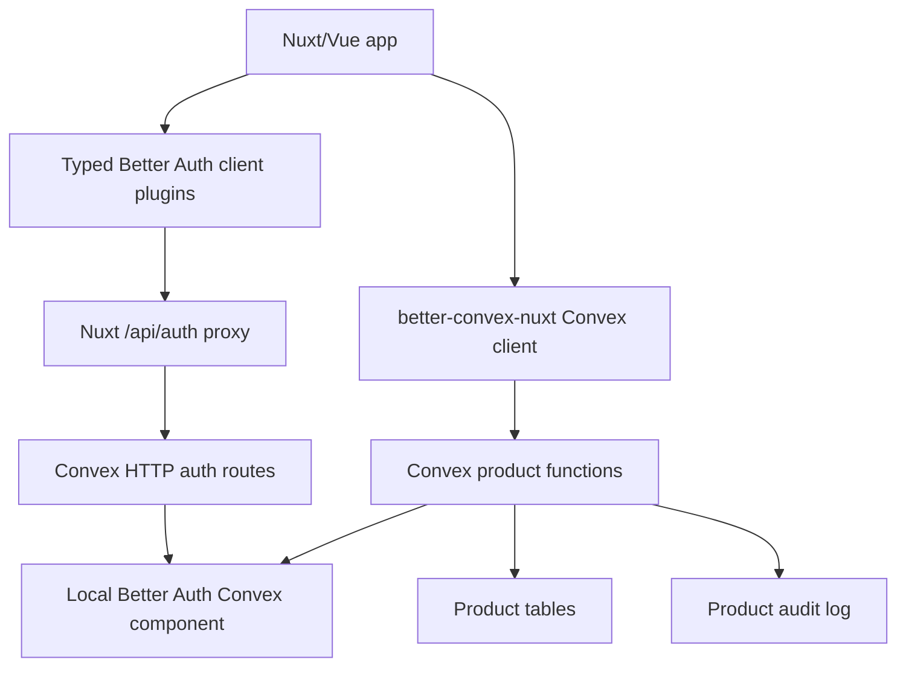

# Better Auth B2B Roadmap

## Purpose

This roadmap turns the research in `learnings.md` into an execution plan.

The goal is to find, through focused spikes, how far we can push a Nuxt/Vue + Convex + Better Auth architecture where Better Auth plugins do the auth-domain heavy lifting and Convex remains the product-domain source of truth.

The consolidated product direction now lives in `docs/content/docs/8.architecture/1.saas-kit-direction.md`. Treat that document as the canonical SaaS Kit architecture/RFC; keep this roadmap as the detailed research execution ledger.

## Non-Negotiables

- One source of truth per concept.
- Better Auth owns auth-domain state: users, sessions, organizations, members, invitations, API keys, and plugin-owned auth data.
- Convex app tables own product-domain state: projects, business records, product audit events, and product-specific workflows.
- Product authorization is enforced in Convex functions, not only in Nuxt UI.
- No app-owned mirrors of Better Auth organizations, memberships, invitations, roles, or API key secrets.
- No compatibility shims or dual paths in the greenfield starter. If we cut over, we delete the old path.
- Every plugin is proven by a spike before it becomes part of the recommended implementation.

## Target Architecture



The developer experience should feel like Vue/Nuxt:

```ts
const authClient = useB2BAuthClient()
await authClient.organization.create({ name, slug })
await authClient.organization.inviteMember({ organizationId, email, role })
```

Product writes stay Convex-native:

```ts
const createProject = useConvexMutation(api.projects.create)
await createProject({ organizationId, name })
```

## Final Verdict

- Core B2B organizations, teams, roles, invitations, and Convex-enforced product permissions are proven for the team starter.
- Better Auth remains the auth-domain source of truth. Convex app tables remain the product-domain source of truth.
- Organization and user API keys are usable with predefined Better Auth key configs. Raw organization deletion requires explicit API-key cleanup first.
- MFA, email OTP, magic links, and passkeys are proven as runtime capabilities. Starter-grade UI and real delivery/provider setup remain productization work.
- Stripe is partially proven with a local fake client and Better Auth-owned subscription rows. Real Stripe webhooks, portal, cancellation/restore, upgrade, and seat sync are not proven.
- SCIM is partially proven for GET/POST provisioning. Full lifecycle is blocked until Better Auth Convex routes can handle PUT/PATCH/DELETE.
- SSO is not a pure Convex starter feature today.
- OAuth/OIDC/MCP provider surfaces are advanced API-platform recipes only, not starter defaults.
- Raw organization deletion must not be exposed in the starter UI.

## Starter Defaults And Advanced Recipes

Starter defaults:

- Local Better Auth Convex component.
- Better Auth Organization with static roles and project permissions.
- Better Auth-owned org/member/invitation/team/teamMember state.
- App-owned `users` projection, `projects`, and `auditEvents` only.
- Convex product functions enforce authorization by asking Better Auth at request time.
- Organization deletion is not exposed in the starter UI.

Advanced recipes:

- Dynamic organization roles.
- Admin user management.
- User and organization API keys.
- Hardened auth: TOTP, email OTP, magic links, and passkeys.
- Stripe billing after real webhook lifecycle is proven.
- SCIM after route-method support is solved.
- OAuth/OIDC/MCP provider routes only with explicit token lifecycle and invalidation decisions.

Verified destructive organization deletion recipe:

1. Revoke/list-delete org-scoped API keys through Better Auth HTTP/client routes.
2. Enable `teams.allowRemovingAllTeams` for the deletion workflow.
3. Clear the deleting user's active team.
4. Remove all teams through Better Auth routes.
5. Delete the organization through Better Auth.
6. Treat stale session active org/team ids as display-only and always refetch current organization state before showing or authorizing product data.

## What We Already Know

### Feasible Now

- Local Better Auth Convex component.
- Better Auth `organization()` as canonical organization/member/invitation source.
- Better Auth `admin()` schema generation.
- Better Auth `apiKey()` schema generation.
- Typed client plugin DX through `createBetterConvexAuthClient()`.
- Static organization permissions via Better Auth `createAccessControl()`.
- Dynamic organization roles via Better Auth `dynamicAccessControl`.
- Organization teams through Better Auth `organization({ teams })`.
- Team-scoped product rows authorized from Better Auth `team` and `teamMember` component state.
- Organization-owned API key management through `@better-auth/api-key`.
- User-owned API key management through `@better-auth/api-key`.
- API-key-authenticated product HTTP routes with predefined API-key configurations.
- Convex product functions calling Better Auth permission APIs.
- Typed Nuxt client surface for organization, admin, API keys, SCIM, passkeys, two-factor, email OTP, magic link, and additional fields.

### Feasible-Looking, Needs Spikes

- Arbitrary per-key permission authoring from Convex mutations.
- OAuth Provider / MCP-style auth server capabilities.
- Real UI/productization for passkeys, two-factor recovery, magic link callbacks, email delivery, and provider-backed OAuth callbacks.
- Real Stripe billing lifecycle: network-backed checkout, webhooks, billing portal, cancellation/restore, and seat sync.

### Not Promised

- Enterprise SSO in pure Convex Better Auth. The official Convex integration currently marks SSO incompatible because it depends on Node.js.
- SCIM or full enterprise identity lifecycle. Treat as future enterprise integration research.
- `convex-authz` for the starter. It adds derived authorization tables, rebuild semantics, and a second authorization system.
- A complete billing system. Stripe is partially verified for local component schema, organization subscription listing, checkout creation, checkout-success activation, and Convex-enforced local project limits.

## Capability Decision Gates

Every capability must pass the same gate before it becomes part of the final implementation path.

1. Schema generates in a local Better Auth Convex component.
2. Required indexes are explicit and stable.
3. Better Auth endpoint works through the Nuxt auth proxy.
4. Typed client plugin methods work through `createBetterConvexAuthClient()`.
5. Convex JWT sync works across SSR, hydration, sign-in, sign-out, and token refresh.
6. Convex product functions can authorize against the capability.
7. Invariant tests cover failure modes, not just happy paths.
8. The capability does not introduce a second source of truth.

If any gate fails, we either drop the capability, move it to an external integration spike, or document the exact missing primitive.

## Phase 1: Local Component Foundation

### Goal

Make `starters/team` use a local Better Auth Convex component so schema-changing plugins can be used safely.

### Implementation

1. Add `convex/betterAuth/convex.config.ts`.
2. Add `convex/betterAuth/auth.ts` only for Better Auth schema generation.
3. Add `convex/betterAuth/adapter.ts`.
4. Generate `convex/betterAuth/schema.ts`.
5. Register the local component in `convex/convex.config.ts`.
6. Update `convex/auth.ts` to use `createAuthOptions(ctx)` and local schema typing.

### Acceptance

- `convex/betterAuth/schema.ts` is generated and committed.
- `authComponent` is typed with the local schema.
- Existing auth routes still work through `convex/http.ts`.
- Existing auth SSR and client token sync tests still pass.
- No team-domain behavior is changed yet.

### Final Use

This becomes the base for all advanced Better Auth plugin work.

## Phase 2: Organization Cutover

### Goal

Replace app-owned team tables with Better Auth Organization.

### Current Evidence

`experiments/better-auth-organization-plugin.md` proves the core auth-domain path:

- Better Auth Organization works only after moving to a local Better Auth Convex component.
- Organization, member, invitation, team, and teamMember rows are visible in component tables.
- Additional fields on organization/team/invitation persist through Better Auth HTTP routes.
- Organization/team updates, member role downgrade, member removal, team removal, and stale-session permission loss are verified through Better Auth HTTP routes plus Convex product authorization.
- Raw Better Auth organization deletion is verified as an unsafe destructive primitive for the starter: it removes `organization`, `member`, and `invitation` rows, but currently leaves `team` and `teamMember` rows, can leave stale active org/team ids on non-deleting sessions, and must not be exposed directly as the product deletion flow.
- Best-effort route-level team cleanup is also verified as insufficient with default Better Auth team settings: public routes can remove non-last teams and their `teamMember` rows, but `remove-team` refuses to remove the final team, so raw org deletion can still leave the last `team` and `teamMember`.
- Better Auth can remove every team through public routes when `teams.allowRemovingAllTeams` is enabled. This removes all `team` and `teamMember` rows before org deletion, but non-deleting sessions can still retain stale active org/team ids.
- Default role permissions and last-owner protection are enforced by Better Auth.
- App-owned organization/member/invitation tables have been removed from the team starter.
- `pnpm feedback:starter-ui-cutover` proves the visible Nuxt starter path now signs up through the UI, creates a Better Auth organization through the typed client, creates a product row through the real Convex `projects` API, signs out cleanly, and writes Better Auth organization/member rows plus app product/audit rows only.

This moves Phase 2 from "visible cutover proven" to "single source of truth cutover landed; keep invariants green while adding plugin capabilities".

### Implementation

1. Enable `organization()` in `convex/auth.ts`. Done.
2. Enable `organizationClient()` in a typed Nuxt composable. Done in `useTeamAuthClient()`.
3. Change the visible Nuxt organization create/list flow to Better Auth. Done.
4. Change product rows to reference Better Auth ids. Done for the real `projects` functions:
   - `projects.organizationId: v.string()`
   - `projects.createdByAuthUserId: v.string()`
5. Replace `requireOrgAccess()` with a Better Auth permission helper for product writes. Done for `projects`.
6. Delete app-owned `organizations`, `memberships`, `invitations`, old `projects`, and old `auditEvents`. Done.
7. Move membership history requirements into immutable product audit events, not membership rows.

### Acceptance

- Creating an organization through Better Auth allows project creation in Convex. Proven through browser UI.
- The visible Nuxt path writes Better Auth organization/member rows and product/audit rows only.
- No app-owned org/member/invitation tables remain.
- Non-members cannot create or list projects for an organization.
- Members without permission cannot create projects.
- Invitation acceptance creates Better Auth membership only.
- Removing a member removes future product access.
- Deleting an organization through product UI is disabled or routed through a verified cleanup flow; direct `/api/auth/organization/delete` is not enough while teams, sessions, and API keys can retain stale rows/state.
- Removing or demoting the only owner fails.
- Product audit events still write from Convex product mutations.

### Final Use

If this passes, Better Auth Organization becomes the canonical B2B team foundation.

## Phase 3: Static Product Permissions

### Goal

Use Better Auth Organization permissions for product actions while keeping enforcement in Convex.

### Current Evidence

`pnpm feedback:better-auth-product-authz` proves this path in experiment form:

- Better Auth roles can include a custom `project` permission resource.
- Convex mutations can call `auth.api.hasPermission()`.
- Owner/member can create product rows.
- Viewer can read but cannot create product rows.
- Outsider cannot read or create product rows.
- Product rows can store Better Auth ids as strings.
- App-owned org/member mirrors no longer exist; product rows store Better Auth ids as strings.

### Implementation

1. Define a small product permission set:

```ts
project: ['create', 'read', 'update', 'delete']
```

2. Define static roles with `createAccessControl()`.
3. Pass the same `ac` and roles to server and client organization plugins.
4. Add a Convex helper:

```ts
const { auth, headers } = await authComponent.getAuth(createAuth, ctx)
const allowed = await auth.api.hasPermission({
  headers,
  body: { organizationId, permissions: { project: ['create'] } },
})
```

### Acceptance

- Owner/admin/member/viewer behavior is tested.
- Backend rejects unauthorized product writes.
- Frontend permission helpers are display-only.
- No JWT claim is used as authoritative role state.

### Final Use

Static Better Auth permissions become the default authorization model for the starter.

## Phase 4: Admin and API Keys

### Goal

Prove Better Auth can cover admin user management and API keys without app-owned mirrors.

### Current Evidence

`pnpm feedback:better-auth-admin` proves Better Auth Admin works in deployment-backed experiment form:

- `admin()` adds `user.role`, `user.banned`, `user.banReason`, `user.banExpires`, and `session.impersonatedBy` to the local component schema.
- A local-only `BETTER_AUTH_ADMIN_USER_IDS` bootstrap can identify the first admin without an app-owned admin table.
- Non-admin users cannot call admin list APIs.
- Admin users can list users, create users, set roles, ban users, unban users, impersonate users, and stop impersonating.
- Ban state blocks email/password sign-in and unban restores sign-in.
- App `organizations` and `memberships` remain empty; app `users` remains only a projection.

`pnpm feedback:better-auth-api-keys` proves organization-owned API key management in experiment form:

- API Key is a separate package, `@better-auth/api-key`, not an export from `better-auth/plugins` in the installed package.
- The local component schema generates `apikey`.
- The schema wrapper needs explicit `apikey` indexes for `key`, `expiresAt`, `referenceId`, and `configId_referenceId`.
- Owner can create, list, update, and delete organization-owned API keys.
- Member with `apiKey.read` can list but cannot create organization-owned keys.
- Viewer and outsider access is rejected by Better Auth organization permissions.
- Raw secrets are returned once on create and are not stored directly in the component table.
- Server-side Convex code can call `auth.api.verifyApiKey()`.

`pnpm feedback:better-auth-user-api-keys` proves user-owned service-key management in experiment form:

- A `user-keys` configuration can use the plugin's default user reference mode.
- A signed-in user can create, list, verify, and delete their own API key.
- Another signed-in user lists zero keys and cannot delete the owner's key.
- Raw secrets are returned once on create and are not stored directly in the component table.
- Server-side Convex code can call `auth.api.verifyApiKey()` for user-owned keys.
- App-owned organization and membership mirrors are not present.

`pnpm feedback:better-auth-api-key-product-route` proves API-key-authenticated product writes:

- Better Auth API-key configurations can define default product permissions.
- Writer keys with `project.create` can create product rows through a Convex HTTP route.
- Reader keys without `project.create` are rejected.
- Keys cannot be used against a different organization.
- Product audit rows can identify actors as `apiKey:<apiKeyId>`.

`pnpm feedback:better-auth-api-key-lifecycle` proves a lifecycle limit:

- Better Auth org-scoped API keys can remain valid after the referenced organization is deleted.
- Organization deletion removes Better Auth `organization` and `member` rows, but not `apikey`.
- Product routes must check Better Auth organization existence before accepting an API key write.
- The current `/api/projects` route rejects surviving keys for deleted organizations.

`pnpm feedback:better-auth-api-key-safe-org-delete` proves the safer route-level deletion recipe:

- A Convex mutation that tries to call Better Auth server-side `listApiKeys()` / `deleteApiKey()` for org keys currently fails with `dynamic module import unsupported` inside the API-key plugin permission check.
- Better Auth HTTP/client routes can list and delete all known org-scoped key configurations before organization deletion.
- After route-level key deletion, raw org/user writer/reader keys no longer verify, component `apikey` rows are gone, and Better Auth organization deletion removes `organization` and `member` rows.
- Product history remains as normal app `projects` and `auditEvents` rows.

Current limit:

- HTTP `POST /api/auth/api-key/verify` returns 404 in the current Convex route setup.
- The final product/API route should verify keys server-side in Convex unless we intentionally change auth route exposure.
- `pnpm feedback:better-auth-api-key-warning-limit` confirms API-key list/delete management routes currently log Convex "unawaited operation" warnings from the plugin cleanup path.
- The installed `@better-auth/api-key@1.6.20` package calls `deleteAllExpiredApiKeys(ctx.context)` without awaiting it from several management routes, and its public options do not expose a switch to disable that cleanup call.
- Treat the warning as a production-readiness issue requiring upstream fix, accepted warning, or explicit operational decision; do not add an app-owned API-key mirror or route fork to hide it.
- Creating an org API key with arbitrary `permissions` from a Convex mutation fails with `dynamic module import unsupported`; prefer predefined key configs until that upstream/runtime issue is understood.
- Raw org deletion does not clean up org-scoped API keys, Better Auth teams, Better Auth team members, or every stale active org/team session field. Public Better Auth routes can clean up all team rows only when `teams.allowRemovingAllTeams` is enabled; default settings clean up non-last teams only. Production UI should keep organization deletion disabled until the final recipe revokes API keys, removes all teams with the Better Auth option enabled, deletes the organization, and treats stale session active ids as display-only.

### Implementation

1. Enable `admin()`.
2. Enable `apiKey()` from `@better-auth/api-key`.
3. Regenerate local component schema.
4. Add client plugins for admin and API key APIs.
5. Use user-owned API keys for personal/service keys when a human owner is the correct reference.
6. Use organization-owned API keys for org-scoped integrations when org membership permissions are required.
7. Verify API-key-authenticated Convex/server routes can resolve the correct subject and organization context.

### Acceptance

- Generated schema contains admin user fields and `apikey`.
- Typed client exposes `admin` and `apiKey` namespaces.
- Admin operations work through the Nuxt auth proxy.
- API keys can be created, listed, revoked, and checked; server-side verification works, while server-side org-key list/delete cleanup is currently blocked by the API-key plugin's dynamic import path in the Convex runtime.
- Organization API key management follows Better Auth organization permissions.
- API key secrets are never copied into app tables.
- HTTP key verification is either intentionally exposed or explicitly not part of the public auth route surface.
- API-key management routes do not emit unresolved async-operation warnings in production mode, or the warning is traced to a harmless upstream cleanup behavior with an accepted mitigation.
- API key scopes are represented by predefined configurations. Arbitrary per-key permission writes and server-side org-key cleanup remain blocked by the same dynamic-import runtime issue.

### Final Use

Admin and API Key become advanced B2B starter features if all acceptance checks pass.

## Phase 5: Dynamic Roles and Teams

### Goal

Find whether Better Auth dynamic roles and teams are worth productizing.

### Current Evidence

`pnpm feedback:better-auth-dynamic-roles` proves dynamic roles in experiment form:

- Enabling `dynamicAccessControl` generates component table `organizationRole`.
- The local component schema can add an explicit `organizationId_role` index.
- Owner can create, list, update, and assign dynamic roles through Better Auth HTTP routes.
- Invalid permission resources are rejected.
- Members without `ac.create` cannot create roles.
- Assigned dynamic roles cannot be deleted.
- Role permission changes immediately affect Convex product authorization through `auth.api.hasPermission()`.
- App-owned organization and membership mirrors are not present.

`pnpm feedback:better-auth-org-teams` proves teams in deployment-backed experiment form:

- Better Auth creates and owns `team` and `teamMember` rows, including the default owner team created with an organization.
- Team-scoped invitations create `teamMember` rows on acceptance.
- Org-only members can have project permissions but still fail team-scoped product writes when they lack a Better Auth `teamMember` row.
- Cross-team reads fail for a member who belongs to a different team.
- Convex product rows can reference `teamId` as product data without mirroring the team itself.
- App-owned organization, membership, and team mirrors are not present.

### Implementation

1. Keep `dynamicAccessControl` out of the basic starter until the cutover is stable.
2. Productize dynamic roles as an advanced recipe or starter variant.
3. Add a role-management UI only after defining naming, permission, and audit policies.
4. Keep teams opt-in and productize only when product records need a team boundary distinct from the organization.
5. Measure table/index complexity and UI complexity before adding visible team UI.

### Acceptance

- Dynamic roles work through the Convex local component.
- Role changes immediately affect Convex product authorization.
- No extra app-owned role tables are needed.
- Role-management UI handles failed operations from Better Auth instead of duplicating policy.
- Teams model a real product requirement distinct from organizations.
- Team-scoped product writes/read paths reject org members outside the team.
- Added complexity is justified by tests and UX.

### Final Use

Static roles stay default. Dynamic roles and teams are verified as opt-in advanced patterns. Teams should be enabled only for products that need a real team-scoped data boundary.

## Phase 6: Auth Hardening

### Goal

Prove security plugins work without breaking SSR or Convex token sync.

### Candidates

- Two factor.
- Passkeys.
- Magic link.
- Email OTP.
- Generic OAuth.

### Current Evidence

`pnpm feedback:better-auth-two-factor` proves TOTP-based 2FA works in deployment-backed experiment form:

- `twoFactor()` adds `user.twoFactorEnabled` and component table `twoFactor`.
- TOTP enrollment creates an unverified `twoFactor` row and returns backup codes once.
- Raw backup codes are not stored directly in the component table.
- TOTP verification marks the row verified and sets `user.twoFactorEnabled`.
- Email/password sign-in is gated with `twoFactorRedirect` and `twoFactorMethods: ["totp"]`.
- Backup code verification completes a challenged sign-in and updates stored backup codes.
- Reusing the same backup code is rejected.
- Disabling 2FA deletes the `twoFactor` row and clears `user.twoFactorEnabled`.

`pnpm feedback:better-auth-email-otp` proves email OTP works in deployment-backed experiment form:

- The plugin reuses Better Auth's `verification` component table and does not need a new app table.
- Local deterministic OTP generation works only when `ALLOW_TEST_RESET=true`.
- OTP delivery is guarded so non-local deployments fail instead of silently using a fake sender.
- `storeOTP: "hashed"` keeps raw OTPs out of the component table.
- Sign-in OTP can auto-create a verified passwordless user.
- Reusing the consumed sign-in OTP is rejected.
- Email-verification OTP marks an existing password user as verified.
- Sign-in and email-verification OTP rows are consumed after success.

`pnpm feedback:better-auth-magic-link` proves magic link works in deployment-backed experiment form:

- The plugin reuses Better Auth's `verification` component table and does not need a new app table.
- Local deterministic magic-link token generation is configured only when `ALLOW_TEST_RESET=true`.
- Magic-link delivery is guarded so non-local deployments fail instead of silently using a fake sender.
- `storeToken: "hashed"` keeps the raw magic-link token out of the component table.
- Magic-link verification can auto-create a verified user and session.
- Reusing the consumed magic-link token redirects with `INVALID_TOKEN`.
- The verification row is consumed after success.

`pnpm feedback:better-auth-session-lifecycle` proves Better Auth session invalidation is visible to Convex product authorization:

- One user can hold two active Better Auth sessions.
- Both session tokens can authorize Convex product writes before revocation.
- The local schema wrapper needs `session.userId_expiresAt` for active-session listing.
- `revoke-session` deletes the secondary session row.
- The revoked secondary token fails product authorization as unauthenticated.
- The primary token remains valid after revoking the secondary session.
- `sign-out` deletes the primary session row.
- The signed-out primary token fails product authorization as unauthenticated.
- `get-session` returns `null` after sign-out.
- Auth-domain rows and product audit rows remain intact without app-owned organization/member mirrors.

`pnpm feedback:better-auth-user-additional-fields` proves Better Auth core user additional fields work in the local component:

- Better Auth `user.additionalFields` stores `locale`, `timezone`, and `marketingOptIn` in the component `user` table.
- `get-session` returns those fields through the Better Auth session API.
- The typed Nuxt client includes `inferAdditionalFields<AppAuth>()`, so the fields are checked by `pnpm typecheck`.
- The app `users` projection intentionally does not mirror those fields, keeping Better Auth as the source of truth for auth/session profile data.
- Use this for session/profile fields, not product authorization, organization membership, or business invariants.

`pnpm feedback:better-auth-member-additional-fields` proves Better Auth Organization member additional fields work through the server-side add-member path:

- `member.additionalFields` stores `title`, `department`, and `billable` on component `member`.
- Public HTTP `/organization/add-member` is not exposed in this setup and returns 404.
- A guarded Convex mutation can call Better Auth server-side `auth.api.addMember` with those fields when adding an existing user to an organization.
- The server-side call can assign the member to a team.
- `/organization/update-member-role` remains role-only; extra profile fields passed to it are ignored and the original member profile fields are preserved.
- App-owned `memberships` remains empty, so Better Auth stays the membership source of truth.
- Use this for lightweight membership profile data. Use product tables for mutable HR/profile workflows until a Better Auth member-profile update endpoint is proven.

Current limit:

- The feedback script waits around Better Auth's 2FA route rate limit. Product UX should avoid rapid repeated 2FA endpoint calls.
- Real email delivery is not configured; the current OTP and magic-link senders are local-only test scaffolding.
- Passkey browser WebAuthn registration/sign-in is proven with `@better-auth/passkey@1.6.20` and a Chromium virtual authenticator; real-device UX and starter UI are not proven yet.

### Acceptance

- Schema generation works when needed.
- Sign-in/sign-up flows work through the Nuxt auth proxy.
- Convex JWT refresh remains stable.
- SSR does not flash incorrect auth state.
- Sign-out does not produce repeated `/convex/token` 401s. Backend session invalidation is proven; browser-backed Nuxt SSR/hydration behavior still needs a UI check after the client cutover.

### Final Use

Successful plugins become documented recipes or hardened starter variants.

## Phase 7: OAuth Provider and MCP/API Platform

### Goal

Find whether Better Auth OAuth Provider can run cleanly in the Convex component runtime.

Current package-surface evidence:

- `oidcProvider()`, `deviceAuthorization()`, `genericOAuth()`, `mcp()`, and `oAuthProxy()` are available from the installed `better-auth@1.6.20` package.
- `@better-auth/oauth-provider` is not installed in the starter.
- Deprecated `oidcProvider()` is runtime-verified with the local Convex component for dynamic client registration, consent, authorization-code token exchange, and userinfo.
- `deviceAuthorization()` is runtime-verified with the local Convex component for device-code approval/denial and session creation.
- Device-issued Better Auth session tokens are runtime-verified against Convex product authorization: a member token can create, then loses create/read access as Better Auth role and membership state changes.
- `mcp()` is runtime-verified with the local Convex component in isolated mode for OAuth discovery, protected-resource metadata, dynamic client registration, consent, authorization-code token exchange, and `/mcp/get-session`.
- `genericOAuth()` is runtime-verified with the local Convex component for OAuth state creation, callback handling, Better Auth `account` linking, user/session creation, state replay rejection, and app `users` projection.
- `oAuthProxy()` plus `genericOAuth()` is expected-limit verified: the proxy encrypts state and rewrites the callback URL, but Generic OAuth still returns to `/oauth2/callback/:providerId`, which does not decrypt proxy state and fails with `state_mismatch`.
- Product-route authorization from OIDC and MCP access tokens is runtime-verified with explicit route logic: component `oauthAccessToken` lookup, `project:create` scope enforcement, component `member` lookup, product write, and audit write.
- OIDC and MCP refresh grants are runtime-verified, but current behavior is not strict refresh-token rotation: old access tokens remain valid, old refresh tokens remain reusable, and component token rows accumulate.
- OIDC/MCP revocation and introspection endpoints are absent in the currently installed plugin surfaces.
- OIDC/MCP client credentials are expected-limit verified: discovery omits `client_credentials`, registration accepts the grant metadata, token endpoints reject it with `invalid_request` / `code is required`, and no token rows are created.
- Current MCP limits: `mcp()` conflicts with deprecated `oidcProvider()` on `POST /oauth2/consent` when both are enabled; advertised `/mcp/userinfo` and `/mcp/jwks` return 404; dynamic MCP client secrets are stored raw.

### Implementation

1. Keep deprecated `oidcProvider()` experiment-gated unless it becomes a real API-platform requirement.
2. Verify the Nuxt proxy/callback UX against the metadata URLs emitted from `SITE_URL`.
3. Keep OAuth/MCP token product routes as explicit recipe code unless Better Auth adds a first-class permission API for OAuth access tokens.
4. Keep service integrations on Better Auth API keys unless a replacement OAuth Provider proves real client-credentials support.
5. Do not expose OAuth/MCP bearer routes as a high-security public API boundary without an explicit invalidation/cleanup strategy or an upstream provider that supports revocation/introspection.
6. Keep MCP isolated behind `BETTER_AUTH_PLATFORM_EXPERIMENT=mcp` unless a product explicitly needs agent/API platform auth and the missing endpoint/secret-storage story is resolved.
7. Re-check `@better-auth/oauth-provider` availability before turning this into a long-lived recipe.
8. Add a Nuxt device verification page only if CLI/TV/device login is a real product requirement.
9. Treat generic OAuth as a provider-specific recipe: keep provider credentials/config in Better Auth, keep provider account links in Better Auth `account`, and avoid app-owned social-account mirrors.
10. Do not recommend `oAuthProxy()` for Generic OAuth preview deployments unless upstream adds proxy handling for `/oauth2/callback/:providerId` or a built-in social provider spike proves the intended path.

### Acceptance

- Runtime works in Convex without Node-only APIs.
- Tokens can authorize product/server routes.
- Generated schema and indexes are stable.
- No external auth database is introduced.
- The chosen provider path is not already deprecated or has a documented replacement plan.

### Final Use

If it passes, this becomes the path for API-platform and agent-oriented apps. If it fails, document the runtime blocker.

## Phase 8: Enterprise Identity

### Goal

Decide whether enterprise SSO/SCIM can fit this architecture.

### Current Finding

Do not build SSO ourselves now. Better Auth SSO is currently marked incompatible with Convex + Better Auth because of Node.js dependencies. SCIM is a separate enterprise plugin surface. `@better-auth/scim` now installs and partially runs against the local Convex component, but it is not ready for starter recommendation because the current Convex Better Auth route helper does not expose SCIM-required PUT/PATCH/DELETE routes.

Local package-surface evidence:

- `better-auth/plugins/sso`, `better-auth/plugins/scim`, `better-auth/plugins/saml`, `@better-auth/sso`, and `@better-auth/saml` are not available in the starter install.
- `@better-auth/scim@1.6.20` is installed as a separate package and exposes `scim()` plus `scimClient()`.
- `pnpm feedback:better-auth-scim` proves SCIM metadata, org-scoped token generation, personal token rejection, hashed `scimProvider.scimToken` storage, SCIM user provisioning, Better Auth `account` linking, Better Auth `member` creation, and no app-owned membership mirror.
- The same probe proves current PUT/PATCH/DELETE SCIM routes return 404 before Better Auth handles them because `@convex-dev/better-auth` route registration currently registers only GET/POST for `/api/auth/*`.
- SSO remains outside the starter implementation. SCIM remains an enterprise compatibility track until route-method support is solved and update/deprovision lifecycle is verified.

### Spike Options

1. Wait for Better Auth or Convex integration support to change.
2. Test an external specialist provider such as WorkOS, Auth0, Stytch, Clerk, or another identity service.
3. Test whether an external Node auth boundary can issue identity that Convex trusts without creating a second team/membership source of truth.

### Stop Conditions

- Requires dual auth databases.
- Requires mirrored memberships.
- Requires product authorization outside Convex.
- Requires custom SAML implementation.

### Final Use

Enterprise SSO remains a future integration track. SCIM is a partial compatibility spike, not part of the starter or core implementation until route-method support and full lifecycle behavior are verified.

## Phase 9: Billing and Subscriptions

### Goal

Find whether Better Auth can own billing-domain subscription state while Convex app tables keep product entitlements and usage enforcement.

### Current Evidence

`pnpm feedback:better-auth-stripe` proves a narrow but useful Stripe boundary:

- `@better-auth/stripe@1.6.20` and `stripe@22.x` install in the team starter.
- The local Better Auth Convex component schema generates `subscription` plus `stripeCustomerId` fields on Better Auth `user` and `organization`.
- The component schema needs explicit `subscription` indexes for `referenceId`, `referenceId_status`, `stripeCustomerId`, and `stripeSubscriptionId`.
- Better Auth Organization can remain the organization source of truth; no app-owned billing organization mirror is needed.
- An organization owner can call Better Auth `GET /subscription/list` for `customerType=organization`.
- An outsider is rejected by the plugin `authorizeReference` callback.
- Checkout start through `POST /subscription/upgrade` creates a Better Auth `subscription` row with status `incomplete`.
- Checkout success through `GET /subscription/success` activates that row, stores `stripeSubscriptionId`, period timestamps, billing interval, and seat count, and makes the row appear in the active subscription list with configured plan limits.
- Convex product logic can reject writes before checkout activation, allow exactly the configured project limit after activation, and reject the next write by reading the active Better Auth `subscription` row.
- The Stripe path does not create app-owned billing rows. Product entitlements write normal app `projects` and `auditEvents` rows only.

### Current Limits

- The probe uses a local fake Stripe client and does not make real Stripe network calls.
- The checkout proof uses a local fake Stripe client and does not make real Stripe network calls.
- Stripe webhook verification and webhook-driven subscription lifecycle writes are not proven.
- Billing portal, cancellation, restore, and upgrade flows are not proven.
- Seat sync on member changes is not proven.
- The proven plan-limit path uses a local fake Stripe client and one shared Convex plan definition; real Stripe price/product metadata and webhook-driven plan changes are not proven.

### Implementation Direction

1. Keep `@better-auth/stripe` experiment-gated until real Stripe and webhook paths pass.
2. Let Better Auth own Stripe customer ids and subscription records.
3. Keep product entitlements as Convex-enforced product logic, derived from Better Auth subscription state only through explicit functions.
4. Do not add app-owned subscription mirrors unless there is a rebuildable, tested read model requirement.

### Acceptance

- Real Stripe checkout creates the expected Stripe customer and Better Auth `subscription` row.
- Webhooks update/cancel subscription rows idempotently.
- Organization owners can manage billing; outsiders and removed members cannot.
- Product Convex functions enforce plan limits from Better Auth subscription state.
- Reset/inspect scripts prove all billing rows are visible and resettable.

### Final Use

If the full path passes, Stripe becomes an advanced B2B recipe. It should not become a base starter default until real Stripe webhooks, cancellation/restore, seat sync, and real provider behavior are proven.

## Final Implementation Path

If the phases pass, the final implementation should be:

1. Local Better Auth Convex component.
2. Better Auth Organization as canonical team model.
3. Static Better Auth organization permissions for product authorization.
4. Convex product tables referencing Better Auth ids as strings.
5. Convex product functions enforcing permissions with Better Auth APIs.
6. Product audit logs for product events and optional membership history.
7. Typed Nuxt composables wrapping `createBetterConvexAuthClient()` for plugin APIs.
8. Optional advanced modules for Admin, API Key, hardened auth, dynamic roles, teams, OAuth Provider, and Stripe only after their spikes pass.

## What We Should Not Build

- Custom enterprise SSO.
- App-owned organization/member/invitation mirrors.
- A second authorization engine for the starter.
- Generic compatibility layers for hypothetical future plugins.
- Public bridge exports unless a real plugin spike requires them.
- Derived role/member projections without a rebuild story and invariant tests.

## Immediate Next Actions

1. Keep the verification loop green after each plugin spike.
2. Spike remaining auth-hardening productization next: passkey starter UI/real-device UX, provider-backed generic OAuth callback UX, delivery-backed email flows, and recovery UX.
3. Decide explicit production semantics for organization deletion and org-scoped API keys.
4. Continue Stripe billing with real checkout, webhook lifecycle, billing portal, cancellation/restore, and seat-sync spikes before recommending it as a recipe.
5. Update docs from passing implementation evidence, not from guesses.
