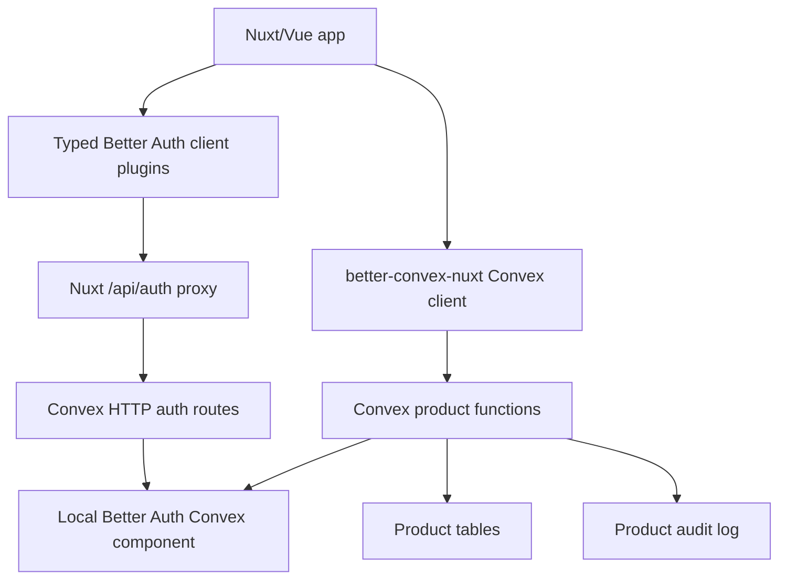

# Better Auth B2B Roadmap

## Purpose

This roadmap turns the research in `learnings.md` into an execution plan.

The goal is to find, through focused spikes, how far we can push a Nuxt/Vue + Convex + Better Auth architecture where Better Auth plugins do the auth-domain heavy lifting and Convex remains the product-domain source of truth.

## Non-Negotiables

- One source of truth per concept.
- Better Auth owns auth-domain state: users, sessions, organizations, members, invitations, API keys, and plugin-owned auth data.
- Convex app tables own product-domain state: projects, business records, product audit events, and product-specific workflows.
- Product authorization is enforced in Convex functions, not only in Nuxt UI.
- No app-owned mirrors of Better Auth organizations, memberships, invitations, roles, or API key secrets.
- No compatibility shims or dual paths in the greenfield starter. If we cut over, we delete the old path.
- Every plugin is proven by a spike before it becomes part of the recommended implementation.

## Target Architecture



The developer experience should feel like Vue/Nuxt:

```ts
const authClient = useB2BAuthClient()
await authClient.organization.create({ name, slug })
await authClient.organization.inviteMember({ organizationId, email, role })
```

Product writes stay Convex-native:

```ts
const createProject = useConvexMutation(api.projects.create)
await createProject({ organizationId, name })
```

## What We Already Know

### Feasible Now

- Local Better Auth Convex component.
- Better Auth `organization()` as canonical organization/member/invitation source.
- Better Auth `admin()` schema generation.
- Better Auth `apiKey()` schema generation.
- Typed client plugin DX through `createBetterConvexAuthClient()`.
- Static organization permissions via Better Auth `createAccessControl()`.
- Convex product functions calling Better Auth permission APIs.

### Feasible-Looking, Needs Spikes

- Organization-owned API keys.
- Dynamic organization roles.
- Organization teams.
- Two-factor, passkey, magic link, and email OTP flows.
- OAuth Provider / MCP-style auth server capabilities.
- Billing plugins such as Stripe.

### Not Promised

- Enterprise SSO in pure Convex Better Auth. The official Convex integration currently marks SSO incompatible because it depends on Node.js.
- SCIM or full enterprise identity lifecycle. Treat as future enterprise integration research.
- `convex-authz` for the starter. It adds derived authorization tables, rebuild semantics, and a second authorization system.

## Capability Decision Gates

Every capability must pass the same gate before it becomes part of the final implementation path.

1. Schema generates in a local Better Auth Convex component.
2. Required indexes are explicit and stable.
3. Better Auth endpoint works through the Nuxt auth proxy.
4. Typed client plugin methods work through `createBetterConvexAuthClient()`.
5. Convex JWT sync works across SSR, hydration, sign-in, sign-out, and token refresh.
6. Convex product functions can authorize against the capability.
7. Invariant tests cover failure modes, not just happy paths.
8. The capability does not introduce a second source of truth.

If any gate fails, we either drop the capability, move it to an external integration spike, or document the exact missing primitive.

## Phase 1: Local Component Foundation

### Goal

Make `starters/team` use a local Better Auth Convex component so schema-changing plugins can be used safely.

### Implementation

1. Add `convex/betterAuth/convex.config.ts`.
2. Add `convex/betterAuth/auth.ts` only for Better Auth schema generation.
3. Add `convex/betterAuth/adapter.ts`.
4. Generate `convex/betterAuth/schema.ts`.
5. Register the local component in `convex/convex.config.ts`.
6. Update `convex/auth.ts` to use `createAuthOptions(ctx)` and local schema typing.

### Acceptance

- `convex/betterAuth/schema.ts` is generated and committed.
- `authComponent` is typed with the local schema.
- Existing auth routes still work through `convex/http.ts`.
- Existing auth SSR and client token sync tests still pass.
- No team-domain behavior is changed yet.

### Final Use

This becomes the base for all advanced Better Auth plugin work.

## Phase 2: Organization Cutover

### Goal

Replace app-owned team tables with Better Auth Organization.

### Implementation

1. Enable `organization()` in `convex/auth.ts`.
2. Enable `organizationClient()` in a typed Nuxt composable, for example `useB2BAuthClient()`.
3. Delete app-owned `organizations`, `memberships`, and `invitations`.
4. Change product rows to reference Better Auth ids:
   - `projects.organizationId: v.string()`
   - `projects.createdByAuthUserId: v.string()`
5. Replace `requireOrgAccess()` with a Better Auth permission helper.
6. Move membership history requirements into immutable product audit events, not membership rows.

### Acceptance

- No app-owned org/member/invitation tables remain.
- Creating an organization through Better Auth allows project creation in Convex.
- Non-members cannot create or list projects for an organization.
- Members without permission cannot create projects.
- Invitation acceptance creates Better Auth membership only.
- Removing a member removes future product access.
- Removing or demoting the only owner fails.
- Product audit events still write from Convex product mutations.

### Final Use

If this passes, Better Auth Organization becomes the canonical B2B team foundation.

## Phase 3: Static Product Permissions

### Goal

Use Better Auth Organization permissions for product actions while keeping enforcement in Convex.

### Implementation

1. Define a small product permission set:

```ts
project: ['create', 'read', 'update', 'delete']
```

2. Define static roles with `createAccessControl()`.
3. Pass the same `ac` and roles to server and client organization plugins.
4. Add a Convex helper:

```ts
const { auth, headers } = await authComponent.getAuth(createAuth, ctx)
const allowed = await auth.api.hasPermission({
  headers,
  body: { organizationId, permissions: { project: ['create'] } },
})
```

### Acceptance

- Owner/admin/member/viewer behavior is tested.
- Backend rejects unauthorized product writes.
- Frontend permission helpers are display-only.
- No JWT claim is used as authoritative role state.

### Final Use

Static Better Auth permissions become the default authorization model for the starter.

## Phase 4: Admin and API Keys

### Goal

Prove Better Auth can cover admin user management and API keys without app-owned mirrors.

### Implementation

1. Enable `admin()`.
2. Enable `apiKey()`.
3. Regenerate local component schema.
4. Add client plugins for admin and API key APIs.
5. Spike user-owned API keys.
6. Spike organization-owned API keys.
7. Verify API-key-authenticated Convex/server routes can resolve the correct subject and organization context.

### Acceptance

- Generated schema contains admin user fields and `apikey`.
- Typed client exposes `admin` and `apiKey` namespaces.
- Admin operations work through the Nuxt auth proxy.
- API keys can be created, listed, revoked, and checked.
- Organization API key management follows Better Auth organization permissions.
- API key secrets are never copied into app tables.

### Final Use

Admin and API Key become advanced B2B starter features if all acceptance checks pass.

## Phase 5: Dynamic Roles and Teams

### Goal

Find whether Better Auth dynamic roles and teams are worth productizing.

### Implementation

1. Enable `organization({ dynamicAccessControl })` in a spike branch.
2. Generate and inspect `organizationRole` schema.
3. Test create/update/delete role flows.
4. Test assigning dynamic roles to members.
5. Enable `teams` only in a separate spike.
6. Measure table/index complexity and UI complexity.

### Acceptance

- Dynamic roles work through Convex local component.
- Role changes immediately affect Convex product authorization.
- No extra app-owned role tables are needed.
- Teams model a real product requirement distinct from organizations.
- Added complexity is justified by tests and UX.

### Final Use

Static roles stay default. Dynamic roles and teams become opt-in advanced patterns only if the spikes prove they are stable and useful.

## Phase 6: Auth Hardening

### Goal

Prove security plugins work without breaking SSR or Convex token sync.

### Candidates

- Two factor.
- Passkeys.
- Magic link.
- Email OTP.
- Generic OAuth.

### Acceptance

- Schema generation works when needed.
- Sign-in/sign-up flows work through the Nuxt auth proxy.
- Convex JWT refresh remains stable.
- SSR does not flash incorrect auth state.
- Sign-out does not produce repeated `/convex/token` 401s.

### Final Use

Successful plugins become documented recipes or hardened starter variants.

## Phase 7: OAuth Provider and MCP/API Platform

### Goal

Find whether Better Auth OAuth Provider can run cleanly in the Convex component runtime.

### Implementation

1. Enable the OAuth Provider plugin in a spike.
2. Generate schema.
3. Test authorization code flow.
4. Test client credentials flow if supported.
5. Test JWKS, token introspection, and revocation.
6. Test MCP-style protected resource metadata if relevant.

### Acceptance

- Runtime works in Convex without Node-only APIs.
- Tokens can authorize product/server routes.
- Generated schema and indexes are stable.
- No external auth database is introduced.

### Final Use

If it passes, this becomes the path for API-platform and agent-oriented apps. If it fails, document the runtime blocker.

## Phase 8: Enterprise Identity

### Goal

Decide whether enterprise SSO/SCIM can fit this architecture.

### Current Finding

Do not build SSO ourselves now. Better Auth SSO is currently marked incompatible with Convex + Better Auth because of Node.js dependencies.

### Spike Options

1. Wait for Better Auth or Convex integration support to change.
2. Test an external specialist provider such as WorkOS, Auth0, Stytch, Clerk, or another identity service.
3. Test whether an external Node auth boundary can issue identity that Convex trusts without creating a second team/membership source of truth.

### Stop Conditions

- Requires dual auth databases.
- Requires mirrored memberships.
- Requires product authorization outside Convex.
- Requires custom SAML implementation.

### Final Use

Enterprise SSO remains a future integration track, not part of the starter or core implementation.

## Final Implementation Path

If the phases pass, the final implementation should be:

1. Local Better Auth Convex component.
2. Better Auth Organization as canonical team model.
3. Static Better Auth organization permissions for product authorization.
4. Convex product tables referencing Better Auth ids as strings.
5. Convex product functions enforcing permissions with Better Auth APIs.
6. Product audit logs for product events and optional membership history.
7. Typed Nuxt composables wrapping `createBetterConvexAuthClient()` for plugin APIs.
8. Optional advanced modules for Admin, API Key, hardened auth, dynamic roles, teams, and OAuth Provider only after their spikes pass.

## What We Should Not Build

- Custom enterprise SSO.
- App-owned organization/member/invitation mirrors.
- A second authorization engine for the starter.
- Generic compatibility layers for hypothetical future plugins.
- Public bridge exports unless a real plugin spike requires them.
- Derived role/member projections without a rebuild story and invariant tests.

## Immediate Next Actions

1. Establish the verification loop from `verification-loop.md`.
2. Create the Phase 1 local component branch.
3. Convert `starters/team` through Phase 2.
4. Add invariant tests for organization cutover and product authorization.
5. Run the Admin + API Key spike only after organization cutover is green.
6. Update docs from the passing implementation, not from guesses.
