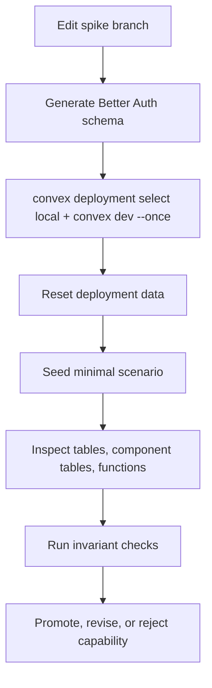

# Convex Experiment Verification Loop

## Goal

Before changing `starters/team`, we need a repeatable loop that proves what is deployed, what tables exist, what data exists, what functions are callable, and whether Better Auth plugin behavior works against a real Convex deployment.

The loop must support:

- Fast deterministic tests.
- Fresh local deployment setup.
- Explicit reset/seed steps.
- Component table inspection.
- Function metadata inspection.
- Auth route and token checks.
- No guessing from generated files alone.

## Recommendation

Use three layers together:

1. `convex-test` for fast invariant tests.
2. Convex CLI scripts for deployment reset, push, seed, function calls, and data inspection.
3. Convex MCP for interactive inspection by agents once the local deployment exists.

Do not rely on the `/convex` plugin alone. In this Codex thread, the available Convex plugin is guidance-only; it does not expose live deployment tools like `tables`, `data`, `run`, or `logs`.

Set up the real Convex MCP server for deployment inspection:

```bash
npx -y convex@latest mcp start --project-dir /Users/matthias/Git/convex/better-convex-nuxt/starters/team
```

For experiment safety, do not enable production flags. Use local or preview deployments only.

## Loop Overview



## Layer 1: Deterministic Tests

Use `convex-test` for pure backend invariants.

This is the fast loop for:

- Product authorization helpers.
- Last-owner behavior if reachable without Better Auth HTTP routes.
- Product table writes.
- Audit event writes.
- No second-source-of-truth assertions.

Command:

```bash
pnpm --dir starters/team test
```

Current status:

- The starter test suite passes in the local setup.
- Keep this layer focused on Convex/app invariants. Use deployment feedback scripts for Better Auth HTTP/component behavior.

What this layer cannot prove:

- Better Auth HTTP endpoints.
- Convex JWT cookie/token behavior.
- Real component table deployment.
- Nuxt auth proxy behavior.

## Layer 2: Local Convex Deployment

Use a real local Convex backend for Better Auth plugin experiments.

First-time bootstrap:

```bash
cd /Users/matthias/Git/convex/better-convex-nuxt/starters/team
npx convex dev --configure new --dev-deployment local
npx convex deployment create local --select
npx convex dev --once
npx convex env set SITE_URL http://localhost:3000 --env-file .env.local
npx convex env set BETTER_AUTH_SECRET "$(openssl rand -base64 32)" --env-file .env.local
npx convex env set ALLOW_TEST_RESET true --env-file .env.local
```

If project configuration fails in a non-interactive terminal, run the `convex dev --configure` command in your shell and answer the team/project prompts there. If local deployment creation fails with anonymous mode, run `npx convex login` first.

`ALLOW_TEST_RESET` is only for local and disposable preview deployments. Do not set it on production.

Set env vars sequentially. Setting multiple Convex env vars in parallel can fail on the local backend with `OptimisticConcurrencyControlFailure`.

Run local backend for manual/dev checks:

```bash
cd /Users/matthias/Git/convex/better-convex-nuxt/starters/team
npx convex deployment select local
npx convex dev
```

For CI-like one-shot push:

```bash
cd /Users/matthias/Git/convex/better-convex-nuxt/starters/team
npx convex deployment select local
npx convex dev --once --typecheck try --typecheck-components
```

## Reset Strategy

There are two reset levels.

### Soft Reset

Soft reset clears experiment-owned app tables through a dedicated Convex mutation.

Use this for fast repeatable product tests.

Rules:

- Only enabled when `ALLOW_TEST_RESET === 'true'`.
- Deletes app product tables and audit rows.
- Does not delete Better Auth component tables unless the spike explicitly includes a component reset function.
- Never available in production.

Expected function shape:

```ts
export const resetForExperiment = internalMutation({
  args: {},
  handler: async (ctx) => {
    if (process.env.ALLOW_TEST_RESET !== 'true') {
      throw new Error('Test reset is disabled')
    }
    // Delete app product data here.
  },
})
```

### Hard Reset

Hard reset replaces deployment data.

Use this when we need a truly fresh Better Auth component state.

Convex CLI supports deployment import replacement:

```bash
npx convex import snapshot.zip --replace-all -y
```

For component data, Convex CLI supports the component path:

```bash
tmpdir=$(mktemp -d)
mkdir -p "$tmpdir/user"
: > "$tmpdir/user/documents.jsonl"
(cd "$tmpdir" && zip -qr /tmp/better-auth-empty.zip user/documents.jsonl)
npx convex import /tmp/better-auth-empty.zip --replace-all -y --component betterAuth --deployment local
```

Verified finding: this hard reset clears both the app tables and the `betterAuth` component tables on the local deployment. Treat it as a full deployment reset, not as a component-only reset. Use soft reset when app product data should be cleared without touching Better Auth state.

## Seed Strategy

Every spike gets explicit seed functions.

Seed functions should create only the minimum scenario needed:

- one user
- one organization
- one membership
- one product row
- optional API key or invitation

For Better Auth-owned data, prefer Better Auth APIs over direct table inserts so hooks and plugin behavior run.

Feedback script output should include ids needed by follow-up checks:

```json
{
  "authUserId": "...",
  "organizationId": "...",
  "memberId": "...",
  "projectId": "..."
}
```

## Inspection Commands

Use CLI first because it is deterministic and scriptable.

For local deployments, keep `npx convex dev` running in another terminal before using `convex data` or `convex function-spec`.

List app tables:

```bash
npx convex data --format json
```

Inspect a table:

```bash
npx convex data projects --format json --limit 50
```

Inspect component tables:

```bash
npx convex data --component betterAuth --format json
npx convex data organization --component betterAuth --format json --limit 50
npx convex data member --component betterAuth --format json --limit 50
npx convex data invitation --component betterAuth --format json --limit 50
```

Verify Better Auth HTTP sign-up and user projection:

```bash
curl -i -sS -X POST http://127.0.0.1:3211/api/auth/sign-up/email \
  -H 'Content-Type: application/json' \
  -H 'Origin: http://localhost:3000' \
  --data '{"name":"Loop User","email":"loop-user@example.com","password":"password123"}'

npx convex data user --component betterAuth --format json --limit 20
npx convex data account --component betterAuth --format json --limit 20
npx convex data session --component betterAuth --format json --limit 20
npx convex data users --format json --limit 20
```

## Agent-Visible Fast Feedback Lines

Yes, an agent can directly see table state after creating users, changing organizations, accepting invitations, and writing product rows. The reliable loop is:

```bash
cd /Users/matthias/Git/convex/better-convex-nuxt/starters/team
pnpm feedback:local-baseline
```

`pnpm feedback:local-baseline` is the default baseline before and after research spikes. It starts `pnpm convex:dev` when ports `3210` and `3211` are free, reuses an existing local Convex server when both ports are already listening, fails on partial port state, performs an initial hard reset, runs the agent-visible probes, performs a final hard reset, inspects app and Better Auth component tables, and stops only the server it started.

For the shortest end-to-end table check, run:

```bash
pnpm feedback:better-auth-table-smoke
```

`pnpm feedback:better-auth-table-smoke` starts local Convex when ports `3210` and `3211` are free, reuses an existing complete local server, hard-resets the deployment through the lifecycle probe, creates users, creates and updates an organization, creates and updates teams, accepts an invitation, changes/removes a member, writes product rows, prints the app and Better Auth component tables, and stops only the server it started. It intentionally leaves the final rows visible until the next reset so the agent can inspect the actual state with `convex data`.

For the fastest typed Nuxt client surface check, run:

```bash
pnpm feedback:better-auth-client-surface
```

`pnpm feedback:better-auth-client-surface` does not need a running Convex server. It checks installed Better Auth client plugin exports and ids, then type-checks the starter `useTeamAuthClient()` contract.

When a local Convex server is already running and you want to run focused probes manually:

```bash
pnpm feedback:better-auth-org-lifecycle
pnpm feedback:better-auth-org-teams
pnpm feedback:better-auth-product-authz
pnpm feedback:better-auth-admin
pnpm feedback:better-auth-two-factor
pnpm feedback:better-auth-email-otp
pnpm feedback:better-auth-magic-link
pnpm feedback:better-auth-dynamic-roles
pnpm feedback:better-auth-api-keys
pnpm feedback:better-auth-user-api-keys
pnpm feedback:better-auth-api-key-product-route
pnpm feedback:better-auth-api-key-lifecycle
pnpm feedback:better-auth-api-key-safe-org-delete
pnpm feedback:better-auth-org-delete-product-access
pnpm feedback:better-auth-org-safe-delete-teams-limit
pnpm feedback:better-auth-org-allow-remove-all-teams
```

Use these read-only table checks for fast inspection after any manual action:

```bash
pnpm feedback:inspect
```

Or inspect individual tables directly:

```bash
pnpm exec convex data user --component betterAuth --format json --limit 20
pnpm exec convex data session --component betterAuth --format json --limit 20
pnpm exec convex data verification --component betterAuth --format json --limit 20
pnpm exec convex data twoFactor --component betterAuth --format json --limit 20
pnpm exec convex data organization --component betterAuth --format json --limit 20
pnpm exec convex data organizationRole --component betterAuth --format json --limit 20
pnpm exec convex data team --component betterAuth --format json --limit 20
pnpm exec convex data teamMember --component betterAuth --format json --limit 50
pnpm exec convex data apikey --component betterAuth --format json --limit 20
pnpm exec convex data subscription --component betterAuth --format json --limit 20
pnpm exec convex data member --component betterAuth --format json --limit 50
pnpm exec convex data invitation --component betterAuth --format json --limit 50
pnpm exec convex data projects --format json --limit 50
pnpm exec convex data auditEvents --format json --limit 50
```

What the current loop proves:

- `pnpm feedback:better-auth-table-smoke` is the short daily command for the core table loop: create users, create/update an organization, create/update/remove teams, accept an invitation, downgrade/remove a member, create product rows, inspect component/app tables, and assert the rows are where they should be.
- `pnpm feedback:better-auth-client-surface` checks Better Auth client plugin exports and ids, then type-checks the Nuxt `useTeamAuthClient()` contract for organization, admin, API key, SCIM, passkey, two-factor, email OTP, magic link, and additional-field APIs.
- `pnpm feedback:starter-ui-cutover` starts isolated local Convex and Nuxt dev servers, signs up through the real UI, creates a Better Auth organization through the typed Nuxt client, creates a product row through the real Convex `projects` functions, signs out, inspects Better Auth/app tables, and asserts the visible starter writes Better Auth organization/member rows plus app product/audit rows only.
- `pnpm feedback:better-auth-org` creates two Better Auth users, creates an organization, creates a team, updates the organization, invites a member, accepts the invitation, then asserts component tables contain the expected rows.
- `pnpm feedback:better-auth-user-additional-fields` signs up a user with Better Auth `user.additionalFields`, checks `get-session`, inspects Better Auth/app user rows, and asserts app `users` does not mirror those fields by default.
- `pnpm feedback:better-auth-member-additional-fields` directly adds an existing user with Better Auth `member.additionalFields`, verifies team membership, and verifies role update preserves but does not mutate those fields.
- `pnpm feedback:better-auth-org-lifecycle` updates organization/team fields, downgrades a member, removes the member, removes a team, and verifies stale session tokens lose product write/read access as expected.
- `pnpm feedback:better-auth-org-delete-product-access` deletes an organization through raw Better Auth organization deletion, verifies stale owner/member sessions cannot read or write product rows, and asserts the current limit: `organization`/`member`/`invitation` rows are gone while `team`/`teamMember` rows and some stale active session fields can remain.
- `pnpm feedback:better-auth-org-safe-delete-teams-limit` proves best-effort public route cleanup can remove non-last teams and related `teamMember` rows, but default Better Auth settings reject deleting the final team, so route cleanup plus raw org deletion can still leave one `team` and `teamMember`.
- `pnpm feedback:better-auth-org-allow-remove-all-teams` enables `teams.allowRemovingAllTeams` behind a local env flag, proves Better Auth routes can remove every `team` and `teamMember` row before org deletion, and asserts stale non-deleting session active ids can still remain.
- `pnpm feedback:better-auth-org-teams` creates two Better Auth teams, invites one member into one team and one member only into the organization, then proves team-scoped Convex product writes/read paths are allowed only for users with a Better Auth `teamMember` row.
- `pnpm feedback:better-auth-product-authz` creates owner/member/viewer/outsider users, creates product rows through Convex mutations, verifies viewer/outsider failures, then asserts product/audit rows exist.
- `pnpm feedback:better-auth-session-lifecycle` creates two sessions for one user, proves both can authorize product writes, revokes one session, proves the revoked token is unauthenticated, signs out the current session, proves that token is also unauthenticated, and asserts the `session` table is empty while auth-domain and product rows remain intact.
- `pnpm feedback:better-auth-admin` bootstraps a local admin id, verifies non-admin rejection, then proves list/create/set-role/ban/unban/impersonation through Better Auth Admin endpoints.
- `pnpm feedback:better-auth-two-factor` enrolls TOTP, verifies setup, proves sign-in is gated, verifies backup code sign-in, rejects backup code reuse, and disables 2FA.
- `pnpm feedback:better-auth-email-otp` sends sign-in and email-verification OTPs, asserts hashed `verification` rows, proves replay rejection, and checks row consumption.
- `pnpm feedback:better-auth-magic-link` sends a magic link, asserts the raw token is not stored in `verification`, verifies the link once, proves replay rejection, and checks user/session creation.
- `pnpm feedback:better-auth-generic-oauth` enables a local generic OAuth provider, creates an OAuth state row, completes the callback with a synthetic provider code, asserts Better Auth `user`/`account`/`session` rows plus app `users` projection, proves state replay is rejected, and asserts the state row is consumed.
- `pnpm feedback:better-auth-oauth-proxy` is an expected-limit probe for `oAuthProxy()` plus `genericOAuth()`: it proves the proxy rewrites callback/state for preview-style auth, then proves Generic OAuth rejects the encrypted proxy state with `state_mismatch` and creates no `user`/`account`/`session` rows.
- `pnpm feedback:better-auth-dynamic-roles` creates a runtime role, assigns it to a member, verifies product authorization changes after role update, and asserts invalid/deleted-role failure modes.
- `pnpm feedback:better-auth-api-keys` creates an organization-owned API key, checks management permissions, verifies server-side key validation, and asserts no app-owned key mirror exists.
- `pnpm feedback:better-auth-user-api-keys` creates a user-owned API key, proves another user cannot list or delete it, verifies the raw key server-side, deletes it, and asserts no app-owned key mirror exists.
- `pnpm feedback:better-auth-api-key-product-route` creates scoped writer/reader org API keys, calls a Convex HTTP product route with `x-api-key`, and asserts key-scoped product authorization.
- `pnpm feedback:better-auth-api-key-lifecycle` deletes a Better Auth organization after creating an org-scoped API key, proves the raw key still validates, and asserts the Convex product route rejects the surviving key because the organization row no longer exists.
- `pnpm feedback:better-auth-api-key-safe-org-delete` proves the production-safe direction for org deletion: server-side cleanup through Better Auth API-key APIs currently fails in Convex with `dynamic module import unsupported`, but Better Auth HTTP/client routes can list and delete known org-scoped key configs before organization deletion; the raw keys then fail verification and `apikey` rows are gone.
- `pnpm feedback:better-auth-stripe` temporarily enables the local Stripe experiment, proves `@better-auth/stripe` can run with the local Convex component for organization subscription listing, asserts owner access and outsider denial, verifies checkout activation, enforces the configured project limit from the active Better Auth `subscription` row in Convex product logic, and verifies no app-owned billing table is introduced.
- `pnpm feedback:better-auth-device-product-authz` exchanges a device code for a Better Auth session token, uses it for Convex product authorization, then proves role downgrade and member removal take effect on that same token.
- The agent can inspect the same rows with `convex data`; this is enough to make experiment feedback observable without opening the dashboard.

Run the full agent feedback probe:

```bash
pnpm feedback:agent
```

This is the inner smoke suite for agent-visible plugin-owned development. It assumes `pnpm convex:dev` is already running. It runs:

- `pnpm feedback:better-auth-org`
- `pnpm feedback:better-auth-user-additional-fields`
- `pnpm feedback:better-auth-member-additional-fields`
- `pnpm feedback:better-auth-org-lifecycle`
- `pnpm feedback:better-auth-org-teams`
- `pnpm feedback:better-auth-product-authz`
- `pnpm feedback:better-auth-email-otp`
- `pnpm feedback:better-auth-magic-link`
- `pnpm feedback:better-auth-passkey-surface`
- `pnpm feedback:better-auth-generic-oauth`
- `pnpm feedback:better-auth-oauth-proxy`
- `pnpm feedback:inspect`

It proves an agent can see the important Better Auth component rows and app product rows without using the dashboard. The app-owned `organizations` and `memberships` tables no longer exist.

For a self-contained local run, prefer:

```bash
pnpm feedback:local-baseline
```

This wraps `feedback:agent` with server startup, initial/final hard reset, and final empty table inspection.

Run the full proven Better Auth suite before making broad research claims:

```bash
pnpm feedback:better-auth-all
```

This is intentionally slower than `feedback:agent`. It starts or reuses local Convex and runs every shared-server Better Auth plugin spike, including org lifecycle mutations, raw org deletion product-access limits, best-effort org delete team-cleanup limits, opt-in `allowRemovingAllTeams` cleanup, org limits, session lifecycle invalidation, dynamic roles, admin, TOTP, email OTP, magic link, passkey server/runtime boundaries, organization and user API keys, API-key product routes, API-key lifecycle after org deletion, API-key safe org deletion, product authorization, Stripe subscription and local plan-limit runtime, generic OAuth sign-in, OAuth proxy expected-limit checks, OIDC provider runtime, device authorization runtime, device-issued session product authorization, isolated MCP runtime, OAuth/MCP token product routes, OAuth/MCP token lifecycle limits, OAuth/MCP client-credentials limits, enterprise package-surface probes, a final hard reset, and final table inspection. It stops only a Convex server it started.

Verified locally on 2026-06-22 against the local Convex deployment. The suite intentionally produces rejected-request logs for negative authorization cases; a pass is the final `better-auth full feedback suite passed` line. Port-owning probes such as `feedback:better-auth-api-key-warning-limit`, `feedback:better-auth-passkey-browser`, and `feedback:starter-ui-cutover` remain separate because they start isolated servers and require free ports.

Run the passkey server/runtime boundary probe:

```bash
pnpm feedback:better-auth-passkey-surface
```

This proves `@better-auth/passkey` is installed, the local Better Auth Convex component generates and resets the `passkey` table, authenticated passkey registration/authentication option endpoints return WebAuthn challenges, list-user-passkeys works, and challenge state is stored in Better Auth `verification`. Use the browser probe below for the full WebAuthn credential creation and passkey sign-in path.

Run the passkey browser WebAuthn probe:

```bash
pnpm feedback:better-auth-passkey-browser
```

This starts its own local Convex server and localhost origin, then uses Playwright with a Chromium virtual authenticator to complete passkey registration, verify the stored Better Auth `passkey` row, sign out, sign back in with `navigator.credentials.get()`, verify session creation, consume WebAuthn challenge rows, hard-reset, and inspect empty tables. Keep it separate from `feedback:better-auth-all` because it owns ports `3000`, `3210`, and `3211`.

Run the enterprise package-surface limit probe:

```bash
pnpm feedback:better-auth-enterprise-surface
```

This proves the current local install exposes OIDC provider, device authorization, generic OAuth, aggregate `mcp()`, aggregate `oAuthProxy()`, and the separately installed `@better-auth/scim` package. SSO/SAML package paths and local implementation folders remain absent. SSO is still marked incompatible by the official Convex + Better Auth docs because of Node.js dependencies.

Run the Stripe organization subscription runtime probe:

```bash
pnpm feedback:better-auth-stripe
```

This sets `BETTER_AUTH_STRIPE_EXPERIMENT=true` for the duration of the script. It proves `@better-auth/stripe@1.6.20` and `stripe@22.x` can be installed with the team starter, the generated local component schema includes `subscription` plus `stripeCustomerId` fields on Better Auth `user` and `organization`, and the local Convex deployment accepts the schema and indexes, including `subscription.referenceId_status` for entitlement lookup. It then proves an organization owner can list subscriptions, an outsider is rejected by the plugin's `authorizeReference` callback, checkout start creates a Better Auth `subscription` row with status `incomplete`, checkout success activates that row, the active subscription list returns configured plan limits, Convex product logic rejects writes before activation, allows exactly 10 projects for the local `team` plan, rejects the 11th project, and writes only normal app `projects` and `auditEvents` rows.

Current limit: this is not a full billing implementation. The probe uses a local fake Stripe client and one shared local plan definition; real Stripe SDK/network behavior, webhook verification, webhook-driven subscription lifecycle updates, billing portal, cancellation/restore, seat sync, real Stripe price metadata, and Nuxt billing UI remain separate spikes.

Run the SCIM partial-runtime probe:

```bash
pnpm feedback:better-auth-scim
```

This proves the current SCIM boundary: schema/table support works, org-scoped token generation works, personal SCIM token generation is rejected, SCIM tokens are stored hashed in `scimProvider`, SCIM metadata works, SCIM GET/POST user provisioning works, Better Auth owns `user`/`account`/`member`, and app `memberships` table is not present. It also asserts the current limit: SCIM PUT/PATCH/DELETE routes return 404 because `@convex-dev/better-auth` currently registers only GET/POST under `/api/auth/*`.

Run the OIDC provider runtime probe:

```bash
pnpm feedback:better-auth-oidc-provider
```

This proves the deprecated local `oidcProvider()` surface can run through the Convex component runtime for dynamic client registration, consent, authorization-code token exchange, and userinfo. The component tables `oauthApplication`, `oauthConsent`, and `oauthAccessToken` are inspected directly. Discovery is served at `/api/auth/convex/.well-known/openid-configuration`; the OAuth runtime endpoints are `/api/auth/oauth2/*`.

Run the device authorization runtime probe:

```bash
pnpm feedback:better-auth-device-authorization
```

This proves `deviceAuthorization()` can run through the Convex component runtime for device-code creation, pending polling, signed-in user claim, approval, token exchange, denial, row consumption, and session creation. The component table `deviceCode` is inspected directly. The installed plugin currently requires explicit `schema: {}` in options, and the local component schema needs the composite `deviceCode_status` index used by token polling.

Run the device-issued session product authorization probe:

```bash
pnpm feedback:better-auth-device-product-authz
```

This proves a session token minted by `deviceAuthorization()` can authorize Convex product functions through the same Better Auth permission path as a normal session. The script creates an organization, invites a member, exchanges a device code for a member session token, creates a product row, downgrades the member to `viewer`, verifies the same token can read but cannot create, removes the member, and verifies the same token can no longer read or create.

Run the isolated MCP runtime probe:

```bash
pnpm feedback:better-auth-mcp-runtime
```

This sets `BETTER_AUTH_PLATFORM_EXPERIMENT=mcp` on the local deployment for the duration of the script, because `mcp()` and deprecated `oidcProvider()` both register `POST /oauth2/consent` and should not be enabled together. It proves MCP OAuth discovery, protected-resource metadata, dynamic client registration, consent, authorization-code token exchange, `/mcp/get-session`, and direct inspection of `oauthApplication`, `oauthConsent`, and `oauthAccessToken`.

Current expected MCP limits are part of the assertion: advertised `/mcp/userinfo` and `/mcp/jwks` return 404 in `better-auth@1.6.20`, and dynamic MCP client secrets are stored raw in `oauthApplication.clientSecret`.

Run the generic OAuth runtime probe:

```bash
pnpm feedback:better-auth-generic-oauth
```

This sets `BETTER_AUTH_GENERIC_OAUTH_EXPERIMENT=true` on the local deployment for the duration of the script. It proves `genericOAuth()` can run through the Convex component runtime for an OAuth2 sign-in/callback flow without app-owned auth tables. The probe uses a local synthetic provider config, asserts the generated authorization URL, verifies the Better Auth `verification` state row before callback, completes `/api/auth/oauth2/callback/local-generic-oauth`, verifies `user`, `account`, `session`, and app `users` rows, proves consumed-state replay redirects with `state_mismatch`, and asserts the state row is gone after callback.

Current limit: this is a deterministic provider-contract probe, not a real external provider or Nuxt callback UI proof. Product use still needs provider-specific config, callback/error UX, and account-linking policy decisions.

Run the OAuth proxy expected-limit probe:

```bash
pnpm feedback:better-auth-oauth-proxy
```

This sets `BETTER_AUTH_GENERIC_OAUTH_EXPERIMENT=true` and `BETTER_AUTH_OAUTH_PROXY_EXPERIMENT=true` for the duration of the script. It proves the current `oAuthProxy()` boundary with Generic OAuth: the proxy hook rewrites the callback URL to `/oauth-proxy-callback`, encrypts the provider state, and leaves the raw Better Auth state in `verification`; however, Generic OAuth still redirects providers to `/oauth2/callback/:providerId`, and that callback does not run the proxy decrypting hook. The encrypted state is rejected with `state_mismatch`, no Better Auth `user`/`account`/`session` rows are created, no app `users` projection is written, and the raw state row remains.

Treat this as an expected limit, not a starter recipe. For preview deployment OAuth, use a real built-in social provider spike or upstream support before recommending `oAuthProxy()` with Generic OAuth.

Run the OAuth/MCP token product route probe:

```bash
pnpm feedback:better-auth-oauth-product-route
```

This proves a Convex HTTP product route can accept OIDC and MCP bearer access tokens without creating an app-owned auth mirror. The route reads component `oauthAccessToken`, enforces `project:create` scope, checks component `member` for organization membership, writes a product row, and writes an audit event. It also asserts missing-scope and invalid-token denial.

This is intentionally documented as recipe code: Better Auth does not currently expose a direct `hasPermission()` path that accepts OAuth/MCP access tokens for product authorization.

Run the OAuth/MCP token lifecycle probe:

```bash
pnpm feedback:better-auth-oauth-token-lifecycle
```

This proves the current installed OIDC/MCP refresh-token behavior. Both OIDC `/oauth2/token` and MCP `/mcp/token` support `grant_type=refresh_token` and return new access/refresh token strings. The current limit is important: old access tokens remain valid, the original refresh token remains reusable, token rows accumulate in component `oauthAccessToken`, and `/oauth2/introspect`, `/oauth2/revoke`, `/mcp/introspect`, and `/mcp/revoke` return 404.

Treat this as a public-API boundary warning. Until upstream behavior changes or we add explicit recipe-level invalidation, OAuth/MCP bearer routes can check component token existence, expiry, scopes, and product membership, but they cannot rely on a Better Auth revocation or introspection endpoint.

Run the OAuth/MCP client-credentials limit probe:

```bash
pnpm feedback:better-auth-oauth-client-credentials-limit
```

This proves the current OIDC/MCP surfaces are not machine-to-machine OAuth providers. Discovery omits `client_credentials`; dynamic registration still accepts and persists clients with `grant_types: ["client_credentials"]`; token requests with `grant_type=client_credentials` fail with `invalid_request` / `code is required`; no `oauthAccessToken` rows are created.

Use Better Auth API keys for service integrations in this starter unless a replacement OAuth Provider proves real client-credentials support.

Run the Better Auth organization plugin probe:

```bash
pnpm feedback:better-auth-org
```

This proves the plugin-owned source-of-truth path:

- hard reset clears app and Better Auth component state
- Better Auth HTTP sign-up creates owner and invitee users
- Better Auth `/organization/create` creates component `organization` and owner `member`
- Better Auth `/organization/create-team` creates component `team`
- Better Auth `/organization/update` mutates the component `organization`
- Better Auth `/organization/invite-member` creates component `invitation`
- Better Auth `/organization/accept-invitation` accepts the invite and creates invitee `member` plus `teamMember`
- app `users` projection is still created from Better Auth user triggers
- app `organizations` and `memberships` remain empty, proving org membership is not duplicated during the plugin-owned spike

Current finding: the npm Better Auth Convex component has a fixed schema and fails when the `organization()` plugin tries to write plugin models such as `member`. The plugin-owned path needs a local Better Auth component schema generated from our Better Auth options. With the local component, `advanced.database.generateId: false`, and local-only `ALLOW_TEST_RESET=true`, the org/team/invitation flow is inspectable and repeatable.

Run the Better Auth organization delete product-access probe:

```bash
pnpm feedback:better-auth-org-delete-product-access
```

Proves the raw organization deletion boundary:

- Better Auth `/organization/delete` removes component `organization`, `member`, and `invitation` rows for the deleted organization.
- Current Better Auth deletion leaves the default and explicit component `team` rows for that organization.
- Current Better Auth deletion leaves related component `teamMember` rows.
- The deleting owner's session clears `activeOrganizationId`, but can retain stale `activeTeamId`.
- A non-deleting member session can retain stale `activeOrganizationId` and `activeTeamId`.
- Convex product authorization remains correct because product functions re-check Better Auth membership at request time; stale sessions cannot read or write org/team product rows after deletion.
- Product history remains as app `projects` and `auditEvents` rows.

Current production guidance:

- Do not expose raw `/api/auth/organization/delete` as the product deletion flow.
- Either keep destructive organization deletion disabled, or implement and verify one explicit cleanup route that removes or revokes teams, team members, API keys, and stale session state before or with organization deletion.

Run the Better Auth best-effort organization delete team cleanup limit probe:

```bash
pnpm feedback:better-auth-org-safe-delete-teams-limit
```

Proves the public route cleanup boundary:

- `set-active-team` accepts `{"teamId": null}` and clears the deleting owner's active team.
- `remove-team` can remove non-last teams and deletes their related `teamMember` rows.
- With default Better Auth team settings, `remove-team` rejects the final team with `UNABLE_TO_REMOVE_LAST_TEAM`.
- After best-effort route cleanup plus raw organization deletion, the final component `team` row and its `teamMember` row can remain.
- The deleting owner's session can be cleaned to no active org/team.
- A non-deleting member session can retain stale active org/team ids.
- Convex product authorization still denies stale member product reads/writes because membership is rechecked through Better Auth.

Current production guidance:

- Public Better Auth routes alone are not a complete organization deletion recipe for this starter.
- Keep destructive organization deletion disabled, or add one explicit server-side cleanup primitive that is verified to remove/revoke teams, team members, API keys, and stale session state before the raw organization row is deleted.

Run the Better Auth allow-remove-all-teams organization delete probe:

```bash
pnpm feedback:better-auth-org-allow-remove-all-teams
```

Proves the Better Auth option that closes the team storage cleanup gap:

- The probe temporarily sets `BETTER_AUTH_ALLOW_REMOVE_ALL_TEAMS_EXPERIMENT=true`, which maps to `organization({ teams: { allowRemovingAllTeams: true } })`.
- `set-active-team` clears the deleting owner's active team.
- Public `remove-team` can delete both the default team and the final remaining team.
- Removing those teams deletes all related `teamMember` rows.
- Raw organization deletion then leaves no component `organization`, `member`, `invitation`, `team`, or `teamMember` rows for the deleted organization.
- A non-deleting member session can still retain stale active org/team ids.
- Convex product authorization still denies stale member product reads/writes because membership is rechecked through Better Auth.

Current production guidance:

- If destructive org deletion becomes a supported product feature, prefer Better Auth's `allowRemovingAllTeams` option plus public route cleanup over direct component table deletion for team cleanup.
- This still does not solve org-scoped API keys or stale active session fields by itself.
- Do not enable this option as a casual default unless the product accepts temporary teamless org state during deletion workflows.

Run the Better Auth organization limits probe:

```bash
pnpm feedback:better-auth-org-limits
```

This proves B2B limits and edge behavior:

- duplicate organization slugs fail
- outsiders cannot access organization state
- default members cannot mutate organizations, teams, or invitations
- admins can update organizations and create teams
- the only-owner guard blocks owner removal
- ownership transfer works before the original owner leaves
- additional fields persist through org/team/invitation routes
- app organization and membership mirrors are not present

Keep the precise experiment log in `experiments/better-auth-organization-plugin.md`.

Run the Better Auth organization teams probe:

```bash
pnpm feedback:better-auth-org-teams
```

This proves team-scoped product behavior without app-owned team mirrors:

- Better Auth creates `team` and `teamMember` component rows.
- Better Auth creates a default owner team when the organization is created.
- A team-scoped invitation creates a `teamMember` row when accepted.
- A Convex product mutation can write `projects.teamId` after verifying both org project permission and Better Auth team membership.
- An org member outside that team is rejected for the team-scoped project write.
- A team member is rejected when reading another team's projects.
- App-owned organization, membership, and team mirrors are not present.

Run the Better Auth-backed product authorization probe:

```bash
pnpm feedback:better-auth-product-authz
```

This proves Convex product functions can use Better Auth permissions:

- Better Auth roles include product-level `project` permissions
- owner/member can create product rows
- viewer can read but cannot create product rows
- outsider cannot read or create product rows
- product rows and product audit rows reference Better Auth ids as strings
- app-owned organization, membership, and legacy project tables remain empty

Run the Better Auth dynamic role probe:

```bash
pnpm feedback:better-auth-dynamic-roles
```

This proves Better Auth dynamic access control can remain the runtime role source:

- enabling dynamic access control adds component table `organizationRole`
- owner can create/list/update a dynamic role
- invalid permission resources fail
- members without `ac.create` cannot create roles
- dynamic roles can be assigned to members
- assigned roles cannot be deleted
- Convex product authorization reacts to dynamic role permission changes
- app-owned organization and membership mirrors are not present

Run the Better Auth Admin probe:

```bash
pnpm feedback:better-auth-admin
```

This proves global user management can stay inside Better Auth:

- `admin()` adds component fields on `user` and `session`
- local first-admin bootstrap works through `BETTER_AUTH_ADMIN_USER_IDS`
- regular users cannot call admin list APIs
- admins can list users, create users, set roles, ban, unban, impersonate, and stop impersonating
- banned users cannot sign in
- impersonation writes `session.impersonatedBy`
- app-owned organization and membership mirrors are not present

Run the Better Auth two-factor probe:

```bash
pnpm feedback:better-auth-two-factor
```

This proves TOTP MFA can stay inside Better Auth:

- `twoFactor()` adds `user.twoFactorEnabled` and component table `twoFactor`
- enabling 2FA creates an unverified `twoFactor` row
- TOTP verification marks the row verified and enables 2FA on the user
- email/password sign-in returns a 2FA challenge instead of a normal session
- backup code verification completes challenged sign-in
- backup codes are single-use
- disabling 2FA deletes the `twoFactor` row
- raw backup codes are not stored directly in component rows
- app-owned organization and membership mirrors are not present

Run the Better Auth email OTP probe:

```bash
pnpm feedback:better-auth-email-otp
```

This proves passwordless and email-verification OTP can stay inside Better Auth:

- `emailOTP()` reuses component table `verification`
- sign-in OTP rows store hashed values, not the raw OTP
- passwordless sign-in can auto-create a verified user/session
- consumed sign-in OTPs cannot be replayed
- email-verification OTP marks an existing password user verified
- sign-in and email-verification rows are consumed after success
- app-owned organization and membership mirrors are not present

Run the Better Auth magic-link probe:

```bash
pnpm feedback:better-auth-magic-link
```

This proves magic-link sign-in can stay inside Better Auth:

- `magicLink()` reuses component table `verification`
- local deterministic token generation is gated by `ALLOW_TEST_RESET`
- `storeToken: "hashed"` keeps the raw token out of component rows
- verification creates a verified user/session
- consumed magic links cannot be replayed
- app-owned organization and membership mirrors are not present

Run the Better Auth API key probe:

```bash
pnpm feedback:better-auth-api-keys
```

This proves organization-owned API key management:

- `@better-auth/api-key` adds component table `apikey`
- owner can create/list/update/delete organization keys
- member with `apiKey.read` can list but not create keys
- viewer and outsider access is rejected
- server-side Convex code can verify raw keys through `auth.api.verifyApiKey()`
- HTTP `/api/auth/api-key/verify` currently returns 404 in this Convex route setup
- raw API key secrets are not stored directly in component rows
- app-owned organization and membership mirrors are not present

Run the API-key warning expected-limit probe:

```bash
pnpm feedback:better-auth-api-key-warning-limit
```

This probe must be run when no local Convex dev server is already listening on ports `3210` or `3211`. It starts an isolated local Convex dev server, creates/lists/deletes a user-owned API key, captures the server log, asserts the current `@better-auth/api-key@1.6.20` management-route warning is still present, then performs a final hard reset.

Current evidence:

- The installed plugin calls `deleteAllExpiredApiKeys(ctx.context)` without awaiting it from several management routes.
- `ApiKeyConfigurationOptions` exposes `deferUpdates`, storage options, rate limits, expiry options, and reference mode, but no option to disable this expired-key cleanup call.
- The warning is a production-readiness limit, not a source-of-truth blocker. Do not add an app-owned API-key mirror or route fork to hide it.
- If this expected-limit probe stops observing the warning, re-evaluate the production-readiness note because upstream behavior likely changed.

Run the user-owned API key probe:

```bash
pnpm feedback:better-auth-user-api-keys
```

This proves user-owned service-key management:

- `user-keys` uses the API-key plugin's default user reference mode
- a signed-in user can create, list, verify, and delete their own key
- another signed-in user lists zero keys and cannot delete the owner's key
- server-side Convex code can verify raw user-owned keys through `auth.api.verifyApiKey()`
- deleted user-owned keys verify as invalid
- raw API key secrets are not stored directly in component rows
- app-owned organization and membership mirrors are not present

Run the API-key product route probe:

```bash
pnpm feedback:better-auth-api-key-product-route
```

This proves API-key-authenticated product writes:

- predefined API-key configurations can carry default product permissions
- writer key creates a product row through `POST /api/projects`
- reader key is rejected for create
- writer key is rejected for the wrong organization
- product rows and audit rows record `apiKey:<apiKeyId>` as actor
- app-owned organization and membership mirrors are not present

Inspect deployed function contract:

```bash
npx convex function-spec --file
```

Run a verification function:

```bash
npx convex run experiments:verifyOrganizationCutover '{"organizationId":"..."}'
```

Watch logs:

```bash
npx convex logs
```

## MCP Usage

Use Convex MCP after the local deployment exists.

Good MCP uses:

- List deployments with `status`.
- List schemas and inferred tables with `tables`.
- Inspect app/component data with `data`.
- Run deployed seed/verify functions with `run`.
- Run read-only one-off queries with `runOneoffQuery`.
- Inspect function signatures with `functionSpec`.
- Read logs and insights after failures.

Do not use MCP as the only verification. MCP is an inspection surface; the pass/fail contract should live in scripts and tests.

Recommended MCP config for local experiments:

```bash
npx -y convex@latest mcp start \
  --project-dir /Users/matthias/Git/convex/better-convex-nuxt/starters/team \
  --env-file .env.local
```

Disable mutating tools if an agent should only inspect:

```bash
npx -y convex@latest mcp start \
  --project-dir /Users/matthias/Git/convex/better-convex-nuxt/starters/team \
  --env-file .env.local \
  --disable-tools envSet,envRemove,run
```

For active experiment agents, allow `run`, but keep production disabled.

## Plugin Experiment Checklist

Each Better Auth plugin spike must answer these questions:

1. Does the local component schema generate?
2. Does `npx convex deployment select local && npx convex dev --once --typecheck try --typecheck-components` pass?
3. Do app tables and Better Auth component tables appear as expected?
4. Do Better Auth endpoints work through `/api/auth`?
5. Does `createBetterConvexAuthClient()` expose the typed client namespace?
6. Does Convex JWT sync survive sign-in, sign-out, SSR, and token refresh?
7. Can Convex product functions authorize using Better Auth state?
8. Are required indexes explicit?
9. Does reset/seed/verify run repeatedly from a clean state?
10. Did we avoid duplicate app-owned mirrors?

## Verification Scripts In The Starter

These scripts are present in `starters/team/package.json` and form the current deployment feedback contract:

```json
{
  "scripts": {
    "convex:create:local": "convex deployment create local --select",
    "convex:select:local": "convex deployment select local",
    "convex:local:once": "convex dev --once --typecheck try --typecheck-components",
    "convex:inspect:functions": "convex function-spec --file",
    "convex:inspect:tables": "convex data --format json",
    "convex:inspect:auth": "convex data --component betterAuth --format json",
    "experiment:hard-reset": "tmpdir=$(mktemp -d) && mkdir -p \"$tmpdir/user\" && : > \"$tmpdir/user/documents.jsonl\" && (cd \"$tmpdir\" && zip -qr /tmp/better-auth-empty.zip user/documents.jsonl) && convex import /tmp/better-auth-empty.zip --replace-all -y --component betterAuth --deployment local",
    "experiment:reset": "convex run experiments:resetForExperiment '{}'",
    "experiment:verify": "convex run experiments:verify '{}'",
    "feedback:agent": "bash scripts/verify-agent-feedback.sh",
    "feedback:local-baseline": "bash scripts/verify-local-baseline.sh",
    "feedback:starter-ui-cutover": "bash scripts/verify-starter-ui-better-auth-cutover.sh",
    "feedback:better-auth-all": "bash scripts/verify-better-auth-all.sh",
    "feedback:better-auth-table-smoke": "bash scripts/verify-better-auth-table-smoke.sh",
    "feedback:better-auth-client-surface": "bash scripts/verify-better-auth-client-surface.sh",
    "feedback:better-auth-user-additional-fields": "bash scripts/verify-better-auth-user-additional-fields.sh",
    "feedback:better-auth-member-additional-fields": "bash scripts/verify-better-auth-member-additional-fields.sh",
    "feedback:better-auth-org": "bash scripts/verify-better-auth-organization-plugin.sh",
    "feedback:better-auth-org-lifecycle": "bash scripts/verify-better-auth-organization-lifecycle.sh",
    "feedback:better-auth-org-delete-product-access": "bash scripts/verify-better-auth-organization-delete-product-access.sh",
    "feedback:better-auth-org-safe-delete-teams-limit": "bash scripts/verify-better-auth-organization-safe-delete-teams-limit.sh",
    "feedback:better-auth-org-allow-remove-all-teams": "bash scripts/verify-better-auth-organization-allow-remove-all-teams.sh",
    "feedback:better-auth-org-limits": "bash scripts/verify-better-auth-organization-limits.sh",
    "feedback:better-auth-org-teams": "bash scripts/verify-better-auth-organization-teams.sh",
    "feedback:better-auth-session-lifecycle": "bash scripts/verify-better-auth-session-lifecycle.sh",
    "feedback:better-auth-admin": "bash scripts/verify-better-auth-admin.sh",
    "feedback:better-auth-two-factor": "bash scripts/verify-better-auth-two-factor.sh",
    "feedback:better-auth-enterprise-surface": "bash scripts/verify-better-auth-enterprise-surface.sh",
    "feedback:better-auth-scim": "bash scripts/verify-better-auth-scim.sh",
    "feedback:better-auth-oidc-provider": "bash scripts/verify-better-auth-oidc-provider.sh",
    "feedback:better-auth-device-authorization": "bash scripts/verify-better-auth-device-authorization.sh",
    "feedback:better-auth-device-product-authz": "bash scripts/verify-better-auth-device-product-authorization.sh",
    "feedback:better-auth-mcp-runtime": "bash scripts/verify-better-auth-mcp-runtime.sh",
    "feedback:better-auth-oauth-product-route": "bash scripts/verify-better-auth-oauth-product-route.sh",
    "feedback:better-auth-oauth-token-lifecycle": "bash scripts/verify-better-auth-oauth-token-lifecycle.sh",
    "feedback:better-auth-oauth-client-credentials-limit": "bash scripts/verify-better-auth-oauth-client-credentials-limit.sh",
    "feedback:better-auth-email-otp": "bash scripts/verify-better-auth-email-otp.sh",
    "feedback:better-auth-magic-link": "bash scripts/verify-better-auth-magic-link.sh",
    "feedback:better-auth-passkey-surface": "bash scripts/verify-better-auth-passkey-surface.sh",
    "feedback:better-auth-passkey-browser": "bash scripts/verify-better-auth-passkey-browser.sh",
    "feedback:better-auth-dynamic-roles": "bash scripts/verify-better-auth-dynamic-roles.sh",
    "feedback:better-auth-api-keys": "bash scripts/verify-better-auth-api-keys.sh",
    "feedback:better-auth-api-key-warning-limit": "bash scripts/verify-better-auth-api-key-warning-limit.sh",
    "feedback:better-auth-user-api-keys": "bash scripts/verify-better-auth-user-api-keys.sh",
    "feedback:better-auth-api-key-lifecycle": "bash scripts/verify-better-auth-api-key-lifecycle.sh",
    "feedback:better-auth-api-key-safe-org-delete": "bash scripts/verify-better-auth-api-key-safe-org-delete.sh",
    "feedback:better-auth-api-key-product-route": "bash scripts/verify-better-auth-api-key-product-route.sh",
    "feedback:better-auth-product-authz": "bash scripts/verify-better-auth-product-authorization.sh"
  }
}
```

Keep these Convex functions for local verification:

- `experiments.resetForExperiment`
- `experiments.verify`

Keep reset gated by `ALLOW_TEST_RESET`.

## First Verification Milestone

For each Organization or product authorization change, prove this loop:

1. Start local Convex.
2. Generate/push local Better Auth component.
3. Inspect Better Auth component tables.
4. Create a Better Auth user/session/org through Better Auth APIs or the visible Nuxt UI.
5. Create a Convex product row authorized by Better Auth membership.
6. Inspect app product tables and Better Auth component tables.
7. Reset.
8. Re-run the same seed and verification without manual cleanup.

The first milestone has passed. The visible Nuxt cutover is now covered by
`pnpm feedback:starter-ui-cutover`, and the legacy app-owned
organization/member/invitation tables and helper path have been removed.
