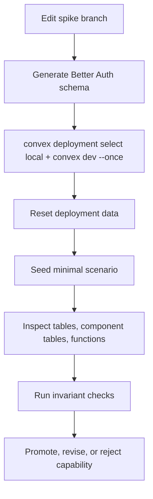

# Convex Experiment Verification Loop

## Goal

Before changing `starters/team`, we need a repeatable loop that proves what is deployed, what tables exist, what data exists, what functions are callable, and whether Better Auth plugin behavior works against a real Convex deployment.

The loop must support:

- Fast deterministic tests.
- Fresh local deployment setup.
- Explicit reset/seed steps.
- Component table inspection.
- Function metadata inspection.
- Auth route and token checks.
- No guessing from generated files alone.

## Recommendation

Use three layers together:

1. `convex-test` for fast invariant tests.
2. Convex CLI scripts for deployment reset, push, seed, function calls, and data inspection.
3. Convex MCP for interactive inspection by agents once the local deployment exists.

Do not rely on the `/convex` plugin alone. In this Codex thread, the available Convex plugin is guidance-only; it does not expose live deployment tools like `tables`, `data`, `run`, or `logs`.

Set up the real Convex MCP server for deployment inspection:

```bash
npx -y convex@latest mcp start --project-dir /Users/matthias/Git/convex/better-convex-nuxt/starters/team
```

For experiment safety, do not enable production flags. Use local or preview deployments only.

## Loop Overview



## Layer 1: Deterministic Tests

Use `convex-test` for pure backend invariants.

This is the fast loop for:

- Product authorization helpers.
- Last-owner behavior if reachable without Better Auth HTTP routes.
- Product table writes.
- Audit event writes.
- No second-source-of-truth assertions.

Command:

```bash
pnpm --dir starters/team test
```

Current caveat from research:

- This currently fails unless starter dependencies/self-imports are prepared. Fixing that belongs in the verification setup before plugin experiments.

What this layer cannot prove:

- Better Auth HTTP endpoints.
- Convex JWT cookie/token behavior.
- Real component table deployment.
- Nuxt auth proxy behavior.

## Layer 2: Local Convex Deployment

Use a real local Convex backend for Better Auth plugin experiments.

First-time bootstrap:

```bash
cd /Users/matthias/Git/convex/better-convex-nuxt/starters/team
npx convex dev --configure new --dev-deployment local
npx convex deployment create local --select
npx convex dev --once
npx convex env set SITE_URL http://localhost:3000 --env-file .env.local
npx convex env set BETTER_AUTH_SECRET "$(openssl rand -base64 32)" --env-file .env.local
npx convex env set ALLOW_TEST_RESET true --env-file .env.local
```

If project configuration fails in a non-interactive terminal, run the `convex dev --configure` command in your shell and answer the team/project prompts there. If local deployment creation fails with anonymous mode, run `npx convex login` first.

`ALLOW_TEST_RESET` is only for local and disposable preview deployments. Do not set it on production.

Set env vars sequentially. Setting multiple Convex env vars in parallel can fail on the local backend with `OptimisticConcurrencyControlFailure`.

Run local backend for manual/dev checks:

```bash
cd /Users/matthias/Git/convex/better-convex-nuxt/starters/team
npx convex deployment select local
npx convex dev
```

For CI-like one-shot push:

```bash
cd /Users/matthias/Git/convex/better-convex-nuxt/starters/team
npx convex deployment select local
npx convex dev --once --typecheck try --typecheck-components
```

## Reset Strategy

There are two reset levels.

### Soft Reset

Soft reset clears experiment-owned app tables through a dedicated Convex mutation.

Use this for fast repeatable product tests.

Rules:

- Only enabled when `ALLOW_TEST_RESET === 'true'`.
- Deletes app product tables and audit rows.
- Does not delete Better Auth component tables unless the spike explicitly includes a component reset function.
- Never available in production.

Expected function shape:

```ts
export const resetForExperiment = internalMutation({
  args: {},
  handler: async (ctx) => {
    if (process.env.ALLOW_TEST_RESET !== 'true') {
      throw new Error('Test reset is disabled')
    }
    // Delete app-owned product data here.
  },
})
```

### Hard Reset

Hard reset replaces deployment data.

Use this when we need a truly fresh Better Auth component state.

Convex CLI supports deployment import replacement:

```bash
npx convex import snapshot.zip --replace-all -y
```

For component data, Convex CLI supports the component path:

```bash
tmpdir=$(mktemp -d)
mkdir -p "$tmpdir/user"
: > "$tmpdir/user/documents.jsonl"
(cd "$tmpdir" && zip -qr /tmp/better-auth-empty.zip user/documents.jsonl)
npx convex import /tmp/better-auth-empty.zip --replace-all -y --component betterAuth --deployment local
```

Verified finding: this hard reset clears both the app tables and the `betterAuth` component tables on the local deployment. Treat it as a full deployment reset, not as a component-only reset. Use soft reset when app product data should be cleared without touching Better Auth state.

## Seed Strategy

Every spike gets explicit seed functions.

Seed functions should create only the minimum scenario needed:

- one user
- one organization
- one membership
- one product row
- optional API key or invitation

For Better Auth-owned data, prefer Better Auth APIs over direct table inserts so hooks and plugin behavior run.

Example seed call shape:

```bash
npx convex run experiments:seedOrganizationScenario '{}'
```

Seed output should include ids needed by follow-up checks:

```json
{
  "authUserId": "...",
  "organizationId": "...",
  "memberId": "...",
  "projectId": "..."
}
```

## Inspection Commands

Use CLI first because it is deterministic and scriptable.

For local deployments, keep `npx convex dev` running in another terminal before using `convex data` or `convex function-spec`.

List app tables:

```bash
npx convex data --format json
```

Inspect a table:

```bash
npx convex data projects --format json --limit 50
```

Inspect component tables:

```bash
npx convex data --component betterAuth --format json
npx convex data organization --component betterAuth --format json --limit 50
npx convex data member --component betterAuth --format json --limit 50
npx convex data invitation --component betterAuth --format json --limit 50
```

Verify Better Auth HTTP sign-up and user projection:

```bash
curl -i -sS -X POST http://127.0.0.1:3211/api/auth/sign-up/email \
  -H 'Content-Type: application/json' \
  -H 'Origin: http://localhost:3000' \
  --data '{"name":"Loop User","email":"loop-user@example.com","password":"password123"}'

npx convex data user --component betterAuth --format json --limit 20
npx convex data account --component betterAuth --format json --limit 20
npx convex data session --component betterAuth --format json --limit 20
npx convex data users --format json --limit 20
```

Run the full agent feedback probe:

```bash
pnpm feedback:agent
```

This proves an agent can see the full path:

- hard reset clears app and Better Auth component state
- Better Auth HTTP sign-up writes component `user`, `account`, and `session`
- the Better Auth user trigger writes app `users`
- `convex run --identity '{"subject":"<better-auth-user-id>"}'` can exercise real protected Convex mutations
- app `organizations`, `memberships`, `projects`, and `auditEvents` are inspectable after writes
- a gated experiment mutation can change an organization and the changed row is visible immediately

Inspect deployed function contract:

```bash
npx convex function-spec --file
```

Run a verification function:

```bash
npx convex run experiments:verifyOrganizationCutover '{"organizationId":"..."}'
```

Watch logs:

```bash
npx convex logs
```

## MCP Usage

Use Convex MCP after the local deployment exists.

Good MCP uses:

- List deployments with `status`.
- List schemas and inferred tables with `tables`.
- Inspect app/component data with `data`.
- Run deployed seed/verify functions with `run`.
- Run read-only one-off queries with `runOneoffQuery`.
- Inspect function signatures with `functionSpec`.
- Read logs and insights after failures.

Do not use MCP as the only verification. MCP is an inspection surface; the pass/fail contract should live in scripts and tests.

Recommended MCP config for local experiments:

```bash
npx -y convex@latest mcp start \
  --project-dir /Users/matthias/Git/convex/better-convex-nuxt/starters/team \
  --env-file .env.local
```

Disable mutating tools if an agent should only inspect:

```bash
npx -y convex@latest mcp start \
  --project-dir /Users/matthias/Git/convex/better-convex-nuxt/starters/team \
  --env-file .env.local \
  --disable-tools envSet,envRemove,run
```

For active experiment agents, allow `run`, but keep production disabled.

## Plugin Experiment Checklist

Each Better Auth plugin spike must answer these questions:

1. Does the local component schema generate?
2. Does `npx convex deployment select local && npx convex dev --once --typecheck try --typecheck-components` pass?
3. Do app tables and Better Auth component tables appear as expected?
4. Do Better Auth endpoints work through `/api/auth`?
5. Does `createBetterConvexAuthClient()` expose the typed client namespace?
6. Does Convex JWT sync survive sign-in, sign-out, SSR, and token refresh?
7. Can Convex product functions authorize using Better Auth state?
8. Are required indexes explicit?
9. Does reset/seed/verify run repeatedly from a clean state?
10. Did we avoid duplicate app-owned mirrors?

## Minimal Verification Scripts To Add

Add these scripts before Phase 1 experiments:

```json
{
  "scripts": {
    "convex:create:local": "convex deployment create local --select",
    "convex:select:local": "convex deployment select local",
    "convex:local:once": "convex dev --once --typecheck try --typecheck-components",
    "convex:inspect:functions": "convex function-spec --file",
    "convex:inspect:tables": "convex data --format json",
    "convex:inspect:auth": "convex data --component betterAuth --format json",
    "experiment:hard-reset": "tmpdir=$(mktemp -d) && mkdir -p \"$tmpdir/user\" && : > \"$tmpdir/user/documents.jsonl\" && (cd \"$tmpdir\" && zip -qr /tmp/better-auth-empty.zip user/documents.jsonl) && convex import /tmp/better-auth-empty.zip --replace-all -y --component betterAuth --deployment local",
    "experiment:reset": "convex run experiments:resetForExperiment '{}'",
    "experiment:seed": "convex run experiments:seedOrganizationScenario '{}'",
    "experiment:verify": "convex run experiments:verify '{}'",
    "experiment:loop": "pnpm experiment:reset && pnpm experiment:seed && pnpm experiment:verify",
    "feedback:agent": "bash scripts/verify-agent-feedback.sh"
  }
}
```

Add these Convex functions during the first spike:

- `experiments.seedOrganizationScenario`
- `experiments.resetForExperiment`
- `experiments.verify`
- `experiments.verifyBetterAuthTables`

Keep them gated by `ALLOW_TEST_RESET` or remove them before promoting a starter release.

## First Verification Milestone

Before implementing the Organization cutover, prove this loop:

1. Start local Convex.
2. Generate/push local Better Auth component.
3. Inspect Better Auth component tables.
4. Seed a Better Auth user/session/org through Better Auth APIs.
5. Create a Convex product row authorized by Better Auth membership.
6. Inspect app product tables and Better Auth component tables.
7. Reset.
8. Re-run the same seed and verification without manual cleanup.

Only after this milestone passes should we start the actual `starters/team` cutover.
